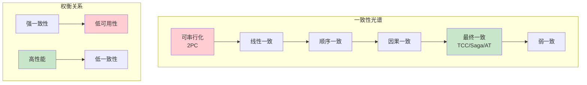

银行转账是一个经典的原子性场景：要么 100 元从账户 A 到账户 B，要么两个账户都不变。但在分布式系统中，保持这种「要么全成功、要么全失败」的强一致性，代价是巨大的性能损耗和可用性风险。

有没有一种方式，可以在某些场景下「妥协」一下，允许短暂的不一致，最终再恢复到一致状态？

这就是柔性事务（BASE）背后的核心思想。它不是放弃一致性，而是重新定义了什么是「可接受的一致性」。

## 从 ACID 到 BASE

### 刚性事务：ACID

ACID 是传统数据库事务的四大特性：

- **Atomicity（原子性）**：事务是最小执行单位，要么全成功，要么全失败
- **Consistency（一致性）**：事务执行前后，数据必须满足所有约束
- **Isolation（隔离性）**：并发执行的事务互不干扰
- **Durability（持久性）**：事务提交后，数据永久保存

```
ACID 的代价：

账户 A: 余额 1000 元
账户 B: 余额 500 元

事务 T: A → B 转账 100 元

ACID 保证：
  ├─ T 执行前：A=1000, B=500
  ├─ T 执行后：A=900, B=600
  └─ T 执行中：不存在（不可见）
```

ACID 是一致性的「最高标准」，但它在分布式场景下有三个问题：

1. **隔离性依赖锁**：高并发下锁竞争严重，性能下降
2. **一致性依赖同步**：跨节点的一致性需要同步等待，网络延迟大
3. **可用性受限**：任何节点故障都可能导致全局不可用

### 柔性事务：BASE

BASE 是对 ACID 的「妥协版」，它重新定义了一致性的优先级：

- **Basically Available（基本可用）**：允许系统在故障时降级，但核心功能可用
- **Soft state（软状态）**：允许数据存在中间状态，不要求强一致
- **Eventually consistent（最终一致）**：数据在一定时间窗口后最终达到一致

```
BASE 的哲学：

不是「要么全成功、要么全失败」
而是「暂时不一致，最终会一致」

账户 A: 余额 1000 元
账户 B: 余额 500 元

事务 T: A → B 转账 100 元（BASE 模式）

T 执行中（软状态）：
  ├─ A 显示: 900 元（预扣）
  ├─ B 显示: 600 元（预增）
  └─ 系统状态: 「转账中」

T 执行后（最终一致）：
  ├─ A 显示: 900 元
  ├─ B 显示: 600 元
  └─ 系统状态: 「已完成」
```

BASE 不是「不要一致性」，而是「不要强一致性」。它通过「允许短暂不一致」来换取「更好的可用性和性能」。

## 刚性事务 vs 柔性事务对比

### 核心特性对比

| 维度 | 刚性事务（ACID） | 柔性事务（BASE） |
| --- | --- | --- |
| **一致性模型** | 强一致 | 最终一致 |
| **隔离级别** | 可串行化 | 宽松隔离 |
| **可用性** | 低（依赖所有节点） | 高（允许降级） |
| **性能** | 低（同步等待） | 高（异步补偿） |
| **适用场景** | 金融核心、核心业务 | 高并发、用户生成内容 |
| **实现复杂度** | 低（数据库原生） | 高（需要业务补偿） |

## 一致性光谱



### CAP 定理的重新解读

CAP 定理告诉我们：在分布式系统中，一致性（Consistency）、可用性（Availability）、分区容错性（Partition tolerance）只能同时满足两个。

但 CAP 有一个关键细节：**分区是不可避免的**。网络抖动、机器宕机、机房断电...任何大规模分布式系统都会面临分区。

```
CAP 的实际含义：

在「没有分区」时：
  → C 和 A 都可以满足

在「发生分区」时：
  → 必须选择 C 或 A

刚性事务的选择：CP（一致性优先，分区时不可用）
柔性事务的选择：AP（可用性优先，分区时允许不一致）
```

:::tip CAP 定理的正确理解
CAP 不是「三选二」，而是「发生分区时二选一」。现代分布式系统几乎必然发生分区，所以实际上是在 CP 和 AP 之间选择。
:::

## 柔性事务的实现模式

### 1. 补偿模式（TCC、Saga）

通过业务层的补偿逻辑来「回滚」：

```
TCC 补偿流程：

Try: 冻结库存、预扣余额
     ↓
失败？
 ├─ 是 → Cancel: 解冻库存、返还余额
 └─ 否 → Confirm: 真正扣减
```

补偿模式的核心思想：**回滚不是撤销，而是执行一个「反操作」**。

### 2. 异步确保模式（可靠消息）

通过消息队列来保证最终一致：

```
异步确保流程：

1. 业务操作 + 发送消息
   ├─ 本地事务：业务操作成功
   └─ 消息发送：失败重试

2. 消息消费 + 补偿
   ├─ 消息消费：执行业务
   └─ 补偿逻辑：消费失败则重试

3. 定时对账
   └─ 检测不一致状态并修复
```

### 3. 最大努力通知模式

通过多次重试 + 人工兜底：

```
最大努力通知流程：

1. 业务操作
   └─ 执行核心业务

2. 发送通知
   ├─ 第一次：实时通知
   ├─ 第二次：5分钟后重试
   ├─ 第三次：1小时后重试
   └─ 第 N 次：放弃

3. 人工介入
   └─ 处理通知失败的异常
```

## 业务场景分析

### 刚性事务适用的场景

| 场景 | 原因 |
| --- | --- |
| **银行转账** | 金额必须精确，账务不能出错 |
| **证券交易** | 撮合逻辑依赖精确的余额状态 |
| **库存扣减** | 超卖会导致资损 |
| **优惠券核销** | 重复核销会导致资损 |
| **订单支付** | 支付金额必须与订单一致 |

### 柔性事务适用的场景

| 场景 | 原因 |
| --- | --- |
| **社交点赞** | 短暂的不一致用户感知不到 |
| **内容发布** | 延迟审核比拒绝发布更可接受 |
| **物流状态** | 状态更新延迟不影响核心流程 |
| **商品浏览量** | 精确计数不是核心需求 |
| **用户画像** | 实时更新 vs 最终一致可以接受 |

### 决策矩阵

| 问题 | 答案 | 推荐方案 |
| --- | --- | --- |
| **业务能接受短暂不一致吗？** | 能 | 柔性事务 |
| **业务能接受数据重复吗？** | 能（可去重） | 柔性事务 |
| **业务对实时性要求高吗？** | 高 | 柔性事务 |
| **业务数据错误会导致资损吗？** | 会 | 刚性事务 |
| **业务需要精确计数吗？** | 是 | 刚性事务 |
| **并发量 > 1000 QPS 吗？** | 是 | 柔性事务 |

## 真实案例

### 案例 1：微信红包的最终一致

微信红包是典型的「最终一致」场景：

```
微信红包流程：

1. 发红包：扣余额 → 创建红包（强一致，本地事务）
2. 抢红包：减红包数量 → 更新用户余额（柔性，异步）
3. 拆红包：更新状态 → 余额入账（最终一致）

为什么可以最终一致？
├─ 红包金额有记录，不怕丢
├─ 用户不会频繁查看余额
├─ 即使短暂不一致，用户感知不强
└─ 最终对账可以修复不一致
```

### 案例 2：12306 抢票的隔离策略

12306 在高并发抢票场景下，采用了「柔性 + 刚性」的混合策略：

```
12306 抢票策略：

核心链路（刚性）：
  ├─ 票价计算：必须精确
  ├─ 订单创建：必须成功
  └─ 支付确认：必须强一致

非核心链路（柔性）：
  ├─ 余票查询：允许短暂不一致
  ├─ 订单状态：允许延迟更新
  └─ 座位锁定：超时释放
```

### 案例 3：电商促销的柔性降级

在双十一等大促期间，很多电商平台会主动降级一致性要求：

```
大促降级策略：

正常时段：
  ├─ 库存扣减：强一致（AT/TCC）
  ├─ 订单创建：强一致（2PC）
  └─ 库存同步：实时

大促高峰期：
  ├─ 库存扣减：最终一致（Saga）
  ├─ 订单创建：异步确认
  └─ 库存同步：批量处理

降级理由：
  ├─ 用户对短暂缺货容忍度高
  ├─ 事后补货可以修复
  ├─ 保住可用性比保住强一致更重要
  └─ 极端情况下，宁可超卖也不能系统崩溃
```

:::warning 超卖的风险
超卖虽然在技术上是「最终一致」的结果，但在商业上可能造成严重资损。大促降级需要与业务方充分沟通，并设置兜底策略（如限量抢购、人工干预）。
:::

## 权衡矩阵

### 刚性事务 vs 柔性事务

|| 维度 | 刚性事务 | 柔性事务 |
|| --- | --- | --- |
|| **一致性强度** | ★★★★★ 强一致 | ★★★☆☆ 最终一致 |
|| **可用性** | ★★☆☆☆ 依赖所有节点 | ★★★★★ 允许降级 |
|| **性能** | ★★☆☆☆ 同步等待 | ★★★★★ 异步补偿 |
|| **开发成本** | ★★★★★ 数据库原生 | ★★☆☆☆ 需业务补偿 |
|| **锁持有时间** | 长（全程持有） | 短（预留后快速释放） |
|| **故障恢复** | 依赖协调者 | 依赖补偿逻辑 |
|| **适用场景** | 金融核心、低并发 | 互联网、高并发 |

### 性能量化对比

| 指标 | 2PC | Saga | AT |
| --- | --- | --- | --- |
| **平均响应时间** | 500ms | 50ms | 50ms |
| **吞吐量** | 200 TPS | 2000 TPS | 2000 TPS |
| **锁等待时间** | 300ms | 0ms | 0ms |
| **网络往返次数** | 3 | 1-2 | 1-2 |

> 数据来源：基于典型电商场景的压测估算，实际数值取决于网络延迟和参与者数量。

## 一致性级别的选择

### 不同一致性级别的实现代价

| 一致性级别 | 实现复杂度 | 性能开销 | 适用场景 |
| --- | --- | --- | --- |
| **强一致（2PC）** | 中 | 高 | 金融核心 |
| **线性一致** | 高 | 高 | 分布式锁 |
| **顺序一致** | 中 | 中 | 消息队列 |
| **因果一致** | 中 | 中 | 社交场景 |
| **最终一致** | 低 | 低 | 大多数场景 |

### 如何选择一致性级别

```
选择一致性的决策树：

数据出错会导致资损吗？
├─ 是 → 必须强一致
└─ 否 → 下一步

数据出错会影响核心业务吗？
├─ 是 → 强一致或因果一致
└─ 否 → 下一步

并发量 > 1000 QPS 吗？
├─ 是 → 最终一致
└─ 否 → 顺序一致或因果一致
```

## 混合使用策略

在实际项目中，刚性事务和柔性事务不是非此即彼的选择，而是可以混合使用：

### 分层架构中的事务策略

```
┌────────────────────────────────────────┐
│              网关层                    │
│  快速路由，不需要事务                   │
└────────────────────────────────────────┘
                ↓
┌────────────────────────────────────────┐
│              服务层                    │
│  核心业务：刚性事务（AT/TCC）           │
│  非核心业务：柔性事务（Saga/消息）       │
└────────────────────────────────────────┘
                ↓
┌────────────────────────────────────────┐
│              数据层                    │
│  核心数据：强一致（主库）               │
│  非核心数据：最终一致（从库/缓存）       │
└────────────────────────────────────────┘
```

### 示例：订单系统的混合事务

```java
@Service
public class OrderService {

    // 核心链路：使用 AT 模式
    @GlobalTransactional(rollbackFor = Exception.class)
    public Order createOrder(OrderDTO dto) {
        // 1. 创建订单 - AT 自动管理
        Order order = orderRepo.save(dto.toOrder());

        // 2. 扣减库存 - AT 自动管理
        inventoryService.decreaseStock(dto.getSkuId(), dto.getQuantity());

        // 3. 扣减余额 - AT 自动管理
        accountService.deductBalance(dto.getUserId(), dto.getAmount());

        // 4. 发送通知 - 异步，不在事务内
        // 这里使用消息队列，即使失败也不会影响主事务
        messageQueue.send("order.created", order);

        return order;
    }

    // 非核心链路：使用 Saga 或消息
    @Async
    public void updateUserStatistics(Long userId) {
        // 用户画像更新，允许最终一致
        // 使用 Saga 编排
        sagaOrchestrator.execute(updateUserStatsSaga(userId));
    }
}
```

## 常见误区

### 误区 1：柔性事务 = 不一致性

柔性事务不是「不要一致性」，而是「不要实时强一致性」。最终，数据仍然是一致的，只是存在短暂的窗口期。

```
典型误解：
├─ 误解：BASE = 允许数据永久不一致
└─ 正确：BASE = 允许短暂不一致，最终必须一致
```

### 误区 2：刚性事务一定比柔性事务好

刚性事务提供更强的一致性，但代价是更差的性能和可用性。在高并发场景下，选择柔性事务可能是唯一的选择。

```
性能对比：

刚性事务（2PC）：
  ├─ 100 个并发事务
  ├─ 平均响应时间：500ms
  └─ 吞吐量：200 TPS

柔性事务（Saga）：
  ├─ 100 个并发事务
  ├─ 平均响应时间：50ms
  └─ 吞吐量：2000 TPS
```

### 误区 3：用了分布式事务就万事大吉

分布式事务只解决了「跨服务的数据一致性问题」。它不能解决：
- 业务逻辑本身的 bug
- 下游系统的超时
- 网络抖动的短暂不一致

```
分布式事务的范围：

它能解决的：
  ├─ 服务 A 成功，服务 B 失败 → 全部回滚
  ├─ 服务 A 成功，服务 B 超时 → 自动重试
  └─ 分支事务失败 → 触发补偿

它不能解决的：
  ├─ 业务逻辑错误（如计算公式写错）
  ├─ 下游系统故障（如支付网关宕机）
  └─ 数据来源错误（如上游数据本身有误）
```

### 误区 4：最终一致就是「最终」会有

最终一致需要满足两个条件：1）没有新的写入；2）系统有足够时间完成同步。如果持续有新写入，可能永远无法「最终」一致。

```
最终一致的前提：

正确理解：
  └─ 「如果没有新写入，在时间窗口 T 后，数据会一致」

错误理解：
  └─ 「数据总会在某个时间点一致」
```

## 术语表

| 术语 | 英文 | 解释 |
| --- | --- | --- |
| ACID | Atomicity, Consistency, Isolation, Durability | 刚性事务的四大特性 |
| BASE | Basically Available, Soft state, Eventually consistent | 柔性事务的核心思想 |
| 刚性事务 | Rigid Transaction | 要求强一致的事务，如 2PC |
| 柔性事务 | Flexible Transaction | 允许最终一致的事务，如 TCC、Saga |
| 软状态 | Soft State | 数据存在的中间状态，不要求强一致 |
| 最终一致 | Eventually Consistent | 在没有新写入的情况下，最终达到一致 |
| 强一致 | Strong Consistency | 任何时刻都能读到最新数据 |
| 补偿 | Compensation | 回滚时的补救操作 |
| 降级 | Degradation | 系统故障时降低功能保证可用性 |

## 延伸思考

刚性事务和柔性事务的选择，本质上是对「一致性」和「可用性」的价值判断。

- 如果你的业务**数据出错会导致资损**，选择刚性事务
- 如果你的业务**数据出错不会立即造成损失**，可以选择柔性事务

但更务实的做法是**混合使用**：
- 核心链路使用刚性事务
- 非核心链路使用柔性事务
- 通过分层架构隔离两者的影响

记住：**没有最好的方案，只有最适合当前业务阶段的方案**。随着业务规模的变化，事务策略也需要不断调整。
