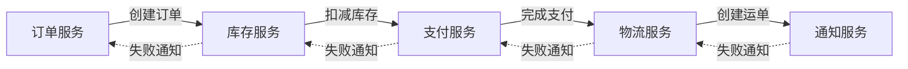
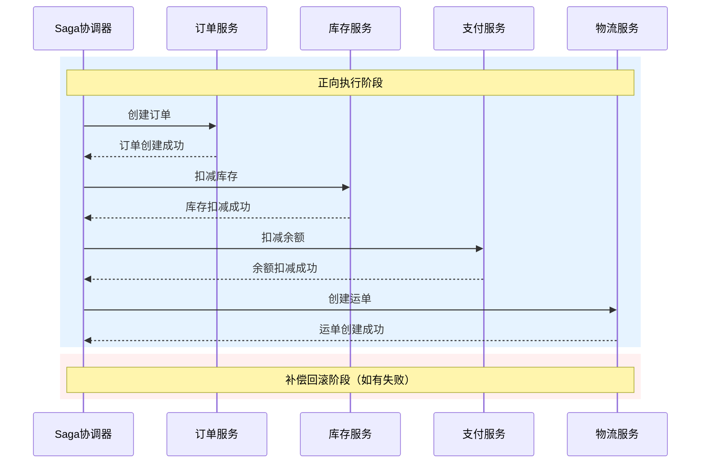

一个订单从创建到完成，中间可能经历十几个步骤：创建订单、扣减库存、预占优惠、计算运费、扣减余额、调用物流、发送通知、更新状态。每一步都可能失败，但失败之后，前面的步骤该怎么办？

TCC 用「回滚」来解决这个问题：Try 预留，失败就 Cancel。但 TCC 的问题在于，很多业务操作是**不可逆**的——短信发出去了，怎么 Cancel？物流已下单，怎么 Cancel？

Saga 模式换了一个思路：**不做回滚，而是做补偿**。如果第 3 步失败了，不是去撤销前 2 步，而是执行第 4、5、6...步来修复状态。这种「正向修复」的思想，让 Saga 适合处理那些「无法撤销」的业务场景。

## Saga 的核心思想

:::tip
**Saga 的本质**

Saga 的本质是：**把一个长事务拆成一系列本地事务，每个本地事务都有对应的补偿事务**。

Saga 最早由数据库领域的研究者提出，用于处理长时间运行的分布式事务。1987 年，Garcia-Molina 和 Salem 在论文《Sagas》中首次系统性地描述了这个模式。
:::

```
Saga 模式的核心假设：

A → B → C → D → E

如果 D 失败了，不是撤销 A、B、C，而是：
A → B → C → D(失败) → C补偿 → B补偿 → A补偿

或者：
A → B → C → D(失败) → E(新的正向操作来修复)
```

Saga 最早由数据库领域的研究者提出，用于处理长时间运行的分布式事务。1987 年，Garcia-Molina 和 Salem 在论文《Sagas》中首次系统性地描述了这个模式。

### 为什么需要 Saga？

TCC 的核心假设是「所有操作都是可逆的」。但现实中，很多操作是不可逆的：

| 操作 | 是否可逆 | TCC 适用性 |
| --- | --- | --- |
| 冻结库存 | 可逆（解冻） | 适用 |
| 预扣余额 | 可逆（返还） | 适用 |
| 发送短信 | 不可逆 | 不适用 |
| 发送邮件 | 不可逆 | 不适用 |
| 打印小票 | 不可逆 | 不适用 |
| 人工审核 | 不可逆 | 不适用 |

当业务链路中存在不可逆操作时，TCC 就力不从心了。Saga 用「补偿」代替「回滚」，适用范围更广。

### Saga 与 TCC 的本质区别

| 维度 | TCC | Saga |
| --- | --- | --- |
| **回滚策略** | 回滚（撤销） | 补偿（正向修复） |
| **资源状态** | 有中间状态（冻结/预留） | 无中间状态（直接执行） |
| **失败处理** | 撤销预留资源 | 执行补偿事务 |
| **适用场景** | 可逆操作 | 包含不可逆操作的长链路 |
| **隔离性** | 较好（资源预留） | 较差（无隔离保证） |
| **性能** | 好（预留后快速释放） | 更好（无预留，直接执行） |

## Saga 的两种编排方式

Saga 有两种实现方式：**编排式（Choreography）** 和 **控制式（Orchestration）**。

### 编排式 Saga

编排式 Saga 没有中央协调者，每个服务只负责自己的业务，并在完成后通知下一个服务：



优点：
- 去中心化，无单点故障
- 服务间松耦合
- 扩展性好

缺点：
- 流程难以可视化
- 服务间循环依赖风险
- 错误处理逻辑分散

### 控制式 Saga

控制式 Saga 有一个中央协调者（Saga Orchestrator）来管理整个流程：



优点：
- 流程清晰，易于可视化
- 错误处理逻辑集中
- 便于事务监控

缺点：
- 协调者可能成为单点（但可通过高可用解决）
- 服务间耦合度稍高

实际生产环境中，控制式 Saga 更常用，因为它的可观测性和可维护性更好。

## Saga 的执行语义

Saga 有两种失败处理策略：**向后补偿** 和 **向前重试**。

### 向后补偿（Backward Recovery）

当某个步骤失败时，撤销之前所有已完成的步骤：

```
正向：A → B → C → D → E
失败：D 失败
补偿：C补偿 → B补偿 → A补偿
```

向后补偿是最常见的 Saga 失败处理策略。它要求每个步骤都有对应的补偿操作。

### 向前重试（Forward Recovery）

当某个步骤失败时，等待条件满足后重试该步骤：

```
正向：A → B → C → D(失败) → 等待 → D(重试) → E
```

向前重试的前提是「失败是暂时性的」（如网络抖动、服务暂时不可用）。如果失败是永久性的（如业务规则冲突），需要退回到向后补偿。

### 混合策略

实际应用中，通常采用混合策略：

```
正向：A → B → C → D → E
失败：D 失败

第一次：重试 D（N 次）
D 仍然失败：退回到向后补偿
补偿：C补偿 → B补偿 → A补偿
```

## Saga 的隔离性问题

Saga 最大的问题是**缺乏隔离性保证**。在 TCC 中，Try 阶段会预留资源，其他事务可以看到「预留」状态。但在 Saga 中，每个步骤都是直接执行的，没有中间状态。

```
隔离性缺失导致的问题：

场景：用户下单购买 2 件商品 A（库存只有 2 件）

Saga 执行序列：
1. 用户1下单：库存 2 → 扣减 2 → 库存 0 ✓
2. 用户2下单：检查库存 → 库存 0 ✗（失败）

但如果：

1. 用户1 Saga 执行到一半（库存已扣，但订单未完成）
2. 用户2下单：检查库存 → 库存 0 ✗（失败）

或者更严重的情况：

1. 用户1下单：库存 2 → 扣减 1（只扣了 1 件）
2. 用户2下单：检查库存 → 库存 1 → 扣减成功
3. 用户1 Saga 失败：补偿（库存 + 1）
4. 结果：用户1 和用户2 都成功了，但只扣了 1 件库存
```

Saga 通过以下几种方式来缓解隔离性问题：

1. **语义锁**：在业务表中增加状态字段，如 `order_status = 'PROCESSING'`
2. **更新前读取**：在更新前先读取最新数据，检测并发冲突
3. **版本号控制**：通过乐观锁（版本号）来检测并发修改
4. **业务层隔离**：在业务层限制同一资源的并发操作

:::warning
**Saga 的隔离性限制**

Saga 本质上是一个「最终一致」的事务模式。如果你的业务对「脏读」和「不可重复读」敏感，Saga 可能不是最佳选择。在这种情况下，可以考虑 2PC 或 AT 模式。
:::

## Saga 与 TCC 对比

| 维度 | Saga | TCC |
| --- | --- | --- |
| **核心思想** | 正向补偿 | 回滚撤销 |
| **资源状态** | 无中间状态 | 有冻结/预留状态 |
| **适用操作** | 包含不可逆操作 | 仅限可逆操作 |
| **隔离性** | 弱 | 强 |
| **性能** | 最好 | 好 |
| **开发成本** | 中 | 高（需实现三个方法） |
| **失败处理** | 补偿事务 | Cancel 回滚 |
| **补偿失败** | 需要多次重试或人工介入 | 悬挂问题，需特殊处理 |

## Java 代码示例：Saga 编排器实现

下面是一个完整的 Saga 编排器实现，采用控制式 Saga 模式：

```java title="SagaOrchestrator.java"
public class SagaOrchestrator {

    private final SagaSteps steps;
    private final Map<String, Object> context = new HashMap<>();

    public SagaOrchestrator(SagaSteps steps) {
        this.steps = steps;
    }

    /**
     * 执行 Saga 流程
     *
     * @return 执行结果
     */
    public SagaResult execute() {
        List<SagaStep> executedSteps = new ArrayList<>();

        try {
            // 按顺序执行每个步骤
            for (SagaStep step : steps.getSteps()) {
                StepResult result = executeStep(step);

                if (!result.isSuccess()) {
                    // 执行失败，启动补偿
                    return compensateAndReturn(executedSteps, result);
                }

                executedSteps.add(step);
            }

            // 所有步骤都执行成功
            return SagaResult.success(context);

        } catch (Exception e) {
            // 异常情况，执行补偿
            return compensateAndReturn(executedSteps, StepResult.failure(e.getMessage()));
        }
    }

    private StepResult executeStep(SagaStep step) {
        log.info("执行 Saga 步骤: {}", step.getName());

        try {
            Object result = step.getAction().execute(context);
            step.setStatus(StepStatus.EXECUTED);
            step.setResult(result);

            log.info("步骤 {} 执行成功", step.getName());
            return StepResult.success(result);

        } catch (Exception e) {
            log.error("步骤 {} 执行失败: {}", step.getName(), e.getMessage());
            step.setStatus(StepStatus.FAILED);
            return StepResult.failure(e.getMessage());
        }
    }

    private SagaResult compensateAndReturn(List<SagaStep> executedSteps, StepResult failureReason) {
        log.warn("Saga 执行失败，开始补偿，已执行步骤数: {}", executedSteps.size());

        List<String> compensatedSteps = new ArrayList<>();
        List<String> failedCompensations = new ArrayList<>();

        // 逆序执行补偿
        for (int i = executedSteps.size() - 1; i >= 0; i--) {
            SagaStep step = executedSteps.get(i);

            if (step.getCompensation() == null) {
                log.warn("步骤 {} 没有配置补偿，跳过", step.getName());
                continue;
            }

            try {
                log.info("执行补偿: {}", step.getName());
                step.getCompensation().execute(context);
                step.setStatus(StepStatus.COMPENSATED);
                compensatedSteps.add(step.getName());

            } catch (Exception e) {
                log.error("补偿 {} 失败: {}", step.getName(), e.getMessage());
                step.setStatus(StepStatus.COMPENSATION_FAILED);
                failedCompensations.add(step.getName());
            }
        }

        return SagaResult.builder()
            .success(false)
            .failedStep(failureReason.getFailedStep())
            .failureReason(failureReason.getReason())
            .compensatedSteps(compensatedSteps)
            .failedCompensations(failedCompensations)
            .build();
    }
}
```

```java title="SagaStep.java"
@Data
@Builder
public class SagaStep {

    private String name;                    // 步骤名称
    private SagaAction action;              // 正向操作
    private SagaCompensation compensation;   // 补偿操作
    private int retryCount = 0;              // 重试次数
    private int maxRetries = 3;              // 最大重试次数

    // 执行状态
    private StepStatus status;
    private Object result;
    private String errorMessage;

    public enum StepStatus {
        PENDING,
        EXECUTING,
        EXECUTED,
        FAILED,
        COMPENSATING,
        COMPENSATED,
        COMPENSATION_FAILED
    }
}
```

```java title="SagaSteps.java"
public class SagaSteps {

    private final List<SagaStep> steps = new ArrayList<>();

    public SagaSteps addStep(String name, SagaAction action, SagaCompensation compensation) {
        steps.add(SagaStep.builder()
            .name(name)
            .action(action)
            .compensation(compensation)
            .build());
        return this;
    }

    public SagaSteps addStep(SagaStep step) {
        steps.add(step);
        return this;
    }

    public List<SagaStep> getSteps() {
        return Collections.unmodifiableList(steps);
    }

    // 静态工厂方法：创建订单 Saga
    public static SagaSteps createOrderSaga() {
        return new SagaSteps()
            .addStep("创建订单",
                context -> {
                    Long userId = (Long) context.get("userId");
                    Order order = orderService.createOrder(userId);
                    context.put("orderId", order.getId());
                    return order;
                },
                context -> {
                    Long orderId = (Long) context.get("orderId");
                    orderService.cancelOrder(orderId);
                })

            .addStep("冻结库存",
                context -> {
                    Long skuId = (Long) context.get("skuId");
                    Integer quantity = (Integer) context.get("quantity");
                    inventoryService.freezeStock(skuId, quantity);
                    return null;
                },
                context -> {
                    Long skuId = (Long) context.get("skuId");
                    Integer quantity = (Integer) context.get("quantity");
                    inventoryService.unfreezeStock(skuId, quantity);
                })

            .addStep("预占优惠",
                context -> {
                    Long userId = (Long) context.get("userId");
                    String couponId = (String) context.get("couponId");
                    promotionService.reserveCoupon(userId, couponId);
                    return null;
                },
                context -> {
                    Long userId = (Long) context.get("userId");
                    String couponId = (String) context.get("couponId");
                    promotionService.releaseCoupon(userId, couponId);
                })

            .addStep("扣减余额",
                context -> {
                    Long userId = (Long) context.get("userId");
                    BigDecimal amount = (BigDecimal) context.get("amount");
                    accountService.deductBalance(userId, amount);
                    return null;
                },
                context -> {
                    Long userId = (Long) context.get("userId");
                    BigDecimal amount = (BigDecimal) context.get("amount");
                    accountService.refundBalance(userId, amount);
                })

            .addStep("调用物流",
                context -> {
                    Long orderId = (Long) context.get("orderId");
                    String address = (String) context.get("address");
                    String logisticsNo = logisticsService.createShipment(orderId, address);
                    context.put("logisticsNo", logisticsNo);
                    return logisticsNo;
                },
                context -> {
                    String logisticsNo = (String) context.get("logisticsNo");
                    logisticsService.cancelShipment(logisticsNo);
                });
    }
}
```

```java title="SagaResult.java"
@Data
@Builder
public class SagaResult {

    private boolean success;                    // 是否全部成功
    private String failedStep;                  // 失败的步骤
    private String failureReason;               // 失败原因
    private List<String> compensatedSteps;       // 已补偿的步骤
    private List<String> failedCompensations;   // 补偿失败的步骤
    private Map<String, Object> context;        // 执行上下文

    public static SagaResult success(Map<String, Object> context) {
        return SagaResult.builder()
            .success(true)
            .context(context)
            .compensatedSteps(Collections.emptyList())
            .failedCompensations(Collections.emptyList())
            .build();
    }

    public boolean hasCompensationFailure() {
        return failedCompensations != null && !failedCompensations.isEmpty();
    }
}
```

### 使用示例

```java title="OrderService.java"
@Service
public class OrderService {

    @Autowired
    private OrderRepository orderRepo;

    @Autowired
    private InventoryService inventoryService;

    @Autowired
    private AccountService accountService;

    @Autowired
    private PromotionService promotionService;

    @Autowired
    private LogisticsService logisticsService;

    /**
     * 创建订单 - 使用 Saga 模式
     */
    public Order createOrderWithSaga(Long userId, Long skuId, Integer quantity,
                                      BigDecimal amount, String couponId, String address) {

        // 1. 准备 Saga 上下文
        Map<String, Object> context = new HashMap<>();
        context.put("userId", userId);
        context.put("skuId", skuId);
        context.put("quantity", quantity);
        context.put("amount", amount);
        context.put("couponId", couponId);
        context.put("address", address);

        // 2. 创建并执行 Saga
        SagaSteps sagaSteps = SagaSteps.createOrderSaga();
        SagaOrchestrator orchestrator = new SagaOrchestrator(sagaSteps);

        SagaResult result = orchestrator.execute();

        // 3. 处理结果
        if (result.isSuccess()) {
            Long orderId = (Long) context.get("orderId");
            return orderRepo.findById(orderId).orElseThrow();
        }

        // 4. 处理失败情况
        log.error("Saga 执行失败: failedStep={}, reason={}, compensated={}",
            result.getFailedStep(), result.getFailureReason(), result.getCompensatedSteps());

        if (result.hasCompensationFailure()) {
            // 补偿失败，需要告警和人工介入
            alertService.sendAlert("Saga补偿失败",
                "failedStep=" + result.getFailedStep() +
                ", failedCompensations=" + result.getFailedCompensations());
        }

        throw new OrderCreationException("订单创建失败: " + result.getFailureReason());
    }
}
```

## Seata Saga 模式

Seata 提供了官方的 Saga 模式实现，支持 JSON DSL 定义 Saga 流程：

```json title="saga-definition.json"
{
  "Name": "orderCreateSaga",
  "Comment": "订单创建 Saga",
  "StartState": "CreateOrder",
  "States": {
    "CreateOrder": {
      "Type": "ServiceTask",
      "ServiceName": "orderService",
      "ServiceMethod": "createOrder",
      "CompensateState": "CancelOrder",
      "Next": "FreezeInventory",
      "Status": {
        "0": "succeed",
        "1": "compensed",
        "2": "failed"
      }
    },
    "FreezeInventory": {
      "Type": "ServiceTask",
      "ServiceName": "inventoryService",
      "ServiceMethod": "freezeStock",
      "CompensateState": "UnfreezeInventory",
      "Next": "DeductBalance",
      "Status": {
        "0": "succeed",
        "1": "compensed",
        "2": "failed"
      }
    },
    "DeductBalance": {
      "Type": "ServiceTask",
      "ServiceName": "accountService",
      "ServiceMethod": "deductBalance",
      "CompensateState": "RefundBalance",
      "Next": "SuccessEnd",
      "Status": {
        "0": "succeed",
        "1": "compensed",
        "2": "failed"
      }
    },
    "CancelOrder": {
      "Type": "ServiceTask",
      "ServiceName": "orderService",
      "ServiceMethod": "cancelOrder"
    },
    "UnfreezeInventory": {
      "Type": "ServiceTask",
      "ServiceName": "inventoryService",
      "ServiceMethod": "unfreezeStock"
    },
    "RefundBalance": {
      "Type": "ServiceTask",
      "ServiceName": "accountService",
      "ServiceMethod": "refundBalance"
    },
    "SuccessEnd": {
      "Type": "Succeed"
    }
  }
}
```

## 权衡矩阵

| 维度 | 评价 | 说明 |
| --- | --- | --- |
| **一致性强度** | 最终一致 | 无强隔离保证，依赖业务层补偿 |
| **可用性** | 极高 | 无中心协调者，无阻塞等待 |
| **性能** | 最好 | 无资源锁定，无中间状态 |
| **侵入性** | 低 | 只需实现补偿逻辑 |
| **开发成本** | 中 | 需编写补偿逻辑，但不需处理悬挂等复杂问题 |
| **适用场景** | 长链路 | 包含不可逆操作的多步骤业务流程 |

## 常见错误与反模式

:::danger
**Saga 实现的三大致命错误**

在实际生产中，Saga 实现有三个最容易犯的错误，必须避免：
:::

### 错误 1：补偿逻辑写错

```java
// 错误示例：补偿逻辑与正向操作不一致
SagaStep step = SagaStep.builder()
    .name("扣减库存")
    .action(ctx -> inventoryService.decreaseStock(skuId, 10))  // 扣减 10
    .compensation(ctx -> inventoryService.increaseStock(skuId, 5)) // 补偿只返还 5
    .build();
```

正确做法：补偿逻辑必须与正向操作完全对称，确保「加回去的数量 = 扣掉的数量」。

### 错误 2：不处理补偿失败

```java
// 错误示例：补偿失败直接抛异常
compensation.execute(context); // 抛异常，不处理
```

正确做法：补偿失败应该重试，并记录失败日志。如果多次重试仍然失败，需要告警和人工介入。

### 错误 3：缺乏幂等性

```java
// 错误示例：正向操作没有幂等处理
action.execute(ctx -> inventoryService.decreaseStock(skuId, quantity));

// 错误示例：补偿操作没有幂等处理
compensation.execute(ctx -> inventoryService.increaseStock(skuId, quantity));
```

正确做法：正向操作和补偿操作都需要幂等处理，确保同一操作不会被重复执行。

## 真实案例

:::info
**某电商平台的订单履约系统 Saga 改造**

该系统需要处理从下单到履约的完整链路，涉及 15 个服务。原本尝试使用 TCC 模式，但因为「发送短信」「打印小票」等不可逆操作无法处理，最终迁移到 Saga 模式。

- **正向链路**：创建订单 → 冻结库存 → 预占优惠 → 扣减余额 → 调用物流 → 发送短信 → 更新状态
- **补偿链路**：更新状态（补偿） → 取消物流 → 返还余额 → 释放优惠 → 解冻库存 → 取消订单
- **效果**：Saga 模式上线后，事务成功率从 99.5% 提升到 99.9%，平均事务处理时间从 800ms 降低到 200ms

**关键经验**：
1. 每个步骤的补偿必须可重复执行（幂等）
2. 补偿失败时需要告警和人工介入
3. 建议使用 Saga Orchestrator 统一管理流程，便于监控和调试
:::

## 术语表

| 术语 | 英文 | 解释 |
| --- | --- | --- |
| Saga | Saga Pattern | 长活事务模式，通过补偿实现最终一致 |
| 编排 | Orchestration | 中央协调者管理整个 Saga 流程 |
| 编排 | Choreography | 去中心化，服务间通过事件驱动 |
| 补偿 | Compensation | 回滚时的补救操作，如返还库存 |
| 正向 | Forward | Saga 的正常执行路径 |
| 向后恢复 | Backward Recovery | 失败时逆序执行补偿 |
| 向前恢复 | Forward Recovery | 失败后等待条件满足，然后重试 |
| 隔离性 | Isolation | 事务之间的相互影响程度 |
| 幂等性 | Idempotency | 同一操作的多次执行效果等同于执行一次 |

## 延伸思考

Saga 给我们最重要的启示是：**分布式事务不一定需要「强回滚」**。在很多业务场景中，用「正向修复」代替「回滚撤销」是更务实的选择。

选择 Saga 还是 TCC，可以参考以下原则：

- 如果业务链路中存在**不可逆操作**（发短信、发邮件等），选择 Saga
- 如果所有操作都是**可逆的**（库存、余额、优惠券等），可以选择 TCC
- 如果对**性能要求极高**，选择 Saga（无预留，无锁）
- 如果对**隔离性要求较高**，选择 TCC（有预留状态）

Saga 的核心哲学是：**承认失败不可避免，用补偿代替回滚**。这种「接受不完美、持续修复」的思想，其实也是分布式系统设计的核心哲学。
