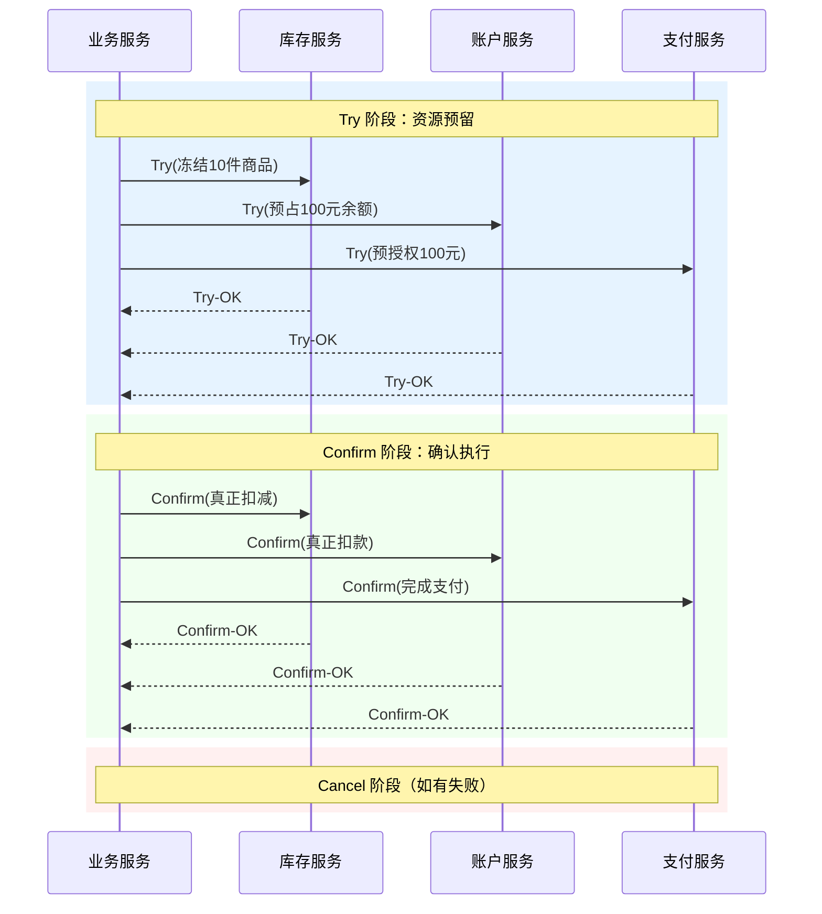

:::danger
**分布式事务的典型乱象**

凌晨 3 点，订单服务扣了库存，积分服务扣了积分，支付服务准备扣款——结果支付网关超时了。库存和积分已经扣了，但钱没扣。用户白得了积分，库存也少了。这就是分布式事务缺失时的典型乱象：部分成功，部分失败，系统状态陷入不一致。
:::

2PC 和 3PC 试图通过协调者来解决这个问题，但协调者本身就是单点。TCC（Try-Confirm-Cancel）换了一个思路：**把事务的「提交」和「回滚」逻辑全部交给业务方**，让每个服务自己决定「我要预留什么资源」「成功了怎么确认」「失败了怎么撤销」。

这种「业务自包含」的设计，让 TCC 在灵活性和性能上，都比 2PC/3PC 往前走了一步。但它带来的挑战，也比想象中更复杂。

## TCC 的核心思想

:::info
**TCC 的本质**

TCC 的本质是把一个分布式事务，拆成三个阶段：

1. **Try**：预留资源，但不确定真正提交
2. **Confirm**：所有服务 Try 成功后，正式确认执行
3. **Cancel**：任何一个服务 Try 失败，执行撤销
:::

TCC 的关键假设是：**每个业务操作都可以被拆解为「预留 → 确认/撤销」的形式**。这要求业务设计者在设计接口时，就考虑到「可撤销」和「可确认」的语义。

1. **Try**：预留资源，但不确定真正提交
2. **Confirm**：所有服务 Try 成功后，正式确认执行
3. **Cancel**：任何一个服务 Try 失败，执行撤销

```
TCC 与 2PC 的本质区别：

2PC：协调者决定一切，参与者只是执行者
TCC：参与者自己管理提交和回滚，协调者只是通知者
```

TCC 的关键假设是：**每个业务操作都可以被拆解为「预留 → 确认/撤销」的形式**。这要求业务设计者在设计接口时，就考虑到「可撤销」和「可确认」的语义。

### 为什么叫 TCC？

TCC 这个名字来自三个阶段的首字母：

- **Try**：尝试预留资源，比如冻结库存、预扣余额
- **Confirm**：确认执行，比如真正扣减库存、真正扣款
- **Cancel**：取消执行，比如解冻库存、返还积分

Try 阶段更像是「占位」而不是「真正执行」。资源被预留了，但业务状态还没有真正变化。Confirm 才真正让状态落地，Cancel 则把预留的资源释放回去。

### TCC 与 2PC 的关键区别

| 维度 | 2PC | TCC |
| --- | --- | --- |
| **资源锁定** | 数据库层面锁定行记录 | 业务层面预留资源 |
| **锁持有时间** | 从 Prepare 到 Commit/Rollback | 从 Try 到 Confirm/Cancel |
| **回滚粒度** | 全局回滚，无法精细控制 | 可以精细控制每个服务的回滚逻辑 |
| **业务侵入性** | 低（数据库 XA） | 高（需要业务实现 Try/Confirm/Cancel） |
| **性能** | 差（长锁持有） | 好（Try 阶段只是预留） |
| **异步能力** | 弱 | 强（Confirm/Cancel 可以异步执行） |

## 三阶段详解

### Try 阶段：资源预留

Try 阶段的核心目标是「先占位，不执行」。每个参与者在这个阶段做两件事：

1. 检查业务规则是否满足（比如库存是否足够）
2. 预留资源（比如冻结库存、预占余额）

```
Try 阶段示例 - 库存服务：

业务操作：扣减 10 件商品
Try 操作：
  - 检查库存是否 >= 10
  - 将 10 件商品状态改为「冻结」
  - 记录冻结流水
  - 返回成功

此时：库存数字没变，10 件商品被「冻结」了
```

Try 阶段返回失败，意味着整个分布式事务应该回滚。所有已经 Try 成功的服务，需要执行 Cancel。

### Confirm 阶段：确认执行

当所有参与者的 Try 都成功后，协调者（或业务编排方）发出 Confirm 指令。每个参与者把「预留」变为「真正执行」：

```
Confirm 阶段示例 - 库存服务：

Confirm 操作：
  - 将冻结的 10 件商品状态改为「已扣减」
  - 真正扣减可用库存数量
  - 记录扣减流水
  - 返回成功
```

Confirm 阶段**不应该失败**。如果 Confirm 失败了（比如数据库宕机），这是一个严重故障，需要人工介入或触发告警。TCC 假设 Try 阶段已经做了充分的检查，Confirm 只是把预留变为执行，不应该有业务规则冲突。

### Cancel 阶段：撤销执行

当任何一个参与者的 Try 失败，或者超时未收到 Confirm 时，所有已 Try 的参与者需要执行 Cancel：

```
Cancel 阶段示例 - 库存服务：

Cancel 操作：
  - 将冻结的 10 件商品状态改回「可用」
  - 清除冻结流水
  - 返回成功
```

Cancel 阶段**必须成功**。如果 Cancel 失败了，资源会一直处于「预留」状态，形成悬挂问题（后面会详细讲）。

## 流程图



## TCC 的三大挑战

:::warning
**TCC 生产的三大经典问题**

TCC 看起来简单，但在生产环境中，它面临三个经典问题：**空回滚**、**幂等性**、**悬挂**。不理解这三个问题，就无法正确实现 TCC。
:::

### 1. 空回滚

:::warning
**问题描述**：Try 阶段超时，事务管理器认为 Try 失败，发起 Cancel。但实际上这个服务根本没有执行过 Try，或者 Try 已经执行成功了只是响应超时。
:::

```
空回滚场景：

T1: 库存服务执行 Try(冻结10件) 成功
T2: 网络抖动，Try-OK 响应丢失
T3: 事务管理器超时未收到响应
T4: 事务管理器发起 Cancel
T5: 库存服务收到 Cancel，但此时资源并未被预留（或者已经 Confirm 了）
```

如果 Cancel 逻辑没有判断「当前状态」，可能会把正常的库存又解冻一次，或者尝试解冻一个不存在的冻结记录。这就是「空回滚」。

**解决方案**：Cancel 操作必须先查询当前状态，再决定如何处理：

```java
public boolean cancel(Long orderId, Long skuId, Integer quantity) {
    // 1. 查询当前状态
    FrozenInventory frozen = frozenInventoryRepo.findByOrderId(orderId);

    // 2. 如果根本没执行过 Try，不处理
    if (frozen == null) {
        log.warn("空回滚：订单 {} 从未预留资源", orderId);
        return true; // 返回成功，避免重复 Cancel
    }

    // 3. 如果已经 Confirm 了，不处理
    if (frozen.isConfirmed()) {
        log.warn("空回滚：订单 {} 已 Confirm，不应 Cancel", orderId);
        return true;
    }

    // 4. 如果已经 Cancel 了（幂等），不处理
    if (frozen.isCancelled()) {
        log.info("空回滚：订单 {} 已 Cancel，忽略重复请求", orderId);
        return true;
    }

    // 5. 执行真正的 Cancel
    inventoryService.unfreeze(skuId, quantity);
    frozen.markCancelled();
    frozenInventoryRepo.save(frozen);

    return true;
}
```

### 2. 幂等性

:::warning
**问题描述**：Try/Confirm/Cancel 任何一阶段都可能因为网络问题超时，事务管理器会重试。服务必须保证「同一笔事务的同一阶段，多次执行效果等同于执行一次」。
:::

```
幂等性场景：

T1: 库存服务执行 Confirm，成功
T2: Confirm-OK 响应丢失
T3: 事务管理器超时未收到响应
T4: 事务管理器发起重试
T5: 库存服务收到第二次 Confirm
```

如果 Confirm 逻辑没有幂等处理，10 件库存会被扣减两次。这就是「幂等性问题」。

**解决方案**：为每笔分布式事务生成全局唯一的事务 ID（XID），并在每个操作中记录「已执行」状态：

```java
public boolean confirm(String xid, Long orderId) {
    // 1. 查询是否已 Confirm（幂等检查）
    TransactionLog log = transactionLogRepo.findByXidAndAction(xid, "CONFIRM");

    if (log != null) {
        log.info("幂等：事务 {} Confirm 已执行，忽略", xid);
        return true;
    }

    // 2. 执行真正的 Confirm
    Inventory inventory = inventoryRepo.findByOrderId(orderId);
    inventory.decreaseStock();
    inventoryRepo.save(inventory);

    // 3. 记录执行日志（保证幂等）
    transactionLogRepo.save(TransactionLog.builder()
        .xid(xid)
        .action("CONFIRM")
        .orderId(orderId)
        .executeTime(LocalDateTime.now())
        .build());

    return true;
}
```

:::tip 幂等性实现要点
幂等性是 TCC 实现中最容易被忽视的环节。建议使用「事务日志表」来记录每个阶段是否已执行，并在执行业务操作之前先检查日志。
:::

### 3. 悬挂

:::warning
**问题描述**：Cancel 比 Try 先执行了，或者 Try 未执行但收到了 Confirm/Cancel。这通常发生在网络乱序或服务重启时。
:::

```
悬挂场景：

T1: 库存服务 Try(冻结10件) - 网络乱序，消息延迟
T2: 事务管理器超时未收到 Try 响应
T3: 事务管理器发起 Cancel
T4: 库存服务先收到 Cancel，执行空 Cancel（但会创建 Cancel 记录）
T5: 库存服务收到 Try，执行 Try（但资源可能已被错误处理）
```

更严重的情况是：Try 因为网络问题一直没执行成功，但 Cancel 执行了，导致资源被错误释放。然后 Try 最终成功了，但此时资源已经被释放了，造成业务状态混乱。

**解决方案**：使用「防悬挂检查」——在 Try 执行前，检查是否有对应的 Cancel 记录：

```java
public boolean tryFreeze(Long orderId, Long skuId, Integer quantity) {
    // 1. 检查是否有未完成的 Cancel（防悬挂）
    TransactionLog cancelLog = transactionLogRepo
        .findByXidAndAction(xid, "CANCEL");

    if (cancelLog != null && !cancelLog.isCompleted()) {
        log.warn("防悬挂：检测到事务 {} 已发起 Cancel，跳过 Try", xid);
        return false;
    }

    // 2. 检查是否已 Try 过（幂等）
    TransactionLog tryLog = transactionLogRepo
        .findByXidAndAction(xid, "TRY");

    if (tryLog != null) {
        log.info("幂等：事务 {} Try 已执行，忽略", xid);
        return true;
    }

    // 3. 执行真正的 Try
    inventoryService.freeze(skuId, quantity);

    // 4. 记录 Try 日志
    transactionLogRepo.save(TransactionLog.builder()
        .xid(xid)
        .action("TRY")
        .build());

    return true;
}
```

## Java 代码示例：完整的 TCC 事务服务

下面是一个完整版的 TCC 库存服务实现，涵盖了 Try/Confirm/Cancel 三个阶段以及幂等性处理：

```java title="TccInventoryService.java"
@Service
public class TccInventoryService {

    @Autowired
    private InventoryRepository inventoryRepo;

    @Autowired
    private TransactionLogRepository transactionLogRepo;

    private static final String ACTION_TRY = "TRY";
    private static final String ACTION_CONFIRM = "CONFIRM";
    private static final String ACTION_CANCEL = "CANCEL";

    /**
     * Try 阶段：冻结库存
     *
     * 这个阶段不真正扣减库存，只是「占位」
     * 如果库存不足，直接返回失败，触发全局回滚
     */
    public boolean tryFreeze(String xid, Long skuId, Integer quantity) {
        log.info("TCC Try: xid={}, skuId={}, quantity={}", xid, skuId, quantity);

        // 1. 幂等检查：是否已 Try 过
        if (isActionExecuted(xid, skuId, ACTION_TRY)) {
            log.info("幂等：xid={}, skuId={} 已 Try，忽略", xid, skuId);
            return true;
        }

        // 2. 防悬挂检查：是否有未完成的 Cancel
        if (hasPendingCancel(xid, skuId)) {
            log.warn("防悬挂：xid={}, skuId={} 有待处理的 Cancel，跳过 Try", xid, skuId);
            return false;
        }

        // 3. 检查库存是否充足
        Inventory inventory = inventoryRepo.findBySkuId(skuId);
        if (inventory == null || inventory.getAvailableStock() < quantity) {
            log.warn("库存不足：skuId={}, 需求={}, 可用={}",
                skuId, quantity, inventory != null ? inventory.getAvailableStock() : 0);
            return false;
        }

        // 4. 执行冻结：扣减可用库存，增加冻结库存
        inventory.setAvailableStock(inventory.getAvailableStock() - quantity);
        inventory.setFrozenStock(inventory.getFrozenStock() + quantity);
        inventoryRepo.save(inventory);

        // 5. 记录事务日志
        saveTransactionLog(xid, skuId, ACTION_TRY, quantity);

        return true;
    }

    /**
     * Confirm 阶段：确认扣减
     *
     * Try 成功后，调用 Confirm 真正扣减库存
     * Confirm 不应该失败，如果失败需要人工介入
     */
    public boolean confirm(String xid, Long skuId) {
        log.info("TCC Confirm: xid={}, skuId={}", xid, skuId);

        // 1. 幂等检查：是否已 Confirm 过
        if (isActionExecuted(xid, skuId, ACTION_CONFIRM)) {
            log.info("幂等：xid={}, skuId={} 已 Confirm，忽略", xid, skuId);
            return true;
        }

        // 2. 查询冻结记录
        TransactionLog tryLog = transactionLogRepo.findByXidAndSkuIdAndAction(xid, skuId, ACTION_TRY);
        if (tryLog == null) {
            // Try 未执行（可能空回滚后收到 Confirm），直接返回成功
            log.warn("Confirm 找不到 Try 记录：xid={}, skuId={}，可能为空回滚后收到 Confirm", xid, skuId);
            return true;
        }

        // 3. 执行确认：减少冻结库存（真正扣减完成）
        Inventory inventory = inventoryRepo.findBySkuId(skuId);
        if (inventory != null) {
            inventory.setFrozenStock(inventory.getFrozenStock() - tryLog.getQuantity());
            inventoryRepo.save(inventory);
        }

        // 4. 记录事务日志
        saveTransactionLog(xid, skuId, ACTION_CONFIRM, tryLog.getQuantity());

        return true;
    }

    /**
     * Cancel 阶段：解冻库存
     *
     * Try 失败或全局回滚时，调用 Cancel 释放预留的资源
     * Cancel 必须成功，不能返回失败
     */
    public boolean cancel(String xid, Long skuId) {
        log.info("TCC Cancel: xid={}, skuId={}", xid, skuId);

        // 1. 幂等检查：是否已 Cancel 过
        if (isActionExecuted(xid, skuId, ACTION_CANCEL)) {
            log.info("幂等：xid={}, skuId={} 已 Cancel，忽略", xid, skuId);
            return true;
        }

        // 2. 查询 Try 记录
        TransactionLog tryLog = transactionLogRepo.findByXidAndSkuIdAndAction(xid, skuId, ACTION_TRY);

        // 3. 如果没有 Try 记录，说明 Try 未执行（空回滚），直接返回成功
        if (tryLog == null) {
            log.info("空回滚：xid={}, skuId={} 从未 Try，无需 Cancel", xid, skuId);
            return true;
        }

        // 4. 执行解冻：返还可用库存
        Inventory inventory = inventoryRepo.findBySkuId(skuId);
        if (inventory != null) {
            inventory.setAvailableStock(inventory.getAvailableStock() + tryLog.getQuantity());
            inventory.setFrozenStock(inventory.getFrozenStock() - tryLog.getQuantity());
            inventoryRepo.save(inventory);
        }

        // 5. 记录事务日志
        saveTransactionLog(xid, skuId, ACTION_CANCEL, tryLog.getQuantity());

        return true;
    }

    // ========== 辅助方法 ==========

    private boolean isActionExecuted(String xid, Long skuId, String action) {
        return transactionLogRepo.findByXidAndSkuIdAndAction(xid, skuId, action) != null;
    }

    private boolean hasPendingCancel(String xid, Long skuId) {
        // 检查是否有 Cancel 记录但 Confirm 未执行
        TransactionLog cancelLog = transactionLogRepo.findByXidAndSkuIdAndAction(xid, skuId, ACTION_CANCEL);
        TransactionLog confirmLog = transactionLogRepo.findByXidAndSkuIdAndAction(xid, skuId, ACTION_CONFIRM);

        return cancelLog != null && confirmLog == null;
    }

    private void saveTransactionLog(String xid, Long skuId, String action, Integer quantity) {
        TransactionLog log = TransactionLog.builder()
            .xid(xid)
            .skuId(skuId)
            .action(action)
            .quantity(quantity)
            .executeTime(LocalDateTime.now())
            .build();
        transactionLogRepo.save(log);
    }
}
```

```java title="Inventory.java (实体类)"
@Entity
@Table(name = "t_inventory")
public class Inventory {

    @Id
    @GeneratedValue(strategy = GenerationType.IDENTITY)
    private Long id;

    private Long skuId;           // 商品 SKU
    private Integer totalStock;   // 总库存
    private Integer availableStock; // 可用库存（Try 阶段扣减这个）
    private Integer frozenStock;  // 冻结库存（Confirm 后扣减这个）

    // Getter/Setter 省略
}
```

```java title="TransactionLog.java (事务日志表)")
@Entity
@Table(name = "t_transaction_log")
public class TransactionLog {

    @Id
    @GeneratedValue(strategy = GenerationType.IDENTITY)
    private Long id;

    @Column(name = "xid", nullable = false)
    private String xid;           // 全局事务 ID

    private Long skuId;           // 关联的商品
    private String action;       // TRY / CONFIRM / CANCEL
    private Integer quantity;     // 操作数量
    private LocalDateTime executeTime; // 执行时间

    // Getter/Setter 省略
}
```

## Seata TCC 模式

Seata 是阿里开源的分布式事务解决方案，提供了 AT、TCC、Saga 三种模式。其中 TCC 模式与上述实现思路一致，但提供了更多基础设施支持。

### Seata TCC 的核心组件

```
Seata TCC 架构：

┌─────────────────────────────────────────────────────┐
│                   TC (Transaction Coordinator)       │
│                   事务协调者（独立服务）              │
└─────────────────────────────────────────────────────┘
                              │
          ┌───────────────────┼───────────────────┐
          ▼                   ▼                   ▼
    ┌──────────┐        ┌──────────┐        ┌──────────┐
    │  服务 A   │        │  服务 B   │        │  服务 C   │
    │  Try/    │        │  Try/    │        │  Try/    │
    │ Confirm/ │        │ Confirm/ │        │ Confirm/ │
    │ Cancel   │        │ Cancel   │        │ Cancel   │
    └──────────┘        └──────────┘        └──────────┘
```

- **TC（Transaction Coordinator）**：独立部署的协调者服务，负责管理全局事务状态
- **TM（Transaction Manager）**：事务管理器，发起全局事务
- **RM（Resource Manager）**：资源管理器，每个微服务

### Seata TCC 注解使用

```java title="SeataTccInventoryService.java"
@LocalTCC
public interface TccInventoryService {

    /**
     * Try 方法：返回 YES 表示成功，NO 表示失败
     * phaseName 必须指定为 "try"
     */
    @TwoPhaseBusinessAction(
        name = "inventoryTccAction",
        commitMethod = "confirm",
        rollbackMethod = "cancel"
    )
    boolean tryDecrease(
        BusinessActionContext context,
        @BusinessActionContextParameter(paramName = "skuId") Long skuId,
        @BusinessActionContextParameter(paramName = "quantity") Integer quantity
    );

    /**
     * Confirm 方法：Seata 自动调用
     */
    boolean confirm(BusinessActionContext context);

    /**
     * Cancel 方法：Seata 自动调用
     */
    boolean cancel(BusinessActionContext context);
}
```

```java title="TccInventoryServiceImpl.java"
@Service
public class TccInventoryServiceImpl implements TccInventoryService {

    @Autowired
    private InventoryRepository inventoryRepo;

    @Override
    public boolean tryDecrease(BusinessActionContext context, Long skuId, Integer quantity) {
        String xid = context.getXid();

        // 业务逻辑与之前相同...
        Inventory inventory = inventoryRepo.findBySkuId(skuId);
        if (inventory == null || inventory.getAvailableStock() < quantity) {
            return false;
        }

        inventory.setAvailableStock(inventory.getAvailableStock() - quantity);
        inventory.setFrozenStock(inventory.getFrozenStock() + quantity);
        inventoryRepo.save(inventory);

        return true;
    }

    @Override
    public boolean confirm(BusinessActionContext context) {
        // Seata 保证只会被调用一次
        // 从 context 中获取参数，执行确认
        Long skuId = (Long) context.getActionContext("skuId");

        Inventory inventory = inventoryRepo.findBySkuId(skuId);
        if (inventory != null && inventory.getFrozenStock() > 0) {
            inventory.setFrozenStock(inventory.getFrozenStock() - 1);
            inventoryRepo.save(inventory);
        }

        return true;
    }

    @Override
    public boolean cancel(BusinessActionContext context) {
        Long skuId = (Long) context.getActionContext("skuId");
        Integer quantity = (Integer) context.getActionContext("quantity");

        Inventory inventory = inventoryRepo.findBySkuId(skuId);
        if (inventory != null) {
            inventory.setAvailableStock(inventory.getAvailableStock() + quantity);
            inventory.setFrozenStock(inventory.getFrozenStock() - quantity);
            inventoryRepo.save(inventory);
        }

        return true;
    }
}
```

:::tip Seata TCC 的优势
1. **事务日志自动管理**：Seata 会自动记录 Try/Confirm/Cancel 的状态，无需自己维护事务日志表
2. **隔离性保证**：通过 branch_session 表保证分布式事务的隔离性
3. **高性能**：Try 阶段只是预留，不涉及数据库行锁
4. **生态完善**：与 Spring Cloud、Dubbo 等主流框架无缝集成
:::

## 权衡矩阵

| 维度 | 评价 | 说明 |
| --- | --- | --- |
| **一致性强度** | 最终一致（业务补偿） | 不保证实时一致，允许中间状态存在 |
| **可用性** | 高 | Try 失败立即返回，不阻塞；Confirm/Cancel 可异步 |
| **性能** | 好 | 资源锁定时间短，无数据库行锁 |
| **侵入性** | 高 | 需要业务实现 Try/Confirm/Cancel 三套逻辑 |
| **开发成本** | 中高 | 需要处理空回滚、幂等性、悬挂等边界情况 |
| **适用场景** | 灵活 | 适合业务逻辑可拆分为「预留/确认/撤销」的场景 |

## TCC vs 2PC vs 3PC 对比

| 维度 | 2PC | 3PC | TCC |
| --- | --- | --- | --- |
| **协调者角色** | 强中心 | 弱中心（有超时） | 通知者（业务编排） |
| **资源锁定** | 数据库行锁 | 数据库行锁（延迟） | 业务层预留 |
| **阻塞时间** | 长 | 中 | 短（可控） |
| **数据一致性** | 强一致（理论） | 强一致（有条件） | 最终一致 |
| **业务侵入性** | 低 | 低 | 高 |
| **失败恢复** | 依赖协调者 | 参与者可自决 | 依赖补偿逻辑 |
| **适用一致性** | 强一致 | 强一致 | 最终一致 |

## 常见错误与反模式

:::danger
**TCC 实现的三大致命错误**

在实际生产中，TCC 实现有三个最容易犯的错误，必须避免：
:::

### 错误 1：Try 阶段做真正的业务操作

```java
// 错误示例：Try 阶段直接扣减库存
public boolean tryDecrease(Long skuId, Integer quantity) {
    inventory.setStock(inventory.getStock() - quantity); // 错误！
    inventoryRepo.save(inventory);
    return true;
}
```

正确做法：Try 阶段只做「冻结」或「预留」，不改变业务的最终状态。Confirm 才真正执行，Cancel 只需要「解冻」或「返还」。

### 错误 2：不处理幂等性

```java
// 错误示例：没有幂等检查
public boolean confirm(Long skuId) {
    inventory.setFrozenStock(inventory.getFrozenStock() - 1);
    inventoryRepo.save(inventory);
    return true;
}
```

正确做法：每次操作前检查事务日志，确保同一事务的同一阶段不会被重复执行。

### 错误 3：Confirm 失败时不记录

```java
// 错误示例：Confirm 失败直接抛异常
public boolean confirm(Long skuId) {
    if (inventory.getStock() < 0) {
        throw new RuntimeException("库存不足"); // 错误！
    }
    // ...
}
```

正确做法：Confirm 阶段不应该失败（或者只记录失败日志，不抛异常）。如果真的失败，需要人工介入或触发告警。

## 术语表

| 术语 | 英文 | 解释 |
| --- | --- | --- |
| TCC | Try-Confirm-Cancel | 三阶段提交的变体，将提交回滚逻辑交给业务方 |
| 预留 | Reserve / Freeze | Try 阶段占位资源，但不真正执行 |
| 确认 | Confirm | Try 成功后，正式执行业务操作 |
| 撤销 | Cancel | Try 失败时，释放预留的资源 |
| 空回滚 |空 Cancel | Try 未执行或未成功，收到 Cancel 请求 |
| 幂等性 | Idempotency | 同一操作的多次执行效果等同于执行一次 |
| 悬挂 | Suspension | Cancel 比 Try 先执行，导致资源状态异常 |
| XID | Transaction ID | 全局事务 ID，用于关联所有参与者 |
| TC | Transaction Coordinator | 事务协调者，管理全局事务状态 |
| 补偿 | Compensation | 回滚时的补救操作，如解冻库存 |

## 延伸思考

:::tip
**TCC 的适用场景与局限**

TCC 给我们最重要的启示是：**业务层面的事务控制比数据库层面的事务控制更灵活**。通过把「提交」和「回滚」的权力交给业务方，TCC 打破了 2PC 的性能瓶颈，但代价是开发成本的增加。

**在实际项目中，TCC 适合以下场景**：

- 库存扣减、余额预占、优惠券锁定等「可逆」的业务操作
- 对性能要求高、无法忍受长事务锁的场景
- 业务逻辑可以清晰拆分为「预留 → 确认/撤销」的场景

如果你的业务很难拆分为「可撤销」的形式（比如发送短信、发送邮件等副作用操作），TCC 可能不是最佳选择。这时可以考虑 Saga 模式，它用「正向补偿」代替「回滚」，更适合长链路业务场景。
:::
