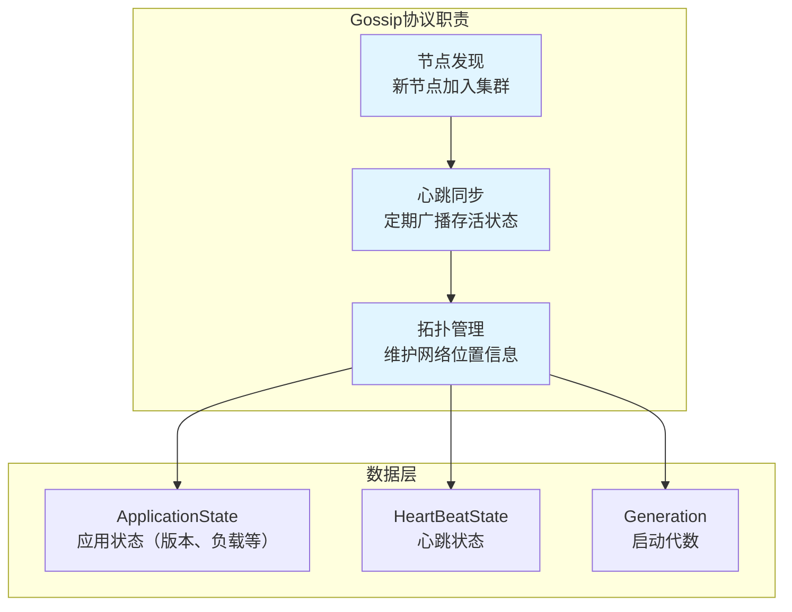
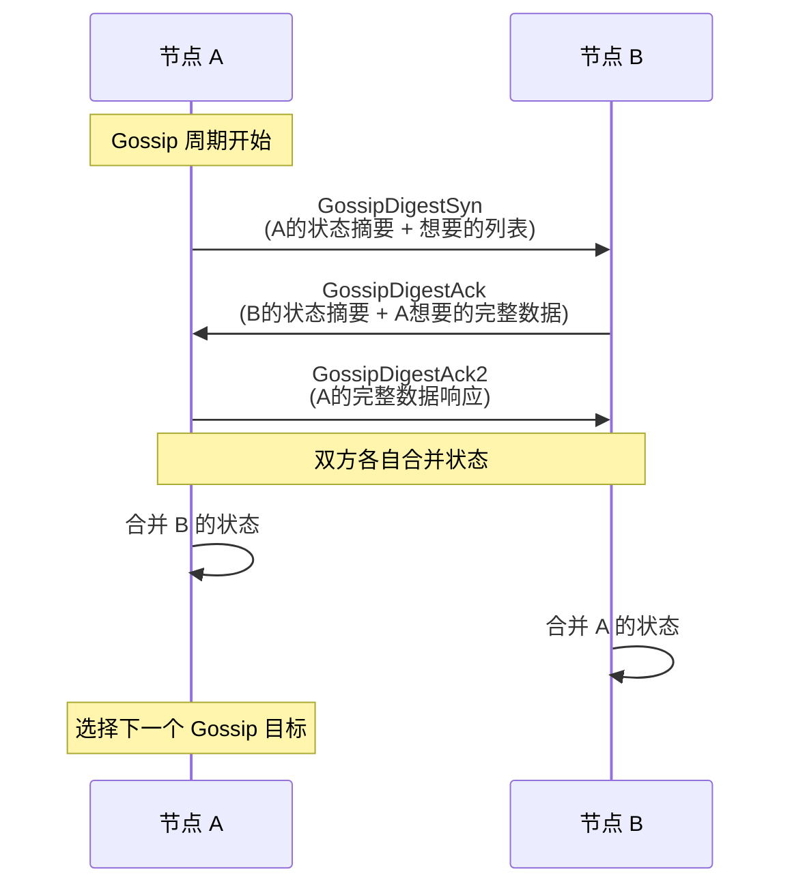

凌晨 2 点，你负责的 Cassandra 集群中一个新节点启动失败。日志显示它一直在尝试加入集群，但种子节点列表配置错误——运维人员把内网 IP 填成了外网 IP，导致新节点无法通过 Gossip 与任何现有节点建立联系。

这是一个典型的 Cassandra Gossip 配置踩坑案例。Cassandra 的 Gossip 协议是业界最成熟的生产级实现之一，它用 Gossip 做节点发现、心跳同步和拓扑管理，每天在数十万节点的集群中稳定运行。但要把 Cassandra Gossip 用好，你需要深入理解它的工作原理和配置细节。

## Cassandra Gossip 的核心职责

Cassandra 的 Gossip 协议不是孤立存在的，它是集群基础设施的核心组件，负责三大职责。

**节点发现与成员管理**是 Gossip 最基础的功能。当一个新节点启动时，它不知道集群中有哪些成员。通过配置种子节点（Seed Node），新节点可以发起第一次 Gossip 交互，然后逐步获取完整的成员列表。这个过程是自动的，不需要手动注册。

**心跳与存活检测**让每个节点定期向其他节点广播自己的存活状态。如果一个节点长期没有出现在任何 Gossip 消息中，其他节点会将其标记为「已死亡」，触发数据副本修复等后续流程。

**拓扑同步**确保每个节点都能了解整个集群的网络拓扑——哪些节点在同一个数据中心，哪些在同一个机架。当需要做读写请求路由时，Cassandra 会参考拓扑信息，优先选择同机房节点以降低延迟。



## Gossip 消息结构

Cassandra 的 Gossip 消息包含三层状态，每层都有不同的语义和用途。

**Generation（启动代数）**是最基础的信息。每个节点每次启动时都会生成一个随机数作为自己的 Generation。如果一个节点的 Generation 增加了，说明它重启过。当 Gossip 消息中的 Generation 比本地记录的更旧时，可以直接忽略这条消息（防止旧消息干扰）。

**HeartBeatState（心跳状态）**包含一个自增的心跳计数器。每个节点定期增加自己的心跳计数，并将其广播给其他节点。如果某个节点的心跳长期没有变化，说明它可能已经故障。

**ApplicationState（应用状态）**是真正的「应用数据」。它可以包含任意键值对，Cassandra 用它来存储：
- 节点版本号（用于协议升级检测）
- 负载状态（用于优化请求路由）
- 提示窗口大小（用于 Hinted Handoff）
- 自定义元数据

```java
public class Gossiper {

    // 内部状态
    private final Map<InetAddressAndPort, EndpointState> endpointStateMap;
    private final Map<InetAddressAndPort, Long> recentGossipHistory;

    /**
     * 模拟 Cassandra Gossip 的核心逻辑
     */
    public void Gossiper(ApplicationState state) {
        this.endpointStateMap = new ConcurrentHashMap<>();
        this.recentGossipHistory = new ConcurrentHashMap<>();
    }

    /**
     * 节点注册（节点加入时调用）
     */
    public void register(InetAddressAndPort endpoint) {
        EndpointState state = new EndpointState();
        state.setApplicationState(ApplicationState.STATUS,
            Value.serializer(new EndpointState.Change(Change.NEW, null)));
        state.setHeartBeatState(new HeartBeatState(0, getGeneration(endpoint)));

        endpointStateMap.put(endpoint, state);

        // 广播 Alive 消息
        disseminate(state);
    }

    /**
     * 更新应用状态
     */
    public void setApplicationState(InetAddressAndPort endpoint,
                                     ApplicationState key,
                                     Value value) {
        EndpointState state = endpointStateMap.computeIfAbsent(endpoint,
            k -> new EndpointState());

        state.setApplicationState(key, value);
        state.getHeartBeatState().incrementHeartBeat();

        // 通过 Gossip 传播
        disseminate(state);
    }

    /**
     * Gossip 传播入口
     */
    private void disseminate(EndpointState state) {
        // 随机选择 1-3 个节点进行 Gossip
        List<InetAddressAndPort> targets = selectRandomGossipTargets(3);

        for (InetAddressAndPort target : targets) {
            GossipDigestSyn synMessage = buildSynMessage(state);
            sendGossip(synMessage, target);
        }
    }

    /**
     * 处理 Gossip 响应
     */
    public void handleGossipDigestAck(GossipDigestAck ack) {
        for (GossipDigest delta : ack.getDelta()) {
            EndpointState remoteState = delta.getEndpointState();

            // 合并状态（以心跳计数较大的为准）
            endpointStateMap.compute(delta.getEndpoint(),
                (k, localState) -> mergeState(localState, remoteState));
        }
    }

    /**
     * 状态合并：心跳计数大的版本优先
     */
    private EndpointState mergeState(EndpointState local, EndpointState remote) {
        if (local == null) {
            return remote;
        }

        if (remote.getHeartBeatState().getGeneration()
                > local.getHeartBeatState().getGeneration()) {
            return remote;
        }

        if (remote.getHeartBeatState().getHeartBeatNumber()
                > local.getHeartBeatState().getHeartBeatNumber()) {
            // 合并 ApplicationState
            for (Map.Entry<ApplicationState, Value> entry :
                    remote.getApplicationStateMap().entrySet()) {
                local.setApplicationState(entry.getKey(), entry.getValue());
            }
            return local;
        }

        return local;
    }
}
```

## Gossip 的执行流程

Cassandra 的 Gossip 每秒执行一次（可通过 `gossip_interval` 配置），每次执行分为三个阶段。

**合成阶段（Syntheis）**：收集本节点需要分享的信息，构建 GossipDigestSyn 消息。这包括本节点的状态摘要（Generation + 心跳计数），以及它想要从对方获取的状态列表。

**交换阶段（Exchange）**：与其他节点交换 Gossip 消息。这是双向的——A 发给 B 一个 Syn，B 回复一个 Ack，同时 B 也可能附上它想要 A 提供的数据。

**处理阶段（Process）**：收到对方的状态后，与本地状态合并。如果发现对方的版本更新，就请求完整数据并更新本地。



## 种子节点机制

种子节点（Seed Node）是 Cassandra Gossip 最重要的配置项，但也是最容易踩坑的地方。

新节点启动时，它不知道集群中有谁。它的唯一信息来源是配置文件中的种子节点列表。新节点联系任意一个种子节点后，就能通过 Gossip 获取完整的成员列表，然后正式加入集群。

种子节点的配置建议：
- 每个数据中心配置 1-2 个种子节点
- 种子节点应该是最稳定的节点（不容易重启或故障）
- 所有种子节点的 `seeds` 配置应该一致

```yaml title="cassandra.yaml"
# 种子节点列表
seed_provider:
  - class_name: org.apache.cassandra.locator.SimpleSeedProvider
    parameters:
      - seeds: "10.0.0.1,10.0.0.2,10.0.1.1"
```

:::warning
种子节点不是仲裁节点。Cassandra 的数据一致性由 Quorum 机制保证，与 Gossip 的种子节点无关。不要把「种子」和「仲裁」搞混。
:::

### 常见踩坑：种子节点配置错误

**错误一：种子节点配置为自身**

```yaml
seeds: "10.0.0.1"  # 假设这是节点 10.0.0.1 的配置
```

新节点启动时，它在种子列表里只看到自己。由于集群中没有其他节点，它会认为自己是第一个节点。但当其他节点后来加入时，它们可能无法找到这个「孤独」的节点。

**错误二：种子节点配置不一致**

如果不同节点的种子列表不一样，可能导致集群分裂成多个「孤岛」。所有节点必须配置相同的种子列表。

**错误三：种子节点全部宕机**

如果所有种子节点同时宕机，新节点将无法加入集群。确保至少有一个种子节点始终可用。

## Phi Accrual 故障检测

Cassandra 使用 Phi Accrual 风格的故障检测来判断节点是否存活。但它不是完全标准的 Phi Accrual 实现，而是做了简化。

关键配置项是 `phi_convict_threshold`。这个值表示「我认为你死了」的置信度阈值。默认值是 8，意味着只有当「这么久没收到心跳」这件事在 1 亿个心跳周期内才可能发生时，才会判定节点故障。

```yaml title="cassandra.yaml"
# Phi Accrual 阈值，默认为 8
phi_convict_threshold: 8

# Gossip 间隔（毫秒），默认为 1000
gossip_interval: 1000
```

phi 值是动态计算的。假设心跳周期是 1 秒，如果一个节点超过约 8 秒没有出现在任何 Gossip 消息中，phi 值就会达到阈值，触发故障判定。

| phi 值 | 大概含义 | 对应无心跳时间（周期=1s） |
| --- | --- | --- |
| 1 | 10% 可能是误报 | 2.3 秒 |
| 3 | 0.1% 可能是误报 | 4.6 秒 |
| 6 | 0.0001% 可能是误报 | 7.2 秒 |
| 8 | 几乎不可能是误报 | 8.5 秒 |
| 12 | 极其确定 | 12.5 秒 |

### 阈值调优建议

**调低阈值（如 phi=4）**：检测更敏感，但可能产生更多误报。适合对延迟敏感、不希望等待太久的场景。

**调高阈值（如 phi=12）**：检测更保守，误报更少。适合跨数据中心部署、网络不稳定的场景。

```java
public class FailureDetector {

    private final double phiThreshold;
    private final Map<InetAddressAndPort, PhiAccrualState> stateMap;

    public FailureDetector(double phiThreshold) {
        this.phiThreshold = phiThreshold;
        this.stateMap = new ConcurrentHashMap<>();
    }

    /**
     * 更新心跳（当收到节点的 Gossip 时调用）
     */
    public void record(InetAddressAndPort endpoint, long arrivalTime) {
        PhiAccrualState state = stateMap.computeIfAbsent(endpoint,
            k -> new PhiAccrualState());
        state.addSample(arrivalTime);
    }

    /**
     * 计算某个节点的 phi 值
     */
    public double getPhi(InetAddressAndPort endpoint) {
        PhiAccrualState state = stateMap.get(endpoint);
        if (state == null) {
            return 0.0;
        }

        long now = System.currentTimeMillis();
        long timeSinceLastHeartbeat = now - state.lastHeartbeat();

        // Cassandra 的简化版 phi 计算
        // 假设心跳间隔服从指数分布
        double mean = state.meanInterval();
        double phi = (timeSinceLastHeartbeat - mean) / mean;

        return phi;
    }

    /**
     * 判断节点是否可疑（phi > 阈值）
     */
    public boolean isSuspect(InetAddressAndPort endpoint) {
        return getPhi(endpoint) >= phiThreshold;
    }
}
```

## 跨数据中心 Gossip

在多数据中心部署中，Cassandra 使用 **Datacenter-aware Gossip** 来优化网络流量。

核心思想是：Gossip 消息优先在同数据中心内部传播，减少跨数据中心的不必要流量。每个 Gossip 轮次中，节点会选择：
- 1 个同机架节点（如果可用）
- 1-2 个同数据中心节点
- 1 个随机节点（可能是其他数据中心）

```yaml title="cassandra.yaml"
# 机架感知
endpoint_snitch: GossipingPropertyFileSnitch

# 跨 DC Gossip 比例（默认 1/3 的 Gossip 消息跨 DC）
# 设置为 0 可以完全禁用跨 DC Gossip
dynamic_snitch_badness_threshold: 0.0
```

```java
public class DatacenterGossipRateLimiter {

    private final double crossDcRate;
    private final Random random = new Random();

    public DatacenterGossipRateLimiter(double crossDcRate) {
        this.crossDcRate = crossDcRate; // 默认 0.33
    }

    /**
     * 判断某次 Gossip 是否允许跨数据中心
     */
    public boolean allowCrossDatacenter(InetAddressAndPort target,
                                         String myDc,
                                         String targetDc) {
        // 同 DC 总是允许
        if (myDc.equals(targetDc)) {
            return true;
        }

        // 跨 DC 按比例允许
        return random.nextDouble() < crossDcRate;
    }
}
```

## 性能与调优

Cassandra 的 Gossip 协议设计为几乎恒定的资源消耗，但在大规模集群中仍需关注以下参数。

### 核心调参项

| 参数 | 默认值 | 说明 | 调优建议 |
| --- | --- | --- | --- |
| `gossip_interval` | 1000ms | Gossip 执行间隔 | 降低可加快收敛，但增加 CPU |
| `phi_convict_threshold` | 8 | 故障判定阈值 | 跨 DC 环境建议 10-12 |
| `max_gossip_delay` | 1000ms | Gossip 消息最大延迟 | 高延迟网络可适当增加 |
| `gossip_rounds` | 3 | 每轮选择的目标数 | 大规模集群可增至 5 |
| `gossip_settle_timeout` | 10000ms | 启动时等待 Gossip 稳定的超时 | 节点多时增加 |

### 性能数据参考

Cassandra 的 Gossip 消息体积极小（通常几百字节），在标准配置下：
- 单节点每秒发送 3-5 条 Gossip 消息
- 总带宽消耗约 10-50 KB/s（与节点规模关系不大）
- CPU 消耗几乎可忽略

这意味着即使集群扩展到数千节点，单节点的 Gossip 资源消耗也基本不变。

```yaml title="cassandra.yaml"
# 生产环境推荐配置
gossip_interval: 1000
phi_convict_threshold: 8
max_gossip_delay: 2000
gossip_rounds: 3
```

## 与其他系统的对比

Cassandra 的 Gossip 实现有其独特之处，与 Consul 和 Akka 有所区别。

| 维度 | Cassandra | Consul | Akka Cluster |
| --- | --- | --- | --- |
| **故障检测** | 简化的 Phi Accrual | 完整 Phi Accrual | 完整 Phi Accrual + KDE |
| **消息传播** | 周期性 Gossip | SWIM + Gossip | 基于 Gossip |
| **成员管理** | 只记录节点 | 完整成员列表 | 只记录节点 |
| **应用状态** | 丰富（STATUS, LOAD 等） | 有限 | 自定义 |
| **跨 DC 支持** | 是 | 是 | 是 |
| **可观测性** | JMX / Prometheus | Consul 内置 | 内置健康检查 |

Consul 的优势是完整的 Phi Accrual 实现（使用核密度估计而非简化版），以及与服务发现的深度集成。Akka 的优势是灵活的死亡观察者（Death Watch）机制。

Cassandra 的优势是在大规模数据存储场景下的深度优化——它的 Gossip 与副本修复、数据放置紧密结合，形成了完整的分布式存储基础设施。

## 权衡矩阵

| 场景 | 推荐配置 | 原因 |
| --- | --- | --- |
| 同机房集群 < 100 节点 | phi=8, interval=1000ms | 默认配置最优 |
| 同机房集群 > 500 节点 | phi=8, interval=1000ms, rounds=5 | 增加 round 可加快大集群收敛 |
| 跨地域部署 | phi=12, interval=2000ms | 容忍更高的网络延迟 |
| 网络不稳定环境 | phi=10, interval=1500ms | 平衡敏感性与稳定性 |
| 对延迟极度敏感 | phi=6, interval=500ms | 更快检测，但误报可能增加 |

## 运维建议

### 监控指标

Cassandra 暴露了多个 Gossip 相关的 JMX 指标，生产环境应监控：

```java
// 关键 Gossip 监控指标
public interface GossipMetrics {
    // 发送/接收的消息数
    MBeanAttributeInfo "Gossiper-StartedAt"
    MBeanAttributeInfo "SimpleMetrics-AppliedMutations"

    // Endpoint 状态
    MBeanAttributeInfo "EndpointState-UpSince"
    MBeanAttributeInfo "EndpointState-Alive"
    MBeanAttributeInfo "EndpointState-Versions"
}
```

Prometheus 抓取示例：

```yaml title="prometheus.yml"
scrape_configs:
  - job_name: 'cassandra'
    static_configs:
      - targets: ['cassandra-node1:9500']
    metrics_path: /metrics
```

### 常见问题排查

**问题一：新节点加不进去**

检查项：
1. 种子节点是否可达（网络连通性）
2. 防火墙是否放行 7000/7001 端口
3. 种子节点的 `listen_address` 和 `broadcast_address` 是否正确

**问题二：节点被误判为死亡**

检查项：
1. 网络是否稳定（有无丢包）
2. phi 阈值是否合适
3. 节点是否有 GC 停顿导致无法响应 Gossip

**问题三：Gossip 收敛慢**

检查项：
1. `gossip_interval` 是否过大
2. 集群是否跨越太多网络跳数
3. 是否有网络拥塞

## 术语表

| 术语 | 定义 |
| --- | --- |
| **Gossiper** | Cassandra 中执行 Gossip 协议的组件 |
| **Seed Node** | 种子节点，新节点加入集群时首先联系的特殊节点 |
| **Generation** | 启动代数，节点每次启动时生成的随机数，用于区分不同生命周期的节点 |
| **HeartBeat** | 心跳计数器，节点定期递增，用于检测存活 |
| **ApplicationState** | 应用状态，Gossip 中传播的键值对数据 |
| **phi_convict_threshold** | Phi Accrual 故障检测的阈值参数 |
| **Datacenter-aware Gossip** | 数据中心感知的 Gossip，优先在同 DC 内传播 |
| **Endpoint State** | 端点状态，包含某个节点的所有 Gossip 信息 |
| **Gossip Digest** | Gossip 摘要，用于高效交换状态差异 |

---

Cassandra 的 Gossip 协议是分布式存储领域的工业级实践。它证明了 Gossip 不仅可以用在小规模系统中，还能支撑百万节点级别的超大规模集群。理解 Cassandra Gossip 的设计，对于设计任何需要大规模成员管理的分布式系统都有重要参考价值。

如果你想更深入理解 Gossip 的数学模型，可以回顾 [Gossip 协议原理](/distributed-theory/gossip-failure/gossip-protocol)；如果你对故障检测的概率模型感兴趣，[Phi Accrual 故障检测器](/distributed-theory/gossip-failure/phi-accrual) 有更详细的推导。
