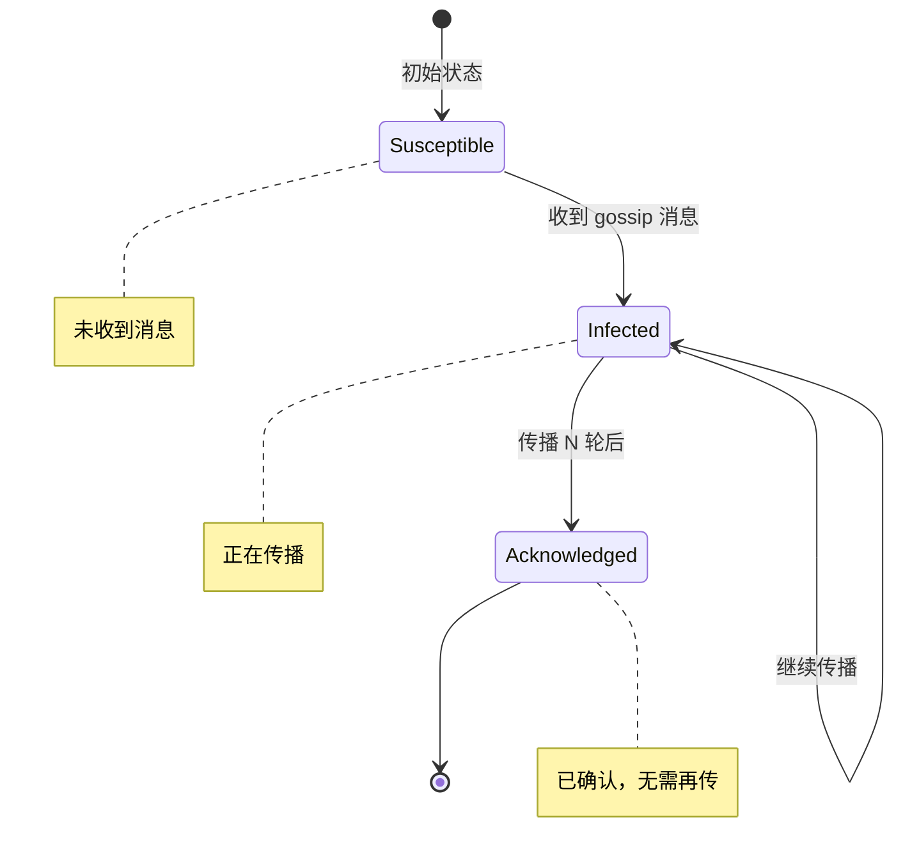
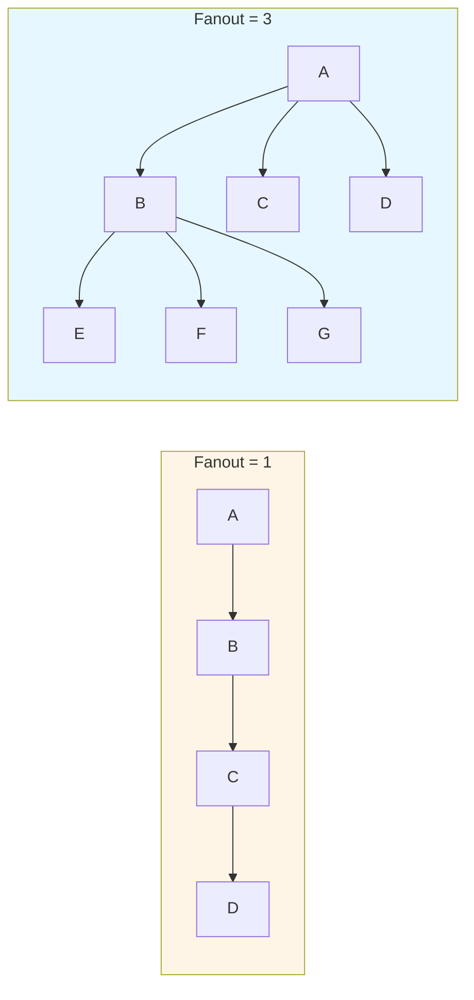

Gossip 的收敛速度是 O(log N)——这是它的核心优势，也是面试常考点。但「O(log N)」到底意味着什么？收敛时间受哪些因素影响？有没有办法让它更快？

这一篇来深入探讨 Gossip 的收敛性，理解为什么这种「病毒式」传播能保证所有节点最终一致，以及它的数学边界在哪里。

## 收敛时间的定义

在 Gossip 协议中，**收敛时间（Convergence Time）**指的是从某个节点更新了一条数据，到集群中所有 N 个节点都收到该更新的时间。通常以「轮次（Round）」为单位度量。

一轮（Round）的定义是：每个节点都执行一次 gossip 轮次，即向随机选择的节点发送消息。由于所有节点并行执行，物理时间上的一轮约等于一个传播周期（通常几十到几百毫秒）。

数学上，设 T(N) 为 N 个节点的收敛时间。理想情况下：

```
T(N) ≈ log₂(N) + log_f(N)
```

其中 f 是每个节点每轮选择的传播目标数量（fanout）。当 f = 1 时，收敛时间是 O(N)（线性）；当 f >= 2 时，收敛时间是 O(log N)。

## 流行病模型：SI、SIa 与 SC

Gossip 协议的收敛性分析借鉴了流行病学的研究成果。流行病模型描述了疾病如何在人群中传播，而 Gossip 协议描述了消息如何在节点间传播——两者的数学本质是相通的。

### SI 模型（Susceptible-Infected）

SI 模型是最简单的模型：每个节点分为「易感者（S）」和「感染者（I）」。感染者会持续传播疾病，而易感者一旦被感染就变成感染者。

在 Gossip 中，SI 模型对应 **Rumor-Mongering 模式**：已收到消息的节点继续传播，未收到消息的节点收到后变为「已感染」并继续传播。

SI 模型的收敛速度取决于感染率 β 和网络结构。在均匀随机网络中，SI 模型达到 100% 感染需要大约 O(log N) 轮。

### SIa 模型（Susceptible-Infected-Acknowledged）

SIa 模型在 SI 基础上增加了「已确认（A）」状态。节点收到消息后进入「已感染」状态，传播若干轮后进入「已确认」状态，停止传播。



SIa 模型解决了「消息无限传播」的问题。节点在传播若干轮后进入「已确认」状态，停止传播，避免了网络资源的浪费。但这也引入了新的问题：如果某个节点在进入「已确认」状态之前丢失了消息（比如网络抖动），它可能永久收不到这条消息。

### SC 模型（Susceptible-Confirmed）

SC 模型是更严格的变体。节点收到消息后必须收到「确认」，才认为消息已被接受。确认可以来自原始发送者，也可以来自其他已收到消息的节点。

SC 模型提供了更强的一致性保证，但实现复杂度也更高，因为它需要节点之间相互确认消息的接收。

## 收敛性的数学保证

Gossip 协议的一个重要特性是：**只要网络是连通的，Gossip 协议必然会收敛**。

这个保证来自于随机图理论的结论。考虑一个完全图（每对节点都有直接连接的可能性），每轮中每个节点以概率 p 感染一个随机节点。根据随机过程理论，这个感染过程是一个**超临界分支过程（Supercritical Branching Process）**，最终感染所有节点。

更形式化地说，假设每个节点每轮随机选择 f 个节点传播消息，则每轮的「有效传播系数」为：

```
λ = f / N
```

当 λ > 0 时，消息会以概率 1 传播到所有节点（只要网络连通）。这个结论不依赖于具体的网络拓扑——只要每个节点在每轮中至少有机会与一个新节点通信，收敛就有保证。

## 收敛时间的影响因素

理论上的 O(log N) 收敛时间，在实际系统中会受到多种因素的影响。

### Fanout（传播系数）

Fanout 是每轮传播给多少个节点。fanout 越大，收敛越快，但带宽消耗也越大。



fanout 与收敛时间的关系不是线性的。当 fanout 从 1 增加到 2-3 时，收敛时间显著下降；但继续增加 fanout，边际收益递减。这是因为当 fanout 足够大时，消息已经能够「覆盖」大部分节点。

### Period（传播周期）

传播周期是两次 gossip 轮次之间的物理时间间隔。周期越短，收敛越快，但 CPU 和网络负载越高。

典型的传播周期是 100ms 到 1 秒。对于延迟敏感的场景（如故障检测），可以设置到 50ms；对于对带宽敏感的场景（如跨数据中心同步），可以设置到 5-10 秒。

### 网络延迟与丢包

网络延迟直接影响每轮 gossip 的物理时间。如果 RTT（往返延迟）是 10ms，那么每轮的物理时间至少是 10ms。即使只需要 10 轮收敛，总物理时间也是 100ms。

网络丢包会延长收敛时间。当消息丢失时，接收方不会收到更新，需要等待下一轮重传。在高丢包率的网络中，可能需要多轮重传才能收敛。

### 节点异构性

真实集群中，不同节点的硬件配置、网络条件可能差异很大。性能较弱的节点（称为「stragglers」）可能拖慢整体收敛时间。

考虑一个极端情况：99% 的节点在 10 轮内收敛，但 1% 的节点在 100 轮后才收敛。那么整体收敛时间是 100 轮，而不是 10 轮。这就是**木桶原理**——最慢的节点决定了整体收敛时间。

## 最坏情况分析：信息孤岛

Gossip 协议在理论上保证了收敛，但在实际部署中，最危险的问题是**信息孤岛（Information Silo）**。

假设某个节点 A 与其他所有节点的连接都很差——网络延迟高、丢包率高。A 收到新数据的概率很低，即使收到也需要很长时间。这会导致：

- A 的数据长期落后于集群
- 如果 A 是数据的重要节点（如某些副本的持有者），可能导致数据不一致
- 如果 A 负责某些关键功能（如协调者），可能导致服务不可用

处理信息孤岛的方法有几种：

**多路径传播**：不依赖单条 gossip 路径，而是让消息通过多条独立路径传播。即使某条路径中断，其他路径仍能到达目标节点。

**强制同步**：当检测到某节点长期落后时（如通过版本号对比），触发强制同步而不是等待自然收敛。

**拓扑感知**：让 Gossip 协议感知网络拓扑，优先与同机房、同机架的节点通信，减少跨地域传播的延迟和丢包。

## Gossip vs 心跳广播 vs 中心化协调

在分布式系统中，除了 Gossip，还有其他成员管理和数据同步机制。理解它们的权衡，才能做出正确的技术选型。

| 维度 | Gossip | 心跳广播 | 中心化协调 |
| --- | --- | --- | --- |
| **带宽复杂度** | O(1) / 节点 | O(N) / 节点 | O(N)（协调者） |
| **收敛时间** | O(log N) 轮 | O(1) 轮 | O(1) 轮 |
| **一致性保证** | 最终一致 | 强一致（可靠广播） | 强一致 |
| **容错性** | 高（无单点） | 中（依赖广播树） | 低（单点故障） |
| **实现复杂度** | 低 | 中 | 中 |
| **适用规模** | 任意规模 | < 1000 节点 | < 100 节点 |
| **延迟敏感度** | 低（异步） | 高（同步等待） | 高（同步等待） |

**心跳广播**通过可靠广播算法（如基于 NACK 的反馈协议）在 O(1) 轮内保证所有节点收到消息，但每条消息的带宽消耗是 O(N)，不适合大规模集群。

**中心化协调**（如 ZooKeeper）通过单一协调者管理成员列表，延迟最低，但存在单点故障风险，且协调者会成为扩展瓶颈。

Gossip 协议在**大规模、高容错、最终一致性可接受**的场景下是最佳选择。Cassandra 的节点发现、Consul 的服务发现、Redis Cluster 的故障检测都选择了 Gossip，正是因为这些场景需要 scale 到成百上千个节点，同时能容忍秒级的收敛延迟。

## 术语表

| 术语 | 英文 | 定义 |
| --- | --- | --- |
| 收敛 | Convergence | 系统中所有节点对某个数据或状态达成一致的过程 |
| 轮次 | Round | 一次完整的 gossip 传播周期，通常指所有节点执行一次 gossip |
| 传播系数 | Fanout | 每个节点每轮选择传播消息的目标节点数量 |
| 传播周期 | Period | 两次 gossip 轮次之间的物理时间间隔 |
| SI 模型 | Susceptible-Infected | 流行病模型：易感者→感染者，用于描述消息扩散 |
| SIa 模型 | Susceptible-Infected-Acknowledged | 带确认的流行病模型：感染者传播后进入已确认状态 |
| SC 模型 | Susceptible-Confirmed | 更严格的模型：必须收到确认才认为消息已被接受 |
| 信息孤岛 | Information Silo | 因网络或性能原因，无法正常接收 gossip 消息的节点 |

---

理解收敛性之后，下一个问题是：Gossip 能检测节点故障吗？传统的超时机制太粗糙，如何更精确地判断一个节点是真的宕机，还是只是网络慢？这就引出了 **Phi Accrual 故障检测器**。
