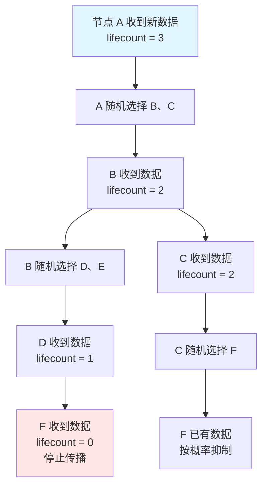

想象你在一个大型派对上，你只认识几个人。你把八卦告诉他们，他们再告诉其他人——即使你不认识派对上的所有人，「八卦」也会在短时间内传遍整个房间。这就是 Gossip 协议最直观的类比。

分布式系统中，Gossip 协议是一种模拟流行病传播的协议。它不需要中心协调者，不需要全网广播，每个节点只需要与少数几个邻居交换信息，就能让数据在短时间内传播到整个集群。这种「病毒式」的信息传播方式，是构建大规模分布式系统的基础设施。

## Gossip 协议的核心要素

:::tip
**Gossip 协议的三个关键组件**

Gossip 协议有三个关键组件，正是它们的组合让协议具有了独特的性质：

1. **Gossip 消息**：传播的载体，包含版本号或时间戳
2. **周期性交互**：每轮随机选择 1-3 个节点传播
3. **随机选择目标**：无中心、无瓶颈、天然容错
:::

- 无需知道全局拓扑
- 避免了单点瓶颈
- 天然具备容错性——某个节点宕机不影响整体传播

## 两种传播模式

Gossip 协议有两种互补的传播模式，适用于不同的场景。

### Anti-Entropy（修复模式）

Anti-Entropy 模式传播完整的数据状态，目标是让所有节点的数据最终完全一致。它的工作方式类似「对账」：两个节点交换各自数据的摘要，发现差异后，持有更新数据的节点将完整数据发送给落后的节点。

这种模式的特点是**最终一致性保证最强**，但带宽消耗也最大。因为每次交互都要传输完整数据，对于数据量大的场景，Anti-Entropy 会造成显著的网络压力。所以实际系统中，Anti-Entropy 通常不频繁执行，可能每分钟甚至更久才执行一次。

### Rumor-Mongering（谣言模式）

Rumor-Mongering 模式传播「新数据」，即只传播最近发生的变化。当一个节点收到新数据后，它会在后续的 gossip 轮次中继续传播这条数据，直到被「老化」机制停止。

为了避免消息无限传播，Gossip 协议引入了**老化（Anti-entropy）或抑制（Suppression）机制**。常见做法是：每条消息有一个生命周期计数器，每被转发一次减 1，当计数器归零时停止传播。或者采用「随机抑制」：节点收到已经知道的消息时，有一定概率不再转发。



两种模式通常配合使用：Rumor-Mongering 用于快速传播增量更新，Anti-Entropy 用于定期修复因消息丢失或节点重启导致的不一致。

## 收敛速度的数学分析

:::info
**Gossip 协议的收敛速度是 O(log N)**——这是它最核心的优势，也是面试中的常考点。

假设集群有 N 个节点，每个节点每轮随机选择 f 个节点传播消息。在理想条件下（网络稳定、无消息丢失），经过 T 轮传播后，消息覆盖的节点数量约为：

```
覆盖节点数 ≈ N × (1 - (1 - f/N)^T)
```

当 T = O(log N) 时，覆盖率接近 100%。这意味着一个有 10000 个节点的系统，大约只需要 log₂(10000) ≈ 14 轮就能让消息传遍全网。
:::

| 节点规模 N | 收敛轮数（约） | 每轮带宽（每个节点） |
| --- | --- | --- |
| 100 | 7 | 恒定（与 N 无关） |
| 1,000 | 10 | 恒定（与 N 无关） |
| 10,000 | 14 | 恒定（与 N 无关） |
| 100,000 | 17 | 恒定（与 N 无关） |

这个表格揭示了 Gossip 最重要的特性：**带宽消耗是 O(1)，与集群规模无关**。无论集群有 100 个节点还是 10 万个节点，每个节点每轮发送的消息数量是固定的（通常是 1-3 条）。这是 Gossip 协议能够 scale 到超大规模的根本原因。

## 简化版 Gossip 协议实现

以下是一个简化版的 Gossip 协议 Java 实现，展示了核心逻辑：

```java
public class GossipNode {
    private final String nodeId;
    private final Map<String, VersionedValue> state;  // key -> (value, version)
    private final Random random = new Random();
    private final int fanout = 3;  // 每轮传播给几个节点
    private final Set<String> clusterMembers;
    
    // 定时执行 gossip 轮次
    public void runGossipRound() {
        // 随机选择目标节点
        List<String> targets = selectRandomTargets(fanout);
        
        for (String target : targets) {
            // 构建待发送的摘要（版本信息）
            Map<String, Long> digest = buildDigest();
            
            // 发送并获取对方的摘要
            Map<String, VersionedValue> remoteDigest = 
                sendGossip(target, digest);
            
            // 合并数据
            mergeFrom(remoteDigest);
        }
    }
    
    // 选择随机目标节点（排除自己）
    private List<String> selectRandomTargets(int count) {
        List<String> allOthers = new ArrayList<>(clusterMembers);
        allOthers.remove(nodeId);
        Collections.shuffle(allOthers);
        return allOthers.stream().limit(count).toList();
    }
    
    // 合并来自其他节点的数据
    private void mergeFrom(Map<String, VersionedValue> remoteState) {
        for (Map.Entry<String, VersionedValue> entry : remoteState.entrySet()) {
            String key = entry.getKey();
            VersionedValue remote = entry.getValue();
            
            state.compute(key, (k, local) -> {
                if (local == null || remote.version() > local.version()) {
                    return remote;  // 采用更新的值
                }
                return local;  // 保留本地值
            });
        }
    }
}
```

这个实现省略了很多细节（如网络通信、超时处理、故障恢复），但体现了 Gossip 协议的本质：**基于版本号的数据合并**。

## Gossip 的优势与局限

:::tip
**Gossip 协议的优势**：

- **去中心化**：无需协调者，天然支持集群弹性伸缩
- **高容错**：节点宕机、网络分区都不影响整体传播
- **自愈能力**：节点恢复后自动同步，无需人工干预
- **可扩展**：带宽消耗恒定，理论上可支持无限规模
- **实现简单**：不需要复杂的分布式算法
:::

:::warning
**Gossip 协议的局限**：

- **最终一致性**：不保证强一致性，数据可能在传播过程中不一致
- **收敛延迟**：O(log N) 的收敛时间对于强一致性场景可能太长
- **消息冗余**：随机选择导致同一消息可能被多次传播，带宽利用率不是最优
- **无法保证覆盖**：极端情况下（随机选择总是「撞车」），某些节点可能长时间收不到消息
:::

| 权衡维度 | Gossip | 中心化广播 | 两阶段提交 |
| --- | --- | --- | --- |
| 带宽复杂度 | O(1) | O(N) | O(N) |
| 延迟 | O(log N) | O(1) | O(1) |
| 一致性 | 最终一致 | 强一致 | 线性一致 |
| 容错性 | 高 | 低（单点） | 中等 |
| 扩展性 | 极好 | 差 | 差 |
| 实现复杂度 | 低 | 低 | 高 |

## 典型使用场景

:::info
**Gossip 协议的典型使用场景**：

- **Cassandra 的节点发现与心跳**：每个节点每秒执行一次 gossip 轮次
- **Consul 的服务发现**：使用 Gossip 协议构建 gossip 池，实现无中心化的服务注册与发现
- **Dynamo/Cassandra 的数据同步**：副本间同步写入数据
- **分布式缓存的失效通知**：广播失效消息，而不是逐个通知
:::

Gossip 协议在工业界有广泛的应用，以下是几个最典型的场景。

**Cassandra 的节点发现与心跳**：Cassandra 使用 Gossip 协议在节点间同步集群拓扑、检测节点存活。每个节点每秒执行一次 gossip 轮次，传播心跳和状态信息。

**Consul 的服务发现**：Consul 使用 Gossip 协议构建 gossip 池，实现无中心化的服务注册与发现。Serf 库是这一领域的成熟开源实现。

**Dynamo/Cassandra 的数据同步**：在副本间同步写入数据时，Gossip 协议用于传播最近的更新操作。

**分布式缓存的失效通知**：当某个缓存条目失效时，通过 Gossip 广播失效消息，而不是逐个通知。

如果你正在设计一个需要大规模节点协调的分布式系统，Gossip 协议几乎是必然的选择。但如果你需要强一致性，比如金融交易系统，Gossip 就不是正确答案了——这时候你应该考虑 Raft 或 Paxos。

---

理解了 Gossip 的传播模型之后，下一个问题是：这种「病毒式」传播到底能不能保证所有节点最终都收到消息？这就涉及到 Gossip 的收敛性分析。
