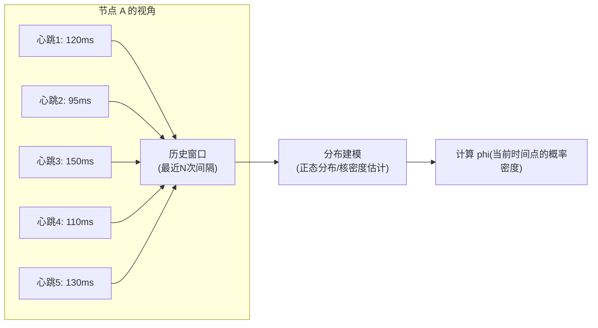

凌晨 3 点，线上监控系统报警：某节点的健康检查连续失败了 3 次。运维工程师按惯例准备执行「重启大法」，但在重启前看了一眼详细日志，发现一个有趣的现象——这个节点之前的健康检查延迟一直在 800ms 左右徘徊，偶尔还会跳到 1500ms。

「等等，这好像不是宕机。」工程师犹豫了一下，决定再观察一分钟。结果发现那个节点其实活得好好的，只是网络交换机出了点小问题，导致延迟波动变大。如果直接重启，可能会造成本来可以自动恢复的服务中断。

这个场景揭示了一个核心问题：**传统的「心跳超时」机制太粗糙了**。它只知道「节点活了」或「节点死了」，却不知道「节点到底有多可能已经死了」。Phi Accrual 故障检测器，正是为了解决这个精确度问题而设计的。

## 为什么简单超时不够用

传统的故障检测方案通常是这么工作的：节点定期发送心跳，如果对方在 `timeout` 时间内没有响应，就判定为死亡。逻辑简单，实现也简单，但问题是——**这个阈值怎么定？**

假设你设置超时为 5 秒。对于一个网络稳定的机房环境，5 秒太长了，检测太慢。对于一个跨地域的分布式系统，5 秒又太短，正常的网络波动就会触发大量误报。

更深层的问题是：**网络延迟不是恒定的**。它会随着负载、GC 暂停、路由变化而波动。如果我们用固定的超时阈值，就只能在「快速检测」和「低误报率」之间二选一，无法两者兼顾。

| 检测方案 | 优点 | 缺点 |
| --- | --- | --- |
| 固定超时（短） | 检测快 | 网络波动时误报率高 |
| 固定超时（长） | 误报率低 | 检测慢，故障发现延迟大 |
| 动态调整超时 | 一定程度适应网络波动 | 仍无法处理延迟分布的变化 |

Phi Accrual 故障检测器的核心思想是：**不判断「死了还是活着」，而是计算「有多大的把握认为它死了」**。这个把握用一个连续值 phi 来表示，你可以根据自己的业务需求设定阈值。

## 历史窗口模型

Phi Accrual 故障检测器的关键创新是**维护一个心跳间隔的历史窗口**，而不是依赖单一的超时值。



每次收到心跳，检测器记录两个时间戳：
1. **收到心跳的时间** `t`
2. **两次心跳之间的时间间隔** `t - t_last`

这些间隔值累积成一个**滑动窗口**。检测器用这个窗口来**建模心跳间隔的概率分布**。常见的建模方式有两种：

### 正态分布假设

如果假设心跳间隔服从正态分布 N(μ, σ²)，则只需要维护两个统计量：
- 均值 μ：平均心跳间隔
- 标准差 σ：间隔的波动程度

这种方法的优点是计算简单，缺点是对于偏态分布（如存在长尾延迟的网络环境）拟合效果不佳。

### 核密度估计（KDE）

不假设任何分布形式，直接用历史数据估计概率密度函数。这种方法更灵活，能适应各种复杂的延迟分布，但计算开销更大。

Akka 默认使用核密度估计，因为它不需要假设分布形式，可以适应各种网络环境。

## phi 值的计算

phi 是 Phi Accrual 故障检测器的核心输出。它的数学含义是：**基于当前观察到的数据（最后一次心跳的时间），计算「最后一次心跳之后已经过了这么久」这个事件，在正常情况下发生的概率有多低。**

phi 值越大，说明「这么久没收到心跳」这件事越不可能发生，因此我们越有把握认为节点已经故障。

### 计算公式

```
phi = -log10( P(now - t_last > Δ) )
```

其中：
- `now` 是当前时间
- `t_last` 是上一次收到心跳的时间
- `Δ` = `now - t_last`，即从最后一次心跳到现在经过的时间
- `P(x > Δ)` 是「下次心跳间隔大于 Δ」的概率

翻译成人话：**phi 值就是「这么久没收到心跳」这件事有多反常的反 log。**

### phi 值的直观理解

| phi 值 | 大概含义 | 实际概率（1/10^phi） |
| --- | --- | --- |
| 1 | 10 次心跳周期内可能出现一次 | 10% |
| 3 | 1000 次心跳周期内可能出现一次 | 0.1% |
| 6 | 100 万次心跳周期内可能出现一次 | 0.0001% |
| 8 | 1 亿次心跳周期内可能出现一次 | 极低 |

Akka 的默认 phi 阈值是 8。这意味着只有当「这么久没收到心跳」这件事在 1 亿个心跳周期内才可能出现一次时，才会判定节点故障。

### 为什么用 log10？

使用对数有几个好处：

1. **数值范围更友好**：概率范围从 1（100%）到 10⁻¹⁵（几乎不可能），log 后变成 -15 到 0，更容易处理
2. **阈值设置直观**：从 phi=5 调整到 phi=6，直觉上就知道是把检测敏感度提高了 10 倍
3. **与工程实践对应**：phi=8 大约对应心跳周期 1 秒时的 8 秒无响应

## Phi Accrual 检测器的 Java 实现

以下是 Phi Accrual 故障检测器的核心实现逻辑：

```java
public class PhiAccrualFailureDetector {

    // 滑动窗口大小
    private final int windowSize;
    // 最小标准差（防止网络波动时 phi 值为负无穷）
    private final double minStdDeviation;
    // phi 值的阈值，超过这个值认为节点已死亡
    private final double threshold;
    // 心跳周期（用于计算初始 phi）
    private final Duration heartbeatInterval;

    // 历史心跳间隔的滑动窗口
    private final List<Long> history;
    // 最后一次收到心跳的时间
    private volatile long lastHeartbeat;

    public PhiAccrualFailureDetector(
            int windowSize,
            double threshold,
            Duration heartbeatInterval) {
        this.windowSize = windowSize;
        this.threshold = threshold;
        this.heartbeatInterval = heartbeatInterval;
        this.minStdDeviation = heartbeatInterval.toMillis() * 0.1; // 最小为周期的 10%
        this.history = new ArrayList<>();
        this.lastHeartbeat = System.currentTimeMillis();
    }

    /**
     * 记录一次心跳
     */
    public void heartbeat(String nodeId) {
        long now = System.currentTimeMillis();
        long interval = now - lastHeartbeat;

        synchronized (history) {
            history.add(interval);
            if (history.size() > windowSize) {
                history.remove(0);
            }
        }

        lastHeartbeat = now;
    }

    /**
     * 计算当前节点的 phi 值
     */
    public double phi(String nodeId) {
        long now = System.currentTimeMillis();
        long timeSinceLastHeartbeat = now - lastHeartbeat;

        synchronized (history) {
            if (history.isEmpty()) {
                // 没有历史数据，使用心跳周期作为均值
                double mean = heartbeatInterval.toMillis();
                return phi(heartbeatInterval.toMillis(), timeSinceLastHeartbeat, mean, minStdDeviation);
            }

            // 计算均值和标准差
            double mean = history.stream().mapToLong(Long::longValue).average().orElse(heartbeatInterval.toMillis());
            double variance = history.stream()
                    .mapToDouble(v -> Math.pow(v - mean, 2))
                    .average()
                    .orElse(minStdDeviation * minStdDeviation);
            double stdDeviation = Math.max(Math.sqrt(variance), minStdDeviation);

            return phi(mean, timeSinceLastHeartbeat, mean, stdDeviation);
        }
    }

    /**
     * 基于正态分布计算 phi
     */
    private double phi(double mean, double timeSinceLastHeartbeat,
                       double calculatedMean, double stdDeviation) {
        if (stdDeviation == 0) {
            // 标准差为 0 时，退化为固定超时
            return timeSinceLastHeartbeat > mean ? 1.0 : 0.0;
        }

        // 计算 Phi = -log10(1 - CDF(Δ))
        // CDF 是正态分布的累计分布函数
        double y = (timeSinceLastHeartbeat - calculatedMean) / stdDeviation;
        double probability = 1.0 - normalCDF(y);

        if (probability < 0.0000000000000001) {
            return 16.0; // 防止 log(0)
        }

        return -Math.log10(probability);
    }

    /**
     * 标准正态分布的累计分布函数（CDF）
     */
    private double normalCDF(double x) {
        // 使用误差函数逼近标准正态分布的 CDF
        return 0.5 * (1.0 + erf(x / Math.sqrt(2)));
    }

    /**
     * 误差函数逼近（Abramowitz and Stegun）
     */
    private double erf(double x) {
        double t = 1.0 / (1.0 + 0.5 * Math.abs(x));
        double tau = t * Math.exp(
            -x * x - 1.26551223
            + t * (1.00002368
            + t * (0.37409196
            + t * (0.09678418
            + t * (-0.18628806
            + t * (0.27886807
            + t * (-1.13520398
            + t * (1.48851587
            + t * (-0.82215223
            + t * 0.17087277))))))))));

        return x >= 0 ? 1.0 - tau : tau - 1.0;
    }

    /**
     * 判断节点是否已经死亡
     */
    public boolean isAvailable(String nodeId) {
        return phi(nodeId) < threshold;
    }

    /**
     * 获取可读的存活状态描述
     */
    public AvailabilityStatus getStatus(String nodeId) {
        double phi = phi(nodeId);
        if (phi < threshold) {
            return AvailabilityStatus.ALIVE;
        } else if (phi < threshold * 1.5) {
            return AvailabilityStatus.SUSPECT;
        } else {
            return AvailabilityStatus.DEAD;
        }
    }
}

enum AvailabilityStatus {
    ALIVE,      // 正常运行
    SUSPECT,    // 可疑状态
    DEAD        // 判定死亡
}
```

### 使用示例

```java
public class FailureDetectorDemo {

    public static void main(String[] args) throws InterruptedException {
        // 创建检测器：窗口大小 100，phi 阈值 8，心跳周期 1 秒
        PhiAccrualFailureDetector detector = new PhiAccrualFailureDetector(
            100,           // 窗口大小
            8.0,           // phi 阈值
            Duration.ofSeconds(1)
        );

        // 模拟节点注册
        String nodeId = "node-1";

        // 模拟正常心跳
        for (int i = 0; i < 10; i++) {
            detector.heartbeat(nodeId);
            System.out.printf("[正常] phi = %.2f, 可用 = %s%n",
                detector.phi(nodeId),
                detector.isAvailable(nodeId));
            Thread.sleep(1000);
        }

        // 模拟网络波动：心跳间隔变长
        System.out.println("\n[网络波动] 心跳间隔变长...");
        Thread.sleep(3000); // 3 秒没收到心跳
        System.out.printf("[网络波动] phi = %.2f, 可用 = %s%n",
            detector.phi(nodeId),
            detector.isAvailable(nodeId));

        // 模拟故障：长时间无心跳
        System.out.println("\n[故障模拟] 继续等待...");
        Thread.sleep(5000); // 再等 5 秒
        System.out.printf("[故障模拟] phi = %.2f, 可用 = %s%n",
            detector.phi(nodeId),
            detector.isAvailable(nodeId));
    }
}
```

运行结果示例：

```
[正常] phi = 0.00, 可用 = true
[正常] phi = 0.01, 可用 = true
...
[正常] phi = 0.15, 可用 = true

[网络波动] phi = 2.34, 可用 = true  // 仍然可用，但 phi 在上升

[故障模拟] phi = 9.87, 可用 = false  // 超过阈值，判定为死亡
```

## 与工业系统的集成

Phi Accrual 故障检测器已经在多个主流分布式系统中得到应用。

### Akka Cluster

Akka 是 Phi Accrual 检测器最著名的应用场景。在 Akka Cluster 中，每个节点都运行一个 Phi Accrual 检测器来监控其他节点的存活状态。

Akka 的默认配置：
- `windowSize = 12`：维护最近 12 次心跳间隔
- `minStdDeviation = 100ms`：最小标准差，防止正常波动导致误报
- `threshold = 8.0`：phi 超过 8 判定死亡
- `heartbeatInterval = 1s`：默认心跳周期

Akka 还支持**差异化的 phi 阈值**。例如，对于有持久化需求的核心节点，可以设置更高的阈值（如 12），减少因短暂网络问题导致的误判。

### Consul

HashiCorp Consul 使用 Phi Accrual 检测器来检测服务实例的健康状态。Consul 的 phi 阈值默认为 5.0，并且支持通过配置调整。

Consul 还有一个独特的优化：**当集群规模较大时，自动降低检测频率**，避免过度的健康检查流量影响系统性能。

### Cassandra

Cassandra 的故障检测使用了类似的概率模型（虽然不是严格意义上的 Phi Accrual），它通过维护 Gossiper 中的节点状态来检测故障。

Cassandra 的 Gossip 协议配合故障检测，实现了：
- **动态种子发现**：通过 Gossip 发现新节点
- **故障检测**：基于历史交互判断节点是否存活
- **拓扑管理**：检测节点的网络位置变化

## 权衡矩阵

| 场景 | 推荐配置 | 说明 |
| --- | --- | --- |
| 高稳定网络环境 | phi = 5~6，窗口 = 50 | 降低阈值可以更快检测故障 |
| 跨地域/跨数据中心 | phi = 10~12，窗口 = 200 | 容忍更大的网络延迟波动 |
| 低延迟敏感业务 | phi = 3~4，窗口 = 30 | 宁可误报也要快速检测 |
| 无状态微服务 | phi = 8~10，窗口 = 100 | 平衡检测速度与稳定性 |

## 常见配置误区

**误区一：阈值越低越好**

有些人认为「我把 phi 设为 1，这样就能更快发现问题」。但 phi=1 意味着「10 次心跳周期内可能出现一次」的情况就会被判定为故障——正常网络波动就足以触发大量误报。

**误区二：窗口越大越好**

更大的窗口可以平滑更多的波动，但也会导致**检测器「忘记」网络状况的变化**。如果网络的 baseline 延迟从 100ms 变成了 500ms，大窗口会花很长时间才能适应这个变化。

**误区三：不做监控告警**

Phi Accrual 检测器的核心价值不只是「判定生死」，而是 **phi 值本身就是一个非常有价值的监控指标**。建议将 phi 值暴露给监控系统，在节点接近阈值但还没死亡时就能发出预警。

## 术语表

| 术语 | 定义 |
| --- | --- |
| **Phi Accrual** | 一种基于概率模型的故障检测算法，通过计算 phi 值来表示节点故障的置信度 |
| **phi 值** | 表示「这么久没收到心跳」这件事在正常情况下发生的概率有多低，值越大表示越可能故障 |
| **滑动窗口（Sliding Window）** | 维护最近 N 次心跳间隔的历史记录，用于建模延迟分布 |
| **核密度估计（KDE）** | 一种非参数估计方法，用历史数据直接估计概率密度函数 |
| **累计分布函数（CDF）** | 描述随机变量小于等于某个值的概率 |
| **误报率（False Positive Rate）** | 节点正常但被误判为故障的概率 |
| **漏报率（False Negative Rate）** | 节点已故障但未被检测到的概率 |

---

故障检测是分布式系统的基础设施，而 Phi Accrual 检测器代表了「自适应、概率化」这一方向。相比于简单粗暴的固定超时，phi 值提供了更精细的「故障置信度」视图，是现代分布式系统不可或缺的能力。

如果你觉得 phi 值的概念太抽象，可以先从 SWIM 协议开始——它提供了另一种故障检测的思路，通过主动探测而非被动观察来判断节点状态。
