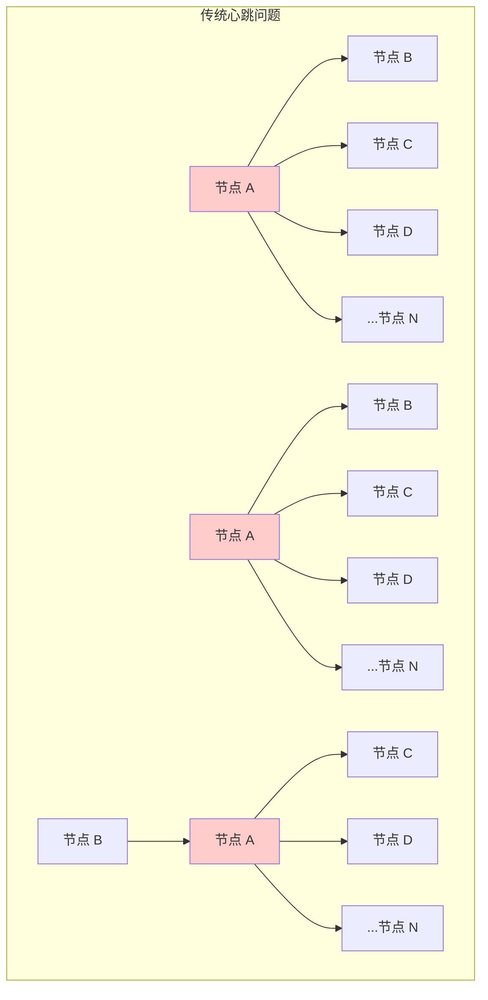
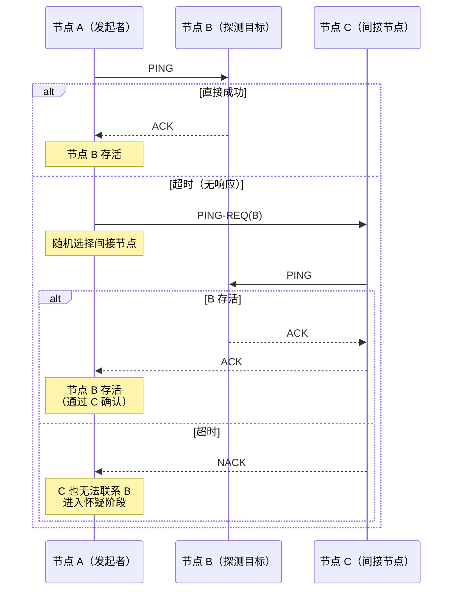
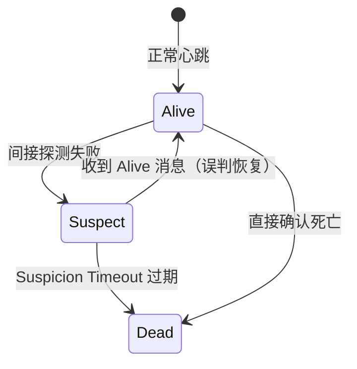

假设你负责维护一个有 10000 个节点的分布式数据库。每个节点每秒向所有其他节点发送心跳，这意味着**每秒要发送 1 亿条心跳消息**。更糟糕的是，这个数字还会随着节点数量**以平方级别增长**。

这就是传统基于心跳的故障检测面临的根本问题：**它无法 scale**。Swim 协议的出现，就是为了解决这个问题。

SWIM 的全称是 **Scalable Weakly-consistent Infection-style Membership protocol**。名字里的每一个词都很关键：
- **Scalable**：可以扩展到大规模集群
- **Weakly-consistent**：只提供弱一致性保证
- **Infection-style**：信息像病毒一样传播
- **Membership**：成员管理（不仅仅是故障检测）

## 传统心跳的局限性

在理解 SWIM 之前，我们先看看传统心跳协议为什么不适合大规模系统。

### 心跳的扩展性问题

假设集群有 N 个节点，每个节点需要检测其他 N-1 个节点的存活。朴素的做法是：

1. **每个节点维护完整成员列表**：O(N) 内存
2. **每个节点每 T 秒发送 N-1 条消息**：O(N) 带宽/节点，O(N²) 总带宽
3. **每个节点每秒处理 N-1 条消息**：O(N) CPU

当 N = 10000 时，**每个节点每秒要发送和接收近 2 万条心跳**，总带宽消耗是难以承受的。



### 心跳的其他问题

除了扩展性，固定间隔的心跳还有其他问题：

**无法区分故障类型**：节点可能因为 GC 暂停而暂时无法响应，固定超时会导致误判。Phi Accrual 检测器解决了这个问题，但仍然无法解决扩展性问题。

**网络拥塞放大**：当大量节点同时检测到某个节点故障时，可能会同时向这个「故障节点」发送大量重连请求，造成网络拥塞——这被称为**惊群效应（Thundering Herd）**。

## SWIM 的核心设计

SWIM 的核心思想只有两句话：

1. **不广播，只探测**：每个节点只随机选择一个其他节点进行探测
2. **不自己判断，让别人帮你确认**：如果探测超时，通过间接探测来确认

### SWIM 的探测周期

SWIM 协议以固定的时间间隔（称为 **protocol period**）执行，通常是几百毫秒到几秒。每个周期内，每个节点执行以下步骤：



**PING**：直接向目标节点发送探测消息。

**ACK**：目标节点正常响应，表示存活。

**PING-REQ（间接探测）**：如果直接 PING 超时（通常 500-1500ms），随机选择一个其他节点 C，让它帮忙间接探测 B。

**NACK**：如果间接探测也失败，进入怀疑阶段。

## 怀疑机制

传统协议的「超时没响应 = 死亡」逻辑过于粗暴。SWIM 引入了**怀疑机制**，给节点一个「自我辩护」的机会。

### 怀疑状态

当节点 A 通过间接探测也无法联系节点 B 时，节点 A 会：

1. **将 B 标记为可疑（Suspect）**
2. **将这个信息通过 Gossip 传播给其他节点**
3. **等待一个超时时间（Suspicion Timeout）**
4. **如果期间没有收到 B 的否认，判定 B 为死亡**



### 增量成员更新

SWIM 的另一个关键设计是**增量传播**。当一个节点被判定为死亡后，这个信息不会立即从所有节点的成员列表中删除。而是通过 Gossip 协议慢慢传播给所有节点。

这种设计的好处是：

1. **带宽峰值平滑**：死亡事件不会导致大量广播
2. **最终一致性**：所有节点最终都会知道成员变化
3. **容错性**：丢失一些 Gossip 消息不影响正确性

## SWIM 的数学保证

尽管 SWIM 使用随机探测和间接确认，它仍然提供了严格的理论保证。

### 检测时间上界

假设集群有 N 个节点，每个周期每个节点执行一次探测：

- **最好情况**：O(1) —— 第一次探测就成功
- **最坏情况**：O(N) —— 需要遍历多个间接节点
- **期望时间**：O(log N) —— 与 Gossip 协议的收敛速度相当

这个期望时间是通过随机选择实现的。直觉上，每次探测只有 1/N 的概率选到目标节点，但由于有 N 个节点同时探测，**总能在 O(log N) 个周期内覆盖整个空间**。

### 假阳性分析

「假阳性」是指节点正常但被误判为死亡。SWIM 的怀疑机制有效降低了假阳性率：

| 机制 | 假阳性场景 | 影响 |
| --- | --- | --- |
| 直接超时 | 网络偶尔抖动 | 可能误判 |
| 间接探测 | 目标节点和间接节点同时网络抖动 | 概率降低到 1/N |
| 怀疑机制 | 需要连续多个周期无法确认 | 概率进一步降低 |

理论上，在稳定网络下，SWIM 的假阳性率可以接近零。

## SWIM 的 Java 实现

以下是 SWIM 协议的核心实现：

```java
public class SwimNode {

    private final String nodeId;
    private final Duration protocolPeriod;      // 探测周期
    private final Duration pingTimeout;         // PING 超时
    private final Duration suspicionTimeout;    // 怀疑超时
    private final int indirectFactor;           // 间接探测候选数

    private final Map<String, MemberState> membership;  // 成员状态
    private final ExecutorService executor;
    private volatile boolean running = true;

    public SwimNode(String nodeId, Duration protocolPeriod) {
        this.nodeId = nodeId;
        this.protocolPeriod = protocolPeriod;
        this.pingTimeout = Duration.ofMillis(500);
        this.suspicionTimeout = Duration.ofSeconds(3);
        this.indirectFactor = 3;

        this.membership = new ConcurrentHashMap<>();
        this.executor = Executors.newFixedThreadPool(2);
    }

    /**
     * SWIM 主循环
     */
    public void start() {
        executor.submit(this::protocolLoop);
        executor.submit(this::gossipLoop);
    }

    /**
     * SWIM 协议主循环
     */
    private void protocolLoop() {
        while (running) {
            long startTime = System.currentTimeMillis();

            // 随机选择一个目标节点进行探测
            String target = selectRandomTarget();
            if (target != null) {
                doProbe(target);
            }

            // 处理怀疑超时
            checkSuspicionTimeout();

            // 保证协议周期的精度
            long elapsed = System.currentTimeMillis() - startTime;
            long sleepTime = protocolPeriod.toMillis() - elapsed;
            if (sleepTime > 0) {
                try {
                    Thread.sleep(sleepTime);
                } catch (InterruptedException e) {
                    Thread.currentThread().interrupt();
                    break;
                }
            }
        }
    }

    /**
     * 执行一次探测
     */
    private void doProbe(String targetId) {
        MemberState target = membership.get(targetId);
        if (target == null) {
            return;
        }

        // 记录当前 incarnation（用于检测旧消息）
        long incarnation = target.incarnation();

        try {
            // 发送 PING 并等待 ACK
            Message ping = new Message(Message.Type.PING, nodeId, targetId, incarnation);
            Message ack = sendWithTimeout(ping, pingTimeout);

            if (ack != null) {
                // 探测成功，节点存活
                markAlive(targetId);
            }
        } catch (TimeoutException e) {
            // 直接探测失败，尝试间接探测
            doIndirectProbe(targetId, incarnation);
        }
    }

    /**
     * 间接探测
     */
    private void doIndirectProbe(String targetId, long targetIncarnation) {
        // 随机选择 k 个候选节点
        List<String> candidates = selectRandomMembers(indirectFactor, targetId);

        for (String indirectNode : candidates) {
            try {
                // 发送 PING-REQ
                Message pingReq = new Message(
                    Message.Type.PING_REQ, nodeId, indirectNode, targetIncarnation
                );
                pingReq.setTarget(targetId);

                Message ack = sendWithTimeout(pingReq, pingTimeout);

                if (ack != null && ack.getType() == Message.Type.ACK) {
                    // 间接探测成功
                    markAlive(targetId);
                    return;
                }
            } catch (TimeoutException e) {
                // 这个间接节点也不响应，继续尝试下一个
                continue;
            }
        }

        // 所有间接探测都失败，进入怀疑状态
        markSuspect(targetId);
    }

    /**
     * 处理怀疑超时
     */
    private void checkSuspicionTimeout() {
        long now = System.currentTimeMillis();

        membership.forEach((nodeId, state) -> {
            if (state.status() == MemberStatus.SUSPECT) {
                if (now - state.suspectSince() > suspicionTimeout.toMillis()) {
                    // 怀疑超时，判定死亡
                    markDead(nodeId);
                }
            }
        });
    }

    /**
     * Gossip 传播循环
     */
    private void gossipLoop() {
        while (running) {
            try {
                Thread.sleep(protocolPeriod.toMillis());

                // 随机选择一个节点交换成员信息
                String target = selectRandomTarget();
                if (target != null) {
                    gossip(target);
                }
            } catch (InterruptedException e) {
                Thread.currentThread().interrupt();
                break;
            }
        }
    }

    /**
     * Gossip 成员信息
     */
    private void gossip(String targetId) {
        // 构建增量更新消息（只包含本地知道的变化）
        IncrementalUpdate update = buildIncrementalUpdate();

        Message msg = new Message(Message.Type.GOSSIP, nodeId, targetId, 0);
        msg.setPayload(serialize(update));

        try {
            sendWithTimeout(msg, pingTimeout);
        } catch (TimeoutException e) {
            // Gossip 失败不阻塞，下一轮继续
        }
    }

    // ========== 状态管理 ==========

    public void markAlive(String nodeId) {
        membership.compute(nodeId, (k, existing) -> {
            if (existing == null) {
                return new MemberState(nodeId, MemberStatus.ALIVE, System.currentTimeMillis());
            }
            return existing.toAlive();
        });

        // 广播 Alive 消息
        broadcast(new Message(Message.Type.ALIVE, nodeId, null, 0));
    }

    public void markSuspect(String nodeId) {
        membership.compute(nodeId, (k, existing) -> {
            if (existing == null) {
                return new MemberState(nodeId, MemberStatus.SUSPECT, System.currentTimeMillis());
            }
            if (existing.status() != MemberStatus.SUSPECT) {
                return existing.toSuspect();
            }
            return existing;
        });

        // 通过 Gossip 广播怀疑消息
        broadcast(new Message(Message.Type.SUSPECT, nodeId, null, 0));
    }

    public void markDead(String nodeId) {
        membership.compute(nodeId, (k, existing) -> {
            if (existing == null) {
                return new MemberState(nodeId, MemberStatus.DEAD, System.currentTimeMillis());
            }
            return existing.toDead();
        });

        // 从成员列表中移除（延迟删除）
        broadcast(new Message(Message.Type.DEAD, nodeId, null, 0));
    }

    // ========== 辅助方法 ==========

    private String selectRandomTarget() {
        List<String> keys = new ArrayList<>(membership.keySet());
        keys.remove(nodeId);
        if (keys.isEmpty()) {
            return null;
        }
        Collections.shuffle(keys);
        return keys.get(0);
    }

    private List<String> selectRandomMembers(int count, String exclude) {
        List<String> keys = new ArrayList<>(membership.keySet());
        keys.remove(nodeId);
        keys.remove(exclude);
        Collections.shuffle(keys);
        return keys.stream().limit(count).toList();
    }
}

// ========== 数据结构 ==========

enum MemberStatus {
    ALIVE,
    SUSPECT,
    DEAD
}

record MemberState(
    String nodeId,
    MemberStatus status,
    long updatedAt,
    long suspectSince,  // 进入怀疑状态的时间
    long incarnation    // incarnation 号，用于区分消息代际
) {
    MemberState(String nodeId, MemberStatus status, long updatedAt) {
        this(nodeId, status, updatedAt, updatedAt, 0);
    }

    MemberState toAlive() {
        return new MemberState(nodeId, MemberStatus.ALIVE, System.currentTimeMillis(), 0, incarnation + 1);
    }

    MemberState toSuspect() {
        return new MemberState(nodeId, MemberStatus.SUSPECT, System.currentTimeMillis(),
            System.currentTimeMillis(), incarnation);
    }

    MemberState toDead() {
        return new MemberState(nodeId, MemberStatus.DEAD, System.currentTimeMillis(),
            suspectSince, incarnation);
    }
}

record Message(
    Message.Type type,
    String source,
    String target,
    long incarnation
) {
    enum Type {
        PING, PING_REQ, ACK, NACK,
        ALIVE, SUSPECT, DEAD, GOSSIP
    }

    Object payload;
    String targetNode;  // PING-REQ 时指定要探测的节点

    // ... getter/setter
}
```

### 简化版使用示例

```java
public class SwimDemo {

    public static void main(String[] args) throws InterruptedException {
        // 创建 5 个节点的集群
        Map<String, SwimNode> cluster = new HashMap<>();

        for (int i = 1; i <= 5; i++) {
            String nodeId = "node-" + i;
            SwimNode node = new SwimNode(nodeId, Duration.ofMillis(500));
            cluster.put(nodeId, node);
            node.start();

            // 添加其他节点到成员列表
            cluster.keySet().stream()
                .filter(id -> !id.equals(nodeId))
                .forEach(id -> node.addMember(id));
        }

        // 运行一段时间
        Thread.sleep(5000);

        // 查看成员状态
        System.out.println("\n=== 成员状态 ===");
        cluster.get("node-1").getMembership().forEach((id, state) -> {
            System.out.printf("%s: %s%n", id, state.status());
        });
    }
}
```

## SWIM 的变体

原始 SWIM 协议有几个常用的变体，提供了不同的权衡。

### SWIM-Dissemination

SWIM 的原始论文描述的是 **Dissemination（传播）** 模式：只传播死亡/存活事件，不传播任何应用层数据。

优点是消息体最小，扩展性最好。缺点是功能单一。

### SWIM-Infection

**Infection（感染）** 模式扩展了 Dissemination，支持传播任意数据（如应用状态）。类似 Gossip 协议的 Rumor-Mongering。

### 随机诱导（Randomized Induction）

原始 SWIM 使用确定性的「每个周期探测一个随机节点」。一些实现（如 Cassandra）会改为「每周期探测多个节点」，以加快检测速度，但会牺牲部分扩展性。

### Ping-RDG（Random Disjoint Set）

每次探测时，从不重叠的节点集合中选择间接探测节点。这样可以避免多个节点同时探测同一个目标，造成网络拥塞。

## 与其他方案的对比

| 维度 | SWIM | 固定心跳 | Phi Accrual |
| --- | --- | --- | --- |
| 扩展性 | O(N) 每节点 | O(N²) 总带宽 | O(N²) 总带宽 |
| 检测时间 | O(log N) 期望 | O(1) | O(1) |
| 误报率 | 低（怀疑机制） | 中 | 低（概率模型） |
| 带宽利用率 | 高（按需探测） | 低（持续发送） | 低（持续发送） |
| 实现复杂度 | 中 | 低 | 中 |
| 一致性 | 弱一致 | 强一致 | 概率一致 |

## 工业实践

### Consul

HashiCorp Consul 的 Serf 库是 SWIM 协议最知名的开源实现之一。Consul 在 SWIM 基础上做了一些改进：

1. **混合协议**：使用 SWIM 进行故障检测，但通过 Gossip 传播成员列表
2. **可配置探测间隔**：支持用户根据网络环境调整协议周期
3. **重命名机制**：支持节点离开时主动广播离开事件，而不是等待超时

### Cassandra

Cassandra 使用 ** Zookeeper 风格的故障检测**，但借鉴了 SWIM 的间接探测思想。当一个节点无法直接联系目标时，会通过其他节点进行间接确认。

### Serf

HashiCorp 的 Serf 是一个纯粹的 SWIM 实现，专注于成员管理和故障检测。它的特点是：

- 零配置：节点加入时自动发现
- 可扩展到数千个节点
- 支持自定义事件处理器

## 权衡矩阵

| 场景 | 推荐方案 | 原因 |
| --- | --- | --- |
| 小规模集群（N `<` 100） | 固定心跳 | 简单，误报率低 |
| 大规模集群（N `>` 1000） | SWIM | 扩展性好 |
| 需要快速检测 | SWIM + 多探测 | 牺牲带宽换速度 |
| 网络不稳定环境 | SWIM + 怀疑机制 | 减少误报 |
| 需要概率化阈值 | Phi Accrual | 更精细的控制 |

## 常见误区

**误区一：SWIM 比心跳慢**

SWIM 的期望检测时间是 O(log N)，对于 1000 个节点的集群，大约需要 10 个周期。如果周期是 500ms，最坏情况约 5 秒。但对于同等规模的固定心跳，如果网络波动导致超时设置为 5 秒，检测时间也是 5 秒——而 SWIM 的带宽消耗只有心跳的 1/1000。

**误区二：SWIM 不适合金融系统**

SWIM 提供的是「弱一致性」——成员视图可能在短时间内不一致。但对于故障检测，这个不一致性窗口通常在秒级，完全可以接受。金融系统如果需要强一致的状态同步，应该在 SWIM 之上叠加 Raft/Paxos，而不是用 SWIM 来做一致性保证。

**误区三：怀疑机制可有可无**

怀疑机制是 SWIM 的精华之一。它通过「给节点辩护机会」大幅降低了误报率。在生产环境中，网络抖动是常态，没有怀疑机制会导致大量误判，影响系统稳定性。

## 术语表

| 术语 | 定义 |
| --- | --- |
| **SWIM** | Scalable Weakly-consistent Infection-style Membership protocol，可扩展的弱一致性感染式成员协议 |
| **Protocol Period** | SWIM 协议的执行周期，每个周期每个节点进行一次探测 |
| **Ping-ACK** | 直接探测机制，发送 PING 并等待 ACK 响应 |
| **Ping-REQ** | 间接探测机制，通过其他节点帮忙探测目标 |
| **Suspicion** | 怀疑状态，当探测失败时进入，等待自我辩护或超时确认 |
| **Incarnation** | 节点的生命周期号，用于区分不同代的节点消息 |
| **Gossip Dissemination** | 通过 Gossip 协议传播成员变更信息 |
| **False Positive** | 假阳性，正常节点被误判为故障 |
| **False Negative** | 假阴性，故障节点未被检测到 |

---

SWIM 协议代表了分布式故障检测从「确定性」到「概率性」的范式转变。它用更少的资源实现了更好的扩展性，同时通过怀疑机制保持了低误报率。如果你正在设计一个需要管理大量节点的系统，SWIM 几乎是不二之选。

理解了 SWIM 的间接探测思想，我们再来看看这些理论在工业界的具体实践——以 Cassandra 为例，看它是如何将 Gossip 和故障检测结合在一起的。
