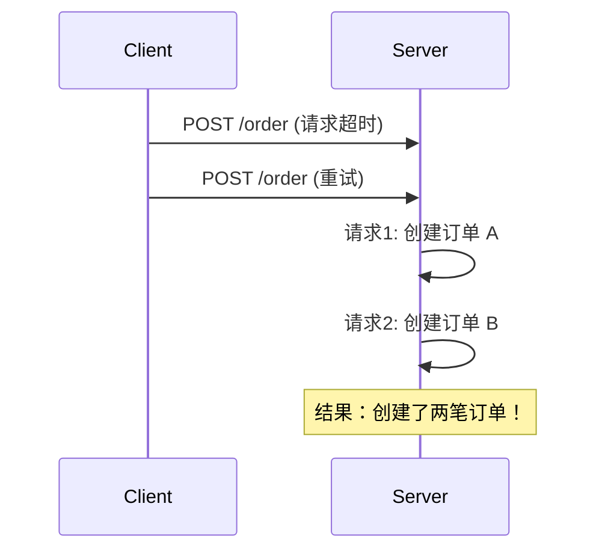
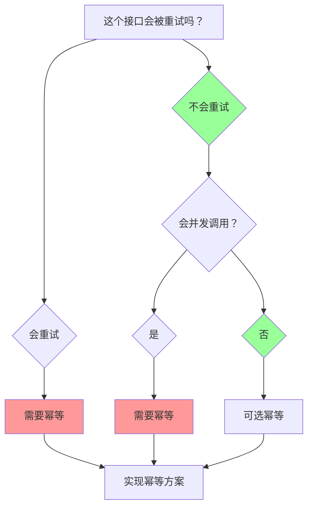

# 幂等性定义与数学基础

一个操作执行一次和执行多次，效果是一样的——这就是幂等。

听起来简单，但这个「简单」的概念，却是分布式系统设计的基石。支付回调重复推送、接口超时重试、服务间调用失败重试——所有这些场景，如果接口不幂等，就会导致数据错乱、业务异常。扣两次钱、创建两笔订单、库存被扣两次——这些事故的根源，往往就是「幂等」两个字没做好。

## 数学定义

幂等（Idempotent）这个词来自数学。如果一个函数 f 满足以下条件，就说 f 是幂等的：

```
f(f(x)) = f(x)
```

把这个公式翻译成人话：一个操作执行一次和应用两次，最终效果相同。注意这里说的是「应用两次」，而不是「连续应用无限次」——幂等性只需要保证两次的效果一样，后续的重复应用结果保持不变。

```java
// 幂等操作示例：设置值
// set(5) 后再 set(5)，结果还是 5
set(5);  // 当前值 = 5
set(5);  // 当前值 = 5（不变）
```

```java
// 非幂等操作示例：自增
// increment() 后再 increment()，结果从 5 变成 6 再变成 7
increment();  // 当前值 = 6
increment();  // 当前值 = 7（变了）
```

这个数学定义看似简单，但它揭示了幂等性的核心：**操作的最终结果只取决于当前状态，而不是执行次数**。

## 幂等性与安全性对比

在分布式系统中，我们经常听到两个概念：**安全性（Safety）** 和 **活性（Liveness）**。这两个概念与幂等性有密切关系。

| 概念 | 定义 | 类比 |
| --- | --- | --- |
| **安全性（Safety）** | 坏事不会发生 | 保险丝——过流时自动断开，防止火灾 |
| **活性（Liveness）** | 好事最终会发生 | 电梯——只要不断电，最终会到达目标楼层 |

幂等性更多属于安全性范畴：**保证重复执行不会导致错误状态**。如果一个操作是幂等的，即使系统出现重复请求、重复消费，也不会破坏数据的正确性。

但是，幂等不等于「一定能成功」。一个幂等操作如果第一次就失败了，后续重试仍然会失败。这是幂等性与可靠性的区别：

- **幂等**：重复执行不产生错误结果
- **可靠**：操作最终一定会成功

:::info
幂等解决的是「重复执行」的问题，可靠性解决的是「最终成功」的问题。两者结合，才能构建健壮的分布式系统。
:::

## 静态幂等 vs 动态幂等

幂等性可以根据参数和行为分为两种类型：

### 静态幂等

操作结果完全由输入参数决定，相同参数总是产生相同结果。

```java
// 静态幂等：GET 请求，相同 URL 返回相同数据
String result = httpGet("https://api.example.com/user/123");
// 无论调用多少次，只要用户 123 数据不变，结果就不变
```

### 动态幂等

操作结果取决于参数和当前状态，相同参数在不同状态下可能产生不同结果，但不会因为「重复执行」而累积副作用。

```java
// 动态幂等：DELETE 请求
// 第一次调用：删除资源，返回 200
// 第二次调用：资源不存在，返回 404（但也算「幂等成功」）
httpDelete("https://api.example.com/order/456");
httpDelete("https://api.example.com/order/456");
// 两次调用都不会产生「删除两次」的问题
```

动态幂等的关键在于：**操作的效果是「目标状态」，而不是「操作本身」**。DELETE 的目标是「资源不存在」，无论资源是否已经不存在，最终状态都一样。

## 分布式环境下的幂等挑战

在单机环境中，幂等性相对容易保证。但在分布式环境下，幂等面临三大挑战：

### 挑战一：网络超时导致的重试

客户端发起请求后，可能因为网络超时而收不到响应。此时客户端无法判断服务端是否处理了该请求，只能选择重试。



问题是：当客户端收到「超时」响应时，服务端可能已经成功处理了请求。重复发送就会导致重复操作。

### 挑战二：消息队列的重复投递

消息队列（如 Kafka、RabbitMQ）在网络抖动或消费者超时的情况下，可能重复投递消息。消费者如果不做幂等处理，就会重复消费。

```mermaid
flowchart LR
    A[Producer 发送消息] --> B[Broker 存储消息]
    B --> C1[Consumer 消费成功]
    C1 --> D[提交 offset 失败]
    D --> B
    B --> C2[Consumer 再次消费]
    Note over C2: 若不幂等：重复处理！
```

### 挑战三：分布式事务的部分成功

在分布式事务中，如果部分节点成功、部分节点失败，回滚时也可能出现幂等问题。比如，TCC 事务的 Try 阶段成功，但 Confirm 或 Cancel 超时，后续重试如何处理？

## 幂等性决策树

面对一个接口，如何判断它是否需要幂等？可以用以下决策树：



:::warning
**常见误区：把幂等和事务混淆**

很多人以为「只要加了事务，就能保证正确性」。但事务和幂等解决的问题完全不同：

- **事务**：保证多个操作要么全部成功，要么全部失败
- **幂等**：保证同一个操作重复执行不会产生错误结果

一个操作如果在事务中执行两次（比如超时重试），仍然可能产生两次副作用。幂等是事务的必要补充，而不是替代。
:::

## 术语表

| 术语 | 英文 | 定义 |
| --- | --- | --- |
| 幂等 | Idempotent | 操作执行一次和执行多次，效果相同 |
| 安全性 | Safety | 保证坏事不会发生 |
| 活性 | Liveness | 保证好事最终会发生 |
| 静态幂等 | Static Idempotency | 相同输入总是产生相同输出 |
| 动态幂等 | Dynamic Idempotency | 操作目标是状态，重复执行达到相同最终状态 |
| 重试 | Retry | 请求失败后重新发送相同请求 |
| 去重 | Deduplication | 识别并过滤重复请求 |

## 思考题

**问题 1**：HTTP 的 GET 方法是幂等的，但为什么有时候 GET 请求也会产生副作用？
<details>
<summary>参考答案</summary>

理论上 GET 只应该读取数据，不应该修改资源。但在实际系统中，很多统计接口会记录访问日志，或者更新缓存的 TTL。严格来说，这些操作使得 GET 不再「纯粹幂等」，但从业务角度，只要不修改核心业务数据，仍然可以视为幂等。设计接口时，应该明确区分「只读操作」和「可能修改状态的操作」。

</details>

**问题 2**：DELETE 操作是幂等的，但如果是删除一个大文件，删除过程中重复调用 DELETE 会怎样？
<details>
<summary>参考答案</summary>

删除大文件通常是分片删除或标记删除：

1. **分片删除**：每次 DELETE 只删除一个分片，重复调用会导致「删除更多分片」的问题，这不是幂等的
2. **标记删除**：只修改删除标记，实际数据保留到 GC 时清理。这种情况下重复调用 DELETE 是幂等的，因为标记已经设为「已删除」

如果业务场景确实需要分片删除，应该使用更细粒度的幂等策略，比如「删除第 N 个分片」这样的操作，每个分片只能被删除一次。

</details>

**问题 3**：幂等性和可靠性是什么关系？它们是否可以相互替代？
<details>
<summary>参考答案</summary>

幂等性和可靠性解决不同问题，不能相互替代：

- **幂等**解决的是「重复执行」问题：保证重复请求不会产生错误结果
- **可靠性**解决的是「最终成功」问题：保证请求最终一定会被处理

一个可靠但不幂等的系统，会在重试时产生重复操作。一个幂等但不可靠的系统，重试不会产生错误，但最终可能仍然失败。

生产级系统通常需要同时保证幂等性和可靠性：用幂等防止重复操作，用重试 + 最终一致性保证可靠性。

</details>