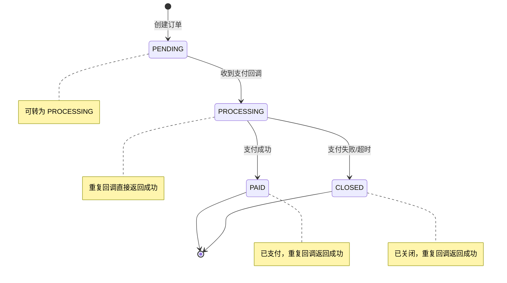
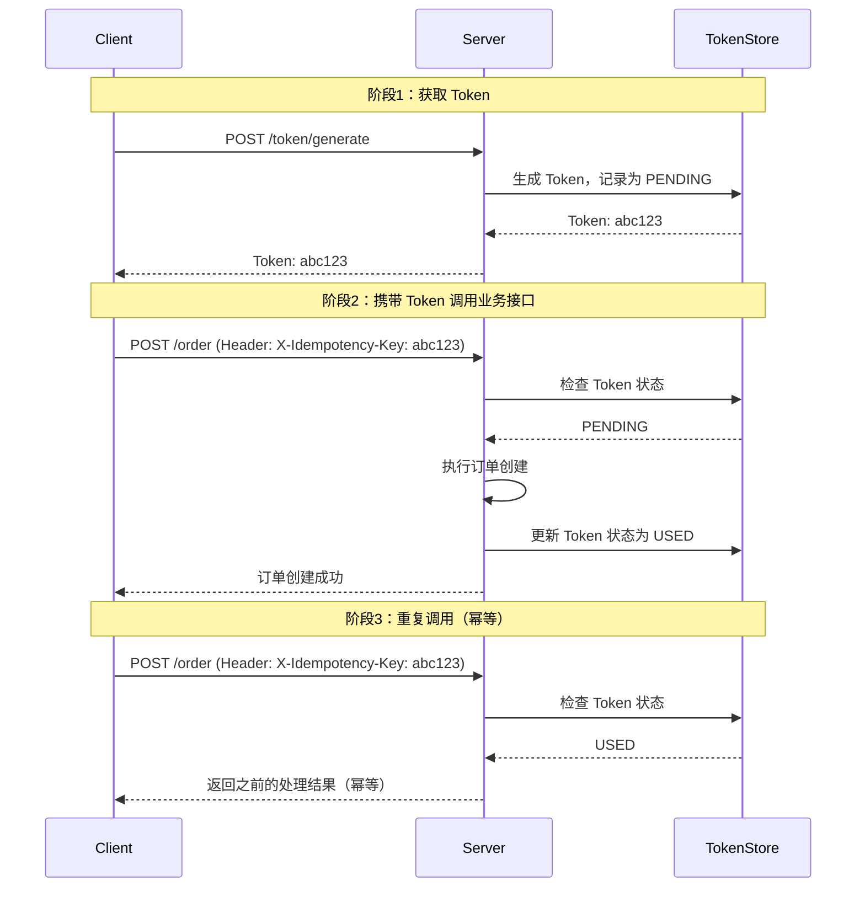

# 接口幂等实现方案

接口幂等是分布式系统的「必备能力」。

HTTP 重试、消息队列重试、服务超时重试——在分布式环境下，请求被重复发送几乎是不可避免的。网络抖动、进程崩溃、超时未响应——任何一种情况都会导致客户端重试。如果接口不做幂等处理，重复请求就会产生重复操作：扣两次钱、创建两笔订单、库存被扣两次。

这篇文档详细介绍三种主流的幂等实现方案：**唯一键约束**、**状态机 + 乐观锁**、**防重 Token**。每种方案都有适用场景和局限性，理解这些才能在实际项目中做出正确选择。

## 方案一：唯一键约束

### 核心思想

利用数据库的唯一索引（或唯一键）来保证幂等。当重复请求插入相同唯一键的记录时，数据库会抛出唯一键冲突异常，捕获异常后返回「已处理」状态——这就是幂等。

### 场景：创建订单

```java
// 客户端生成唯一订单号
public class OrderRequest {
    private String orderNo;  // 格式：时间戳 + 用户ID + 随机数
    private String productId;
    private Integer quantity;
    private BigDecimal amount;
}
```

```sql title="防重表结构"
CREATE TABLE `idempotence_record` (
  `id` bigint NOT NULL AUTO_INCREMENT,
  `idempotence_key` varchar(64) NOT NULL COMMENT '幂等键',
  `status` tinyint NOT NULL DEFAULT '0' COMMENT '0-处理中 1-成功 2-失败',
  `result` text COMMENT '处理结果',
  `created_at` datetime NOT NULL DEFAULT CURRENT_TIMESTAMP,
  `updated_at` datetime NOT NULL DEFAULT CURRENT_TIMESTAMP ON UPDATE CURRENT_TIMESTAMP,
  PRIMARY KEY (`id`),
  UNIQUE KEY `uk_idempotence_key` (`idempotence_key`)
) ENGINE=InnoDB DEFAULT CHARSET=utf8mb4 COMMENT='幂等记录表';
```

```java title="幂等插入逻辑"
@Service
public class OrderServiceImpl implements OrderService {

    @Autowired
    private OrderRepository orderRepository;

    @Autowired
    private IdempotenceRepository idempotenceRepository;

    @Override
    @Transactional
    public Order createOrder(OrderRequest request) {
        String idempotenceKey = "order:" + request.getOrderNo();

        // 1. 检查是否已处理
        Optional<IdempotenceRecord> existing =
            idempotenceRepository.findByIdempotenceKey(idempotenceKey);

        if (existing.isPresent()) {
            IdempotenceRecord record = existing.get();
            if (record.getStatus() == 1) {
                // 已成功处理，返回之前的结果
                return JSON.parseObject(record.getResult(), Order.class);
            } else if (record.getStatus() == 0) {
                // 正在处理中，可能需要等待或返回处理中状态
                throw new OrderProcessingException("订单正在处理中");
            } else {
                // 处理失败，可重试
                return processOrder(request, idempotenceKey);
            }
        }

        // 2. 未处理，执行创建逻辑
        return processOrder(request, idempotenceKey);
    }

    private Order processOrder(OrderRequest request, String idempotenceKey) {
        // 记录处理中状态
        IdempotenceRecord record = new IdempotenceRecord();
        record.setIdempotenceKey(idempotenceKey);
        record.setStatus(0);  // 处理中
        idempotenceRepository.save(record);

        try {
            // 3. 执行订单创建
            Order order = new Order();
            order.setOrderNo(request.getOrderNo());
            order.setProductId(request.getProductId());
            order.setQuantity(request.getQuantity());
            order.setAmount(request.getAmount());
            order.setStatus("CREATED");
            order = orderRepository.save(order);

            // 4. 更新为成功状态
            record.setStatus(1);
            record.setResult(JSON.toJSONString(order));
            idempotenceRepository.save(record);

            return order;
        } catch (Exception e) {
            // 5. 更新为失败状态
            record.setStatus(2);
            record.setResult(e.getMessage());
            idempotenceRepository.save(record);
            throw e;
        }
    }
}
```

### 优点与缺点

| 维度 | 优点 | 缺点 |
| --- | --- | --- |
| **可靠性** | 数据库原生保证，无需额外逻辑 | 需要业务方生成唯一键 |
| **性能** | 唯一索引查询极快 | 唯一键碰撞时需要优雅处理 |
| **实现** | 思路清晰，易于理解 | 需要额外的防重表或唯一索引 |
| **适用范围** | 插入类操作（创建订单、用户注册） | 不适合复杂的状态流转 |

### 适用场景

- 新增类操作（INSERT）
- 有明确唯一标识的业务（如订单号、支付流水号）
- 对一致性要求高的核心业务

## 方案二：状态机 + 乐观锁

### 核心思想

当业务操作涉及状态流转时，可以通过「检查当前状态 + 乐观锁」的方式实现幂等。只有在允许的状态下才能执行操作，其他状态直接返回成功（幂等）。

### 场景：支付回调



### 状态机幂等实现

```java
// 订单状态枚举
public enum OrderStatus {
    PENDING("待支付"),
    PROCESSING("支付中"),
    PAID("已支付"),
    CLOSED("已关闭");

    private final String description;

    OrderStatus(String description) {
        this.description = description;
    }
}
```

```java title="状态机幂等校验"
@Service
public class PaymentServiceImpl implements PaymentService {

    @Autowired
    private OrderRepository orderRepository;

    @Override
    @Transactional
    public PaymentResult handlePaymentCallback(PaymentCallbackRequest request) {
        String orderNo = request.getOrderNo();
        String transactionId = request.getTransactionId();

        // 1. 查询订单
        Order order = orderRepository.findByOrderNo(orderNo);
        if (order == null) {
            throw new OrderNotFoundException(orderNo);
        }

        // 2. 幂等校验：检查状态
        OrderStatus currentStatus = order.getStatus();
        if (currentStatus == OrderStatus.PAID) {
            // 已支付，重复回调直接返回成功（幂等）
            return PaymentResult.success(order.getId(), "订单已支付");
        }

        if (currentStatus == OrderStatus.CLOSED) {
            // 已关闭，重复回调直接返回成功（幂等）
            return PaymentResult.success(order.getId(), "订单已关闭");
        }

        if (currentStatus != OrderStatus.PROCESSING &&
            currentStatus != OrderStatus.PENDING) {
            // 其他状态不允许支付，直接返回成功
            return PaymentResult.success(order.getId(), "订单状态不允许支付");
        }

        // 3. 执行支付（使用乐观锁）
        int updatedRows = orderRepository.updateStatusWithVersion(
            order.getId(),
            OrderStatus.PAID,        // 目标状态
            OrderStatus.PROCESSING,   // 期望状态
            order.getVersion()        // 乐观锁版本
        );

        if (updatedRows == 0) {
            // 乐观锁冲突，说明并发修改了订单状态
            throw new ConcurrentModificationException("订单状态已被修改");
        }

        // 4. 更新支付信息
        order.setTransactionId(transactionId);
        order.setPaidAt(LocalDateTime.now());
        order.setStatus(OrderStatus.PAID);
        orderRepository.save(order);

        return PaymentResult.success(order.getId(), "支付成功");
    }
}
```

```sql title="乐观锁更新 SQL"
-- 使用 version 字段实现乐观锁
UPDATE orders
SET status = 'PAID',
    transaction_id = #{transactionId},
    paid_at = NOW(),
    version = version + 1
WHERE id = #{orderId}
  AND status IN ('PROCESSING', 'PENDING')
  AND version = #{currentVersion}
```

### 优点与缺点

| 维度 | 优点 | 缺点 |
| --- | --- | --- |
| **可靠性** | 状态流转天然支持幂等 | 需要设计合理的状态机 |
| **性能** | 无额外查询，直接检查状态 | 乐观锁冲突可能导致失败 |
| **实现** | 与业务逻辑紧耦合 | 不适合没有状态概念的纯数据操作 |
| **适用范围** | 有状态流转的业务（支付、退款） | 不适合无状态的数据写入 |

### 适用场景

- 支付、退款、取消等有状态流转的业务
- 需要严格控制状态转换顺序的场景
- 乐观锁能解决并发更新问题的场景

## 方案三：防重 Token

### 核心思想

客户端在调用接口前，先向服务端申请一个「防重 Token」，服务端将 Token 标记为「已申请但未使用」。调用接口时携带这个 Token，服务端检查 Token 状态，如果未使用则执行操作并标记为「已使用」。如果 Token 已被使用，直接返回成功（幂等）。

### Token 生命周期



### Redis Token 实现

```java
@Service
public class IdempotencyTokenService {

    @Autowired
    private StringRedisTemplate redisTemplate;

    private static final String TOKEN_PREFIX = "idem:token:";
    private static final long TOKEN_TTL_SECONDS = 3600;  // Token 有效期 1 小时

    /**
     * 生成幂等 Token
     */
    public String generateToken() {
        String token = UUID.randomUUID().toString();
        redisTemplate.opsForValue().set(
            TOKEN_PREFIX + token,
            "PENDING",
            TOKEN_TTL_SECONDS,
            TimeUnit.SECONDS
        );
        return token;
    }

    /**
     * 检查并锁定 Token（原子操作）
     * @return 如果返回 null 说明 Token 已使用；如果返回 "PENDING" 说明已锁定可处理
     */
    public String tryLockToken(String token) {
        String key = TOKEN_PREFIX + token;
        String current = redisTemplate.opsForValue().get(key);

        if (current == null) {
            return null;  // Token 不存在或已过期
        }

        if ("PENDING".equals(current)) {
            // 尝试设置为 PROCESSING（原子操作）
            Boolean success = redisTemplate.opsForValue().setIfAbsent(
                key + ":processing",
                "1",
                30,  // 处理中的锁，30 秒后自动释放
                TimeUnit.SECONDS
            );
            if (Boolean.TRUE.equals(success)) {
                return "PENDING";
            }
        }

        return null;  // Token 已被使用
    }

    /**
     * 标记 Token 为已完成
     */
    public void completeToken(String token, String result) {
        String key = TOKEN_PREFIX + token;
        redisTemplate.opsForValue().set(key, "COMPLETED", TOKEN_TTL_SECONDS, TimeUnit.SECONDS);
        redisTemplate.delete(key + ":processing");
    }
}
```

```java title="业务接口使用 Token"
@RestController
public class OrderController {

    @Autowired
    private IdempotencyTokenService tokenService;

    @Autowired
    private OrderService orderService;

    @PostMapping("/orders")
    public ResponseEntity<OrderResponse> createOrder(
        @RequestHeader(value = "X-Idempotency-Key", required = false) String idempotencyKey,
        @RequestBody OrderRequest request
    ) {
        // 1. 无 Token，不保证幂等（适用于不重试的场景）
        if (StringUtils.isBlank(idempotencyKey)) {
            Order order = orderService.createOrder(request);
            return ResponseEntity.ok(OrderResponse.from(order));
        }

        // 2. 有 Token，尝试锁定
        String lockResult = tokenService.tryLockToken(idempotencyKey);

        if (lockResult == null) {
            // Token 已使用，返回成功（幂等）
            return ResponseEntity.ok(OrderResponse.duplicate("订单已创建"));
        }

        try {
            // 3. 执行订单创建
            Order order = orderService.createOrder(request);
            // 4. 标记 Token 完成
            tokenService.completeToken(idempotencyKey, JSON.toJSONString(order));
            return ResponseEntity.ok(OrderResponse.from(order));
        } catch (Exception e) {
            // 5. 失败时不删除 Token，允许重试
            throw e;
        }
    }
}
```

### 优点与缺点

| 维度 | 优点 | 缺点 |
| --- | --- | --- |
| **可靠性** | 支持分布式环境下的幂等 | 依赖 Redis，需要考虑 Redis 不可用的情况 |
| **性能** | Redis 操作极快 | 多一次 Token 校验网络开销 |
| **实现** | 可作为通用组件 | 需要客户端配合获取 Token |
| **适用范围** | 几乎所有接口 | 适用于客户端可控制的场景 |

### 适用场景

- 需要对非幂等操作（POST）做幂等处理的场景
- 客户端可控制的场景（如前端页面、App）
- 需要追踪请求处理状态的场景

## 权衡矩阵

| 维度 | 唯一键约束 | 状态机 + 乐观锁 | 防重 Token |
| --- | --- | --- | --- |
| **适用操作** | INSERT 类操作 | 有状态流转的操作 | 所有操作 |
| **实现复杂度** | 低 | 中 | 中 |
| **外部依赖** | 数据库 | 数据库 | Redis + 数据库 |
| **性能开销** | 极低 | 低 | 中 |
| **并发安全** | 原生保证 | 乐观锁保证 | Redis 原子操作 |
| **失败恢复** | 数据库事务回滚 | 乐观锁冲突重试 | 需要额外处理 |
| **适用业务** | 订单创建、用户注册 | 支付、退款、取消 | 所有需要幂等的接口 |

## 方案组合使用

实际项目中，三种方案可以组合使用：

1. **入口层**：使用防重 Token 做第一道防线，支持快速拒绝重复请求
2. **业务层**：使用状态机 + 乐观锁控制业务状态流转
3. **存储层**：使用唯一键约束做最后一道防线，确保数据不会重复插入

```java title="三层幂等防护"
@Service
public class OrderServiceImpl implements OrderService {

    // 第一层：防重 Token
    @Autowired
    private IdempotencyTokenService tokenService;

    // 第二层：状态机 + 乐观锁
    @Autowired
    private OrderRepository orderRepository;

    @Override
    public Order createOrder(String idempotencyKey, OrderRequest request) {
        // 1. Token 校验（快速路径）
        if (tokenService.isCompleted(idempotencyKey)) {
            return tokenService.getResult(idempotencyKey);
        }

        // 2. 唯一键校验（数据库层）
        Optional<Order> existing = orderRepository.findByOrderNo(request.getOrderNo());
        if (existing.isPresent()) {
            return existing.get();  // 已有订单，直接返回
        }

        // 3. 执行业务逻辑
        Order order = doCreateOrder(request);

        // 4. 保存结果到 Token
        tokenService.saveResult(idempotencyKey, order);

        return order;
    }
}
```

:::tip
**实践建议**：不要过度设计。简单场景下，一个唯一键约束就足够了。只有在复杂业务场景下，才需要组合多种方案。
:::

## 术语表

| 术语 | 英文 | 定义 |
| --- | --- | --- |
| 唯一键约束 | Unique Constraint | 数据库层面的唯一性保证 |
| 状态机 | State Machine | 描述业务状态流转的模型 |
| 乐观锁 | Optimistic Locking | 依赖版本号的并发控制机制 |
| 防重 Token | Idempotency Token | 用于标识唯一请求的令牌 |
| CAS | Compare-And-Swap | 乐观锁的底层原子操作 |
| 版本号 | Version | 用于乐观锁的递增字段 |

## 思考题

**问题 1**：唯一键约束方案中，如果客户端没有生成唯一键，服务端如何处理？
<details>
<summary>参考答案</summary>

服务端可以采用两种策略：

1. **服务端生成唯一键**：让客户端先调用获取唯一键的接口（如 POST /generate-id），服务端生成并返回唯一键，客户端再携带这个键调用业务接口。

2. **拒绝请求**：如果请求中没有唯一键，且业务本身需要幂等，可以直接返回错误，要求客户端带上幂等键。

实际项目中，推荐第一种方式，因为客户端可能因为网络问题在获取唯一键后仍然重试，所以服务端也需要有兜底的幂等逻辑（如防重表）。

</details>

**问题 2**：乐观锁在高并发场景下失败率很高，应该如何优化？
<details>
<summary>参考答案</summary>

乐观锁在高并发场景下的主要问题是「大量重试」。优化思路：

1. **重试 + 随机退避**：发生冲突后，等待随机时间再重试，避免集体重试。
2. **分段乐观锁**：将数据按某个维度分段，不同段的更新不会冲突。
3. **降低冲突概率**：使用「预占位」方式，如先更新状态为 PROCESSING，再执行业务，最后更新为最终状态。
4. **改为悲观锁**：在高并发场景下，悲观锁（如 SELECT FOR UPDATE）可能更稳定。
5. **异步处理**：将并发请求放入队列，串行处理。

</details>

**问题 3**：防重 Token 方案中，如果业务处理成功但 Token 更新失败（如 Redis 宕机），会怎样？
<details>
<summary>参考答案</summary>

会出现「重复处理」的问题：

1. **Redis 宕机**：Token 校验完全失效，业务接口会正常执行。但这种情况下，重复请求只有数据库层做幂等（如果有唯一键约束）或状态机层做幂等。

2. **Token 更新失败**：Token 仍为 PENDING 状态，后续重试会被认为「正在处理中」，业务不会重复执行。但超过 30 秒（processing 锁过期）后，可能再次处理。

解决方案：
- 业务逻辑执行完后，即使 Redis 操作失败，也将结果返回给客户端
- 配合数据库唯一键约束作为兜底
- 使用 Redis 的 AOF 持久化或主从复制提高可用性

</details>