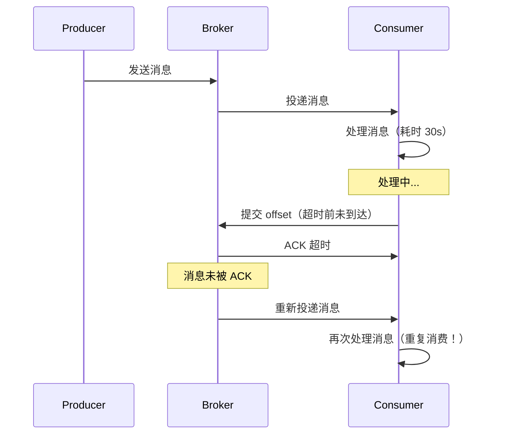
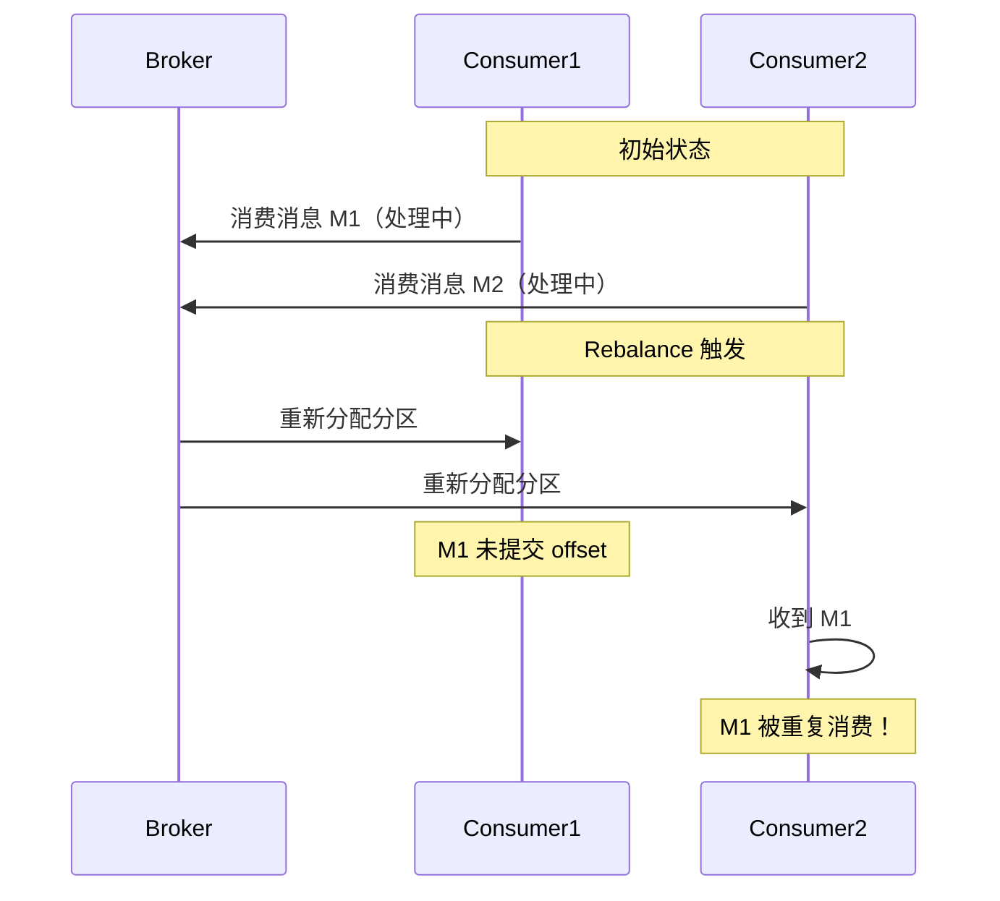
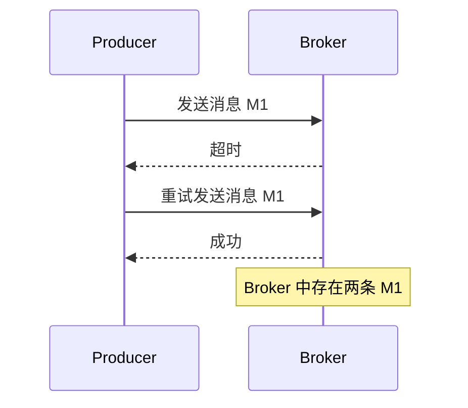

# 消息队列幂等消费

消息队列的消费幂等是最难的。

HTTP 接口的幂等，至少请求来源是可控的——客户端知道自己在重试，可以带上幂等 Key。但消息队列的消费完全不同：**消息可能重复投递、消费者可能崩溃、消费可能超时**。更糟糕的是，生产者不知道消费者是否成功处理了消息，只能根据「超时」来判断——而超时不等于失败。

Kafka 承诺的是 **At-Least-Once**（至少一次），而不是 **Exactly-Once**（恰好一次）。这意味着：如果你不做幂等处理，同一条消息可能被消费多次。

## 消息重复的根本原因

要解决消息重复问题，首先要理解它是怎么产生的。

### 原因一：消费者超时



当消费者处理消息的时间超过 `max.poll.interval.ms`（Kafka）或 `prefetch` 超时（RabbitMQ）时，Broker 会认为消费者已失效，重新将消息投递给其他消费者或重试。

### 原因二：Rebalance

当消费者组中的分区重新分配时，正在处理的消息可能被其他消费者重新接收：



### 原因三：生产者重试

当 Broker 处理超时或返回错误时，生产者会重试发送消息：



## 幂等消费的解决思路

消息幂等的核心是：**让消费者能够识别「这是不是重复消息」**。

识别方式有三种：

| 识别方式 | 实现原理 | 适用场景 |
| --- | --- | --- |
| **消息去重表** | 记录已处理的消息 ID | 通用场景 |
| **Redis 去重** | 使用消息 ID 作为 Redis Key | 高性能场景 |
| **业务状态幂等** | 业务表本身有状态字段 | 有明确状态流转的业务 |

## 方案一：消息去重表

### 核心思想

在数据库中创建一张「消息去重表」，每次消费消息前，先查询该消息是否已被处理。如果已处理，直接跳过；如果未处理，则处理并写入去重表。

```sql title="消息去重表结构"
CREATE TABLE `message_dedup` (
  `id` bigint NOT NULL AUTO_INCREMENT PRIMARY KEY,
  `message_id` varchar(64) NOT NULL COMMENT '消息唯一标识',
  `business_key` varchar(128) COMMENT '业务标识（如订单号）',
  `status` tinyint NOT NULL DEFAULT 0 COMMENT '处理状态：0-处理中 1-成功 2-失败',
  `retry_count` int NOT NULL DEFAULT 0 COMMENT '重试次数',
  `error_message` text COMMENT '错误信息',
  `created_at` datetime NOT NULL DEFAULT CURRENT_TIMESTAMP,
  `updated_at` datetime NOT NULL DEFAULT CURRENT_TIMESTAMP ON UPDATE CURRENT_TIMESTAMP,
  `expire_at` datetime NOT NULL COMMENT '过期时间',
  UNIQUE KEY `uk_message_id` (`message_id`),
  KEY `idx_expire_at` (`expire_at`)
) ENGINE=InnoDB DEFAULT CHARSET=utf8mb4 COMMENT='消息去重表';
```

### 幂等消费实现

```java
@Service
@Slf4j
public class IdempotentMessageConsumer {

    @Autowired
    private MessageDedupRepository dedupRepository;

    @Autowired
    private OrderService orderService;

    /**
     * 幂等消费消息
     */
    public void consume(Message message) {
        String messageId = message.getMessageId();
        String businessKey = message.getBusinessKey();

        // 1. 检查消息是否已处理
        Optional<MessageDedup> existing = dedupRepository.findByMessageId(messageId);

        if (existing.isPresent()) {
            MessageDedup dedup = existing.get();
            switch (dedup.getStatus()) {
                case 1:  // 已成功处理，跳过
                    log.info("消息已处理，跳过: messageId={}", messageId);
                    return;
                case 0:  // 正在处理中
                    if (dedup.getRetryCount() > 10) {
                        log.warn("消息处理超时，进入死信队列: messageId={}", messageId);
                        moveToDeadLetterQueue(message);
                        return;
                    }
                    log.info("消息正在处理中，等待: messageId={}", messageId);
                    return;
                case 2:  // 处理失败，判断是否可重试
                    if (dedup.getRetryCount() >= 3) {
                        log.warn("消息重试次数超限，进入死信队列: messageId={}", messageId);
                        moveToDeadLetterQueue(message);
                        return;
                    }
                    // 可重试，继续处理
                    break;
            }
        }

        // 2. 未处理，尝试插入去重记录
        MessageDedup dedup = null;
        try {
            dedup = tryAcquireDedup(messageId, businessKey);
        } catch (DuplicateKeyException e) {
            // 唯一键冲突，说明其他消费者刚插入，跳过
            log.info("消息正在被其他消费者处理: messageId={}", messageId);
            return;
        }

        // 3. 执行业务逻辑
        try {
            processBusiness(message);
            // 4. 更新为成功状态
            dedup.setStatus(1);
            dedupRepository.save(dedup);
            log.info("消息处理成功: messageId={}", messageId);
        } catch (Exception e) {
            // 5. 更新为失败状态
            dedup.setStatus(2);
            dedup.setErrorMessage(e.getMessage());
            dedup.setRetryCount(dedup.getRetryCount() + 1);
            dedupRepository.save(dedup);
            log.error("消息处理失败: messageId={}, retryCount={}",
                messageId, dedup.getRetryCount(), e);
            // 抛出异常，触发重试
            throw e;
        }
    }

    private MessageDedup tryAcquireDedup(String messageId, String businessKey) {
        MessageDedup dedup = new MessageDedup();
        dedup.setMessageId(messageId);
        dedup.setBusinessKey(businessKey);
        dedup.setStatus(0);  // 处理中
        dedup.setRetryCount(0);
        dedup.setExpireAt(LocalDateTime.now().plusHours(24));
        return dedupRepository.save(dedup);
    }

    private void processBusiness(Message message) {
        // 业务逻辑：创建订单
        OrderRequest request = new OrderRequest();
        request.setOrderNo(message.getBusinessKey());
        request.setProductId(message.getProductId());
        request.setQuantity(message.getQuantity());
        orderService.createOrder(request);
    }

    private void moveToDeadLetterQueue(Message message) {
        // 移动到死信队列
        deadLetterQueue.send(message);
    }
}
```

### 定时清理过期记录

```java
@Component
@Slf4j
public class DedupCleanupTask {

    @Autowired
    private MessageDedupRepository dedupRepository;

    @Scheduled(cron = "0 0 3 * * ?")  // 每天凌晨 3 点执行
    public void cleanupExpiredRecords() {
        int deleted = dedupRepository.deleteByExpireAtBefore(LocalDateTime.now());
        log.info("清理过期去重记录: count={}", deleted);
    }
}
```

## 方案二：Redis 去重

### 核心思想

使用 Redis 代替数据库存储消息处理状态。Redis 的高性能和原子操作使其非常适合高频消息处理场景。

```java
@Service
@Slf4j
public class RedisMessageDedupService {

    @Autowired
    private StringRedisTemplate redisTemplate;

    private static final String DEDUP_PREFIX = "msg:dedup:";
    private static final long DEFAULT_TTL_SECONDS = 86400;  // 24 小时

    /**
     * 尝试获取消息处理权
     * @return true = 可以处理；false = 消息已处理或正在处理
     */
    public boolean tryAcquire(String messageId) {
        String key = DEDUP_PREFIX + messageId;

        // SETNX + TTL，原子操作
        Boolean success = redisTemplate.opsForValue()
            .setIfAbsent(key, "PROCESSING", DEFAULT_TTL_SECONDS, TimeUnit.SECONDS);

        if (Boolean.TRUE.equals(success)) {
            return true;
        }

        // Key 已存在，检查状态
        String status = redisTemplate.opsForValue().get(key);
        return !"PROCESSED".equals(status);
    }

    /**
     * 标记消息处理完成
     */
    public void complete(String messageId) {
        String key = DEDUP_PREFIX + messageId;
        redisTemplate.opsForValue().set(key, "PROCESSED", DEFAULT_TTL_SECONDS, TimeUnit.SECONDS);
    }

    /**
     * 标记消息处理失败
     */
    public void fail(String messageId) {
        String key = DEDUP_PREFIX + messageId;
        redisTemplate.opsForValue().set(key, "FAILED", DEFAULT_TTL_SECONDS, TimeUnit.SECONDS);
    }

    /**
     * 检查消息是否已处理
     */
    public boolean isProcessed(String messageId) {
        String key = DEDUP_PREFIX + messageId;
        String status = redisTemplate.opsForValue().get(key);
        return "PROCESSED".equals(status);
    }
}
```

### Redis + 消息 ID 的原子操作

使用 Lua 脚本保证「检查 + 标记」的原子性：

```java
@Service
public class RedisLuaMessageDedupService {

    @Autowired
    private StringRedisTemplate redisTemplate;

    private static final String DEDUP_PREFIX = "msg:dedup:";
    private static final long TTL_SECONDS = 86400;

    // Lua 脚本：检查并获取处理权
    private static final String ACQUIRE_SCRIPT =
        "local key = KEYS[1] " +
        "local status = redis.call('GET', key) " +
        "if status == nil then " +
        "    redis.call('SET', key, 'PROCESSING', 'EX', ARGV[1]) " +
        "    return 1 " +  // 可以处理
        "elseif status == 'PROCESSING' then " +
        "    return 0 " +  // 正在处理
        "else " +
        "    return -1 " +  // 已处理完成
        "end";

    public int tryAcquire(String messageId) {
        String key = DEDUP_PREFIX + messageId;
        Long result = redisTemplate.execute(
            new DefaultRedisScript<>(ACQUIRE_SCRIPT, Long.class),
            Collections.singletonList(key),
            String.valueOf(TTL_SECONDS)
        );
        return result != null ? result.intValue() : 0;
    }
}
```

## 方案三：业务状态机幂等

### 核心思想

如果业务表本身有状态字段，可以利用状态流转来实现幂等。例如：订单支付消息，只需要「PROCESSING → PAID」状态流转，其他状态直接返回成功。

```java
@Service
@Slf4j
public class OrderPaymentConsumer {

    @Autowired
    private OrderRepository orderRepository;

    /**
     * 支付消息幂等消费
     */
    @KafkaListener(topics = "payment-result", groupId = "payment-consumer")
    public void consumePaymentResult(PaymentMessage message) {
        String orderNo = message.getOrderNo();
        String transactionId = message.getTransactionId();
        BigDecimal paidAmount = message.getPaidAmount();

        log.info("收到支付结果消息: orderNo={}, transactionId={}", orderNo, transactionId);

        // 1. 查询订单
        Order order = orderRepository.findByOrderNo(orderNo);
        if (order == null) {
            log.error("订单不存在: orderNo={}", orderNo);
            return;
        }

        // 2. 幂等校验：检查状态
        switch (order.getStatus()) {
            case "PAID":
                // 已支付，幂等返回成功
                log.info("订单已支付，跳过: orderNo={}", orderNo);
                return;

            case "CLOSED":
                // 已关闭，幂等返回成功
                log.info("订单已关闭，跳过: orderNo={}", orderNo);
                return;

            case "CANCELLED":
                // 已取消，幂等返回成功
                log.info("订单已取消，跳过: orderNo={}", orderNo);
                return;
        }

        // 3. 状态为 PENDING 或 PROCESSING，执行支付确认
        try {
            confirmPayment(order, transactionId, paidAmount);
            log.info("支付确认成功: orderNo={}", orderNo);
        } catch (ConcurrentModificationException e) {
            // 乐观锁冲突，可能并发支付，再次查询状态
            Order currentOrder = orderRepository.findByOrderNo(orderNo);
            if ("PAID".equals(currentOrder.getStatus())) {
                log.info("并发支付确认成功: orderNo={}", orderNo);
            } else {
                throw e;
            }
        }
    }

    @Transactional
    public void confirmPayment(Order order, String transactionId, BigDecimal paidAmount) {
        // 使用乐观锁更新
        int rows = orderRepository.confirmPayment(
            order.getId(),
            transactionId,
            paidAmount,
            order.getVersion()
        );

        if (rows == 0) {
            throw new ConcurrentModificationException("订单状态已被修改");
        }
    }
}
```

```sql title="乐观锁 SQL"
-- OrderRepository 中的方法
@Modifying
@Query("UPDATE Order o SET o.status = 'PAID', " +
       "o.transactionId = :transactionId, " +
       "o.paidAmount = :paidAmount, " +
       "o.version = o.version + 1 " +
       "WHERE o.id = :orderId " +
       "AND o.status IN ('PENDING', 'PROCESSING') " +
       "AND o.version = :version")
int confirmPayment(
    @Param("orderId") Long orderId,
    @Param("transactionId") String transactionId,
    @Param("paidAmount") BigDecimal paidAmount,
    @Param("version") Integer version
);
```

## Kafka 消费者完整实现

```java
@Component
@Slf4j
public class IdempotentKafkaConsumer {

    @Autowired
    private RedisMessageDedupService dedupService;

    @Autowired
    private OrderService orderService;

    @Autowired
    private ObjectMapper objectMapper;

    /**
     * Kafka 消费者配置
     */
    @Bean
    public ConcurrentKafkaListenerContainerFactory<String, String> kafkaListenerContainerFactory(
            ConsumerFactory<String, String> consumerFactory) {
        ConcurrentKafkaListenerContainerFactory<String, String> factory =
            new ConcurrentKafkaListenerContainerFactory<>();
        factory.setConsumerFactory(consumerFactory);
        factory.setConcurrency(3);  // 并发消费数
        factory.getContainerProperties().setAckMode(
            ContainerProperties.AckMode.MANUAL_IMMEDIATE);  // 手动提交
        return factory;
    }

    @KafkaListener(topics = "order-created", groupId = "order-consumer")
    public void consume(String messageJson, Acknowledgment acknowledgment) {
        try {
            // 1. 解析消息
            OrderCreatedMessage message = objectMapper.readValue(messageJson,
                OrderCreatedMessage.class);

            String messageId = message.getMessageId();
            log.info("收到消息: messageId={}, orderNo={}", messageId, message.getOrderNo());

            // 2. 幂等检查
            if (!dedupService.tryAcquire(messageId)) {
                log.info("消息已处理，跳过: messageId={}", messageId);
                acknowledgment.acknowledge();
                return;
            }

            // 3. 执行业务逻辑
            try {
                processOrderCreated(message);
                // 4. 标记完成
                dedupService.complete(messageId);
                log.info("消息处理成功: messageId={}", messageId);
            } catch (Exception e) {
                // 5. 标记失败（可重试）
                dedupService.fail(messageId);
                log.error("消息处理失败: messageId={}", messageId, e);
                throw e;  // 抛出异常，触发重试
            }

            // 6. 手动提交 offset
            acknowledgment.acknowledge();

        } catch (Exception e) {
            log.error("消息处理异常", e);
            // 业务异常不提交 offset，触发重试
            // 注意：如果重试次数超限，需要人工介入或移入死信队列
        }
    }

    private void processOrderCreated(OrderCreatedMessage message) {
        OrderRequest request = new OrderRequest();
        request.setOrderNo(message.getOrderNo());
        request.setProductId(message.getProductId());
        request.setQuantity(message.getQuantity());
        orderService.createOrder(request);
    }
}
```

## 幂等消费 vs 事务消费

这是两个容易混淆的概念：

| 维度 | 幂等消费 | 事务消费 |
| --- | --- | --- |
| **解决的问题** | 重复消息不重复处理 | 消息处理与 offset 提交的原子性 |
| **实现方式** | 去重表 / Redis / 状态机 | Kafka 事务 / 两阶段提交 |
| **副作用** | 消息可能被重复处理 | 消息不会丢失，但可能重复处理 |
| **适用场景** | 所有场景 | 需要严格「消息处理成功才提交 offset」的场景 |

:::info
**关键认知**：幂等消费解决的是「重复消息」问题，事务消费解决的是「消息丢失」问题。两者解决的问题不同，通常需要同时使用：事务消费保证「处理成功才提交 offset」，幂等消费保证「重复消息不重复处理」。
:::

## 权衡矩阵

| 维度 | 消息去重表 | Redis 去重 | 业务状态幂等 |
| --- | --- | --- | --- |
| **实现复杂度** | 中 | 低 | 低 |
| **性能** | 中（数据库查询） | 高（Redis 操作） | 高（直接查询业务表） |
| **可靠性** | 高（数据库可靠） | 中（依赖 Redis） | 高（业务表即数据源） |
| **适用消息量** | 中等（万级 QPS） | 高（十万级 QPS） | 有状态流转的业务 |
| **查询开销** | 每次需查询去重表 | 每次需查询 Redis | 无额外查询 |
| **需要维护的表** | 是 | 否 | 否 |

:::tip
**实践建议**：优先使用业务状态幂等，因为它是零成本的幂等方案。如果业务没有明确的状态字段，再考虑 Redis 去重。消息去重表适合需要「可追溯」「可查询」的场景。
:::

## 术语表

| 术语 | 英文 | 定义 |
| --- | --- | --- |
| At-Least-Once | At-Least-Once | 至少一次投递，可能重复 |
| Exactly-Once | Exactly-Once | 恰好一次投递，不会重复 |
| Rebalance | Rebalance | 消费者组分区重新分配 |
| Offset | Offset | 消息在分区中的位置 |
| 死信队列 | Dead Letter Queue | 无法正常处理的消息队列 |
| 消息去重 | Message Deduplication | 识别并过滤重复消息 |

## 思考题

**问题 1**：为什么 Kafka 的 At-Least-Once 语义是合理的，而不是设计缺陷？
<details>
<summary>参考答案</summary>

Exactly-Once 的代价非常高。要实现 Exactly-Once，需要在以下三个环节都保证原子性：

1. **生产者发送消息**：消息写入和 offset 提交必须原子
2. **Broker 存储消息**：消息必须持久化
3. **消费者处理消息**：消息处理和 offset 提交必须原子

在分布式系统中，同时满足这三点的成本极高：
- 需要分布式事务支持
- 需要跨系统的协调
- 性能会大幅下降

At-Least-Once + 幂等消费是一种工程权衡：
- 消息不会丢失（至少一次）
- 性能可以很高
- 幂等消费解决重复问题

这符合大多数业务场景的需求。只有极少数场景（如金融转账）才需要 Exactly-Once，此时可以用数据库事务来保证。

</details>

**问题 2**：如果消费者处理消息后成功提交 offset，但数据库事务在提交前崩溃了，会发生什么？
<details>
<summary>参考答案</summary>

会发生「消息丢失」：

1. 消费者处理消息，执行业务逻辑
2. 业务逻辑在数据库事务中
3. offset 已提交（Kafka 认为消息已处理）
4. 数据库事务提交前崩溃
5. 数据库回滚，业务操作丢失

这种情况属于「消息丢失」而不是「重复消费」。解决思路：

1. **先提交 offset，后处理业务**（At-Least-Once）：可能丢失消息，但不会重复
2. **先处理业务，后提交 offset**（Exactly-Once，需要幂等）：可能重复，但不会丢失
3. **业务和 offset 在同一事务中**（需要 Kafka 事务支持）：性能和复杂度都很高

实际项目中，通常选择方案 2：使用幂等消费保证「重复消息不重复处理」，接受极小概率的「消息丢失」（数据库崩溃）。

</details>

**问题 3**：如何设计死信队列的处理流程？
<details>
<summary>参考答案</summary>

死信队列（DLQ）用于处理「多次重试后仍失败」的消息。设计要点：

1. **进入 DLQ 的条件**：
   - 重试次数超过阈值（如 3 次）
   - 消息格式错误（如无法解析）
   - 业务异常不可恢复（如数据违规）

2. **DLQ 消息格式**：
   ```json
   {
     "originalTopic": "order-created",
     "originalMessage": "{...}",
     "errorMessage": "订单号重复",
     "errorTime": "2024-01-15T10:30:00Z",
     "retryCount": 3,
     "stackTrace": "..."
   }
   ```

3. **DLQ 消费处理**：
   - 人工审核：定期检查 DLQ，手动处理
   - 定时重试：按指数退避重试（如 1 分钟、10 分钟、1 小时）
   - 自动修复：识别可修复的错误，自动处理

4. **监控告警**：
   - DLQ 消息数量 > 0 时告警
   - DLQ 消息数量增长速率告警

5. **根因分析**：
   - 分析 DLQ 消息的错误类型
   - 识别系统性问题，从源头解决

</details>