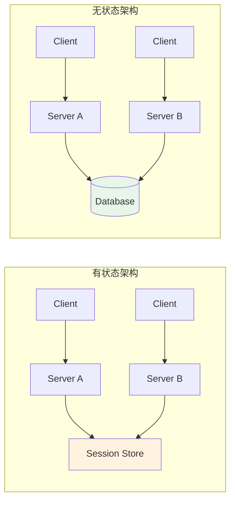
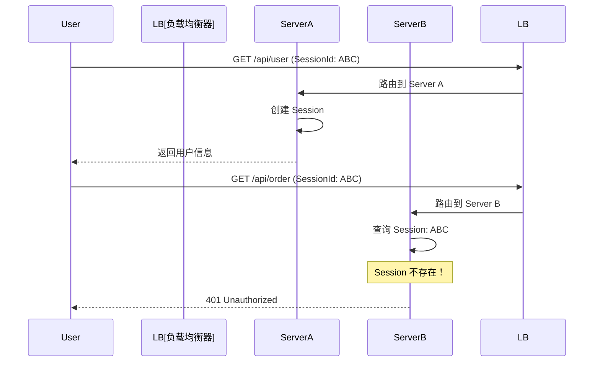
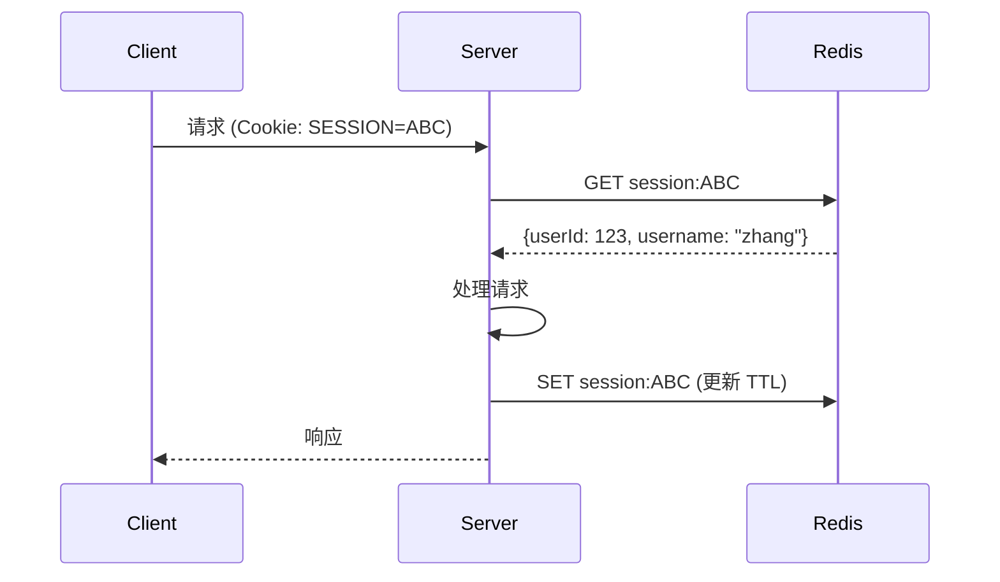
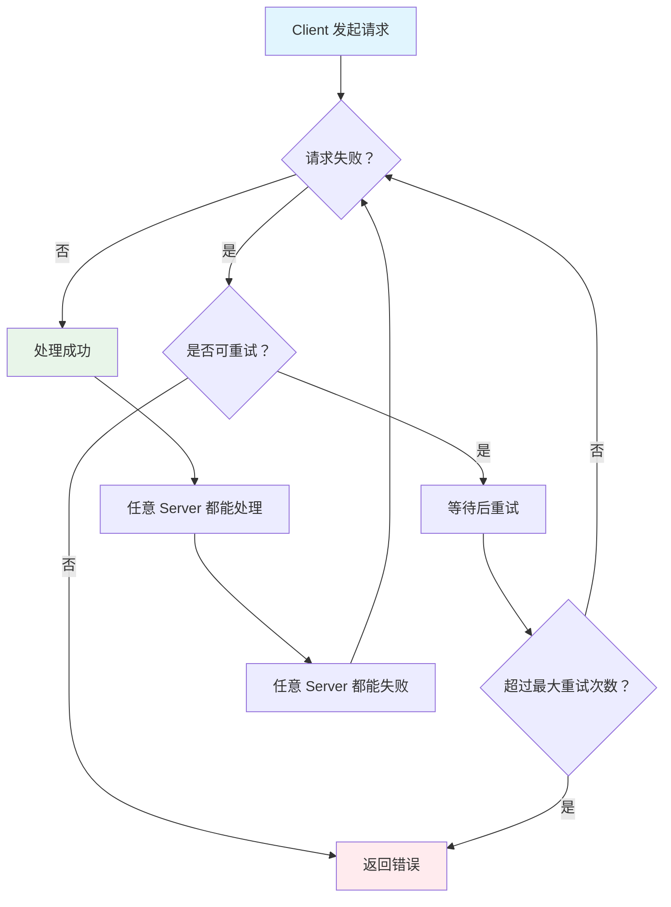
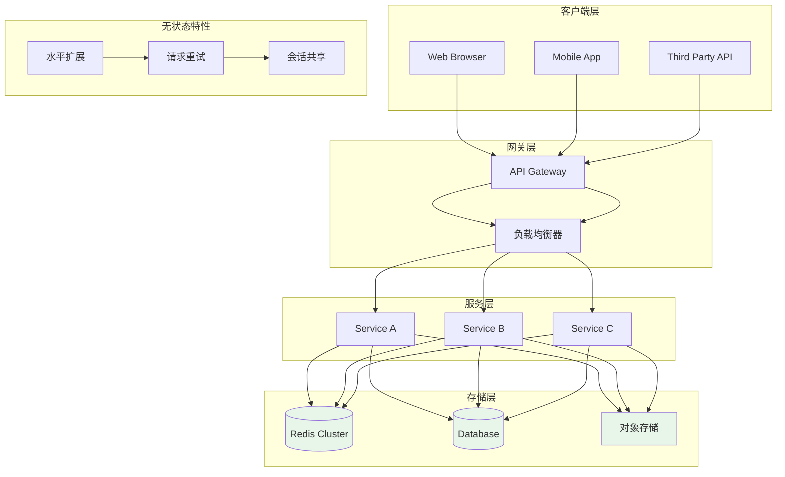

# 无状态设计模式

幂等是无状态设计的逻辑基础。

如果每个请求都是幂等的，服务器就可以随时被替换、扩容、缩容——不需要关心「这个请求之前是谁处理的」，不需要关心「用户上一次请求访问的是哪台机器」，不需要关心「服务器重启后用户会不会丢数据」。

无状态设计是现代分布式系统的基石。它让弹性伸缩、故障恢复、负载均衡成为可能。但无状态设计不是银弹——它需要代价：所有状态都需要存储到外部，所有请求都需要携带完整上下文。

## 什么是无状态

### 无状态的定义

**无状态（Stateless）** 意味着服务节点不存储客户端相关的状态数据。所有状态都存储在外部（Redis、数据库），每个请求都携带完成处理所需的全部信息。



### 有状态 vs 无状态

| 维度 | 有状态 | 无状态 |
| --- | --- | --- |
| **会话存储** | 服务节点内存 | 外部存储（Redis/数据库） |
| **水平扩展** | 困难（需会话同步） | 简单（任意新增节点） |
| **故障恢复** | 需要 Session 迁移 | 任意节点接管 |
| **负载均衡** | 需要 Sticky Session | 任意路由 |
| **部署复杂度** | 高 | 低 |
| **性能** | 高（内存访问） | 中等（网络开销） |

## 有状态架构的问题

### 问题一：会话绑定（Sticky Session）

传统 Java Web 应用使用 Session 存储用户登录状态。如果部署多个实例，用户第一次请求被路由到 Server A，后续请求被路由到 Server B，会导致「Session 丢失」。



解决方案：使用 Sticky Session，将同一 Session 的请求路由到同一服务器。但这又带来了新问题：

- 某台服务器负载过高，无法分流
- 服务器重启，Session 丢失，用户被迫登出
- 无法平滑缩容

### 问题二：水平扩展困难

有状态服务在扩展时面临「Session 迁移」问题：

1. 新增 Server C，需要迁移部分 Session 到 Server C
2. 迁移过程中，Session 不可用
3. 迁移后，原有请求可能仍路由到旧服务器

### 问题三：单点故障

如果 Server A 崩溃，所有在 Server A 上的 Session 都丢失：

- 用户被迫重新登录
- 未完成的业务操作丢失
- 用户体验下降

## 无状态设计的三个原则

### 原则一：不存储会话

用户会话数据存储在外部，而不是服务器内存。

**错误做法**：

```java
// 有状态：会话存储在服务器内存
public class UserController {
    private Map<String, UserSession> sessions = new ConcurrentHashMap<>();

    @PostMapping("/login")
    public User login(String username, String password) {
        User user = authenticate(username, password);
        String sessionId = UUID.randomUUID().toString();
        sessions.put(sessionId, new UserSession(user));  // 存储在内存
        return user;
    }
}
```

**正确做法**：

```java
// 无状态：会话存储在 Redis
public class UserController {

    @Autowired
    private StringRedisTemplate redisTemplate;

    @PostMapping("/login")
    public LoginResponse login(String username, String password) {
        User user = authenticate(username, password);
        String token = generateToken(user);

        // 会话存储在 Redis
        String key = "session:" + token;
        redisTemplate.opsForHash().putAll(key, Map.of(
            "userId", user.getId().toString(),
            "username", user.getUsername()
        ));
        redisTemplate.expire(key, Duration.ofHours(24));

        return new LoginResponse(token, user);
    }

    @GetMapping("/userinfo")
    public User getUserInfo(@RequestHeader("Authorization") String token) {
        // 任意服务器都可以从 Redis 获取会话
        String key = "session:" + token;
        Map<Object, Object> session = redisTemplate.opsForHash().entries(key);
        if (session.isEmpty()) {
            throw new UnauthorizedException("会话已过期");
        }
        return userService.findById(Long.parseLong((String) session.get("userId")));
    }
}
```

### 原则二：不存储计算中间结果

复杂计算可能需要多步完成，每一步的结果不应该存储在服务器内存中。

**错误做法**：

```java
// 有状态：计算中间结果存储在内存
public class ReportService {
    // 存储多步计算的中间结果
    private Map<String, ReportProgress> progressMap = new ConcurrentHashMap<>();

    public String startReport(String reportId) {
        progressMap.put(reportId, new ReportProgress());
        return reportId;
    }

    public ReportProgress continueReport(String reportId) {
        ReportProgress progress = progressMap.get(reportId);
        // 计算中间步骤
        progress.addStep(processStep(progress.getCurrentStep()));
        return progress;
    }
}
```

**正确做法**：

```java
// 无状态：计算上下文存储在外部
public class ReportService {

    @Autowired
    private RedisTemplate<String, Object> redisTemplate;

    public String startReport(String reportId) {
        // 初始化计算上下文
        String key = "report:context:" + reportId;
        redisTemplate.opsForHash().putAll(key, Map.of(
            "step", "0",
            "status", "PROCESSING"
        ));
        redisTemplate.expire(key, Duration.ofHours(1));
        return reportId;
    }

    public ReportProgress continueReport(String reportId) {
        String key = "report:context:" + reportId;
        Map<Object, Object> context = redisTemplate.opsForHash().entries(key);
        if (context.isEmpty()) {
            throw new ReportNotFoundException(reportId);
        }

        int currentStep = Integer.parseInt((String) context.get("step"));
        ReportProgress progress = new ReportProgress();
        progress.addStep(processStep(currentStep));

        // 更新计算上下文
        redisTemplate.opsForHash().put(key, "step", String.valueOf(currentStep + 1));

        return progress;
    }
}
```

### 原则三：不存储文件

上传的文件不应该存储在服务器本地文件系统。

**错误做法**：

```java
// 有状态：文件存储在服务器本地
@PostMapping("/upload")
public String upload(MultipartFile file) {
    String path = "/data/uploads/" + file.getOriginalFilename();
    file.transferTo(new File(path));  // 存储在本地磁盘
    return path;
}
```

**正确做法**：

```java
// 无状态：文件存储在对象存储
@Service
public class FileService {

    @Autowired
    private OSSClient ossClient;

    @Autowired
    private StringRedisTemplate redisTemplate;

    public String upload(MultipartFile file) {
        String objectKey = "uploads/" + UUID.randomUUID() + "/" + file.getOriginalFilename();

        // 上传到对象存储
        ossClient.putObject("bucket", objectKey, file.getInputStream());

        // 元数据存储到 Redis
        String metaKey = "file:meta:" + objectKey;
        redisTemplate.opsForHash().putAll(metaKey, Map.of(
            "filename", file.getOriginalFilename(),
            "size", String.valueOf(file.getSize()),
            "contentType", file.getContentType()
        ));
        redisTemplate.expire(metaKey, Duration.ofDays(365));

        return objectKey;
    }
}
```

## 会话外移：Spring Session + Redis

Spring Session 提供了开箱即用的分布式会话解决方案。

### Maven 依赖

```xml
<dependency>
    <groupId>org.springframework.session</groupId>
    <artifactId>spring-session-data-redis</artifactId>
    <version>3.2.0</version>
</dependency>
```

### 配置

```java
@Configuration
@EnableRedisHttpSession(maxInactiveIntervalInSeconds = 3600)
public class SessionConfig {
    // 通过 @EnableRedisHttpSession 注解自动配置
    // 会话数据自动存储到 Redis
}
```

### 使用

```java
@RestController
@RequestMapping("/api")
public class UserController {

    @GetMapping("/userinfo")
    public User getUserInfo(HttpSession session) {
        // HttpSession 底层是 Redis，自动同步
        Long userId = (Long) session.getAttribute("userId");
        if (userId == null) {
            throw new UnauthorizedException("未登录");
        }
        return userService.findById(userId);
    }

    @PostMapping("/login")
    public LoginResponse login(String username, String password, HttpSession session) {
        User user = authenticate(username, password);
        // 存储到 Session（自动同步到 Redis）
        session.setAttribute("userId", user.getId());
        session.setAttribute("username", user.getUsername());
        return new LoginResponse(user);
    }

    @PostMapping("/logout")
    public void logout(HttpSession session) {
        session.invalidate();  // 从 Redis 删除
    }
}
```

### Spring Session 工作原理



## 幂等 + 无状态 = 可重试架构

无状态设计和幂等性是相辅相成的：

- **无状态** 让请求可以路由到任意服务器
- **幂等** 让请求可以安全地重试

两者结合，构成了现代分布式系统的容错基础：



### 可重试架构的实现

```java
@Service
public class ResilientOrderService {

    @Autowired
    private OrderService orderService;

    @Autowired
    private RetryTemplate retryTemplate;

    /**
     * 带重试的业务调用
     */
    public Order createOrderWithRetry(OrderRequest request, String idempotencyKey) {
        return retryTemplate.execute(context -> {
            int attempt = context.getRetryCount() + 1;
            log.info("创建订单，第 {} 次尝试: orderNo={}", attempt, request.getOrderNo());

            try {
                return orderService.createOrder(idempotencyKey, request);
            } catch (DuplicateOrderException e) {
                // 幂等异常：订单已创建，返回现有订单
                log.info("订单已存在，返回现有订单: orderNo={}", request.getOrderNo());
                return orderService.getByOrderNo(request.getOrderNo());
            } catch (Exception e) {
                // 其他异常，触发重试
                log.warn("创建订单失败，将重试: orderNo={}, attempt={}",
                    request.getOrderNo(), attempt);
                throw e;
            }
        });
    }
}
```

```java
@Configuration
public class RetryConfig {

    @Bean
    public RetryTemplate retryTemplate() {
        RetryTemplate retryTemplate = new RetryTemplate();

        // 指数退避策略
        ExponentialBackOffPolicy backOffPolicy = new ExponentialBackOffPolicy();
        backOffPolicy.setInitialInterval(1000);    // 初始等待 1 秒
        backOffPolicy.setMultiplier(2.0);          // 每次翻倍
        backOffPolicy.setMaxInterval(30000);      // 最大等待 30 秒
        retryTemplate.setBackOffPolicy(backOffPolicy);

        // 重试策略
        Map<Class<? extends Throwable>, Boolean> retryableExceptions = new HashMap<>();
        retryableExceptions.put(TimeoutException.class, true);
        retryableExceptions.put(ConnectionException.class, true);
        retryableExceptions.put(DuplicateOrderException.class, false);  // 幂等异常不重试

        SimpleRetryPolicy retryPolicy = new SimpleRetryPolicy(3, retryableExceptions);
        retryTemplate.setRetryPolicy(retryPolicy);

        return retryTemplate;
    }
}
```

## 无状态设计的代价

无状态设计不是银弹，它有代价：

| 代价 | 说明 | 应对方案 |
| --- | --- | --- |
| **网络开销** | 每次请求都需要访问外部存储 | 使用本地缓存（read-through/write-through） |
| **一致性** | 状态在外部存储，分布式环境下一致性可能延迟 | 接受最终一致性，或使用强一致性存储 |
| **依赖** | 依赖 Redis/数据库的可用性 | 使用多级存储（本地缓存 + 远程存储） |
| **复杂度** | 需要处理缓存穿透、缓存击穿等问题 | 做好缓存设计 |

### 多级存储方案

```java
@Service
public class CachedSessionService {

    @Autowired
    private StringRedisTemplate redisTemplate;

    // 本地缓存：Guava Cache 或 Caffeine
    private Cache<String, Map<String, Object>> localCache;

    public Map<String, Object> getSession(String sessionId) {
        String cacheKey = "session:" + sessionId;

        // 1. 先查本地缓存
        Map<String, Object> session = localCache.getIfPresent(cacheKey);
        if (session != null) {
            return session;
        }

        // 2. 本地缓存未命中，查 Redis
        session = redisTemplate.opsForHash().entries(cacheKey);
        if (session != null && !session.isEmpty()) {
            // 写入本地缓存
            localCache.put(cacheKey, session);
            return session;
        }

        return null;  // 会话不存在
    }

    public void updateSession(String sessionId, Map<String, Object> session) {
        String cacheKey = "session:" + sessionId;

        // 1. 更新 Redis（权威数据源）
        redisTemplate.opsForHash().putAll(cacheKey, session);
        redisTemplate.expire(cacheKey, Duration.ofHours(24));

        // 2. 更新本地缓存
        localCache.put(cacheKey, session);
    }

    public void invalidateSession(String sessionId) {
        String cacheKey = "session:" + sessionId;

        // 1. 删除 Redis
        redisTemplate.delete(cacheKey);

        // 2. 删除本地缓存
        localCache.invalidate(cacheKey);
    }
}
```

## 无状态架构全景图



## 权衡矩阵

| 维度 | 有状态 | 无状态 |
| --- | --- | --- |
| **性能** | 高（内存访问） | 中等（网络开销） |
| **扩展性** | 困难 | 简单 |
| **故障恢复** | 需要 Session 迁移 | 任意节点接管 |
| **一致性** | 强一致性 | 可能最终一致 |
| **实现复杂度** | 低（直接使用内存） | 中（需要外部存储） |
| **适用场景** | 低并发、单实例 | 高并发、分布式 |
| **运维成本** | 低 | 中 |

:::info
**实践建议**：无状态设计是现代分布式系统的主流选择，但不必追求 100% 无状态。核心业务状态（用户认证、关键业务数据）必须无状态；非核心状态（访问日志、临时缓存）可以保留在内存中。
:::

## 术语表

| 术语 | 英文 | 定义 |
| --- | --- | --- |
| 无状态 | Stateless | 服务节点不存储客户端状态 |
| 有状态 | Stateful | 服务节点存储客户端状态 |
| 会话 | Session | 用户与服务器的交互上下文 |
| Sticky Session | Sticky Session | 将同一会话路由到同一服务器 |
| Spring Session | Spring Session | Spring 提供的分布式会话解决方案 |
| 多级存储 | Multi-Level Storage | 本地缓存 + 远程存储的组合 |

## 思考题

**问题 1**：无状态设计是否意味着「完全不存储状态」？如果用户需要实时看到其他人更新的数据，怎么办？
<details>
<summary>参考答案</summary>

无状态设计的「无状态」指的是**不在服务节点内存中存储状态**，而不是「完全不存储状态」。

对于「实时看到其他人更新的数据」：

1. **长轮询/短轮询**：客户端定期拉取最新数据
2. **WebSocket**：服务端推送数据更新
3. **SSE（Server-Sent Events）**：服务端推送数据更新
4. **分布式缓存 + 通知**：数据更新时通过消息队列通知其他服务节点更新本地缓存

无状态设计 + 实时推送 是常见的组合方案。

</details>

**问题 2**：如果 Redis 不可用，无状态服务还能正常工作吗？
<details>
<summary>参考答案</summary>

这取决于具体设计：

1. **完全依赖 Redis**：Redis 不可用，服务不可用（fail-fast）
2. **本地缓存降级**：Redis 不可用时，降级到本地缓存，接受数据可能不是最新
3. **多级存储**：Redis + 数据库双写，保证至少有一份可用
4. **只读降级**：Redis 不可用时，服务降级为只读，拒绝写操作

实际项目中，需要根据业务容错要求选择合适的降级策略。核心支付类业务通常选择 fail-fast，非核心业务可以选择降级。

</details>

**问题 3**：无状态设计的「无状态」是绝对的，还是相对的？
<details>
<summary>参考答案</summary>

「无状态」是相对的，不是绝对的。

不同层面的「无状态」：

| 层面 | 有状态 | 无状态 |
| --- | --- | --- |
| **进程内** | 变量、对象 | 不存储会话 |
| **节点内** | 本地文件 | 外部存储 |
| **集群内** | 单机缓存 | 分布式缓存 |

实际项目中，无状态设计的目标是：**任何服务节点崩溃，其他节点可以无缝接管**，而不需要：
- 手动迁移 Session
- 修改负载均衡配置
- 通知用户重新登录

这个目标的实现方式，可以是：
- 所有状态存储在 Redis/数据库
- 或使用 Session 复制（如 Tomcat 集群）
- 或使用 Cookie 存储会话（JWT）

</details>