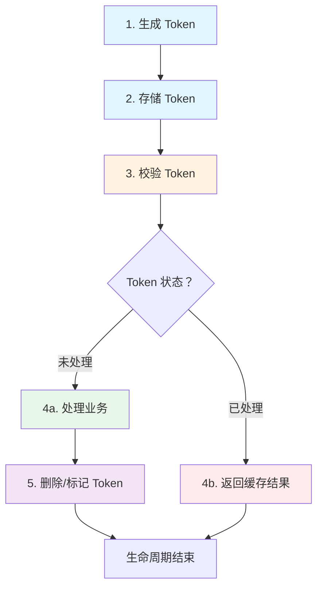

# 分布式幂等 Token 机制

分布式环境下，一个请求可能同时发送到多个服务实例。

单机环境下，幂等可以通过内存中的标志位实现。但当服务水平扩展、部署多个实例时，每个实例的内存都是独立的——Instance A 标记了「请求已处理」，但 Instance B 不知道，它会再次处理这个请求。这就是分布式幂等的核心挑战：**跨实例的状态同步**。

Redis 作为分布式存储，提供了一种简单而强大的解决方案：**用 Redis 作为共享的「已处理」标记存储**。每个服务实例都访问同一个 Redis，任何实例的「处理」标记都能被其他实例看到。

## Token 的生命周期

幂等 Token 的完整生命周期分为四个阶段：



| 阶段 | 操作 | 目的 |
| --- | --- | --- |
| 生成 | 创建唯一 Token | 标识请求 |
| 存储 | 写入 Redis（初始状态） | 记录「待处理」 |
| 校验 | 检查 Redis 中的状态 | 判断是否需要处理 |
| 清理 | 删除或更新状态 | 释放资源，防止内存泄漏 |

## Redis 实现方案

### 方案一：SETNX 原子操作

最简单的方式：使用 `SETNX`（SET if Not eXists）保证只有一个实例能「抢占」Token。

```java
@Service
public class RedisIdempotencyServiceV1 {

    @Autowired
    private StringRedisTemplate redisTemplate;

    private static final String TOKEN_PREFIX = "idem:";
    private static final long TOKEN_TTL_SECONDS = 3600;

    /**
     * 尝试获取 Token（原子操作）
     * @return true = 获取成功，可以处理；false = Token 已被占用
     */
    public boolean tryAcquire(String token) {
        String key = TOKEN_PREFIX + token;
        Boolean success = redisTemplate.opsForValue()
            .setIfAbsent(key, "PROCESSING", TOKEN_TTL_SECONDS, TimeUnit.SECONDS);
        return Boolean.TRUE.equals(success);
    }

    /**
     * 标记 Token 为完成
     */
    public void complete(String token) {
        String key = TOKEN_PREFIX + token;
        redisTemplate.opsForValue().set(key, "COMPLETED", TOKEN_TTL_SECONDS, TimeUnit.SECONDS);
    }

    /**
     * 释放 Token（失败时）
     */
    public void release(String token) {
        redisTemplate.delete(TOKEN_PREFIX + token);
    }
}
```

```java title="业务接口使用"
@Service
public class OrderServiceImpl implements OrderService {

    @Autowired
    private RedisIdempotencyServiceV1 idempotencyService;

    @Autowired
    private OrderRepository orderRepository;

    @Override
    public Order createOrder(String idempotencyKey, OrderRequest request) {
        // 1. 尝试获取 Token
        if (!idempotencyService.tryAcquire(idempotencyKey)) {
            // Token 已被占用，说明正在处理或已处理
            return getExistingOrder(request.getOrderNo());
        }

        try {
            // 2. 执行业务逻辑
            Order order = doCreateOrder(request);
            // 3. 标记完成
            idempotencyService.complete(idempotencyKey);
            return order;
        } catch (Exception e) {
            // 4. 失败时释放 Token，允许重试
            idempotencyService.release(idempotencyKey);
            throw e;
        }
    }
}
```

### 方案二：检查 + 删除（Check-And-Delete）

`SETNX` 只能保证「只有一个实例能获取 Token」，但无法保存「处理结果」。方案二使用「检查 + 删除」模式，支持返回之前的处理结果。

```java
@Service
public class RedisIdempotencyServiceV2 {

    @Autowired
    private StringRedisTemplate redisTemplate;

    private static final String TOKEN_PREFIX = "idem:";
    private static final long TOKEN_TTL_SECONDS = 3600;

    /**
     * 检查 Token 状态并获取处理结果
     * @return null = 未处理，可以继续；非 null = 已处理，返回结果
     */
    public String checkAndGet(String token) {
        String key = TOKEN_PREFIX + token;
        String value = redisTemplate.opsForValue().get(key);

        if (value == null) {
            return null;  // Token 不存在或已过期
        }

        if (value.startsWith("RESULT:")) {
            // 已处理完成，返回缓存结果
            return value.substring(7);
        }

        return null;  // 正在处理中
    }

    /**
     * 保存处理结果
     */
    public void saveResult(String token, String result) {
        String key = TOKEN_PREFIX + token;
        redisTemplate.opsForValue().set(key, "RESULT:" + result, TOKEN_TTL_SECONDS, TimeUnit.SECONDS);
    }
}
```

### 方案三：Lua 脚本原子操作

方案一和方案二都有一个潜在问题：**检查和操作不是原子的**。在高并发场景下，两个请求可能同时检查到「Token 不存在」，然后同时处理。

使用 Lua 脚本可以保证「检查 + 操作」的原子性：

```java
@Service
public class RedisIdempotencyServiceV3 {

    @Autowired
    private StringRedisTemplate redisTemplate;

    private static final String TOKEN_PREFIX = "idem:";
    private static final long TOKEN_TTL_SECONDS = 3600;

    // Lua 脚本：尝试锁定 Token
    // 返回 1 = 成功获取锁，0 = Token 已存在
    private static final String ACQUIRE_SCRIPT =
        "local key = KEYS[1] " +
        "local ttl = ARGV[1] " +
        "local result = redis.call('SETNX', key, 'LOCKED') " +
        "if result == 1 then " +
        "    redis.call('EXPIRE', key, ttl) " +
        "    return 1 " +
        "end " +
        "return 0";

    // Lua 脚本：保存结果并释放锁
    private static final String COMPLETE_SCRIPT =
        "local key = KEYS[1] " +
        "local value = ARGV[1] " +
        "local ttl = ARGV[2] " +
        "local current = redis.call('GET', key) " +
        "if current == 'LOCKED' or current == 'RESULT:'..value then " +
        "    redis.call('SET', key, 'RESULT:'..value, 'EX', ttl) " +
        "    return 1 " +
        "end " +
        "return 0";

    // Lua 脚本：检查 Token 是否已完成，返回结果
    private static final String CHECK_SCRIPT =
        "local key = KEYS[1] " +
        "local current = redis.call('GET', key) " +
        "if current and string.find(current, 'RESULT:') == 1 then " +
        "    return string.sub(current, 8) " +
        "end " +
        "return nil";

    public boolean tryAcquire(String token) {
        String key = TOKEN_PREFIX + token;
        Long result = redisTemplate.execute(
            new DefaultRedisScript<>(ACQUIRE_SCRIPT, Long.class),
            Collections.singletonList(key),
            String.valueOf(TOKEN_TTL_SECONDS)
        );
        return result != null && result == 1;
    }

    public void complete(String token, String result) {
        String key = TOKEN_PREFIX + token;
        redisTemplate.execute(
            new DefaultRedisScript<>(COMPLETE_SCRIPT, Long.class),
            Collections.singletonList(key),
            result,
            String.valueOf(TOKEN_TTL_SECONDS)
        );
    }

    public String check(String token) {
        String key = TOKEN_PREFIX + token;
        return redisTemplate.execute(
            new DefaultRedisScript<>(CHECK_SCRIPT, String.class),
            Collections.singletonList(key)
        );
    }
}
```

```java title="业务接口使用 Lua 版本"
@Service
public class OrderServiceImpl implements OrderService {

    @Autowired
    private RedisIdempotencyServiceV3 idempotencyService;

    @Override
    public Order createOrder(String idempotencyKey, OrderRequest request) {
        // 1. 先检查是否已处理
        String existingResult = idempotencyService.check(idempotencyKey);
        if (existingResult != null) {
            // 已处理，直接返回结果
            return JSON.parseObject(existingResult, Order.class);
        }

        // 2. 尝试获取锁
        if (!idempotencyService.tryAcquire(idempotencyKey)) {
            // 获取锁失败，说明有其他实例正在处理
            // 等待后重试，或者直接返回「正在处理」
            throw new OrderProcessingException("订单正在处理中");
        }

        try {
            // 3. 执行业务逻辑
            Order order = doCreateOrder(request);
            // 4. 保存结果并释放锁
            idempotencyService.complete(idempotencyKey, JSON.toJSONString(order));
            return order;
        } catch (Exception e) {
            // 业务异常时不释放锁，允许重试
            throw e;
        }
    }
}
```

## Token 生成策略

### 基础版：UUID

```java
public String generateToken() {
    return UUID.randomUUID().toString().replace("-", "");
}
```

UUID 的优点是简单、全球唯一。但 UUID 是无意义的字符串，不便于调试和问题排查。

### 进阶版：业务标识 + UUID

```java
public String generateToken(String businessType, String businessId) {
    // 格式：业务类型:业务ID:时间戳:随机数
    return String.format("%s:%s:%d:%04d",
        businessType,
        businessId,
        System.currentTimeMillis(),
        new Random().nextInt(10000)
    );
}

// 示例
// order:10001:1704067200000:8723
// refund:20001:1704067200001:1345
```

### 生产版：复合 Token

```java
public class IdempotencyToken {

    private final String businessType;  // 业务类型
    private final String businessId;    // 业务 ID
    private final long timestamp;       // 时间戳
    private final String machineId;     // 机器标识
    private final String sequence;      // 序列号

    public static IdempotencyToken create(String businessType, String businessId) {
        return new IdempotencyToken(
            businessType,
            businessId,
            System.currentTimeMillis(),
            getMachineId(),
            generateSequence()
        );
    }

    @Override
    public String toString() {
        return String.format("%s:%s:%d:%s:%s",
            businessType, businessId, timestamp, machineId, sequence);
    }

    private static String getMachineId() {
        // 从环境变量或配置中获取机器 ID
        String ip = System.getenv("HOST_IP");
        if (ip == null) ip = "127.0.0.1";
        // 取 IP 最后一段作为机器标识
        return ip.substring(ip.lastIndexOf('.') + 1);
    }

    private static String generateSequence() {
        // 使用 AtomicInteger 保证单机内的序列号递增
        return String.format("%04d", SEQUENCE.incrementAndGet() % 10000);
    }

    private static final AtomicInteger SEQUENCE = new AtomicInteger(0);
}
```

## Redis 不可用时的降级方案

Token 机制的最大风险是 **Redis 不可用**。此时幂等失效，可能导致重复处理。

### 降级策略

| 策略 | 说明 | 适用场景 |
| --- | --- | --- |
| **拒绝请求** | Redis 不可用时直接拒绝请求 | 核心支付场景 |
| **使用本地缓存** | 降级到单机缓存，放弃分布式幂等 | 非核心场景 |
| **使用数据库** | 降级到防重表 | 有强一致性要求的场景 |
| **记录日志 + 告警** | 记录请求日志，后续人工处理 | 非实时场景 |

```java title="降级方案实现"
@Service
public class RedisIdempotencyServiceWithFallback {

    @Autowired
    private StringRedisTemplate redisTemplate;

    @Autowired
    private IdempotenceRecordRepository fallbackRepository;

    private volatile boolean redisAvailable = true;

    @PostConstruct
    public void init() {
        // 健康检查：每 10 秒检测 Redis 是否可用
        Executors.newSingleThreadScheduledExecutor().scheduleAtFixedRate(() -> {
            try {
                redisTemplate.opsForValue().get("health-check");
                redisAvailable = true;
            } catch (Exception e) {
                redisAvailable = false;
                log.warn("Redis 不可用，降级到数据库幂等");
            }
        }, 0, 10, TimeUnit.SECONDS);
    }

    public boolean tryAcquire(String token) {
        if (redisAvailable) {
            try {
                return tryAcquireFromRedis(token);
            } catch (Exception e) {
                log.warn("Redis 操作失败，降级到数据库", e);
            }
        }
        // 降级到数据库
        return tryAcquireFromDatabase(token);
    }

    private boolean tryAcquireFromRedis(String token) {
        String key = "idem:" + token;
        Boolean success = redisTemplate.opsForValue()
            .setIfAbsent(key, "PROCESSING", 3600, TimeUnit.SECONDS);
        return Boolean.TRUE.equals(success);
    }

    private boolean tryAcquireFromDatabase(String token) {
        try {
            IdempotenceRecord record = new IdempotenceRecord();
            record.setIdempotenceKey(token);
            record.setStatus(0);
            record.setCreatedAt(LocalDateTime.now());
            record.setExpireAt(LocalDateTime.now().plusHours(24));
            fallbackRepository.save(record);
            return true;
        } catch (DataIntegrityViolationException e) {
            // 唯一键冲突，说明已存在
            return false;
        }
    }
}
```

## 完整实现示例

```java title="幂等拦截器"
@Component
@Slf4j
public class IdempotencyInterceptor implements HandlerInterceptor {

    @Autowired
    private RedisIdempotencyServiceV3 idempotencyService;

    @Override
    public boolean preHandle(HttpServletRequest request, HttpServletResponse response, Object handler) {
        String idempotencyKey = request.getHeader("X-Idempotency-Key");

        // 没有幂等 key，直接放行
        if (StringUtils.isBlank(idempotencyKey)) {
            return true;
        }

        // 检查是否已处理
        String existingResult = idempotencyService.check(idempotencyKey);
        if (existingResult != null) {
            // 已处理，返回缓存结果
            writeResponse(response, HttpServletResponse.SC_OK, existingResult);
            return false;
        }

        // 尝试获取锁
        if (!idempotencyService.tryAcquire(idempotencyKey)) {
            // 获取锁失败
            writeResponse(response, HttpServletResponse.SC_ACCEPTED,
                "{\"message\":\"请求正在处理中\"}");
            return false;
        }

        // 将 Token 放入请求属性，供后续使用
        request.setAttribute("idempotencyKey", idempotencyKey);
        return true;
    }

    private void writeResponse(HttpServletResponse response, int status, String body) {
        try {
            response.setStatus(status);
            response.setContentType("application/json");
            response.getWriter().write(body);
        } catch (IOException e) {
            log.error("写入响应失败", e);
        }
    }
}
```

```java title="Spring MVC 配置"
@Configuration
public class WebMvcConfig implements WebMvcConfigurer {

    @Autowired
    private IdempotencyInterceptor idempotencyInterceptor;

    @Override
    public void addInterceptors(InterceptorRegistry registry) {
        registry.addInterceptor(idempotencyInterceptor)
            .addPathPatterns("/api/**")  // 需要幂等的接口
            .excludePathPatterns("/health", "/metrics");  // 排除的接口
    }
}
```

```java title="Controller 使用示例"
@RestController
@RequestMapping("/api/orders")
@Slf4j
public class OrderController {

    @Autowired
    private OrderService orderService;

    @Autowired
    private RedisIdempotencyServiceV3 idempotencyService;

    @PostMapping
    public ResponseEntity<OrderResponse> createOrder(
        @RequestHeader(value = "X-Idempotency-Key", required = false) String idempotencyKey,
        @RequestBody OrderRequest request,
        HttpServletRequest httpRequest
    ) {
        // 如果拦截器没有注入 idempotencyKey，尝试获取
        if (StringUtils.isBlank(idempotencyKey)) {
            idempotencyKey = (String) httpRequest.getAttribute("idempotencyKey");
        }

        Order order = orderService.createOrder(request);

        // 标记幂等完成（如果拦截器没有自动处理）
        if (StringUtils.isNotBlank(idempotencyKey)) {
            idempotencyService.complete(idempotencyKey, JSON.toJSONString(order));
        }

        return ResponseEntity.ok(OrderResponse.from(order));
    }
}
```

## 权衡矩阵

| 维度 | SETNX | 检查 + 删除 | Lua 脚本 |
| --- | --- | --- | --- |
| **原子性** | 高 | 中（有竞争窗口） | 最高 |
| **性能** | 极快 | 快 | 快 |
| **实现复杂度** | 低 | 中 | 高 |
| **结果缓存** | 不支持 | 支持 | 支持 |
| **适用场景** | 简单幂等 | 需要返回结果 | 生产级幂等 |

| 维度 | Redis 可用 | 数据库降级 | 拒绝请求 |
| --- | --- | --- | --- |
| **幂等性** | 分布式幂等 | 数据库幂等 | 无幂等 |
| **可用性** | 依赖 Redis | 高 | 最高 |
| **一致性风险** | 无 | 可能有延迟 | 无 |
| **适用场景** | 正常情况 | Redis 故障 | 核心支付 |

:::warning
**重要提醒**：Token 机制虽然强大，但不是万能的。它只解决了「同一 Token 的重复请求」问题。如果客户端因为 Bug 生成了不同的 Token（如每次重试都生成新 Token），幂等仍然会失效。因此，Token 的生成策略必须保证幂等性。
:::

## 术语表

| 术语 | 英文 | 定义 |
| --- | --- | --- |
| SETNX | SET if Not eXists | Redis 原子操作，仅当 key 不存在时设置值 |
| Lua 脚本 | Lua Script | Redis 支持的脚本语言，保证原子执行 |
| TTL | Time To Live | 键的生存时间 |
| 降级 | Degradation | 服务不可用时的备用处理策略 |
| 幂等 Key | Idempotency Key | 标识唯一请求的令牌 |
| 分布式锁 | Distributed Lock | 跨多个服务实例的锁机制 |

## 思考题

**问题 1**：如果 Token 处理成功后，Redis 恰好宕机，导致「完成」操作没有执行，会有什么后果？
<details>
<summary>参考答案</summary>

后果是「重复处理」：

1. 请求 A 成功获取 Token，处理业务，保存结果
2. Redis 在「保存结果」之前宕机
3. Token 状态仍为「处理中」或已丢失
4. 请求 A 重试，再次获取 Token（因为原 Token 已丢失）
5. 业务被再次执行

解决方案：
- **数据库兜底**：业务表使用唯一键约束，重复插入会失败
- **状态机幂等**：业务表本身有状态，更新类操作使用乐观锁
- **结果预写**：在处理业务前先保存「预结果」，完成后更新为「正式结果」
- **重试保护**：处理前检查是否已存在业务结果，而不是只检查 Token

</details>

**问题 2**：如何设计 Token 的过期时间？
<details>
<summary>参考答案</summary>

Token 过期时间需要平衡两个因素：
- **太长**：浪费 Redis 内存，且 Token 丢失后无法被覆盖
- **太短**：可能导致正常请求被拒绝

设计建议：

1. **基于业务处理时间**：Token TTL = 平均处理时间 × 2 + 最大重试延迟
   - 例如：平均处理 1 秒，最大重试延迟 5 秒，TTL = 1 × 2 + 5 = 7 秒，建议设置 10~30 秒

2. **基于消息生命周期**：如果 Token 用于消息队列，TTL = 消息最大保留时间
   - 例如：Kafka 消息保留 7 天，TTL = 7 天

3. **分级 TTL**：
   - 简单操作：10~30 秒
   - 复杂操作（涉及外部系统）：1~5 分钟
   - 批处理：10~30 分钟

4. **动态 TTL**：根据业务负载动态调整
   - 高峰期缩短 TTL，减少内存占用
   - 低峰期延长 TTL，提高容错性

</details>

**问题 3**：在高并发秒杀场景下，Token 机制可能成为瓶颈，如何优化？
<details>
<summary>参考答案</summary>

高并发秒杀场景下，所有请求都携带同一个 Token（如商品 ID），会导致：
1. 所有请求都竞争同一个 Redis Key
2. 大量请求获取锁失败
3. Redis 成为瓶颈

优化方案：

1. **分段 Token**：
   - 不使用商品 ID 作为 Token
   - 使用「商品 ID + 随机数」作为 Token
   - 不同请求的 Token 不同，减少竞争

2. **本地缓存 + Redis**：
   - 先检查本地缓存（如 ConcurrentHashMap）
   - 本地未命中再访问 Redis
   - 使用滑动窗口控制本地缓存大小

3. **Redis Cluster 分片**：
   - 按 Token 的哈希值分配到不同分片
   - 不同分片的请求互不影响

4. **异步确认**：
   - 获取锁后立即返回「排队中」
   - 异步处理业务，处理完成后通知客户端
   - 减少同步等待时间

5. **消息队列削峰**：
   - 请求先进入队列
   - 消费者从队列消费，串行处理
   - 完全避免 Redis 竞争

</details>