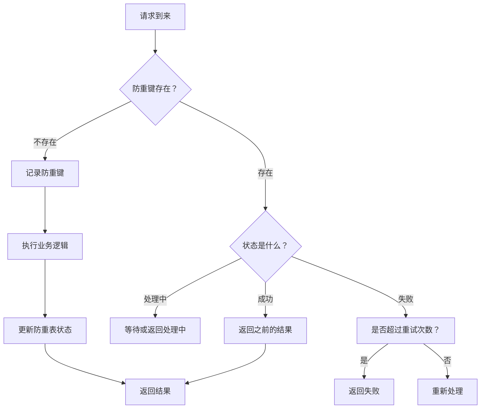

# 唯一索引与乐观锁

数据库的唯一约束是最简单、最可靠的幂等保障。

很多开发者在学习分布式系统时，会研究各种复杂的幂等方案：Redis Token、防重表、消息队列去重……但往往忽略了一个最朴素的方案：**利用数据库的唯一索引**。

当一个唯一键被重复插入时，数据库会抛出异常。这个异常可以被捕获并转换为「幂等成功」。这个过程不需要额外的缓存，不需要分布式协调，甚至不需要修改业务逻辑——数据库天然就是幂等的。

但唯一索引不是万能的。它适用于插入类操作，对于更新类操作，需要借助乐观锁来实现幂等。

## 唯一索引的幂等机制

### 原理

唯一索引保证：**同一个唯一键的值，在表中只能出现一次**。当重复插入相同唯一键的记录时，数据库会抛出 `DuplicateKeyException`（MySQL）或 `unique constraint violation`（Oracle/PostgreSQL）。

```java
// 捕获唯一键冲突 = 幂等
try {
    orderRepository.save(order);
    return "订单创建成功";
} catch (DuplicateKeyException e) {
    // 唯一键冲突，说明订单已存在，返回幂等成功
    return "订单已存在";
}
```

### 幂等性分析

```
第一次调用：
INSERT INTO orders (order_no, ...) VALUES ('ORD-001', ...) 
→ 执行成功，返回 Order 对象

第二次调用：
INSERT INTO orders (order_no, ...) VALUES ('ORD-001', ...) 
→ 唯一键冲突，抛出异常
→ 捕获异常，返回「订单已存在」
→ 效果等价于「订单创建成功」

结论：重复执行 = 第一次执行的效果 → 幂等
```

### 唯一键的选择

唯一键的选择直接影响幂等的效果：

| 唯一键类型 | 示例 | 适用场景 |
| --- | --- | --- |
| 业务唯一键 | `order_no`、`payment_id` | 有明确业务标识的场景 |
| 复合唯一键 | `(user_id, product_id, date)` | 组合唯一性约束的场景 |
| 全局唯一 ID | UUID、业务发号器 | 无明确唯一标识的场景 |

:::warning
**唯一键必须是幂等的依据**：如果唯一键本身不是幂等的（如包含时间戳的随机数），则无法保证幂等。因为两次请求可能产生两个不同的唯一键，从而创建两条记录。
:::

## 防重表设计

### 什么是防重表

防重表是专门为幂等设计的表。它的结构很简单：只存储「已处理的请求标识」和「处理结果」。

```sql title="防重表结构"
CREATE TABLE `idempotency_record` (
  `id` bigint NOT NULL AUTO_INCREMENT PRIMARY KEY,
  `idempotence_key` varchar(128) NOT NULL COMMENT '幂等键',
  `business_type` varchar(32) NOT NULL COMMENT '业务类型',
  `status` tinyint NOT NULL DEFAULT 0 COMMENT '状态：0-处理中 1-成功 2-失败',
  `result` text COMMENT '处理结果（JSON）',
  `retry_count` int NOT NULL DEFAULT 0 COMMENT '重试次数',
  `created_at` datetime NOT NULL DEFAULT CURRENT_TIMESTAMP,
  `updated_at` datetime NOT NULL DEFAULT CURRENT_TIMESTAMP ON UPDATE CURRENT_TIMESTAMP,
  `expire_at` datetime COMMENT '过期时间',
  UNIQUE KEY `uk_idempotence_key` (`idempotence_key`, `business_type`),
  KEY `idx_expire_at` (`expire_at`)
) ENGINE=InnoDB DEFAULT CHARSET=utf8mb4 COMMENT='幂等记录表';
```

### 防重表的工作流程



### 完整的防重表实现

```java title="防重表服务"
@Service
@Slf4j
public class IdempotenceService {

    @Autowired
    private IdempotenceRecordRepository repository;

    @Autowired
    private ObjectMapper objectMapper;

    /**
     * 尝试获取幂等锁
     * @return 如果返回空，说明已存在或获取失败；如果返回记录，说明可以处理
     */
    @Transactional
    public Optional<IdempotenceRecord> tryAcquireLock(String idempotenceKey, String businessType) {
        // 1. 查找是否已存在
        Optional<IdempotenceRecord> existing =
            repository.findByIdempotenceKeyAndBusinessType(idempotenceKey, businessType);

        if (existing.isPresent()) {
            IdempotenceRecord record = existing.get();
            // 正在处理中，不允许重复处理
            if (record.getStatus() == 0) {
                return Optional.empty();
            }
            // 已处理完成，返回记录供后续判断
            return existing;
        }

        // 2. 不存在，插入新记录（状态为处理中）
        IdempotenceRecord record = new IdempotenceRecord();
        record.setIdempotenceKey(idempotenceKey);
        record.setBusinessType(businessType);
        record.setStatus(0);  // 处理中
        record.setExpireAt(LocalDateTime.now().plusHours(24));  // 24 小时过期

        try {
            record = repository.save(record);
            return Optional.of(record);
        } catch (DataIntegrityViolationException e) {
            // 唯一键冲突，说明其他线程刚插入
            return repository.findByIdempotenceKeyAndBusinessType(idempotenceKey, businessType);
        }
    }

    /**
     * 标记处理成功
     */
    @Transactional
    public void markSuccess(String idempotenceKey, String businessType, Object result) {
        repository.findByIdempotenceKeyAndBusinessType(idempotenceKey, businessType)
            .ifPresent(record -> {
                record.setStatus(1);  // 成功
                try {
                    record.setResult(objectMapper.writeValueAsString(result));
                } catch (JsonProcessingException e) {
                    log.warn("序列化结果失败", e);
                }
                repository.save(record);
            });
    }

    /**
     * 标记处理失败
     */
    @Transactional
    public void markFailed(String idempotenceKey, String businessType, String errorMessage) {
        repository.findByIdempotenceKeyAndBusinessType(idempotenceKey, businessType)
            .ifPresent(record -> {
                record.setStatus(2);  // 失败
                record.setResult(errorMessage);
                record.setRetryCount(record.getRetryCount() + 1);
                repository.save(record);
            });
    }
}
```

```java title="防重表使用示例"
@Service
public class OrderServiceImpl implements OrderService {

    @Autowired
    private IdempotenceService idempotenceService;

    @Autowired
    private OrderRepository orderRepository;

    @Override
    public Order createOrder(String orderNo, OrderRequest request) {
        String idempotenceKey = "order:" + orderNo;

        // 1. 尝试获取幂等锁
        Optional<IdempotenceRecord> lockOpt =
            idempotenceService.tryAcquireLock(idempotenceKey, "CREATE_ORDER");

        if (lockOpt.isEmpty()) {
            // 没有获取到锁，说明正在处理或已处理
            IdempotenceRecord record =
                idempotenceService.getRecord(idempotenceKey, "CREATE_ORDER").orElseThrow();
            if (record.getStatus() == 0) {
                throw new OrderProcessingException("订单正在处理中");
            }
            // 已处理完成，返回之前的结果
            return JSON.parseObject(record.getResult(), Order.class);
        }

        // 2. 执行业务逻辑
        try {
            Order order = doCreateOrder(request);
            // 3. 标记成功
            idempotenceService.markSuccess(idempotenceKey, "CREATE_ORDER", order);
            return order;
        } catch (Exception e) {
            // 4. 标记失败（允许重试）
            idempotenceService.markFailed(idempotenceKey, "CREATE_ORDER", e.getMessage());
            throw e;
        }
    }
}
```

## 乐观锁与幂等

### 为什么需要乐观锁

唯一索引只能保证「插入不重复」，但不能保证「更新不重复」。考虑这个场景：

```java
// 订单支付回调
public void handlePaymentCallback(String orderNo, BigDecimal paidAmount) {
    Order order = orderRepository.findByOrderNo(orderNo);
    // [!code warning]
    // 问题：两次回调同时到达，都会进入这里
    if (order.getStatus() == "PAID") {
        return;  // 已支付
    }
    order.setStatus("PAID");
    order.setPaidAmount(paidAmount);
    orderRepository.save(order);  // [!code warning]
    // 如果没有乐观锁，两次都会更新成功！
}
```

这个问题需要用乐观锁来解决。

### 乐观锁原理

乐观锁的核心思想：**假设并发冲突是小概率事件，先操作，冲突了再重试**。

实现方式是给每条记录加一个 `version` 字段。更新时，检查 `version` 是否匹配：

```sql
-- 更新时检查 version
UPDATE orders
SET status = 'PAID',
    paid_amount = 100.00,
    version = version + 1
WHERE order_no = 'ORD-001'
  AND version = 5  -- 期望的版本号
```

如果 `version` 不等于 5（说明其他线程修改了记录），更新失败（0 rows affected）。此时可以选择重试。

### 乐观锁的幂等性

乐观锁天然支持幂等：

```java
public PaymentResult handlePaymentCallback(String orderNo, BigDecimal paidAmount) {
    Order order = orderRepository.findByOrderNo(orderNo);

    // 幂等：已经是 PAID 状态，直接返回成功
    if ("PAID".equals(order.getStatus())) {
        return PaymentResult.success("订单已支付");
    }

    // 使用乐观锁更新
    int rows = orderRepository.updatePaymentStatus(
        orderNo,
        "PENDING",     // 期望状态
        "PAID",        // 目标状态
        paidAmount,
        order.getVersion()
    );

    if (rows == 0) {
        // 乐观锁冲突，说明并发修改了
        // 可能是：1. 其他线程刚支付成功  2. 状态已被其他操作修改
        throw new ConcurrentModificationException("订单状态已被修改");
    }

    return PaymentResult.success("支付成功");
}
```

### CAS（Compare-And-Swap）

乐观锁的底层是 CAS（Compare-And-Swap）操作。CAS 是 CPU 提供的原子指令：

```java
// CAS 的语义
// compareAndSwap(object, expectedValue, newValue)
// 如果 object 的当前值等于 expectedValue，则将其设置为 newValue
// 返回是否成功

// Java 中的 CAS
AtomicInteger balance = new AtomicInteger(100);
boolean success = balance.compareAndSet(100, 90);  // 如果当前是 100，改为 90
```

在高并发场景下，CAS 的失败率会上升。可以通过以下方式优化：

| 优化策略 | 说明 |
| --- | --- |
| **重试 + 退避** | 冲突后随机等待一段时间再重试 |
| **分段锁** | 按某个维度（如用户 ID）将数据分段，不同段不冲突 |
| **减少冲突** | 降低并发度，如批量处理代替逐条处理 |
| **乐观锁改悲观锁** | 高冲突场景下，悲观锁可能更稳定 |

## 数据库唯一键 vs 业务唯一键

### 谁来生成唯一键

这是幂等设计中的一个关键问题：

| 方案 | 优点 | 缺点 |
| --- | --- | --- |
| **客户端生成** | 服务端无状态，扩展性好 | 需要客户端配合 |
| **服务端生成** | 服务端可控，唯一性有保证 | 增加一次网络调用 |
| **第三方发号器** | 全局唯一，高可用 | 依赖外部服务 |

### 推荐策略

1. **业务唯一键**：如果业务本身有唯一标识（如订单号、支付流水号），优先使用业务唯一键。

```java
// 好的做法：使用业务唯一键
String orderNo = request.getOrderNo();  // 业务生成的订单号
Order order = new Order();
order.setOrderNo(orderNo);  // 用订单号作为幂等键
orderRepository.save(order);
```

2. **无业务唯一键**：如果业务没有唯一标识，使用全局唯一 ID 生成器（如 Snowflake）。

```java
// Snowflake ID 生成
public class SnowflakeIdGenerator {
    private final Sequence sequence;

    public SnowflakeIdGenerator(DataSource dataSource) {
        this.sequence = new Sequence(dataSource);
    }

    public long nextId() {
        return sequence.nextId();
    }
}

// 使用
Order order = new Order();
order.setId(snowflakeIdGenerator.nextId());  // 全局唯一 ID
orderRepository.save(order);
```

3. **复合唯一键**：如果需要组合唯一性约束（如同一用户同一天只能有一条记录），使用复合唯一键。

```sql
-- 复合唯一键：同一用户同一天只能有一条打卡记录
CREATE TABLE attendance (
    id BIGINT PRIMARY KEY,
    user_id BIGINT NOT NULL,
    date DATE NOT NULL,
    status VARCHAR(20),
    UNIQUE KEY uk_user_date (user_id, date)
);
```

## MySQL 实现示例

```sql title="订单表（含唯一索引和版本号）"
CREATE TABLE orders (
    id BIGINT NOT NULL AUTO_INCREMENT PRIMARY KEY,
    order_no VARCHAR(64) NOT NULL COMMENT '订单号',
    user_id BIGINT NOT NULL,
    product_id BIGINT NOT NULL,
    quantity INT NOT NULL DEFAULT 1,
    amount DECIMAL(10,2) NOT NULL,
    status VARCHAR(20) NOT NULL DEFAULT 'PENDING' COMMENT 'PENDING/PROCESSING/PAID/CLOSED',
    version INT NOT NULL DEFAULT 0 COMMENT '乐观锁版本号',
    created_at DATETIME NOT NULL DEFAULT CURRENT_TIMESTAMP,
    updated_at DATETIME NOT NULL DEFAULT CURRENT_TIMESTAMP ON UPDATE CURRENT_TIMESTAMP,
    UNIQUE KEY uk_order_no (order_no),
    KEY idx_user_id (user_id),
    KEY idx_status (status)
) ENGINE=InnoDB DEFAULT CHARSET=utf8mb4 COMMENT='订单表';
```

```java title="订单 Repository（含乐观锁更新）"
@Repository
public interface OrderRepository extends JpaRepository<Order, Long> {

    Optional<Order> findByOrderNo(String orderNo);

    @Modifying
    @Query("UPDATE Order o SET o.status = :targetStatus, " +
           "o.version = o.version + 1 " +
           "WHERE o.orderNo = :orderNo " +
           "AND o.status = :expectedStatus " +
           "AND o.version = :expectedVersion")
    int updateStatusWithVersion(
        @Param("orderNo") String orderNo,
        @Param("targetStatus") String targetStatus,
        @Param("expectedStatus") String expectedStatus,
        @Param("expectedVersion") Integer expectedVersion
    );

    @Modifying
    @Query("UPDATE Order o SET o.status = :targetStatus, " +
           "o.paidAmount = :paidAmount, " +
           "o.version = o.version + 1 " +
           "WHERE o.orderNo = :orderNo " +
           "AND o.status = 'PROCESSING' " +
           "AND o.version = :expectedVersion")
    int confirmPayment(
        @Param("orderNo") String orderNo,
        @Param("targetStatus") String targetStatus,
        @Param("paidAmount") BigDecimal paidAmount,
        @Param("expectedVersion") Integer expectedVersion
    );
}
```

## 权衡矩阵

| 维度 | 唯一索引 | 防重表 | 乐观锁 |
| --- | --- | --- | --- |
| **适用场景** | 插入类操作 | 任何操作 | 更新类操作 |
| **并发控制** | 原生保证 | 无并发控制 | 版本号控制 |
| **实现复杂度** | 极低 | 中 | 低 |
| **性能开销** | 极低 | 中（多次查询） | 低 |
| **失败处理** | 捕获异常即可 | 需要状态管理 | 需要重试 |
| **适用操作** | INSERT | INSERT/UPDATE | UPDATE |
| **数据一致性** | 强一致性 | 强一致性 | 最终一致性（重试） |

:::info
**实践建议**：唯一索引是最简单、最可靠的幂等方案。如果业务允许，优先使用唯一索引。乐观锁适合更新类操作，但需要考虑重试策略。防重表适合需要追踪处理状态的场景。
:::

## 术语表

| 术语 | 英文 | 定义 |
| --- | --- | --- |
| 唯一索引 | Unique Index | 保证列值唯一的数据库索引 |
| 乐观锁 | Optimistic Locking | 依赖版本号控制的并发策略 |
| 悲观锁 | Pessimistic Locking | 依赖排他锁的并发策略 |
| CAS | Compare-And-Swap | CPU 级别的原子操作指令 |
| 版本号 | Version | 用于乐观锁的递增字段 |
| 防重表 | Idempotence Table | 专门记录幂等状态的表 |
| 复合唯一键 | Composite Unique Key | 多列组合的唯一性约束 |

## 思考题

**问题 1**：如果使用乐观锁更新一条记录，但更新后没有将新版本号返回给调用方，会发生什么？
<details>
<summary>参考答案</summary>

会发生「乐观锁永远失败」的问题：

1. 线程 A 读取记录（version = 1）
2. 线程 B 读取记录（version = 1）
3. 线程 A 更新成功（version 变为 2），但没有返回新版本号
4. 线程 B 尝试更新（WHERE version = 1），发现版本号已变成 2，更新失败
5. 线程 B 重试，读取新记录（version = 2）
6. 线程 B 更新成功

如果线程 A 始终没有返回新版本号，线程 B 会陷入无限重试。因此，乐观锁的正确用法是：**每次读取记录后立即更新，同时获取新版本号**。

</details>

**问题 2**：唯一索引和唯一约束有什么区别？
<details>
<summary>参考答案</summary>

在 MySQL 中，Unique Index（唯一索引）和 Unique Constraint（唯一约束）在功能上几乎等价：

- **唯一索引**：用于加速唯一性查询，同时保证唯一性
- **唯一约束**：语义上是约束，数据库会为其创建唯一索引

主要区别：

| 维度 | 唯一索引 | 唯一约束 |
| --- | --- | --- |
| **用途** | 加速查询 + 保证唯一 | 保证唯一性 |
| **外键引用** | 不可被外键引用 | 可以被外键引用 |
| **延迟约束** | 不支持延迟检查 | PostgreSQL 支持 `DEFERRABLE` |

对于幂等性来说，两者没有区别，都能满足要求。

</details>

**问题 3**：在高并发场景下，如果乐观锁冲突率很高，应该如何优化？
<details>
<summary>参考答案</summary>

高并发场景下乐观锁冲突率高的根本原因是：**多个线程同时读取同一行数据**。优化思路：

1. **减少读取频率**：使用「预占位」策略，先更新状态为 PROCESSING（占位），再执行业务逻辑，最后更新为最终状态。这样不同线程会在「预占位」阶段就冲突，不会走到业务逻辑。

2. **分段策略**：按某个维度（如 user_id % 100）将数据分到不同表，不同表的更新互不影响。

3. **降低并发度**：使用消息队列将并发请求串行化，或使用分布式锁。

4. **改用悲观锁**：在 SELECT 时加 `FOR UPDATE`，直接锁定行。虽然会降低并发度，但避免了无效的重试。

5. **增加重试退避**：使用指数退避策略，避免大量线程同时重试。

</details>