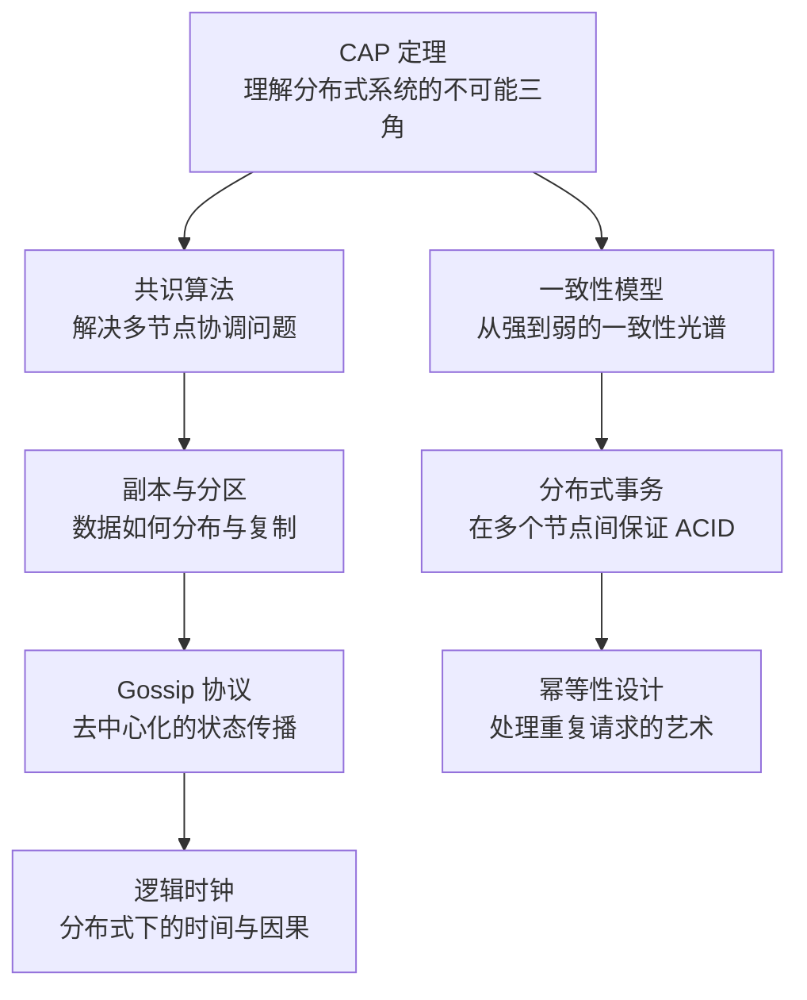

# 分布式理论

分布式系统是现代后端架构的基石。当单机性能达到瓶颈、业务规模跨越单机容量上限时，我们就必须面对一个核心问题：**多个节点协同工作时，如何保证数据一致性与服务可用性？**

本模块聚焦分布式系统的核心理论，从 CAP 定理出发，逐步深入到一致性模型、共识算法、分布式事务等核心领域。无论你是准备架构师面试，还是在实际项目中做技术选型，这些理论都是绕不开的基础。

## 模块结构

本模块按主题分为 8 个子模块：

| 子模块 | 核心问题 | 典型场景 |
| --- | --- | --- |
| CAP 与 BASE 理论 | 一致性与可用性的权衡 | Redis/ZooKeeper 选型 |
| 一致性模型 | 不同场景下应该选哪种一致性 | 主从复制、数据同步 |
| 共识算法 | 多节点如何达成一致决策 | etcd、分布式锁 |
| 分布式事务 | 跨节点的数据一致性保证 | 跨服务下单支付 |
| 副本与分区 | 数据如何在多节点间分布 | Cassandra、MongoDB |
| Gossip 与故障检测 | 节点状态如何高效传播 | Cassandra、DynamoDB |
| 幂等性与无状态设计 | 请求重复执行不会产生副作用 | 支付回调、重试机制 |
| 逻辑时钟与向量时钟 | 分布式环境下事件先后如何判断 | 冲突检测、版本管理 |

## 核心演进路径

分布式理论的学习顺序建议如下：

## 学习建议

1. **从 CAP 入手**：理解分布式系统面临的核心权衡，这是所有后续概念的基础
2. **对比学习**