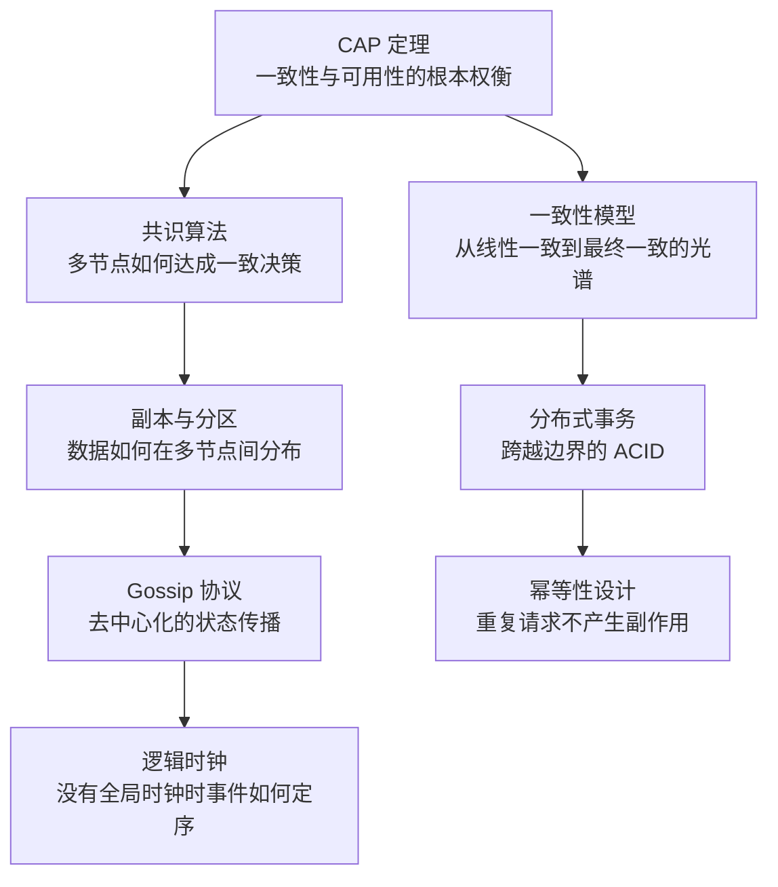

# 分布式理论

三个节点，其中一个挂了，整个系统就无法写入。你第一反应是「这不对，挂了应该还能用才对」——毕竟单机数据库挂了，应用早就自动切换到备库了。但在分布式存储系统里，这不是故障，这是 `CP` 系统的正常行为。

这个反直觉的事实，贯穿整个分布式理论的学习过程。你会不断遇到类似的「看起来不对，但仔细想想确实是这样」的时刻——这些时刻，恰好就是理解分布式系统本质的入口。

## 为什么分布式系统如此困难

当业务从单机走向分布式，一切看起来美好的架构假设都开始崩塌。

**单机的隐含前提消失了。** 在一台机器上，`读到的数据是最新的` 是理所当然的——因为只有一份数据。但在多台机器上，这个前提不再成立：每个节点都有自己的数据副本，网络延迟随时可能发生，某些节点可能正在 GC 停顿中。一个看似简单的 `读取最新数据` 操作，在分布式环境下变得异常复杂。

**故障从罕见事件变成常态事件。** 单机系统的假设是 `机器不会坏`。分布式系统的假设必须反过来：`任何节点、任何时刻都可能故障，网络随时可能不可达`。在这个假设之上构建的系统，需要考虑几十种单机系统根本不需要考虑的场景：节点宕机重启后数据不一致怎么办？网络分区时两个子集群同时写入怎么解决？

**时间不再是全局一致的。** 单机系统里，`gettimeofday()` 拿到的时间戳可以认为是全局一致的。但在分布式系统里，每个节点都有自己的时钟，而时钟可能漂移、可能被 NTP 同步跳变。`事件 A 发生在事件 B 之前` 这个判断，在单机上只需要看时间戳，在分布式上却需要专门设计的逻辑时钟。

这就是分布式系统面临的根本挑战：`一致性、可用性、分区容忍性` 之间的权衡。`CAP` 定理告诉我们，在网络分区发生时，一致性和可用性不可兼得。但这只是冰山一角——围绕这个核心权衡，衍生出了一整套理论体系：一致性模型描述了 `一致` 的不同程度，共识算法解决了 `多节点如何做出一致决策`，分布式事务保证了 `跨越边界的 ACID`，而逻辑时钟则回答了 `没有全局时钟时，事件先后如何判断`。

## 模块全景图

分布式理论不是一堆零散概念的堆砌。从 `CAP` 出发，这些子模块构成了一条完整的知识链路：

下面逐一介绍每个子模块解决的问题。

## CAP 与 BASE 理论

> 起点：理解分布式系统面临的不可能三角

`CAP` 定理常被简化为 `一致性、可用性、分区容忍性三选二`，但这个说法遗漏了关键细节——**分区容忍性不是可选的**，任何分布式系统都必须容忍网络分区。因此 `CAP` 的真实含义是：在网络分区发生时，一致性和可用性必须二选一。

`ZooKeeper` 选择了 `CP`——在分区时拒绝服务直到恢复，但保证数据一致。`Eureka` 选择了 `AP`——始终响应可用，但不同节点可能返回不同数据。你在技术选型时选的是哪个？这个选择没有标准答案，取决于业务对数据一致性的真实要求。

`BASE` 理论是 `CAP` 的工程妥协：放弃强一致性，接受数据最终会收敛到一致。几乎所有大规模分布式系统（`DynamoDB`、`Cassandra`、`Riak`）都遵循 `BASE` 哲学。

## 一致性模型

> 深入：一致不是非黑即白，而是一个光谱

很多人以为一致性只有 `一致` 和 `不一致` 两种状态。实际上，**一致性是一个从强到弱的光谱**，不同的一致性级别对应着截然不同的实现代价和应用场景。

**线性一致性（`Linearizability`）** 是最强的——写操作完成后，所有后续读操作都能读到最新值，就像操作发生在单一节点上。实现它的代价是跨节点协调的延迟，`ZooKeeper` 通过 `Zab` 协议提供了近似线性一致性的保证。

**顺序一致性（`Sequential Consistency`）** 弱一些：所有节点看到的操作顺序是相同的，但不保证这个顺序和真实时间一致。

**因果一致性（`Causal Consistency`）** 进一步弱化：只保证有因果关系的操作顺序一致，没有因果关系的操作可以以任意顺序执行。这已经需要向量时钟来追踪因果关系了。

**最终一致性（`Eventual Consistency`）** 是最弱的——系统允许暂时不一致，只要最终收敛到一致即可。`DynamoDB`、`Cassandra` 默认就是这个级别。

## 共识算法

> 核心：多节点如何做出一致决策

想象一个场景：三个数据库节点要选出一个主节点来处理写入请求。在网络可能延迟、节点可能宕机的环境下，如何让它们最终做出相同的决定？

这就是共识算法要解决的问题——**分布式系统皇冠上的明珠**。解决了共识问题，上面那一层 `分布式事务`、`分布式锁`、`服务发现` 才能成立。

**`Paxos`** 是共识算法的鼻祖，由 Leslie Lamport 在 1998 年提出，但因其复杂性被很多人认为是 `理论上优美、工程上难用` 的代名词。**`Raft`** 是 2014 年诞生的后起之秀，通过更强的可理解性设计成为了工程界的主流选择——`etcd`、`Consul`、`CockroachDB` 都在用。**`ZAB`** 是 `ZooKeeper` 使用的协议，思想和 `Raft` 非常相似，但在细节上有不少差异。

很多人以为用了 `Raft` 就万事大吉了。但 `Raft` 只解决了 `日志复制的一致性`，**不解决 `读一致性的问题`**——如果 follower 节点直接提供读服务，可能读到 stale data。你知道怎么解决吗？

## 分布式事务

> 落地：跨越边界的 ACID 如何实现

在单体应用中，事务是一件事：`begin → 操作 → commit`。但在分布式架构下，一笔业务操作横跨多个服务、多个数据库——下单服务要扣库存，账户服务要扣余额，物流服务要创建运单。任何一步失败，都需要其他所有步骤一起回滚。

**`2PC`（两阶段提交）** 是最直观的方案，但协调者宕机会导致资源永远被锁定——这是它的致命缺陷。**`3PC`** 试图用超时机制缓解这个问题，但仍然无法完全避免数据不一致。**`TCC`（Try-Confirm-Cancel）** 把补偿逻辑交给业务方，在灵活性上更进一步，但侵入性也更强。**`Saga`** 放弃了 `ACID` 中的隔离性，用一系列本地事务和正向/逆向补偿来模拟长事务，适合长流程的业务。

如果你在选型：`2PC` 几乎不推荐在生产环境使用；`Seata` 的 `AT` 模式通过 undo log 实现了对业务几乎无侵入的分布式事务，是目前 Java 生态最主流的方案。

## 副本与分区

> 扩展：数据如何在多节点间分布与复制

副本解决数据高可用问题——一份数据在多个节点上保留副本，任意节点宕机不影响数据可用性。分区解决水平扩展问题——把数据按某个维度分散到多个节点，单机不够就加节点。

`Cassandra` 这样的系统同时实现了副本和分区。但副本带来了新问题：**多个副本之间如何保持一致？**

**`Quorum`** 机制是答案：写入时等待 `W` 个副本确认，读取时从 `R` 个副本中选取最新值。只要 `W + R > N`（N 为副本数），就能保证读写必然重叠，从而读到最新值。这是 `DynamoDB`、`Cassandra` 的核心机制。

但 `Quorum` 不是万能的。当部分节点不可用时（这个场景叫 `Hinted Handoff`），数据可能暂时不一致。反熵（`Anti-Entropy`）机制负责在后台定期对比副本数据、修复不一致。

## Gossip 协议与故障检测

> 规模：数千节点时如何高效传播状态

在数千个节点的数据中心里，一个节点宕机了，其他节点如何快速发现？如果用中心化的心跳机制，心跳中心本身就会成为单点瓶颈。如果用全广播，每个节点都要维护全量节点列表，流量会爆炸。

`Gossip` 协议给出了一个优雅的答案：**像流行病传播一样，让节点之间互相 `八卦`**，每个节点定期把自己知道的信息随机传播给少数几个邻居，病毒式地扩散到整个集群。去中心化、容错、几乎恒定的网络开销——`Cassandra` 用 `Gossip` 做节点元数据同步，`Consul` 用 `Gossip` 做成员管理。

故障检测比 `超时没响应` 要复杂得多。**`Phi Accrual` 故障检测器** 用概率模型来判断节点是否真的宕机了——它会分析历史心跳间隔的分布，而不是简单地设置一个固定超时。这让它能自适应网络波动，误判率更低。

## 逻辑时钟与向量时钟

> 本质：没有全局时钟时，事件先后如何判断

单机系统里，看物理时钟就能判断事件先后。但在分布式系统里，每个节点都有自己的时钟，而时钟可能漂移、可能被 NTP 同步跳变。**用物理时钟判断事件先后，是不可靠的。**

**`Lamport 时间戳`** 提供了一种不依赖物理时钟就能判断事件先后的方法：只需满足 `如果 A 发生在 B 之前，则 L(A) < L(B)` 这一条件。但它有一个局限：反过来不一定成立——即使 `L(A) < L(B)`，A 和 B 也可能没有因果关系。

**`向量时钟`** 解决了这个问题。它不仅能判断两个事件的先后关系，还能判断两个事件是否 `可能有关联`——这是检测数据冲突的基础。`DynamoDB`、`Cassandra` 这些最终一致性数据库，用向量时钟来判断 `我的写入和你的写入是不是冲突的，应该保留哪个`。

## 幂等性设计

> 容错：重复请求不产生副作用

分布式系统的请求会因为网络超时、进程崩溃、服务端处理超时等原因被重复发送。支付回调扣了两次钱？订单创建了两笔？库存被扣了两件？

**幂等（`Idempotent`）** 意味着一个操作执行一次和执行多次，效果是一样的。`GET` 是天然的幂等操作——读一万遍也不会改变资源状态。`PUT` 是幂等的——用相同的值覆盖，资源还是那个值。但 `POST` 和 `DELETE` 就不是天然的幂等——两次 `POST` 会创建两笔订单。

幂等性是系统容错的最后一道防线。所有重试机制——`HTTP` 重试、消息队列重试、服务间调用超时重试——都必须以幂等性为前提。无状态设计则是幂等性的架构基础：把状态转移到外部存储，每个服务节点都是可随时替换的。

## 学习路径建议

分布式理论的学习，建议按以下顺序推进：

1. **从 `CAP` 入手**：理解分布式系统面临的核心权衡，这是所有后续概念的基础
2. **理解一致性模型**：明白一致不是二元问题，而是一个光谱，不同场景需要不同级别的一致性
3. **掌握共识算法**：共识是分布式系统皇冠上的明珠，解决了它，上面的一切才有可能
4. **分布式事务落地**：在共识基础上，理解如何实现跨越边界的 `ACID`
5. **副本与分区**：理解数据如何在多节点间分布与复制，这是大规模数据存储的基础
6. **Gossip 与故障检测**：理解去中心化系统的状态传播机制
7. **逻辑时钟**：理解没有全局时钟时如何判断事件先后
8. **幂等性**：理解分布式环境下的容错机制

本模块的所有文章，都遵循 `从问题出发` 的写作原则。每篇文章不只讲 `是什么`，更讲 `为什么这样设计`、`什么场景下不该用`、`和同类方案相比有什么优劣`。希望你读完这个模块之后，能够真正理解这些理论背后的权衡，而不是停留在 `知道这个名词` 的程度。
