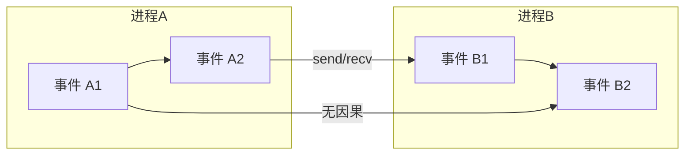
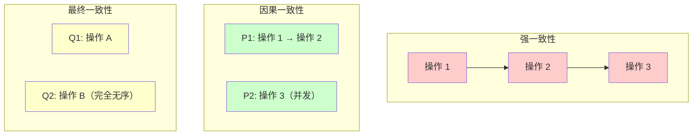
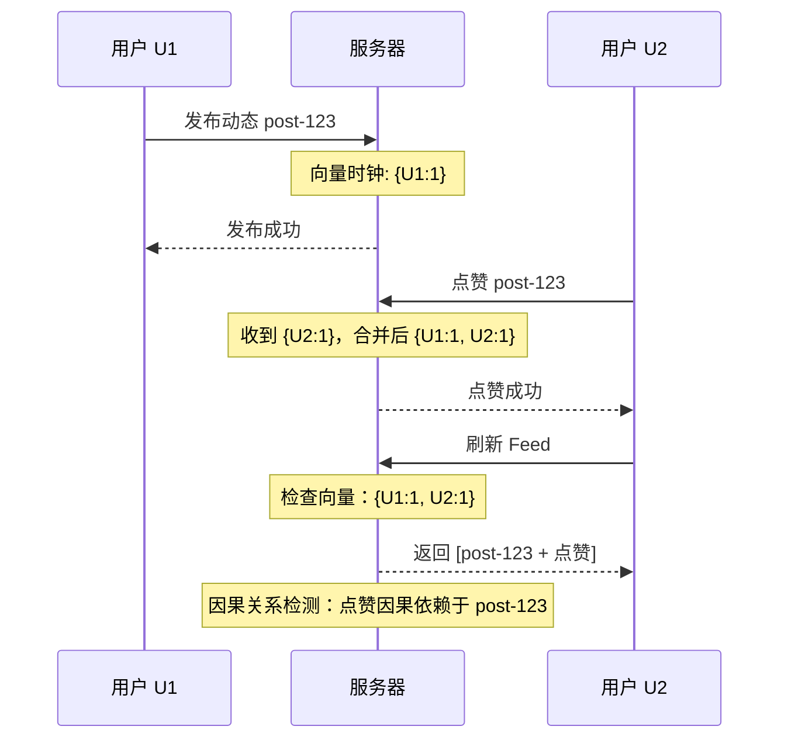
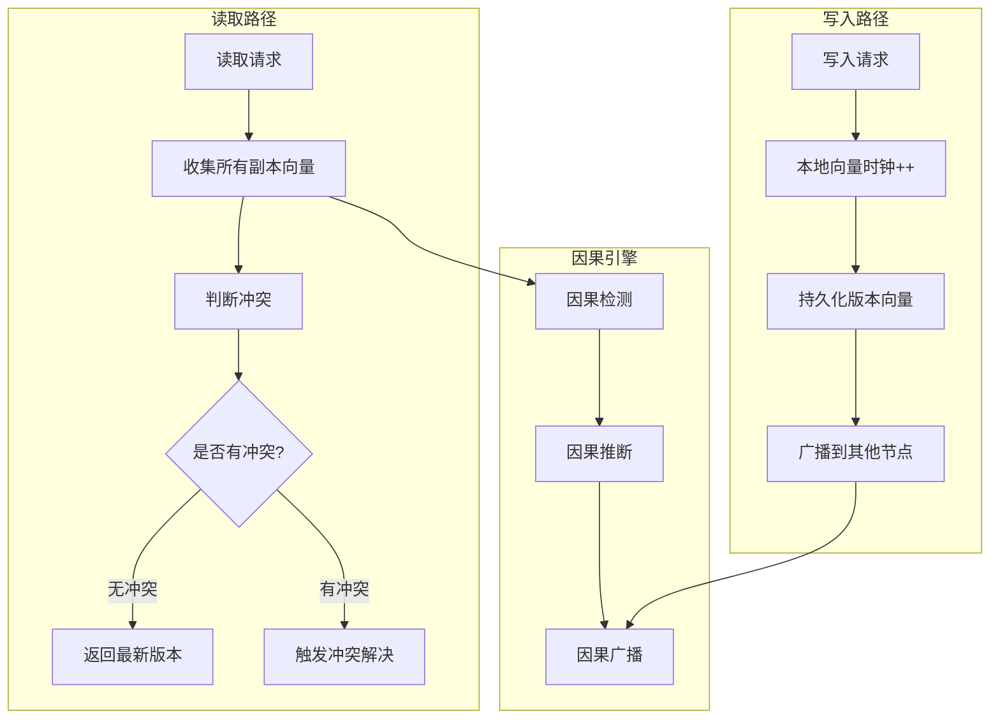

# 因果关系检测

分布式系统中最危险的错误，不是「慢」，而是「乱序」。

用户下单后，库存应该被扣减；如果库存扣减先于下单完成，就会出现「扣了库存但没有订单」的诡异状态。这是因果关系被破坏的结果——**因为 A 才发生 B，但 B 却在 A 之前完成了**。

因果关系是分布式正确性的基石。因果一致性、分布式事务、协作编辑、社交 Feed 排序——这些场景都需要正确处理因果关系。而判断因果关系的能力，来自逻辑时钟。

## happens-before 的形式化

Lamport 在 1978 年定义了 **happens-before** 关系（记作 `→`），这是因果关系的形式化基础：

```
定义：
1. 如果事件 a 和事件 b 在同一进程内，且 a 先于 b 发生，则 a → b
2. 如果进程 P 发送消息 m，进程 Q 接收消息 m，
   则 send(m) → receive(m)
3. 传递性：如果 a → b 且 b → c，则 a → c
```

这三条规则定义了「因果」的边界——只有通过消息传递「传播」的事件才有因果关系。本地事件的先后顺序是因果的，通过网络「传播」的事件也是因果的，但**两个独立进程上的独立事件**——没有消息连接——就没有因果关系。



图中：
- `A1 → A2`（进程内因果）
- `A2 → B1`（消息传递因果）
- `B1 → B2`（进程内因果）
- `A1 → B2`（传递性：`A1 → A2 → B1 → B2`）
- `A2` 与 `B2` **没有直接因果**（虽然通过传递性可以建立）
- `A1` 与 `B2` **有因果**（通过传递链）

## 因果一致性的定义

**因果一致性（Causal Consistency）** 是介于「顺序一致性」和「最终一致性」之间的模型：

> **定义**：所有有因果关系的操作必须按顺序发生；无因果关系的操作可以乱序。

这比顺序一致性（所有操作都有全局顺序）弱，比最终一致性（什么顺序都不保证）强。它的核心价值是：**只在必要时才同步，不必要时允许并发**。



## 因果关系的应用场景

### 场景一：分布式事务

TCC 和 Saga 事务的本质是**人为补偿因果**：操作 A 失败了，要撤销操作 B。系统必须知道 B 是由 A 导致的，否则补偿顺序会乱。

```java
// Saga 事务：补偿顺序必须与执行顺序相反
public class SagaExecutor {

    public void execute(List<Step> steps) {
        List<CompensableStep> completed = new ArrayList<>();

        try {
            for (Step step : steps) {
                step.execute();
                if (step instanceof CompensableStep) {
                    completed.add((CompensableStep) step);
                }
            }
        } catch (Exception e) {
            // 补偿必须逆序：最后完成的先补偿
           补偿失败的操作会破坏因果一致性，需要确保补偿的顺序正确。

### 场景二：版本控制

Git 的分支合并本质上是因果关系处理。两个分支各自独立演进，在合并点需要判断「哪些变更有因果关系，哪些是并发的」。

```java
// Git 合并算法（简化）
public class MergeResult {
    public List<Change> apply(List<Change> base,
                              List<Change> branch1,
                              List<Change> branch2) {
        // 1. 找出共同祖先（base）
        // 2. 对比 branch1 和 base，找出 branch1 的「因果变更」
        // 3. 对比 branch2 和 base，找出 branch2 的「因果变更」
        // 4. 如果两个分支改的是同一个地方 → 冲突
        // 5. 如果改的是不同地方 → 自动合并
    }
}
```

### 场景三：社交 Feed 排序

用户的 Feed 需要按「因果顺序」排列。用户 A 发了一条动态，用户 B 点赞了这条动态，用户 C 看到这条动态时，必须看到 B 的点赞——因为 B 的点赞**因果依赖**于 A 的动态。



## 如何判断因果关系

判断两个事件是否有因果关系，核心工具是**向量时钟**：

| 关系 | 结论 |
|---|---|
| VC(A) `&lt;` VC(B) | B 可能由 A 导致（因果） |
| VC(A) `&gt;` VC(B) | A 可能由 B 导致（因果） |
| VC(A) `‖` VC(B) | 并发，无法判断因果 |

```java
public class CausalityChecker {

    /**
     * 判断事件 B 是否由事件 A 导致
     */
    public boolean isCausedBy(VectorClock clockB, VectorClock clockA) {
        // B 由 A 导致，当且仅当 clockA < clockB
        return VectorRelationTest.compare(clockA.getVector(), clockB.getVector())
                == VectorRelation.BEFORE;
    }

    /**
     * 判断两个事件是否并发（因果无关）
     */
    public boolean isConcurrent(VectorClock clockA, VectorClock clockB) {
        return VectorRelationTest.compare(clockA.getVector(), clockB.getVector())
                == VectorRelation.CONCURRENT;
    }

    /**
     * 判断事件 B 是否发生在事件 A 之后（不要求因果）
     */
    public boolean happensAfter(VectorClock clockA, VectorClock clockB) {
        // 「之后」包括「因果之后」和「并发之后」
        VectorRelation relation = VectorRelationTest.compare(
            clockA.getVector(), clockB.getVector());

        return relation == VectorRelation.BEFORE
            || relation == VectorRelation.EQUAL;
    }
}
```

## 并发事件的处理

当两个事件并发时——`VC(A) `‖` VC(B)`——意味着它们**可能因果无关**。这时需要冲突解决机制。

常见的并发处理策略：

| 策略 | 做法 | 例子 |
|---|---|---|
| **自动合并** | 交集部分保留，并集展示 | Dynamo 的语义合并 |
| **最后写入胜出** | 保留物理时间戳最大的 | Cassandra |
| **用户参与** | 返回多个版本，让用户选择 | Google Docs |
| **报错提示** | 拒绝并发写入，要求重试 | 某些金融系统 |

```java
public class ConcurrentEventHandler {

    public VersionedData handleConcurrent(
            VersionedData local,
            VersionedData remote) {

        // 如果内容相同，自动合并
        if (local.getContent().equals(remote.getContent())) {
            return VersionedData.merge(local, remote);
        }

        // 如果内容不同，需要业务层决策
        // 这里返回 null，表示需要人工介入
        throw new ConcurrentModificationException(
            "Two concurrent versions detected: " + local + " vs " + remote);
    }
}
```

## 因果推断的挑战

在大规模集群中维护完整的因果关系开销很大。常见挑战：

### 挑战一：向量时钟膨胀

当节点频繁加入离开时，版本向量会不断增长。每个版本都需要存储完整的向量，空间开销 `O(N)`。

**解法**：定期压缩版本向量，只保留「活跃」节点的信息。但这可能导致因果精度下降。

### 挑战二：因果推断的延迟

要准确判断因果关系，需要等待足够的消息汇聚。比如节点 A 发送消息给 B，B 又发送消息给 C，要确定「C 的操作是否因果依赖 A」，需要等到 C 收到 B 的消息。

**解法**：使用「乐观因果」——假设大多数情况下因果关系是存在的，在检测到冲突时再回退。

### 挑战三：跨数据中心因果

在多数据中心部署中，消息延迟可能是几十毫秒甚至秒级。因果推断需要等待这些延迟，影响实时性。

**解法**：使用 HLC（混合逻辑时钟）——在保证因果的前提下，尽量使用物理时间。

## 因果追踪的架构图



## 权衡矩阵

| 特性 | 无因果保障 | 因果一致性 | 强一致性 |
|---|---|---|
| 性能 | 最高 | 中等 | 较低 |
| 实现复杂度 | 低 | 高 | 最高 |
| 延迟 | 低 | 中等 | 高 |
| 适用场景 | 非关键数据 | 大多数业务场景 | 金融交易 |
| 冲突频率 | 需业务处理 | 较低 | 无 |

## 术语表

| 术语 | 英文 | 定义 |
|---|---|---|
| happens-before | happens-before | 表示事件 A 在时间或因果上先于事件 B 发生 |
| 因果一致性 | causal consistency | 有因果关系的操作必须按顺序发生的一致性模型 |
| 因果依赖 | causal dependency | 一个事件由另一个事件导致的关系 |
| 并发事件 | concurrent event | 两个既无因果依赖的事件 |
| 冲突解决 | conflict resolution | 处理并发写入冲突的机制 |

## 延伸思考

因果关系是分布式系统正确性的「底层协议」。无论是分布式事务的补偿顺序、社交 Feed 的正确排序，还是协作编辑的变更合并，都依赖因果关系的正确判断。

但因果追踪是有代价的：空间开销、时间延迟、实现复杂度。选择因果一致性意味着接受这些代价。如果你的业务对「正确性」要求极高（如金融交易），这个代价值得；如果只是「一般业务数据」，可能最终一致性就够用了。

下一篇文章会讲 **Dynamo 中的向量时钟实践**，看看 Amazon 是如何在大规模生产系统中实现因果追踪的。
