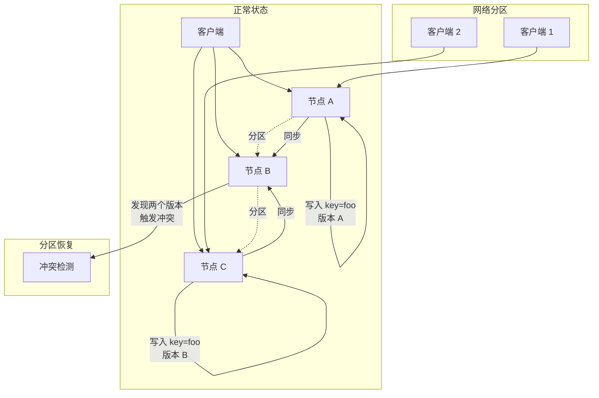
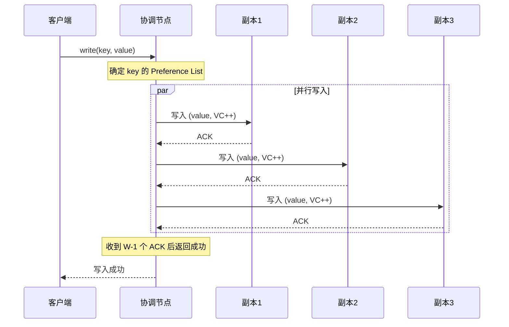

# Dynamo 中的向量时钟实践

2007 年，Amazon 发表了 Dynamo 论文。这篇论文奠定了现代最终一致性数据库的基石——它告诉整个行业：**在高可用和强一致性之间，你必须做出选择**。

Dynamo 选择高可用，代价是**数据冲突不可避免**。而解决冲突的核心武器，就是**向量时钟**。

这篇文档深入解析 Dynamo 中向量时钟的实现方式、冲突检测与解决机制，以及实践中遇到的问题和解决方案。

## Dynamo 的冲突场景

Dynamo 是一个「永远可写」的 KV 存储——即使发生网络分区，每个节点仍然可以接受写入。代价是：当分区恢复时，多个节点可能对同一个 key 有不同的值。



图中展示了一个典型的冲突场景：
1. 正常情况下，三个节点协同服务
2. 网络分区后，客户端 1 只能写 A，客户端 2 只能写 C
3. 分区恢复后，B 节点发现「同一个 key 有两个不同版本」，触发冲突

## 向量时钟在 Dynamo 中的应用

Dynamo 的每个数据项携带一个向量时钟。写入流程：

1. 客户端读取数据，获取当前版本向量 `VC`
2. 客户端发起写入，携带 `VC' = increment(VC, currentNode)`
3. 所有副本更新自己的版本向量

```java
public class DynamoData {
    private String key;
    private String value;
    private VectorClock clock;

    // 写入：增加当前节点的版本
    public DynamoData write(String newValue, String nodeId) {
        VectorClock newClock = clock.copy();
        newClock.increment(nodeId);
        return new DynamoData(key, newValue, newClock);
    }

    // 读取：收集所有副本的向量，返回给客户端
    public static class ReadResponse {
        public String value;
        public VectorClock clock;
        public List<Version> versions;  // 所有冲突版本
    }
}
```

读取流程更复杂：

```java
public class DynamoStore {

    /**
     * Dynamo 的读操作（带冲突检测）
     *
     * @param key 要读取的 key
     * @return 读取结果，包含所有检测到的冲突版本
     */
    public ReadResponse read(String key) {
        // 1. 从 N 个副本中读取数据
        List<DynamoData> replicas = readFromReplicas(key);

        // 2. 收集所有副本的向量时钟
        List<VectorClock> clocks = replicas.stream()
            .map(DynamoData::getClock)
            .collect(Collectors.toList());

        // 3. 合并向量时钟
        VectorClock mergedClock = mergeAll(clocks);

        // 4. 判断是否有冲突
        List<DynamoData> conflicting = findConflicting(replicas, mergedClock);

        if (conflicting.size() > 1) {
            // 有冲突，返回所有冲突版本给客户端
            return new ReadResponse(
                conflicting.get(0).getValue(),  // 任意一个作为默认值
                mergedClock,
                conflicting
            );
        }

        // 无冲突，返回最新版本
        return new ReadResponse(
            conflicting.get(0).getValue(),
            mergedClock,
            Collections.emptyList()
        );
    }

    /**
     * 查找冲突版本：如果某个版本无法被其他版本「覆盖」，就是冲突的
     */
    private List<DynamoData> findConflicting(
            List<DynamoData> replicas,
            VectorClock merged) {

        return replicas.stream()
            .filter(r -> isUncovered(r.getClock(), replicas))
            .collect(Collectors.toList());
    }

    /**
     * 判断某个向量时钟是否被「覆盖」
     * 如果存在另一个版本 >= 当前版本，则当前版本被覆盖
     */
    private boolean isUncovered(VectorClock vc, List<DynamoData> replicas) {
        for (DynamoData replica : replicas) {
            if (replica.getClock().dominates(vc)) {
                return false;  // 被覆盖，不是冲突
            }
        }
        return true;  // 没被覆盖，是冲突
    }
}
```

## 冲突判断：Syntactic vs Semantic Reconciliation

Dynamo 论文区分了两种冲突解决策略：

### Syntactic Reconciliation（语法协调）

顾名思义，系统根据向量时钟的「语法」自动判断哪个版本「更新」。

**规则**：如果 `VC1 `<` VC2`，则 VC2 覆盖 VC1；如果两个版本并发（`VC1 `‖` VC2`），则两个版本都保留。

```java
public class SyntacticReconciler {

    /**
     * 语法协调：返回所有「未被覆盖」的版本
     */
    public List<DynamoData> reconcile(List<DynamoData> versions) {
        List<DynamoData> result = new ArrayList<>();

        for (DynamoData candidate : versions) {
            boolean isCovered = false;

            for (DynamoData other : versions) {
                if (other != candidate
                    && VectorRelationTest.compare(other.getClock(), candidate.getClock())
                       == VectorRelation.BEFORE) {
                    isCovered = true;
                    break;
                }
            }

            if (!isCovered) {
                result.add(candidate);
            }
        }

        return result;
    }
}
```

### Semantic Reconciliation（语义协调）

当语法协调无法解决时（如两个版本都未被覆盖，且内容不同），需要业务层介入。

Dynamo 的建议是**让客户端决定**——返回所有冲突版本给客户端，客户端根据业务逻辑合并。

> **真实案例**：Amazon 购物车的语义协调。
> 当购物车内容冲突时（两个客户端同时添加了不同的商品），Dynamo 无法自动合并。购物车应用返回两个版本给用户，让用户决定保留哪个。
> 这个设计后来成为 Dynamo 的标志性案例。

```java
public class ShoppingCartService {

    /**
     * 购物车的语义协调
     * 购物车冲突 = 两个客户端同时修改了购物车
     * 正确做法：合并两个购物车的商品列表
     */
    public ShoppingCart semanticMerge(
            ShoppingCart version1,
            ShoppingCart version2) {

        Set<Item> mergedItems = new HashSet<>();
        mergedItems.addAll(version1.getItems());
        mergedItems.addAll(version2.getItems());

        return new ShoppingCart(mergedItems);
    }
}
```

## 向量时钟膨胀问题

Dynamo 论文承认了一个实践中的问题：**向量时钟会膨胀**。

当一个 key 被大量不同的节点写入过时，它的向量时钟会变得很大。这在以下场景尤为严重：

- 节点频繁加入离开
- 负载均衡导致写入分散到不同节点
- 长期运行的 key 有很多历史版本

Dynamo 的论文提到，他们后来采用了 **Simple Versioning** 策略——**不再保留完整的向量时钟历史**，而是：

1. 当向量时钟维度超过某个阈值（如 10 个节点）时，丢弃最早的版本
2. 只保留「最近几次更新」的信息

```java
public class CompactingVectorClock implements VectorClock {

    private static final int MAX_DIMENSIONS = 10;

    private final Map<String, Long> versions;

    @Override
    public void increment(String nodeId) {
        versions.merge(nodeId, 1L, Long::sum);
        compactIfNeeded();
    }

    private void compactIfNeeded() {
        if (versions.size() > MAX_DIMENSIONS) {
            // 找到版本号最小的维度删除
            String minKey = versions.entrySet().stream()
                .min(Map.Entry.comparingByValue())
                .map(Map.Entry::getKey)
                .orElseThrow();

            versions.remove(minKey);
        }
    }
}
```

:::warning 压缩的代价
压缩版本向量意味着因果信息的丢失。如果删除了某个节点的历史版本，之后的冲突判断可能不准确。这是「空间换因果精度」的典型权衡。
:::

## Dynamo vs Cassandra

Dynamo 和 Cassandra 都是「Dynamo 风格」的最终一致性存储，但它们的冲突解决策略有所不同：

| 维度 | Dynamo | Cassandra |
|---|---|---|
| 冲突检测 | 向量时钟 | 时间戳 |
| 冲突解决 | 客户端合并 / LWW | LWW（物理时间戳） |
| 多版本保留 | 是 | 否 |
| 优点 | 可保留所有历史 | 实现简单 |
| 缺点 | 客户端复杂 | 无法支持语义合并 |

Cassandra 选择 LWW 的原因是**实现简单**——不需要返回多个版本给客户端。但如果两个写入恰好并发（时钟漂移导致时间戳不可靠），LWW 可能导致数据丢失。

Dynamo 选择向量时钟的原因是**保留所有可能性**——让客户端决定如何合并。但这对客户端开发者提出了更高的要求。

```java
// Cassandra 的 LWW 冲突解决（内置）
public class CassandraLWWStrategy {

    public static ByteBuffer resolve(List<Column> versions) {
        // 找到时间戳最大的版本
        Column latest = versions.stream()
            .max(Comparator.comparingLong(Column::getTimestamp))
            .orElseThrow();

        return latest.getValue();
    }
}
```

## Dynamo 的写入路径

Dynamo 的写入不是简单的「覆盖」，而是「追加新版本」：



关键点：
- 写入时，**不需要等所有 N 个副本完成**，只需要 W-1 个
- 读取时，**不需要查所有 N 个副本**，只需要 R 个
- 只要 `W + R > N`，就能保证「读写会至少在一个副本上重叠」，从而检测到冲突

## 权衡矩阵

| 特性 | Dynamo 向量时钟 | Cassandra 时间戳 | ZooKeeper ZAB |
|---|---|---|---|
| 冲突检测 | ✅ 向量比较 | ❌ 时间戳比较 | ✅ 全序广播 |
| 多版本保留 | ✅ 支持 | ❌ 不支持 | ❌ 不支持 |
| 客户端复杂度 | 高 | 低 | 低 |
| 实现复杂度 | 高 | 低 | 高 |
| 适用场景 | 协作编辑、购物车 | 日志、计数器 | 配置管理、元数据 |
| 一致性保证 | 最终一致 | 最终一致 | 强一致 |

## 术语表

| 术语 | 英文 | 定义 |
|---|---|---|
| Dynamo | Amazon Dynamo | Amazon 开发的高可用 KV 存储系统 |
| Preference List | Preference List | 负责存储某个 key 的节点列表 |
| Syntactic Reconciliation | 语法协调 | 根据向量时钟语法自动解决冲突 |
| Semantic Reconciliation | 语义协调 | 根据业务逻辑解决冲突 |
| Simple Versioning | 简单版本 | 简化版向量时钟，控制维度数量 |
| 向量时钟膨胀 | vector clock explosion | 向量维度随节点增加而膨胀的问题 |

## 延伸思考

Dynamo 的向量时钟实践揭示了一个重要的工程哲学：**没有完美的解决方案，只有权衡**。

向量时钟能精确检测冲突，但代价是空间开销和实现复杂度。LWW 实现简单，但可能丢失并发写入。选择哪种方案，取决于业务对「正确性」的要求。

Dynamo 的另一个教训是：**把复杂性推给客户端**。这让 Dynamo 本身很简单（只是读写数据），但把「如何合并冲突」的复杂性推给了应用开发者。这是一种合理的设计选择，但不是所有团队都有能力承担这种复杂性。

下一篇文章会讲**逻辑时钟 vs 物理时钟**，看看在不同场景下应该如何选择时钟系统。
