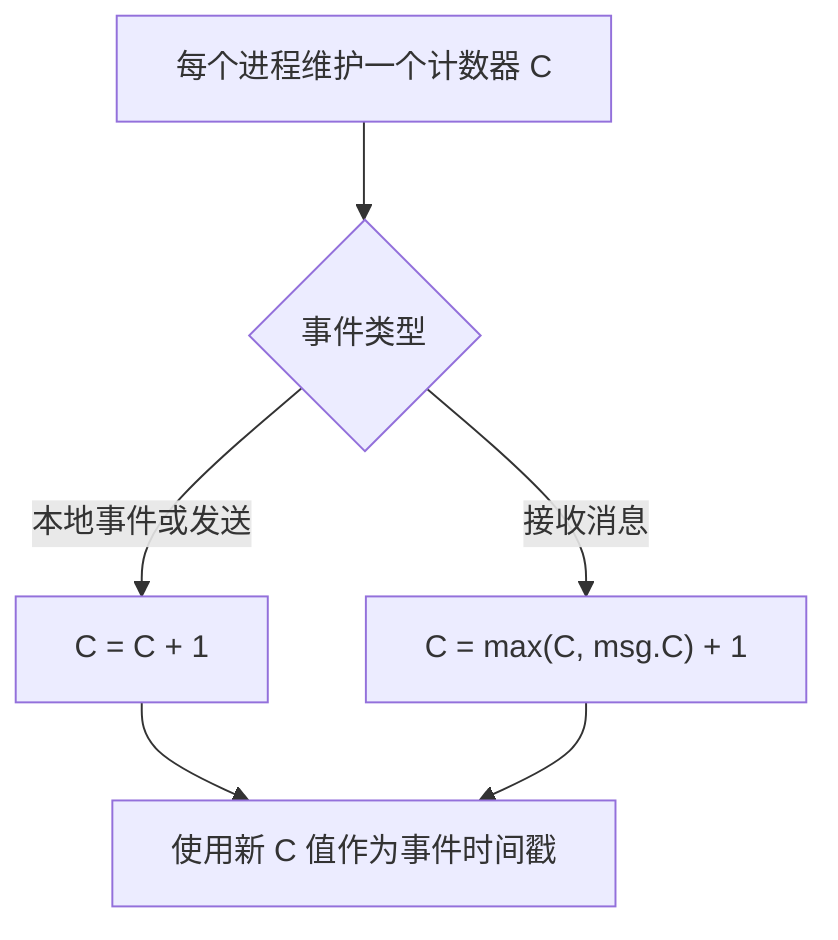
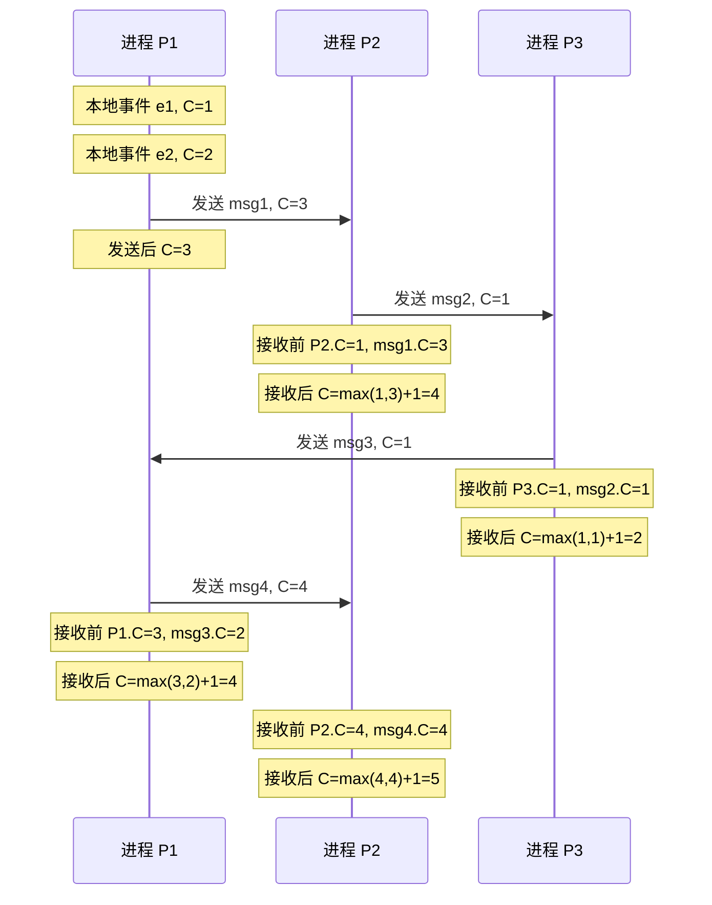

# Lamport 逻辑时钟

凌晨两点，你在线上环境排查一个分布式事务问题：服务 A 调用服务 B，服务 B 又调用服务 C。但日志里显示，C 执行完了，B 才开始执行。你想搞清楚这个调用链的因果关系，却发现三台服务器的时钟完全不同步——A 比 B 快 50ms，B 比 C 慢 30ms。用物理时钟判断「谁先谁后」，已经不可行了。

这就是分布式系统的核心困境：**没有全局时钟**。Lamport 在 1978 年的论文《Time, Clocks, and the Ordering of Events in a Distributed System》中给出了答案——用事件顺序本身来定义时间，而不是反过来。

## happens-before 关系

Lamport 提出的 **happens-before** 关系（记作 `→`）是逻辑时钟的基石。它有两种情况：

1. **本地顺序**：在同一进程内，事件 A 先于事件 B 发生，则 `A → B`
2. **消息传递**：进程 P 发送消息 m，进程 Q 接收消息 m，则 `send(m) → receive(m)`

happens-before 关系具有**传递性**：`A → B` 且 `B → C`，则 `A → C`。

但注意：`A → B` **不意味着** `B → A` 一定成立。如果两个事件既没有本地顺序，也没有消息传递关系，它们就是**并发**的（记作 `A ‖ B`）。

:::info 并发的精确定义
很多资料说「两个事件不能比较先后就是并发」，这个说法不够精确。严格来说：**如果既不能推出 `A → B`，也不能推出 `B → A`，则 A 和 B 并发**。这意味着它们之间没有因果关系。
:::

## Lamport 时间戳的核心规则

Lamport 时钟的实现非常简单，只有两条规则：



**规则一：本地事件与发送消息**
每个进程维护一个本地计数器 `C`。发生本地事件或发送消息时，`C++`，并将 `C` 作为该事件的时间戳，随消息一起发送。

**规则二：接收消息**
收到消息时，取 `max(本地C, 消息携带的C) + 1` 作为新的本地 `C`，再将新 `C` 作为接收事件的时间戳。

```java
public class LamportClock {
    private int counter;
    private final int processId;

    public LamportClock(int processId) {
        this.counter = 0;
        this.processId = processId;
    }

    // 本地事件：计数器自增
    public int tick() {
        counter++;
        return counter;
    }

    // 发送消息：自增后发送
    public int send() {
        counter++;
        return counter;
    }

    // 接收消息：取 max 后自增
    public int receive(int receivedCounter) {
        counter = Math.max(counter, receivedCounter) + 1;
        return counter;
    }

    public int getCounter() {
        return counter;
    }
}
```

## 偏序与全序

Lamport 时钟满足一个关键性质：**如果 `A → B`，则 `L(A) < L(B)`**。

换句话说，happens-before 关系可以推导出时间戳的大小关系。但**反过来不成立**：`L(A) < L(B)` **不意味着** `A → B`。

这就引出了**偏序（Partial Order）** 与**全序（Total Order）** 的区别：

| 概念 | 定义 | 说明 |
|---|---|---|
| 偏序 | 部分事件可比，部分事件不可比 | Lamport 时钟只能比较有 happens-before 关系的事件 |
| 全序 | 任意两个事件都可比 | 需要额外的 tie-breaking 机制（如进程 ID） |

Lamport 提出的全序方法：**`(时间戳, 进程ID)` 元组**。时间戳相同时，用进程 ID 打破平局。这样就能为所有事件建立一个「看起来合理」的全局顺序。

```java
public class LamportTimestamp implements Comparable<LamportTimestamp> {
    private final int clock;
    private final int processId;

    public LamportTimestamp(int clock, int processId) {
        this.clock = clock;
        this.processId = processId;
    }

    @Override
    public int compareTo(LamportTimestamp other) {
        if (this.clock != other.clock) {
            return Integer.compare(this.clock, other.clock);
        }
        // 时间戳相同时，用进程 ID 打破平局
        return Integer.compare(this.processId, other.processId);
    }
}
```

:::warning 全序的代价
全序虽然让所有事件都能比较，但它**不保证因果性**。两个因果无关的事件可能被排成任意顺序，这有时会导致意想不到的行为。比如 Paxos 用全序广播来保证一致性，但它依赖的是「多数派」来兜底。
:::

## 事件序列图解

下面用时序图展示三个进程的事件序列与时间戳变化：



从这个序列图可以看出：
- 事件 `e1 → e2 → msg1_send`（P1 内部顺序）
- `msg1_send → msg1_receive`（消息传递）
- P2 收到 `msg1` 后，时间戳从 1 跳到 4（因为 `max(1, 3) + 1 = 4`）

## Lamport 时钟的局限性

Lamport 时钟的核心价值是**保证因果顺序**：如果 `A → B`，则 `L(A) < L(B)`。但它**不能判断两个事件是否并发**。

假设有两个事件：
- 事件 X 的时间戳是 10
- 事件 Y 的时间戳是 20

我们只知道 `L(X) < L(Y)`，但**不知道 X 和 Y 是否有因果关系**。可能是 `X → Y`，也可能它们根本毫无关系，只是碰巧 X 先发生。

这在某些场景下是**够用的**（比如进程内事件全序），但在检测**数据冲突**时，就不够用了。检测冲突需要知道「我的写入和你的写入是否并发」——这正是向量时钟要解决的问题。

:::tip 什么时候用 Lamport 时钟
- 需要为所有事件建立全序（比如 Paxos 的全序广播）
- 不需要检测并发，只需要保证因果顺序的场景
- 作为更复杂时钟系统的基础组件
:::

## 权衡矩阵

| 特性 | Lamport 时钟 | 向量时钟 |
|---|---|---|
| 空间复杂度 | `O(1)`（单节点） | `O(N)`（N 为节点数） |
| 判断 `A → B` | ✅ 可以 | ✅ 可以 |
| 判断 `A ‖ B`（并发） | ❌ 不可以 | ✅ 可以 |
| 因果追踪能力 | 弱 | 强 |
| 适用场景 | 全序广播、Paxos | 冲突检测、Dynamo、Cassandra |

## 术语表

| 术语 | 英文 | 定义 |
|---|---|---|
| happens-before | happens-before | 表示事件 A 在时间上先于事件 B 发生的关系 |
| 偏序 | partial order | 部分元素可比，部分元素不可比的关系 |
| 全序 | total order | 任意两个元素都可比的关系 |
| Lamport 时间戳 | Lamport timestamp | Lamport 时钟产生的逻辑时间值 |
| tie-breaking | tie-breaking | 时间戳相同时用额外信息打破平局 |
| 并发 | concurrent | 两个事件既无 happens-before 关系，也无反向关系 |

## 延伸思考

Lamport 时钟解决了「如何给事件排序」的问题，但没有解决「如何知道两个事件是否有因果关系」的问题。

如果你的系统需要检测「我的写入和你的写入是否冲突」——比如 DynamoDB 的多副本写入——那你需要向量时钟。但如果你只需要为所有操作建立一个全局顺序（像 Paxos 那样），Lamport 时钟就够了。

**没有最好的时钟系统，只有最适合场景的时钟系统。**
