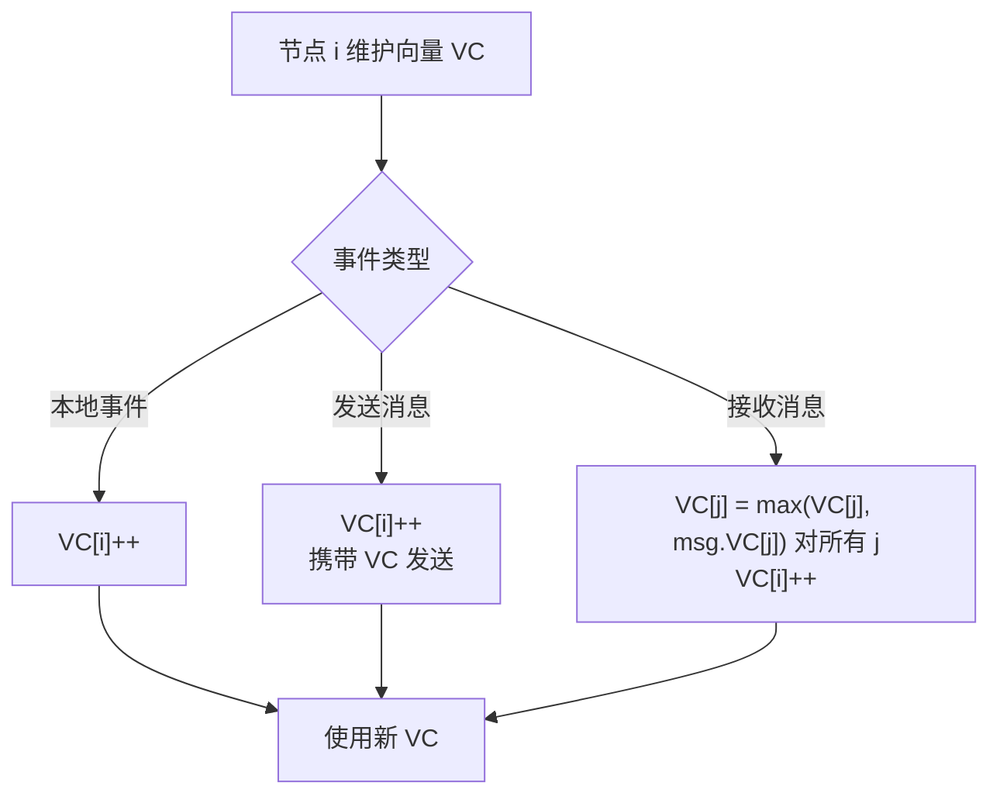
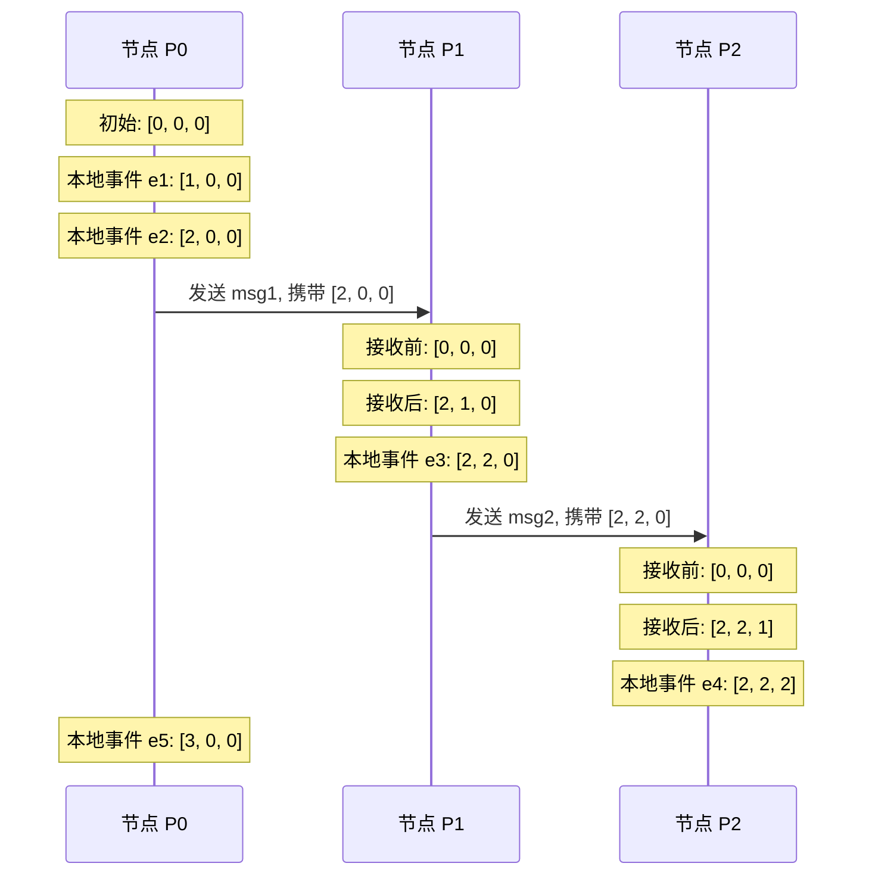

# 向量时钟原理

Lamport 时钟告诉你：`L(A) < L(B)` 意味着 A 在 B 之前。但它无法回答这个问题：**如果 `L(A) < L(B)`，A 和 B 真的有因果关系吗？**

答案是：不一定。`L(A) < L(B)` 可能是因为：
1. A 真的导致了 B（`A → B`）
2. A 和 B 毫无关系，只是碰巧 A 先发生

在分布式系统中，这个区别至关重要。想象 DynamoDB 的场景：三个副本各自独立写入数据，你要判断「这些写入是冲突的还是可以自动合并的」。仅靠 Lamport 时钟，你什么都判断不了。

**向量时钟（Vector Clock）** 解决了这个问题。它不仅能判断事件先后，还能判断两个事件是否**并发**——这让它成为检测数据冲突的利器。

## 向量时钟的核心思想

Lamport 时钟是**一个数字**，向量时钟是**一个 N 维向量**（N = 节点数）。

假设系统有 3 个节点，每个节点维护一个向量：

```
节点 0 的向量时钟: [VC0, VC1, VC2]
节点 1 的向量时钟: [VC0, VC1, VC2]
节点 2 的向量时钟: [VC0, VC1, VC2]
```

- `VC0` 表示「节点 0 感知到的逻辑时间」
- `VC1` 表示「节点 1 感知到的逻辑时间」
- `VC2` 表示「节点 2 感知到的逻辑时间」

向量的含义是：**每个节点记录的不只是自己的逻辑时间，而是所有节点的逻辑时间**。

## 向量时钟的更新规则



**规则一：本地事件**
节点 i 发生本地事件时，`VC[i]++`。

**规则二：发送消息**
节点 i 发送消息时，`VC[i]++`，然后将完整向量 `VC` 附加到消息中。

**规则三：接收消息**
节点 i 从节点 j 收到消息时，对向量的每个维度取 `max`：
```
for each k: VC[k] = max(VC[k], msg.VC[k])
VC[i]++
```

```java
public class VectorClock {
    // vector[0] = 节点 0 的逻辑时间
    // vector[1] = 节点 1 的逻辑时间
    // ...
    private final long[] vector;
    private final int nodeId;

    public VectorClock(int nodeId, int totalNodes) {
        this.nodeId = nodeId;
        this.vector = new long[totalNodes];
    }

    // 本地事件：当前节点逻辑时间++
    public void increment() {
        vector[nodeId]++;
    }

    // 发送消息：自增后返回副本
    public VectorClock send() {
        vector[nodeId]++;
        return copy();
    }

    // 接收消息：merge 后自增
    public void receive(VectorClock received) {
        for (int i = 0; i < vector.length; i++) {
            vector[i] = Math.max(vector[i], received.vector[i]);
        }
        vector[nodeId]++;
    }

    // 返回副本（发送时使用）
    private VectorClock copy() {
        VectorClock result = new VectorClock(nodeId, vector.length);
        System.arraycopy(vector, 0, result.vector, 0, vector.length);
        return result;
    }

    public long[] getVector() {
        return vector.clone();
    }

    @Override
    public String toString() {
        return Arrays.toString(vector);
    }
}
```

## 向量比较三规则

向量时钟的核心能力是**比较两个向量**。给定两个向量 VC 和 VD，有三种关系：

| 关系 | 定义 | 含义 |
|---|---|---|
| VC `&lt;` VD | VC[k] `&lt;=` VD[k] 对所有 k 成立，**且至少一个** `&lt;` | D 可能由 A 导致（因果） |
| VC `&gt;` VD | VC[k] `&gt;=` VD[k] 对所有 k 成立，**且至少一个** `&gt;` | A 可能由 D 导致（因果） |
| VC `‖` VD | 既不 `&lt;` 也不 `&gt;` | 并发（可能因果无关） |

:::info 并发的判断
如果两个向量「分叉」了——你有的我也在涨，我有的你也在涨——那它们就是并发的。这正是检测数据冲突的关键。
:::

```java
public enum VectorRelation {
    BEFORE,    // VC < VD
    AFTER,     // VC > VD
    EQUAL,     // VC == VD
    CONCURRENT // VC || VD
}

public class VectorRelationTest {

    /**
     * 比较两个向量时钟的关系
     *
     * @param vc 向量 A
     * @param vd 向量 B
     * @return 两者的关系
     */
    public static VectorRelation compare(long[] vc, long[] vd) {
        if (vc.length != vd.length) {
            throw new IllegalArgumentException("向量长度必须一致");
        }

        boolean allLessOrEqual = true;
        boolean allGreaterOrEqual = true;
        boolean hasStrictLess = false;
        boolean hasStrictGreater = false;

        for (int i = 0; i < vc.length; i++) {
            if (vc[i] < vd[i]) {
                allGreaterOrEqual = false;
                hasStrictLess = true;
            }
            if (vc[i] > vd[i]) {
                allLessOrEqual = false;
                hasStrictGreater = true;
            }
        }

        if (!hasStrictLess && !hasStrictGreater) {
            return VectorRelation.EQUAL;
        }
        if (allLessOrEqual && hasStrictLess) {
            return VectorRelation.BEFORE;  // VC < VD
        }
        if (allGreaterOrEqual && hasStrictGreater) {
            return VectorRelation.AFTER;   // VC > VD
        }
        return VectorRelation.CONCURRENT; // 并发
    }
}
```

## 用时序图理解向量时钟



关键观察：
- 节点 P1 收到 P0 的消息后，`VC[0]` 从 0 跳到 2——P1 知道了 P0 已经发生了 2 个事件
- P0 和 P1 的向量在演化过程中逐渐同步信息

## 偏序 vs 全序的再次理解

有了向量时钟，我们可以精确判断因果关系：

- `VC `&lt;` VD` → D 一定由 A 导致（因果）
- `VC `&gt;` VD` → A 一定由 D 导致（因果）
- `VC `‖` VD` → 并发，无法判断因果

但向量时钟给出的是**偏序**：如果两个事件并发（分叉），它们无法比较。这是有意为之——强行给并发事件排序，反而会丢失信息。

## Lamport 时钟 vs 向量时钟

| 维度 | Lamport 时钟 | 向量时钟 |
|---|---|---|
| 数据结构 | 单一整数 | N 维向量 |
| `A → B` 能推出 | `L(A) &lt; L(B)` | `VC `&lt;` VD` |
| `L(A) &lt; L(B)` 能推出 | **什么也推不出** | `A → B`（因果） |
| 能检测并发吗 | ❌ 不能 | ✅ 能 |
| 空间开销 | `O(1)` | `O(N)` |
| 代表系统 | Paxos | DynamoDB、Cassandra、Riak |

关键区别在于：**Lamport 时钟只知道「事件 A 在某个事件之后」，向量时钟知道「事件 A 之后还有哪些事件发生」**。

## 权衡矩阵

| 特性 | Lamport 时钟 | 向量时钟 |
|---|---|---|
| 空间复杂度 | `O(1)` | `O(N)` |
| 时间复杂度 | `O(1)` | `O(N)`（比较时） |
| 因果追踪 | ❌ 无法判断并发 | ✅ 可判断因果 |
| 冲突检测 | ❌ 不支持 | ✅ 支持 |
| 适用场景 | 全序广播 | 最终一致性存储、协作编辑 |

向量时钟的空间开销 `O(N)` 是真实代价。当节点数达到成百上千时，每个向量会变得很大。这催生了**版本向量（Version Vector）**——向量时钟在数据库领域的简化版本，只记录「有变化」的维度。

## 术语表

| 术语 | 英文 | 定义 |
|---|---|---|
| 向量时钟 | vector clock | 每个节点维护 N 维向量的逻辑时钟 |
| 偏序 | partial order | 部分元素可比，部分元素不可比的关系 |
| 并发 | concurrent | 两个向量时钟无法比较（既不 `<` 也不 `>`） |
| 因果依赖 | causal dependency | 一个事件由另一个事件导致的关系 |
| 向量融合 | vector merge | 收到消息时对各维度取 max 的操作 |

## 延伸思考

向量时钟的代价是空间。当你需要追踪成百上千个节点时，每个向量会变得很大。Dynamo 的论文提到，他们用向量时钟的「简化版本」来缓解这个问题。

但简化版向量时钟会牺牲一些能力：比如无法精确追踪完整的因果链，只能追踪「最近几个版本的分支」。这是典型的**时空权衡**——你想追踪更多因果关系，就要付出更多空间；你想节省空间，就要接受因果追踪能力的退化。

下一篇文章会讲**版本向量**，它正是向量时钟在 Dynamo、Cassandra 中的实际应用形式。
