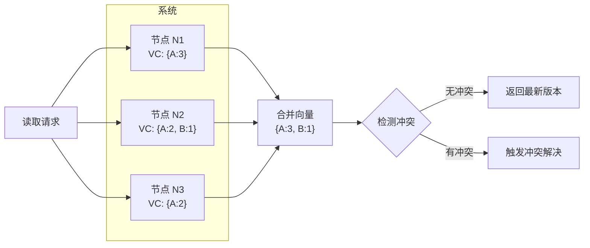

# 版本向量

DynamoDB 在 2007 年的论文里写道：「向量时钟被用来追踪同一数据的不同版本之间的因果关系。」但实现 Dynamo 的人很快发现一个问题：**全量向量时钟太贵了**。

当一个 key 被几十个节点写入过，这个 key 的向量时钟就有几十维。每个版本的存储成本都很高。这在存储成本敏感的系统中是不可接受的。

于是，**版本向量（Version Vector）** 诞生了。它是向量时钟的实用化版本——**只记录「有变化」的维度**，而不是每个节点都记录。

## 版本向量 vs 向量时钟

向量时钟的哲学是：**我要知道所有节点在什么时候发生了什么**。

版本向量的哲学是：**我只需要知道「谁更新了这条数据，以及更新了多少次」**。

| 维度 | 向量时钟 | 版本向量 |
|---|---|---|
| 记录内容 | 所有节点的逻辑时间 | 只记录「参与过更新的节点」 |
| 向量维度 | 固定 N（N = 节点数） | 动态（取决于谁更新过） |
| 典型应用 | 理论研究 | DynamoDB、Cassandra、Riak |
| 存储优化 | 无 | 只记录变化的维度 |

版本向量本质上是一个**计数器 map**：key 是节点 ID，value 是该节点的逻辑版本号。

```java
public class VersionVector {
    // 只记录「有变化」的节点
    // 比如 { nodeA: 3, nodeB: 1 } 表示 nodeA 更新了 3 次，nodeB 更新了 1 次
    private final Map<String, Long> versions;

    public VersionVector() {
        this.versions = new HashMap<>();
    }

    public VersionVector(Map<String, Long> versions) {
        this.versions = new HashMap<>(versions);
    }

    // 本地更新
    public void increment(String nodeId) {
        versions.merge(nodeId, 1L, Long::sum);
    }

    // 获取某个节点的版本
    public long getVersion(String nodeId) {
        return versions.getOrDefault(nodeId, 0L);
    }

    // 合并两个版本向量（收到远端版本时调用）
    public void merge(VersionVector other) {
        for (Map.Entry<String, Long> entry : other.versions.entrySet()) {
            versions.merge(entry.getKey(), entry.getValue(), Math::max);
        }
    }

    // 复制
    public VersionVector copy() {
        return new VersionVector(new HashMap<>(versions));
    }

    @Override
    public String toString() {
        return versions.toString();
    }
}
```

## Dynamo/Cassandra 中的版本向量

Dynamo 论文中，每个数据项携带一个版本向量。当数据被更新时：
1. 更新节点增加自己维度的版本号
2. 新版本带上更新后的向量
3. 读取时，收集所有副本的版本向量，判断是否有冲突



## 版本冲突检测

两个版本是否有冲突？答案是：**如果两个版本向量无法比较，就是冲突的**。

比较规则和向量时钟一样：
- `VV1 `&lt;` VV2` → VV2 由 VV1 导致，无冲突
- `VV1 `&gt;` VV2` → VV1 由 VV2 导致，无冲突
- `VV1 `‖` VV2` → **并发，冲突**

```java
public enum ConflictStatus {
    NO_CONFLICT,   // 可以自动合并
    CONFLICT       // 需要冲突解决
}

public class ConflictDetector {

    public static ConflictStatus detect(VersionVector local, VersionVector remote) {
        VectorRelation relation = compare(local, remote);

        switch (relation) {
            case BEFORE:  // 本地版本更旧，无冲突
            case AFTER:   // 本地版本更新，无冲突
            case EQUAL:   // 完全一致，无冲突
                return ConflictStatus.NO_CONFLICT;
            case CONCURRENT: // 并发，冲突
                return ConflictStatus.CONFLICT;
            default:
                throw new IllegalStateException("Unexpected relation");
        }
    }

    private static VectorRelation compare(VersionVector a, VersionVector b) {
        Map<String, Long> va = a.getVersions();
        Map<String, Long> vb = b.getVersions();

        boolean aBeforeb = true;
        boolean aAfterb = true;

        // 检查 a 是否 <= b 的所有键
        for (Map.Entry<String, Long> entry : va.entrySet()) {
            long bVersion = vb.getOrDefault(entry.getKey(), 0L);
            if (entry.getValue() > bVersion) {
                aBeforeb = false;
            }
            if (entry.getValue() < bVersion) {
                aAfterb = false;
            }
        }

        // 检查 b 是否有 a 没有的键
        for (Map.Entry<String, Long> entry : vb.entrySet()) {
            if (!va.containsKey(entry.getKey())) {
                aBeforeb = false;
            }
            long aVersion = va.getOrDefault(entry.getKey(), 0L);
            if (entry.getValue() < aVersion) {
                aAfterb = false;
            }
            if (entry.getValue() > aVersion) {
                aBeforeb = false;
            }
        }

        boolean aStrictBefore = aBeforeb && hasStrictLess(va, vb);
        boolean aStrictAfter = aAfterb && hasStrictLess(vb, va);

        if (!aStrictBefore && !aStrictAfter) {
            // 检查是否完全相等
            if (va.equals(vb)) {
                return VectorRelation.EQUAL;
            }
            // 并发
            return VectorRelation.CONCURRENT;
        }

        return aStrictBefore ? VectorRelation.BEFORE : VectorRelation.AFTER;
    }

    private static boolean hasStrictLess(Map<String, Long> a, Map<String, Long> b) {
        for (Map.Entry<String, Long> entry : a.entrySet()) {
            if (entry.getValue() < b.getOrDefault(entry.getKey(), 0L)) {
                return true;
            }
        }
        return false;
    }
}
```

## 冲突解决策略

当检测到冲突时，有三种常见的解决策略：

| 策略 | 说明 | 适用场景 |
|---|---|---|
| **最后写入胜出（LWW）** | 给每个版本加上物理时间戳，保留时间戳最大的 | 不需要保留历史版本的数据 |
| **客户端合并** | 返回所有冲突版本，让客户端决定如何合并 | 需要用户参与的协作类应用 |
| **全部保留** | 保存所有版本，交给应用层处理 | 需要完整历史记录的场景 |

### LWW（Last Write Wins）

LWW 是最简单的策略——每个版本带上写入时间（通常是物理时间戳），冲突时保留时间戳最大的。

```java
public class LWWStrategy implements ConflictResolution {

    @Override
    public VersionedData resolve(VersionedData local, VersionedData remote) {
        // 如果 remote 更晚，返回 remote
        if (remote.getTimestamp() > local.getTimestamp()) {
            return remote;
        }
        return local;
    }
}
```

:::warning LWW 的陷阱
LWW 依赖于物理时钟。但在分布式系统中，时钟漂移是常态。如果两个节点时钟相差几分钟，LWW 可能导致「后写入的版本被覆盖」。Dynamo 论文建议用向量时钟处理冲突，而不是简单依赖 LWW。
:::

### 客户端合并

协作编辑类应用（如 Google Docs）常采用这种方式：返回所有冲突版本，让用户手动合并。

```java
public interface ConflictMerger {
    /**
     * 客户端负责合并冲突版本
     *
     * @param versions 所有冲突版本
     * @return 合并后的新版本
     */
    VersionedData merge(List<VersionedData> versions);
}
```

### 全部保留

某些场景需要保留所有版本的历史轨迹（如金融交易、审计日志）。这时版本向量会持续增长，直到业务确认可以「压缩」某些版本。

## 存储效率优化

版本向量只记录「有变化」的维度，相比全量向量时钟节省了大量空间。但当一个 key 被非常多的节点写入过时，版本向量仍然会变得很大。

Dynamo 论文提到两种优化策略：

1. **版本过期（Version Expiration）**：删除「被其他版本覆盖」的旧版本
2. **故障节点版本清理**：当某个节点长期故障时，清理它相关的版本维度

```java
public class VersionVectorCompactor {

    /**
     * 压缩版本向量：移除被其他版本「覆盖」的分支
     * 只有当某个版本不再被任何「活跃」分支引用时，才可以压缩
     */
    public VersionVector compact(VersionVector vv, Set<String> activeNodes) {
        // 保留活跃节点的版本
        Map<String, Long> compacted = new HashMap<>();
        for (Map.Entry<String, Long> entry : vv.getVersions().entrySet()) {
            if (activeNodes.contains(entry.getKey())) {
                compacted.put(entry.getKey(), entry.getValue());
            }
        }
        return new VersionVector(compacted);
    }
}
```

## 权衡矩阵

| 特性 | 全量向量时钟 | 版本向量 |
|---|---|---|
| 空间开销 | `O(N)`（N = 节点数） | `O(K)`（K = 写入过的节点数） |
| 因果追踪精度 | 完整 | 受限于记录的历史 |
| 适用场景 | 理论研究 | DynamoDB、Cassandra |
| 实现复杂度 | 较高 | 较低 |

## 术语表

| 术语 | 英文 | 定义 |
|---|---|---|
| 版本向量 | version vector | 只记录「有变化」节点的向量时钟简化形式 |
| LWW | Last Write Wins | 最后写入胜出的冲突解决策略 |
| 冲突检测 | conflict detection | 判断两个数据版本是否冲突的过程 |
| 版本合并 | version merge | 合并两个版本向量的操作 |

## 延伸思考

版本向量是「实用主义」的产物——在保证核心能力（冲突检测）的前提下，尽可能节省空间。这在存储成本敏感的分布式数据库中非常重要。

但版本向量有一个隐性代价：**它只能告诉你「谁更新了谁」，不能告诉你「完整的历史因果链」**。当版本被压缩后，因果关系可能会丢失。

如果你的业务需要「完整的因果追踪」——比如审计系统——那可能需要保留更多的历史信息，甚至回到全量向量时钟。如果只需要「基本的冲突检测」，版本向量就够用了。

下一篇文章会讲**因果关系检测**，看看如何在实际系统中应用这些时钟技术。
