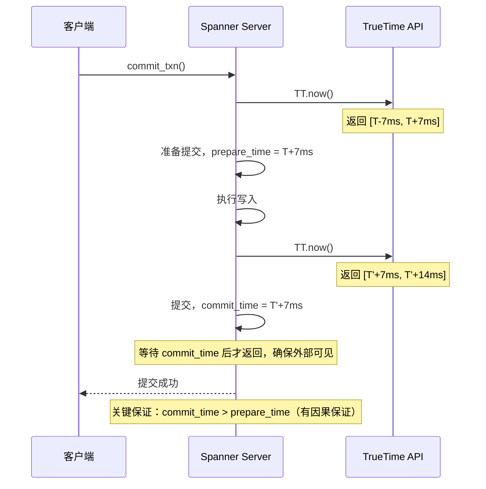
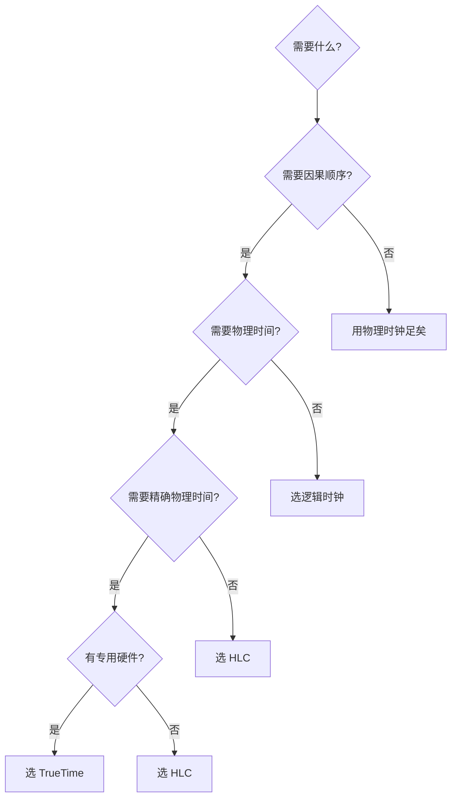

# 逻辑时钟 vs 物理时钟

分布式系统有两个时钟体系。

**物理时钟**基于物理时间——你手机上的时间、电脑右下角的时间、NTP 同步的时间。它们给你的生活带来了便利，但在分布式系统中，它们的问题很多。

**逻辑时钟**基于事件顺序——不依赖物理时间，只依赖「谁先谁后」。它们在分布式系统中更可靠，但能力有限。

理解这两种时钟的差异和适用场景，是做出正确架构决策的基础。

## 物理时钟的问题

物理时钟看起来很可靠，但分布式系统中它有三个致命问题：

### 问题一：时钟漂移（Clock Drift）

每个物理时钟都有误差。石英晶体振荡器的误差约为每天 ±15 秒。这意味着两天后，你的服务器时间可能误差 30 秒。

更糟糕的是，这种漂移是**不可预测的**——你不知道它是快还是慢，也不知道漂了多少。

### 问题二：NTP 同步延迟

NTP（Network Time Protocol）可以同步时钟，但有延迟。

从时间服务器获取时间需要：
1. 客户端发送请求（延迟 T1）
2. NTP 服务器处理（延迟 T2）
3. 客户端收到响应（延迟 T3）

往返时间是 `T3 - T1`，但单向延迟是未知的。NTP 假设往返延迟对称，即 `T1 ≈ T3`，但这个假设在网络拥塞时不成立。

结果是：**NTP 同步的精度受限于网络延迟**，在跨数据中心场景下，误差可能达到几十毫秒甚至秒级。

### 问题三：人为调整

管理员可能手动调整时间、闰秒（Leap Second）会导致时间「倒流」一秒、虚拟机迁移可能导致时钟突变。这些都会导致「后面发生的事件时间戳反而更小」的问题。

```java
// 物理时钟导致的问题
public class PhysicalTimeProblem {

    public static void main(String[] args) throws InterruptedException {
        long t1 = System.currentTimeMillis();
        Thread.sleep(100);
        long t2 = System.currentTimeMillis();

        System.out.println("时间差: " + (t2 - t1) + "ms");

        // 看起来正常：100ms 延迟

        // 但如果期间发生了 NTP 同步...
        // t2 可能比 t1 更小！
    }
}
```

:::warning 时钟回拨的灾难
2012 年，Reddit 的一次闰秒事故导致数据库主从复制出问题——从库的时间「回拨」了一秒，导致某些事件的序号出现混乱。这不是代码 bug，是物理时钟的本质问题。
:::

## 逻辑时钟的优势

逻辑时钟完全绕开了物理时钟的问题：

1. **不依赖物理时间**：无论时钟漂移还是闰秒，都不影响
2. **事件顺序是确定的**：只要消息传递顺序正确，时间戳大小关系就是正确的
3. **实现简单**：只需要一个计数器

但逻辑时钟有一个根本限制：**只能建立偏序，不能建立绝对时间**。

你可以说「事件 A 在事件 B 之前」，但你无法说「事件 A 发生在下午 3 点」。

```java
// 逻辑时钟的核心：无论物理时间如何，只要消息顺序正确，时间戳就正确
public class LogicalTimeGuarantee {

    public static void main(String[] args) {
        LamportClock clock1 = new LamportClock(1);
        LamportClock clock2 = new LamportClock(2);

        // 无论物理时间如何，以下关系是确定的：
        int t1 = clock1.send();           // P1 发送消息
        int t2 = clock2.receive(t1);      // P2 接收消息

        // t1 < t2 是确定的（因为有消息传递关系）
        System.out.println(t1 < t2);      // 永远为 true
    }
}
```

## Hybrid Logical Clock（HLC）

物理时钟和逻辑时钟各有优劣。**混合逻辑时钟（HLC）**试图结合两者的优点。

HLC 的设计目标是：
1. 提供因果顺序（逻辑时钟的能力）
2. 同时提供「有界」的物理时间近似（物理时钟的能力）
3. 存储空间 `O(1)`

### HLC 的结构

HLC 的时间戳是一个四元组：`(physical_time, logical_time, node_id)`

- `physical_time`：物理时间的毫秒数（来自本地时钟）
- `logical_time`：逻辑计数器（当物理时间不变时递增）
- `node_id`：节点 ID（tie-breaking）

```java
public class HybridLogicalClock {

    private long physicalTime;    // 物理时间（毫秒）
    private long logicalTime;     // 逻辑计数器
    private final int nodeId;

    // 本地事件
    public HlcTimestamp tick() {
        long now = System.currentTimeMillis();

        if (now > physicalTime) {
            // 物理时间前进，逻辑时间归零
            physicalTime = now;
            logicalTime = 0;
        } else {
            // 物理时间不变，逻辑时间递增
            logicalTime++;
        }

        return new HlcTimestamp(physicalTime, logicalTime, nodeId);
    }

    // 接收远程消息
    public HlcTimestamp receive(HlcTimestamp received) {
        long now = System.currentTimeMillis();

        // 三者取最大：本地物理时间、接收的物理时间、接收的逻辑时间
        physicalTime = Math.max(now,
            Math.max(physicalTime, received.physicalTime));

        if (physicalTime == received.physicalTime) {
            // 物理时间相同，逻辑时间取 max + 1
            logicalTime = Math.max(logicalTime, received.logicalTime) + 1;
        } else if (physicalTime == now && physicalTime > received.physicalTime) {
            // 本地物理时间前进，逻辑时间归零
            logicalTime = 0;
        } else {
            // 接收的物理时间更大
            logicalTime = Math.max(logicalTime, received.logicalTime) + 1;
        }

        return new HlcTimestamp(physicalTime, logicalTime, nodeId);
    }

    // 比较两个 HLC
    public int compareTo(HlcTimestamp other) {
        if (this.physicalTime != other.physicalTime) {
            return Long.compare(this.physicalTime, other.physicalTime);
        }
        if (this.logicalTime != other.logicalTime) {
            return Long.compare(this.logicalTime, other.logicalTime);
        }
        return Integer.compare(this.nodeId, other.nodeId);
    }
}
```

### HLC 的性质

HLC 满足三个重要性质：

| 性质 | 说明 |
|---|---|
| **因果顺序** | 如果 `A → B`，则 `HLC(A) < HLC(B)` |
| **有界漂移** | `|HLC.physical - 实际物理时间| &lt;= 边界`（通常几十毫秒） |
| **空间 `O(1)`** | 只需一个计数器，不需要每个节点一个 |

HLC 的「有界漂移」是关键——它保证 `HLC.physical` 与实际物理时间的误差不会无限增长。这在需要「时间相关性」的场景下非常有用。

比如在金融系统中，你想知道「这笔交易发生在哪一天」——HLC 可以提供足够精确的物理时间近似。

## TrueTime：Google 的方案

Google Spanner 采用了另一种方案：**TrueTime**。

TrueTime 使用 GPS 时钟和原子钟，实现「有界的物理时间误差」。误差范围通常是 ±7ms（在 Google 的数据中心内）。

```java
// TrueTime 的简化 API
public class TrueTime {

    /**
     * 返回一个时间区间 [earliest, latest]
     * TrueTime 保证：实际物理时间一定在这个区间内
     */
    public static Interval now() {
        // 通过 GPS + 原子钟获取有界误差的时间
        long epsilon = 7;  // 误差 ±7ms
        long now = hardwareClock.now();

        return new Interval(now - epsilon, now + epsilon);
    }

    /**
     * 等待直到物理时间超过给定时间
     * 用于「等待到指定时间再提交事务」
     */
    public static void waitUntil(long targetTime) {
        while (now().latest() < targetTime) {
            // 自旋等待
            Thread.yield();
        }
    }
}
```

Spanner 的 Commit Wait 机制利用了 TrueTime 的误差边界：



TrueTime 的优势是**不需要消息传递就能建立因果顺序**——只需要等待「误差区间」过去。这在强一致性事务中非常有用。

但 TrueTime 的代价是：
1. 需要专用硬件（GPS + 原子钟）
2. 提交事务需要等待误差边界（通常 7~10ms 延迟）
3. 实现复杂度高

## 三种时钟的对比

| 维度 | 逻辑时钟（Lamport） | HLC | TrueTime |
|---|---|---|---|
| 物理时间 | ❌ 无 | ✅ 有界近似 | ✅ 有界精确 |
| 因果顺序 | ✅ 偏序 | ✅ 偏序 | ✅ 偏序 |
| 绝对时间戳 | ❌ 无 | ⚠️ 有界近似 | ✅ 有界精确 |
| 硬件依赖 | ❌ 无 | ❌ 无 | ✅ GPS + 原子钟 |
| 提交延迟 | `O(1)` | `O(1)` | 等待误差边界（~10ms） |
| 实现复杂度 | 低 | 中 | 高 |
| 适用场景 | 全序广播、Paxos | 分布式数据库 | Spanner |

## 选型建议

### 场景一：只需要因果顺序

选 **逻辑时钟（Lamport / 向量时钟）**。

不需要物理时间，只需要知道「谁先谁后」。典型场景：
- Paxos 全序广播
- 分布式锁
- 协作编辑

### 场景二：需要因果顺序 + 物理时间近似

选 **HLC**。

需要知道「大概要什么时候」，同时需要因果顺序。典型场景：
- 分布式数据库（如 CockroachDB）
- 事件溯源系统
- 金融交易（需要知道交易日期）

### 场景三：需要严格物理时间 + 强一致

选 **TrueTime**。

需要知道「精确的物理时间」，且愿意等待。典型场景：
- Google Spanner
- 全球分布式强一致事务
- 需要跨数据中心强一致的应用



## 权衡矩阵

| 场景 | 推荐方案 | 不推荐方案 | 理由 |
|---|---|---|---|
| Paxos 全序广播 | Lamport 时钟 | TrueTime | 不需要物理时间，Lamport 够用 |
| 最终一致性存储 | 向量时钟 | TrueTime | 需要检测并发，TrueTime 帮不上忙 |
| CockroachDB | HLC | 纯逻辑时钟 | 需要知道物理时间（交易日期） |
| Spanner | TrueTime | HLC | 需要精确物理时间保证 |
| 协作编辑 | 向量时钟 | 物理时钟 | 需要精确的并发检测 |
| 日志系统 | 物理时钟 | 向量时钟 | 日志只需要物理时间 |

## 术语表

| 术语 | 英文 | 定义 |
|---|---|---|
| 时钟漂移 | clock drift | 物理时钟随时间的误差累积 |
| NTP | Network Time Protocol | 网络时间协议，用于同步物理时钟 |
| 闰秒 | leap second | 校准 UTC 与地球自转的时间调整 |
| 偏序 | partial order | 部分元素可比，部分元素不可比 |
| HLC | Hybrid Logical Clock | 混合逻辑时钟，结合物理和逻辑时钟 |
| TrueTime | Google TrueTime | Google 的有界物理时间实现 |
| Commit Wait | commit-wait | Spanner 事务提交的等待机制 |

## 延伸思考

时钟选择是分布式系统设计中的基础决策。一旦选错，改造成本很高——因为时钟系统渗透到系统的每个角落。

我的建议是：

1. **先问「我需要什么」**，而不是「哪个更好」
2. **优先选逻辑时钟**：实现简单，没有物理时钟的问题
3. **只有在明确需要物理时间时，才考虑 HLC 或 TrueTime**
4. **TrueTime 慎重**：它需要专用硬件，而且提交延迟是真实的代价

没有完美的时钟系统，只有最适合场景的时钟系统。选择之前，想清楚你的业务真正需要什么。
