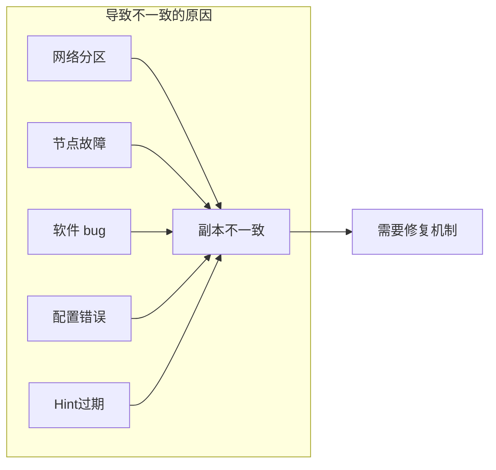
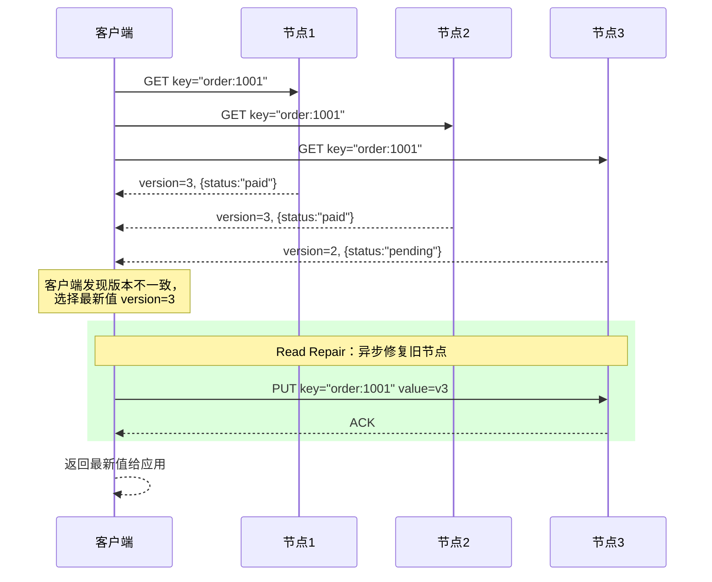
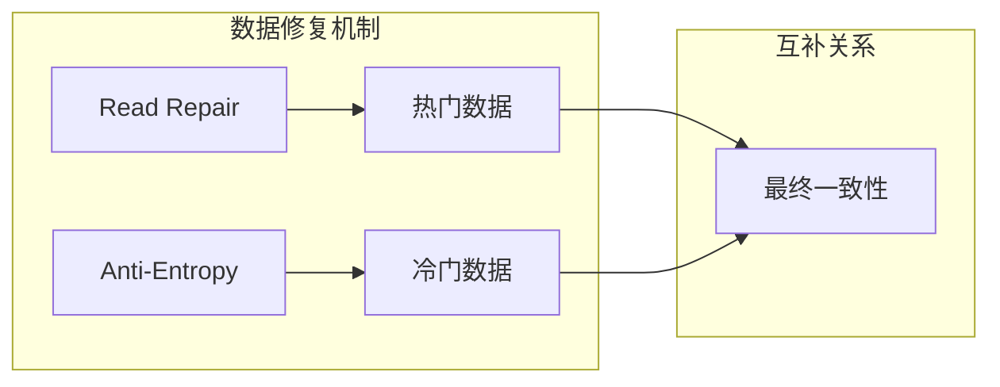
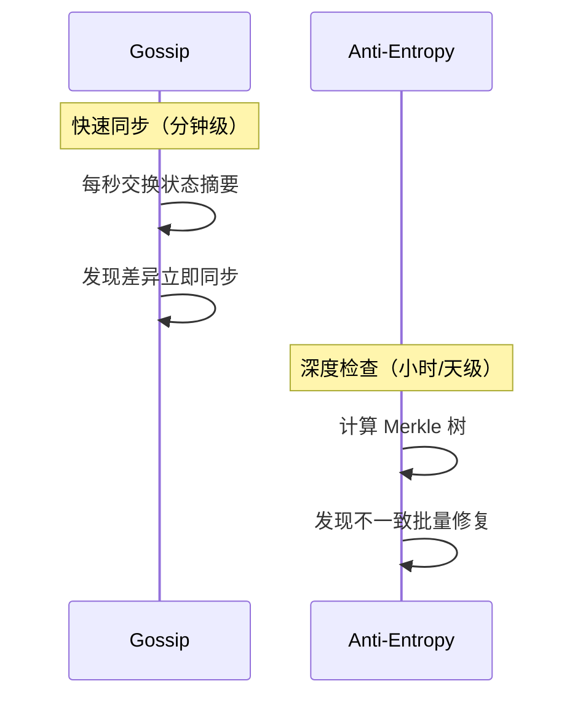

# 读修复与反熵

分布式系统中最棘手的问题之一是：**数据副本之间出现了不一致**。网络分区、节点故障恢复、程序 bug——各种原因都可能导致同一个数据在不同节点上存储了不同的值。谁来发现这些不一致？谁来修复？

**Read Repair（读修复）** 和 **Anti-Entropy（反熵）** 就是解决这个问题的两种核心机制。它们一个是被动触发、一个是主动检查，互为补充，共同保证了分布式存储系统的最终一致性。

## 为什么需要数据修复

在理想世界里，每次写入都会同步到所有副本。但在现实世界里，完美的同步是不存在的：



### 常见的不一致场景

| 场景 | 原因 | 修复方式 |
| --- | --- | --- |
| 异步复制延迟 | 主从复制中从库重放慢 | Read Repair / Anti-Entropy |
| 节点故障恢复 | Hinted Handoff 过期 | Anti-Entropy |
| 网络分区 | 部分写入成功 | Read Repair / Anti-Entropy |
| Quorum 未达成 | 写入时节点不可用 | Hinted Handoff + Anti-Entropy |

## Read Repair：读取时修复

### 核心思想

Read Repair 的精髓在于**「利用读取操作，顺带修复旧数据」**。当客户端并发读取 N 个节点时，如果发现某些节点返回了旧版本数据，就主动将最新数据写回这些节点。

```
读取流程：

客户端 ──────► 节点1 ──► 返回 v3（最新）
        │
        ├─────► 节点2 ──► 返回 v3（最新）
        │
        └─────► 节点3 ──► 返回 v2（旧） ◄── 需要修复

发现节点3是旧数据 → 触发修复 → 将 v3 写入节点3
```

### 触发时机

Read Repair 在以下场景触发：

1. **读取 N 个节点后，发现版本不一致**：有些节点返回了旧数据
2. **写入 Quorum 未达成时**：后续读取发现数据不一致

### 算法流程



### 代码实现

```java
public class ReadRepairExecutor {
    private final DynamoClient dynamoClient;
    private final int numReplicas;

    public byte[] readWithRepair(String key) {
        // 并发读取所有副本
        List<CompletableFuture<ReplicaResult>> futures = new ArrayList<>();
        for (Replica replica : replicas) {
            futures.add(dynamoClient.getAsync(replica, key));
        }

        // 收集响应
        List<ReplicaResult> results = futures.stream()
            .map(CompletableFuture::join)
            .filter(r -> r.isSuccess())
            .collect(Collectors.toList());

        // 选择最新版本
        ReplicaResult latest = results.stream()
            .max(Comparator.comparing(ReplicaResult::getVersion))
            .orElseThrow(() -> new NoDataException(key));

        // 修复旧版本节点（异步，不阻塞读取）
        for (ReplicaResult result : results) {
            if (result.getVersion() < latest.getVersion()) {
                asyncRepair(result.getReplica(), key, latest);
            }
        }

        return latest.getData();
    }

    private void asyncRepair(Replica replica, String key, ReplicaResult latest) {
        // 异步写回最新值，不等待响应
        dynamoClient.putAsync(replica, key, latest.getData(), latest.getVersion())
            .thenAccept(r -> LOG.debug("Repaired replica {} for key {}", replica, key))
            .exceptionally(e -> {
                LOG.warn("Failed to repair replica {} for key {}", replica, key, e);
                return null;
            });
    }
}
```

### 修复策略

| 策略 | 描述 | 适用场景 |
| --- | --- | --- |
| 同步修复 | 读取等待所有修复完成 | 强一致读取 |
| 异步修复 | 读取返回后异步修复 | 通用场景（**推荐**） |
| 后台修复 | 记录需要修复，稍后批量处理 | 高读取负载 |

### Cassandra 的 Read Repair 配置

```yaml title="cassandra.yaml"
# Read Repair 概率（0.0 ~ 1.0）
# 默认 0.1，即 10% 的读取触发 Read Repair
read_repair_chance: 0.1

# 针对特定表的配置
# 大表可以降低 Repair 概率减少开销
```

```sql
-- 创建表时指定 Read Repair 概率
CREATE TABLE orders (
    order_id UUID PRIMARY KEY,
    user_id UUID,
    status text,
    amount decimal
) WITH read_repair_chance = 0.05;
```

:::tip
100% 的读取都触发 Read Repair 可以最快达到一致性，但开销大。10% 是性能和一致性的平衡点——随着时间推移，多次读取最终会修复所有不一致。
:::

## Anti-Entropy：主动检查与修复

### 核心思想

Read Repair 是「请求驱动的」，只有被读取的数据才可能被修复。但如果某个数据很久没被读取，它的不一致状态会一直存在。

**Anti-Entropy（反熵）** 是「周期驱动的」——系统定期主动检查副本之间的一致性，发现不一致就修复。

「熵」在热力学中表示「混乱程度」，反熵就是「减少混乱」——通过主动同步，让所有副本趋于一致。

### Merkle 树：高效比较大量数据

检查两个副本是否一致，最笨的方法是逐条比较——如果有 10 亿条数据，这个比较将极其缓慢。

**Merkle 树**（哈希树）提供了一种高效的方式：

```
原始数据：
[0] [1] [2] [3] [4] [5] [6] [7]
 │   │   │   │   │   │   │   │
 └─┬─┘   └─┬─┘   └─┬─┘   └─┬─┘
   │       │       │       │
  H0      H1       H2      H3     ← 叶子节点哈希（每条数据）
   │       │       │       │
   └───────┼───────┘       │
           │               │
          H01              H23       ← 中间节点哈希（两个叶子异或后哈希）
           │               │
           └───────┬───────┘
                   │
                  H02              ← 根节点哈希（所有数据的指纹）
```

### Merkle 树比较流程

```mermaid
flowchart TD
    subgraph 节点A
        A1["H0"] --> A2["H01"]
        A3["H1"] --> A2
        A4["H2"] --> A5["H23"]
        A6["H3"] --> A5
        A2 --> A7["Root"]
        A5 --> A7
    end

    subgraph 节点B
        B1["H0'"] --> B2["H01'"]
        B3["H1'"] --> B2
        B4["H2'"] --> B5["H23'"]
        B6["H3'"] --> B5
        B2 --> B7["Root'"]
        B5 --> B7
    end

    A1 <-->|比较| B1
    A7 <-->|根哈希相同| B7

    Note over A7,B7: 根哈希相同 → 树上所有数据一致<br/>无需进一步比较
```

### Merkle 树比较过程

```java
public class MerkleTreeComparison {
    /**
     * 比较两棵 Merkle 树，返回需要同步的数据范围
     */
    public DiffResult compare(MerkleNode a, MerkleNode b) {
        // 如果两个节点哈希相同，数据一致
        if (a.getHash().equals(b.getHash())) {
            return DiffResult.NO_DIFF;
        }

        // 如果是叶子节点且哈希不同，需要同步这个范围的数据
        if (a.isLeaf() && b.isLeaf()) {
            return DiffResult.createRangeDiff(a.getRange(), b.getRange());
        }

        // 如果是内部节点，递归比较子树
        DiffResult diff = new DiffResult();
        for (int i = 0; i < a.getChildren().size(); i++) {
            diff.merge(compare(a.getChildren().get(i), b.getChildren().get(i)));
        }
        return diff;
    }
}
```

### Cassandra 的 Anti-Entropy 实现

```bash
# 手动执行 Anti-Entropy 修复
nodetool repair -pr

# 参数说明
# -pr: 只修复主副本（Primary Range）
# -inc: 增量修复（只修复变更部分）
# -j 4: 使用 4 个并发任务

# 查看修复进度
nodetool compactionstats

# 查看历史修复记录
nodetool history
```

```java
// Cassandra Anti-Entropy 修复流程（简化）
public class AntiEntropyRepair {
    public void repair(String keyspace, String table) {
        // 1. 计算 Merkle 树
        MerkleTree tree = calculateMerkleTree(keyspace, table);

        // 2. 与其他副本交换 Merkle 树
        for (Replica replica : replicas) {
            MerkleTree remoteTree = exchangeMerkleTrees(replica);

            // 3. 比较 Merkle 树
            List<Range> diffs = compareTrees(tree, remoteTree);

            // 4. 对差异范围进行数据同步
            for (Range range : diffs) {
                syncRange(range, replica);
            }
        }
    }

    private void syncRange(Range range, Replica target) {
        // 读取本地数据，按范围分片发送给目标节点
        List<ByteBuffer> data = readRange(range);
        for (ByteBuffer row : data) {
            target.put(row.getKey(), row.getValue(), row.getVersion());
        }
    }
}
```

### Repair 的调度策略

Anti-Entropy 修复开销较大，不适合频繁执行：

```yaml title="cassandra.yaml"
# 节点启动后多久开始 Repair（秒）
# 默认 0，节点启动立即开始
# 生产环境建议设置为 3600（1小时后）
# 避免集群启动时的 Repair 风暴
auto_bootstrap: true

# gc_grace_seconds：墓碑保留时间
# 删除数据后，墓碑在这个时间内有效
# 如果 Repair 在此之前执行，旧副本上的数据被正确删除
gc_grace_seconds: 864000  # 10天
```

```sql
-- 设置表级别的 gc_grace_seconds
-- 重要数据表可以延长墓碑保留时间
ALTER TABLE orders WITH gc_grace_seconds = 604800;  -- 7天
```

:::warning
gc_grace_seconds 是 Anti-Entropy 的关键参数。如果节点故障超过这个时间，墓碑可能被 GC 回收，但修复尚未完成，可能导致已删除的数据「复活」。
:::

## Read Repair vs Anti-Entropy

| 维度 | Read Repair | Anti-Entropy |
| --- | --- | --- |
| 触发方式 | 请求驱动（读取时触发） | 周期驱动（定时执行） |
| 修复范围 | 只修复被读取的数据 | 修复所有数据 |
| 时效性 | 高（读取时立即修复） | 低（可能延迟数小时/数天） |
| 资源开销 | 低（按需执行） | 高（计算 Merkle 树开销大） |
| 数据范围 | 单条数据 | 大量数据 |

两者互为补充：

- Read Repair 保证**热门数据**快速达到一致
- Anti-Entropy 保证**冷门数据**最终也会一致



## Gossip + Anti-Entropy：完美搭档

很多分布式系统（如 Cassandra）同时使用 **Gossip 协议**和 **Anti-Entropy**：

- **Gossip**：快速传播近期变更（最近几分钟的数据）
- **Anti-Entropy**：定期检查和修复不一致（保证长期一致性）



### Cassandra 的数据同步策略

```java
// Cassandra 数据同步优先级
public enum SyncStrategy {
    // 1. 最高优先级：Gossip 传播近期变更
    //    节点间每秒交换 Gossip 消息
    //    变更立即同步到其他节点

    // 2. 次优先级：Hinted Handoff
    //    节点故障期间的临时写入
    //    节点恢复后归还数据

    // 3. 普通优先级：Read Repair
    //    读取时被动修复
    //    只修复被读取的数据

    // 4. 最低优先级：Anti-Entropy
    //    定期深度检查
    //    后台批量修复不一致
}
```

## 性能开销与优化

### Anti-Entropy 的开销

计算大型 Merkle 树是 CPU 密集型操作：

| 数据量 | Merkle 树计算时间 | 网络传输量 |
| --- | --- | --- |
| 1GB | ~10 秒 | ~16KB（Merkle 树本身） |
| 100GB | ~15 分钟 | ~16KB |
| 1TB | ~2.5 小时 | ~16KB |

Merkle 树的传输量与数据量无关（只传树结构），但计算量与数据量成正比。

### 优化策略

```yaml
# Cassandra 修复优化配置
# 1. 使用增量修复（只检查增量数据）
nodetool repair -inc -pr

# 2. 限制并发 Repair 任务数
# 避免 Repair 消耗过多资源影响正常读写
nodetool repair -j 1  # 串行执行

# 3. 分时间段 Repair
# 错峰执行，避免所有节点同时 Repair
crontab -e
# 每天凌晨 2 点执行 Repair
0 2 * * * nodetool repair -pr -j 2
```

### Read Repair 的采样

高读取量场景下，100% 触发 Read Repair 可能成为瓶颈：

```yaml
# Cassandra 读取采样
# 10% 的读取触发同步 Read Repair
# 90% 的读取触发异步 Read Repair（优先级低）
read_repair_chance: 0.1          # 同步修复概率
dclocal_read_repair_chance: 0.0  # 本 DC 不需要同步修复
```

## 权衡矩阵

| 策略 | 一致性速度 | 资源开销 | 实现复杂度 | 适用场景 |
| --- | --- | --- | --- | --- |
| 同步 Read Repair | 最快（读取时同步） | 高（阻塞读取） | 低 | 强一致需求 |
| 异步 Read Repair | 快（异步修复） | 中 | 低 | 通用场景 |
| 增量 Anti-Entropy | 慢（周期检查） | 中 | 中 | 冷数据修复 |
| 全量 Anti-Entropy | 最慢（全量检查） | 高 | 中 | 初始同步 |

## 术语表

| 术语 | 英文 | 定义 |
| --- | --- | --- |
| Read Repair | Read Repair | 读取时发现不一致，主动修复旧副本的机制 |
| Anti-Entropy | Anti-Entropy | 反熵，主动定期检查并修复副本间数据不一致的机制 |
| Merkle 树 | Merkle Tree | 哈希树，通过哈希比较高效检测数据差异的树形结构 |
| 墓碑 | Tombstone | 删除标记，表示数据已被删除但尚未完全清理 |
| gc_grace_seconds | GC Grace Seconds | 墓碑的有效期，超过后墓碑被垃圾回收 |
| 一致性修复 | Consistency Repair | 通过 Read Repair 或 Anti-Entropy 恢复数据一致性的过程 |

## 总结

Read Repair 和 Anti-Entropy 是分布式存储系统保证最终一致性的两大支柱：

1. **Read Repair**：被动触发，利用读取请求顺便修复旧数据，适合热门数据
2. **Anti-Entropy**：主动检查，通过 Merkle 树高效比较副本差异，适合冷门数据

两者配合 Gossip 和 Hinted Handoff，构成了完整的数据一致性保障体系：

```
数据写入 → Hinted Handoff（故障期间） → Gossip（快速传播）
                        ↓
              Read Repair（热门数据）
              Anti-Entropy（冷门数据）
                        ↓
                   最终一致
```

下一章我们将讨论**数据分区策略**，看看当单机存储无法容纳所有数据时，如何将数据分散到多个节点，以及不同分区策略的权衡。