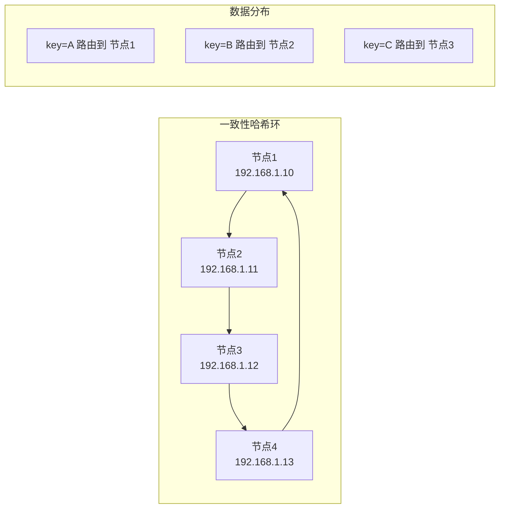
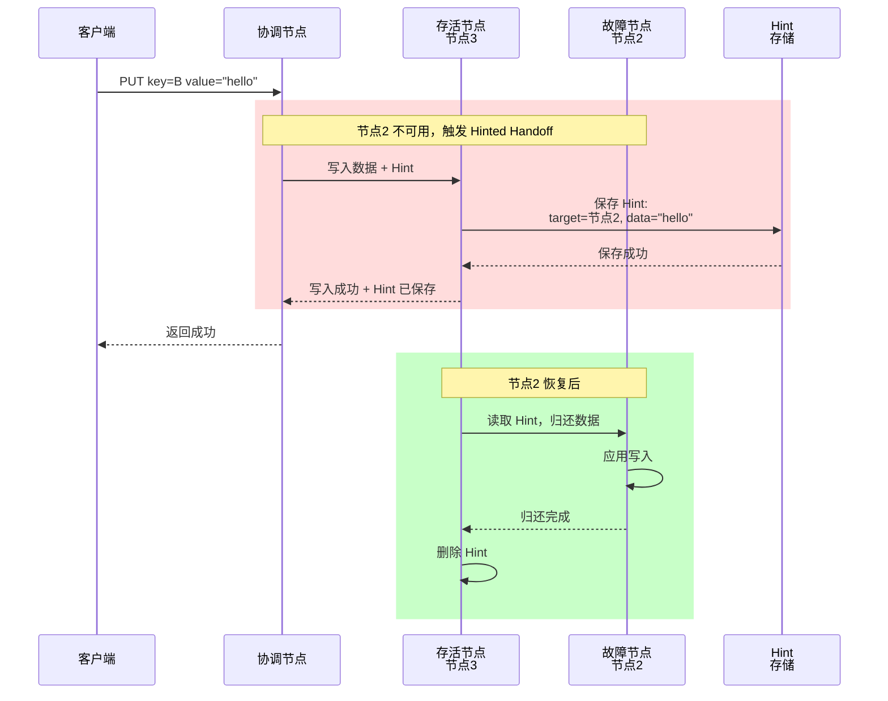
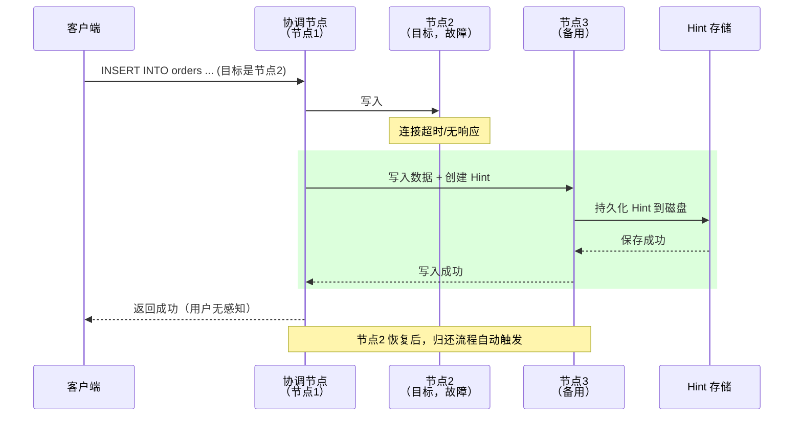
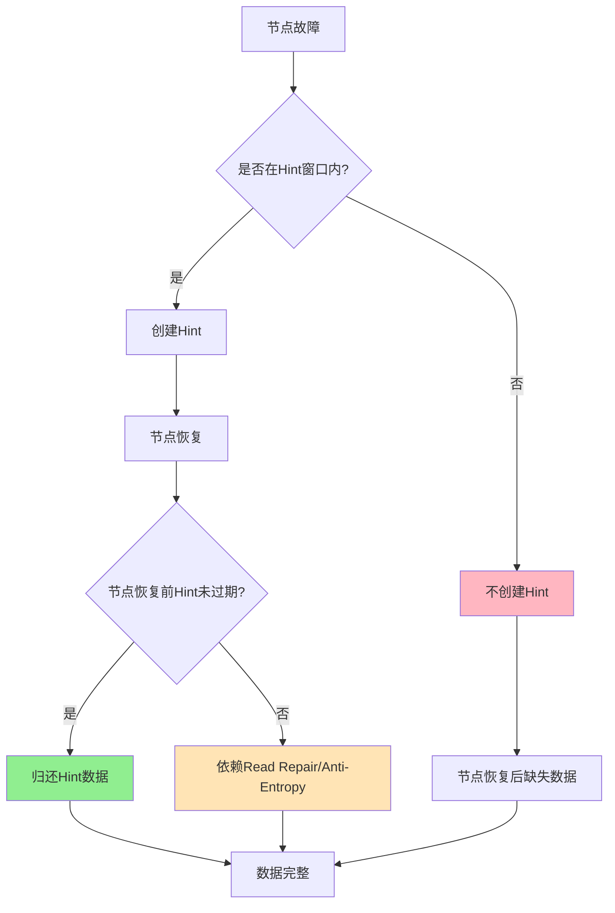
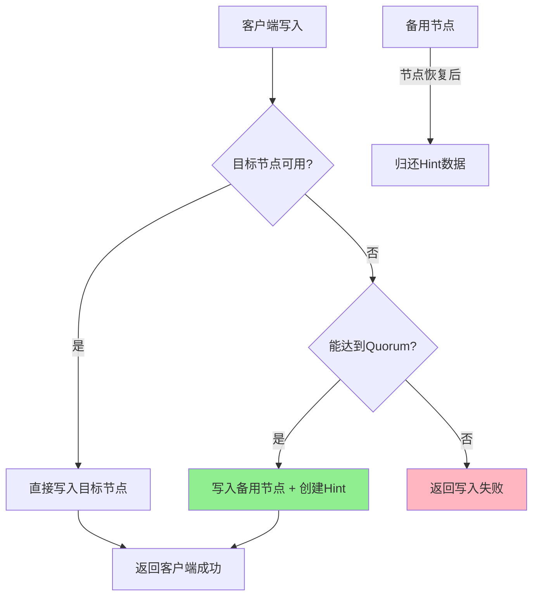

# Hinted Handoff

分布式系统的节点不是铁打的。网络抖动、机器宕机、磁盘故障——各种问题都会导致节点暂时不可用。在无主复制系统中，当某个节点故障时，写入请求去哪了？数据会不会丢失？

**Hinted Handoff**（临时转交）就是解决这个问题的一种机制：故障期间，其他节点代为处理本该写入故障节点的请求，并记录一个「提示」（Hint），等故障节点恢复后再归还数据。这是一种优雅的「先欠着，后面还」策略。

## 问题的核心

在无主复制中（如 Dynamo、Cassandra），数据按照一致性哈希分布在 N 个节点上：



当节点 2 故障时：

- 本该写入节点 2 的数据（key=B）应该去哪？
- 如果直接丢弃，节点 2 恢复后数据就丢失了
- 如果等待节点 2 恢复，系统写入吞吐下降

## Hinted Handoff 的原理

### 核心思想

当协调节点发现目标节点不可用时：

1. **选择一个备用节点**代为写入
2. **记录 Hint**：包含目标节点 ID、原始数据、写入时间
3. **写入成功后返回客户端**：写入没有失败，用户无感知
4. **故障节点恢复后**：从 Hint 中读取数据，归还到正确的节点



### Hint 的数据结构

```java
// Hint 数据结构（简化版）
public class HintedWrite {
    private String key;                    // 数据的键
    private byte[] value;                  // 数据的值
    private int targetNodeId;              // 本应写入的目标节点 ID
    private long hintedAt;                 // 记录 Hint 的时间戳
    private long expiresAt;                // Hint 过期时间

    // 计算 Hint 的有效期
    public boolean isExpired() {
        return System.currentTimeMillis() > expiresAt;
    }

    // 归还数据时的元信息
    private Map<String, String> metadata;  // 版本号、TTL 等
}
```

## Cassandra 中的 Hinted Handoff

Cassandra 是 Hinted Handoff 应用最广泛的系统之一。让我看看它的具体实现。

### 配置参数

```yaml title="cassandra.yaml"
# 是否启用 Hinted Handoff
hinted_handoff_enabled: true

# 每个节点的 Hint 存储目录
hints_directory: /var/lib/cassandra/hints

# Hint 过期时间（秒），默认 4 小时
max_hint_window_on_ms: 3600000  # 1小时
# 或者
max_hint_window_in_ms: 4h       # 4小时

# 跨数据中心是否启用 Hinted Handoff
hinted_handoff_across_datacenters: true

# 发送 Hint 的超时时间
hints_flush_period: 10000ms
```

```sql
-- 查看 Hinted Handoff 状态
DESCRIBE CLUSTER;

-- 查看每个节点的 Hint 数量
SELECT * FROM system.compaction_history;
```

### 写入 Hint 的流程



### Hint 归还（Hint Replay）

```java
// Cassandra Hint Replay 简化实现
public class HintReplayer {
    private final File hintsDirectory;
    private final Duration maxHintAge = Duration.ofHours(4);

    public void replayHints(Node recoveredNode) {
        File[] hintFiles = listHintFilesFor(recoveredNode.getId());

        for (File hintFile : hintFiles) {
            try {
                HintedWrite hint = deserializeHint(hintFile);

                // 检查 Hint 是否过期
                if (hint.isExpired()) {
                    LOG.info("Hint {} expired, skipping", hint.getKey());
                    deleteHintFile(hintFile);
                    continue;
                }

                // 归还数据到目标节点
                boolean success = writeToTargetNode(hint);

                if (success) {
                    deleteHintFile(hintFile);
                    LOG.info("Hint {} replayed successfully", hint.getKey());
                } else {
                    // 写入失败，稍后重试
                    LOG.warn("Failed to replay hint {}, will retry", hint.getKey());
                }

            } catch (Exception e) {
                LOG.error("Error replaying hint {}", hintFile, e);
            }
        }
    }
}
```

### 禁用特定表的 Hinted Handoff

Cassandra 允许对特定表禁用 Hinted Handoff：

```sql
-- 对重要表禁用 Hinted Handoff（高价值数据，强一致优先）
CREATE TABLE critical_data (
    id UUID PRIMARY KEY,
    payload text
) WITH hinted_handoff = false;
```

:::warning
禁用 Hinted Handoff 后，如果目标节点在写入期间不可用，该数据可能永久丢失。如果业务对数据持久性要求高，需要使用 `CONSISTENCY ALL` 或应用层重试策略。
:::

## Hint 过期与数据修复

### Hint 的生命周期

```
┌─────────────────────────────────────────────────────────────┐
│                      Hint 生命周期                           │
├─────────────────────────────────────────────────────────────┤
│                                                             │
│  时间轴 ──────────────────────────────────────────────────► │
│                                                             │
│  T0: 写入请求  T1: 创建Hint  T2: 过期  T3: 节点恢复          │
│    │           │           │           │                    │
│    ▼           ▼           ▼           ▼                    │
│  [记录Hint]  [等待恢复]  [过期丢弃]  [数据丢失？]            │
│                                                             │
└─────────────────────────────────────────────────────────────┘
```

### Hint 过期后的数据修复

当 Hint 过期被丢弃后，故障节点恢复时数据可能不完整。这时依赖 **Anti-Entropy**（反熵）和 **Read Repair**（读修复）来恢复数据：

1. **Read Repair**：下次读取时发现不一致，主动修复
2. **Anti-Entropy**：后台定期检查并修复不一致

这些机制在下一章会详细讲解。



## 真实案例：节点重启后的数据恢复

> **某社交平台 Cassandra 集群的 Hinted Handoff 实践**
>
> 场景：凌晨 3 点，3 节点 Cassandra 集群的节点 2 因内存故障重启。
>
> 处理过程：
>
> 1. **故障检测**（T+0s）：节点 2 无响应，Gossip 协议在 10 秒内检测到
>
> 2. **写入接管**（T+0s ~ T+30min）：
>    - 期间写入节点 2 的数据全部写入节点 3，并生成 Hint
>    - Hint 存储在 `/var/lib/cassandra/hints/` 目录
>    - Hint 总数：约 50,000 条
>
> 3. **节点恢复**（T+30min）：
>    - 节点 2 重启上线
>    - Hinted Handoff 服务自动扫描 Hint 目录
>
> 4. **数据归还**（T+30min ~ T+45min）：
>    - 节点 3 逐条将 Hint 数据发送给节点 2
>    - 节点 2 接收并写入 MemTable
>
> 5. **完成验证**（T+60min）：
>    - `nodetool repair` 执行全量一致性校验
>    - 所有数据恢复一致

## Hinted Handoff 与 Quorum 的配合

### 写入流程整合



### 失效后降级处理

当 Hinted Handoff 也无法满足时，系统需要降级处理：

```java
public class WriteHandler {
    public WriteResult handleWrite(Request request) {
        List<Node> targets = getTargetNodes(request.getKey());

        // 第一阶段：尝试写入所有目标节点
        List<Future<WriteResponse>> futures = writeToAllNodes(targets, request);

        // 第二阶段：检查成功数量
        int successCount = waitForResponses(futures);

        if (successCount >= W) {
            return WriteResult.success();
        }

        // 第三阶段：降级处理
        if (successCount >= 1) {
            // 至少有一个成功，触发 Hinted Handoff
            triggerHintedHandoff(request, targets, futures);
            return WriteResult.success();  // 用户视角成功
        }

        return WriteResult.failure("Write quorum not met");
    }
}
```

## 权衡矩阵

| 维度 | 启用 Hinted Handoff | 禁用 Hinted Handoff |
| --- | --- | --- |
| 数据持久性 | 高（故障期间数据不丢失） | 低（故障期间写入可能丢失） |
| 写入可用性 | 高（故障不影响写入） | 低（故障时写入失败） |
| 系统复杂度 | 高（需要 Hint 存储和管理） | 低 |
| 存储开销 | 高（Hint 占用磁盘空间） | 无 |
| 恢复时间 | 长（需要重放 Hint） | 无需恢复 |

## Hinted Handoff 的局限性

### 1. 无法处理永久故障

Hint 是临时的，如果节点永久离开集群：

1. Hint 过期被丢弃
2. 数据永久丢失
3. 需要其他副本恢复（如 Anti-Entropy）

### 2. Hint 丢失

Hint 存储在磁盘上，如果备用节点也故障：

1. Hint 可能丢失
2. 数据需要从其他途径恢复

### 3. Hint 重放顺序

Hint 重放可能不按原始顺序进行，对有依赖关系的数据可能有问题：

```java
// 问题场景：账户余额操作
// Hint 1: 余额 +100
// Hint 2: 余额 -50
// 如果重放顺序错误：先 -50 再 +100，结果不同

// 解决：使用单调递增的序列号
public class AccountHint {
    private long sequenceNumber;  // 全局单调递增序列号
    private Operation operation;   // 操作类型
    private BigDecimal delta;     // 变更金额

    public boolean canApply(Account current) {
        return this.sequenceNumber > current.getLastSequence();
    }
}
```

### 4. 跨数据中心延迟

跨数据中心 Hinted Handoff 延迟高，Hint 传输可能失败：

```yaml
# Cassandra 跨数据中心配置
hinted_handoff_across_datacenters: true  # 启用
# 但建议跨 DC 的 Hint 窗口设置更短
max_hint_window_in_ms: 1h  # 跨 DC 1 小时，本 DC 保持默认
```

## 术语表

| 术语 | 英文 | 定义 |
| --- | --- | --- |
| Hinted Handoff | Hinted Handoff | 节点故障时，其他节点代为写入并记录提示的机制 |
| Hint | Hint | 记录代写信息的临时数据，包含目标节点、原始数据、时间戳 |
| Hint Replay | Hint Replay | 故障节点恢复后，从 Hint 中恢复数据的过程 |
| Hint Window | Hint Window | Hint 有效的最大时间窗口，超过后被丢弃 |
| Anti-Entropy | Anti-Entropy | 反熵，主动检查并修复副本间数据不一致的机制 |
| Read Repair | Read Repair | 读修复，读取时发现不一致主动修复的机制 |

## 总结

Hinted Handoff 是无主复制系统中保证数据持久性的重要机制。它的核心思想是「临时接管、后面归还」：

1. **故障期间**：备用节点代写 + 记录 Hint
2. **节点恢复**：从 Hint 中恢复数据到目标节点
3. **Hint 过期**：依赖 Read Repair 和 Anti-Entropy 兜底

但 Hinted Handoff 不是万能的：
- 无法处理永久故障
- Hint 本身可能丢失
- Hint 重放顺序可能有问题

下一章我们将讲解 **Anti-Entropy（反熵）**，看看系统如何主动检测和修复副本间的数据不一致。