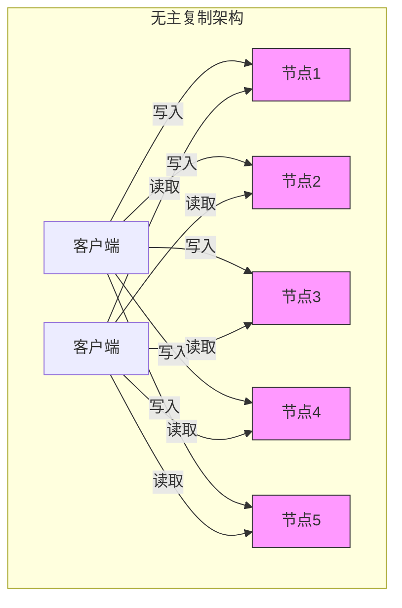
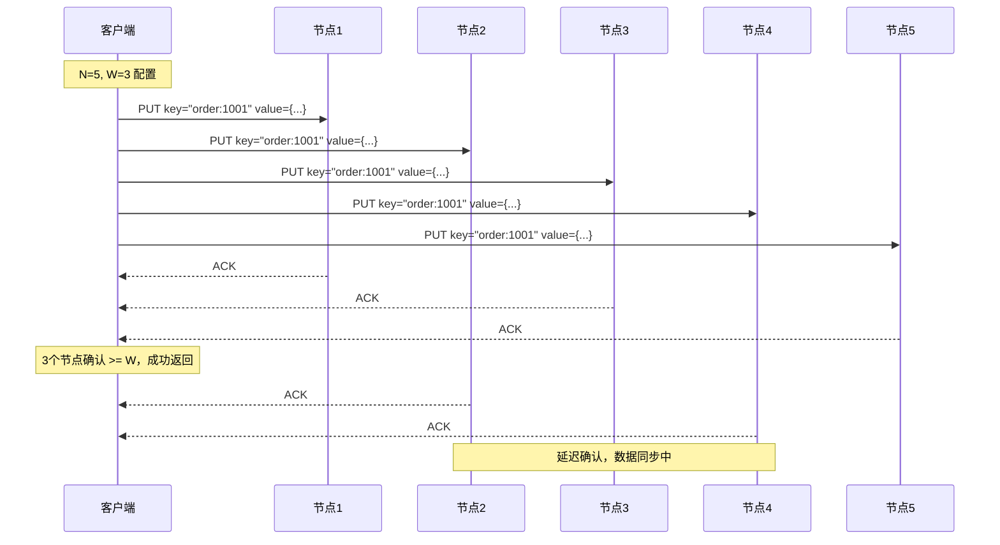
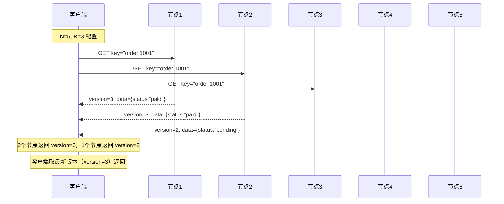
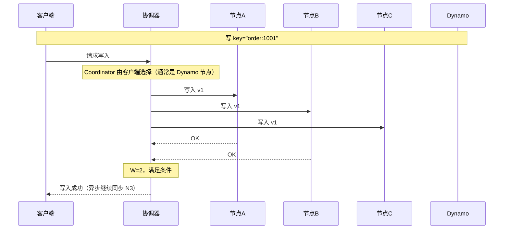
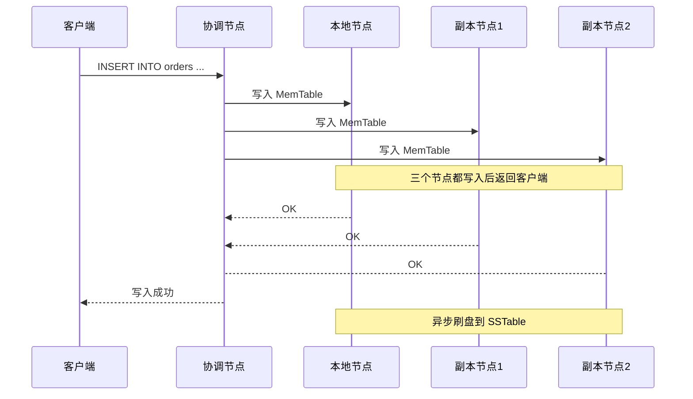

# 无主复制

2007 年，Amazon CTO Werner Vogels 发表了一篇论文，提出了一个革命性的概念：**Dynamo**——一个完全去中心化的存储系统。没有主节点，没有单点故障，任何节点都可以接受读写请求。十年后，这一理念被 Cassandra、Riak 等系统继承和发展，形成了今天我们所熟知的**无主复制**（Leaderless Replication）。

主从复制解决了数据高可用问题，但主节点依然是写入的瓶颈。多主复制解决了写入扩展问题，但冲突解决成为新的复杂性来源。无主复制更进一步：**彻底取消主节点概念，让客户端直接与任意 N 个副本交互**。这带来了前所未有的灵活性，也带来了新的设计挑战。

## 无主复制的核心思想

在无主复制中，**没有任何节点在写入流程中处于特殊地位**。客户端可以直接将数据写入任意节点，系统保证在一定条件下数据最终一致。



这与主从复制的本质区别：

| 维度 | 主从复制 | 无主复制 |
| --- | --- | --- |
| 写入路由 | 写主库，主库转发给从库 | 客户端直接写入 N 个节点 |
| 读取路由 | 可读从库 | 客户端并发读 R 个节点 |
| 主节点 | 存在，单点瓶颈 | 不存在 |
| 故障影响 | 主库故障需要切换 | 任意节点故障不影响整体服务 |

## 写入流程：写 N 个节点

无主复制的写入不经过任何协调节点。客户端直接将数据发送到 N 个节点，要求至少 W 个节点确认成功。

### 写入流程图



### 写入成功的条件

写入被认为成功的前提是：**至少 W 个节点确认写入**。

- W `>` N：不可能，因为 W 个节点不能超过总节点数
- W `=` N：所有节点必须成功，最严格的一致性保证
- W `=` 1：只需 1 个节点成功，最高写入可用性，但一致性最弱
- W `=` ⌈(N+1)/2⌉：多数派写入，避免脑裂

## 读取流程：读 R 个节点

无主复制的读取同样并发查询多个节点，从返回的数据中选择「最新」的结果。

### 读取流程图



### 版本向量与冲突检测

无主复制系统中，每个数据项都携带**版本号**或**向量时钟**，用于判断哪个版本「最新」。

```java
// 数据项结构（简化版）
public class DataItem {
    private String key;
    private String value;
    private long version;           // 简单版本号
    private VectorClock vectorClock; // 向量时钟（复杂场景）

    // 比较两个版本谁更新
    public boolean isNewerThan(DataItem other) {
        if (this.vectorClock != null && other.vectorClock != null) {
            return this.vectorClock.dominates(other.vectorClock);
        }
        // 简单版本号比较
        return this.version > other.version;
    }
}
```

## NWR 配置：一致性与可用性的调谐

NWR 是无主复制的核心配置，三个参数的组合决定了系统的行为。

### 参数定义

| 参数 | 含义 | 取值范围 |
| --- | --- | --- |
| N | 总副本数 | `1` ~ `集群节点数` |
| W | 写入成功所需确认节点数 | `1` ~ `N` |
| R | 读取成功所需返回节点数 | `1` ~ `N` |

### 一致性保证的数学原理

**强读取（Read Your Writes）**：当 W + R `>` N 时，读取 quorum 和写入 quorum 一定有交集，保证**读到自己写入的值**。

```
N=3, W=2, R=2
写入 quorum = {节点1, 节点2}
读取 quorum = {节点2, 节点3}

交集 = {节点2} ≠ ∅

结论：任何读取 quorum 一定与写入 quorum 有交集，
      一定能读到最新写入的数据
```

### 典型配置场景

| 配置 | 特点 | 适用场景 |
| --- | --- | --- |
| N=3, W=3, R=1 | 强一致写入，读取性能高 | 写少读多、一致性优先 |
| N=3, W=1, R=3 | 强一致读取，写入性能高 | 写多读少、可用性优先 |
| N=3, W=2, R=2 | 平衡读写性能 | 通用场景 |
| N=5, W=3, R=3 | 容忍 2 节点故障 | 大规模集群 |
| N=7, W=4, R=4 | 容忍 3 节点故障，强一致 | 金融级存储 |

### 权衡矩阵

| 配置 | 写入可用性 | 读取可用性 | 一致性保证 | 延迟 |
| --- | --- | --- | --- | --- |
| W=1, R=1 | 最高 | 最高 | 最终一致 | 最低 |
| W=N, R=1 | 低（任一节点故障则失败） | 高 | 强一致写入 | 高 |
| W=1, R=N | 高 | 低（所有节点必须可用） | 强一致读取 | 中 |
| W `>` N/2, R `>` N/2 | 中 | 中 | 多数派一致 | 中 |

:::info
Dynamo 默认配置 N=3, W=2, R=2。这是性能和一致性的平衡点——写入需要多数派确认，读取也需要多数派返回，确保强读取（Read Your Writes）保证。
:::

## 故障处理：节点宕机不影响服务

无主复制的另一个优势是**节点故障对服务的影响极小**。

### 故障容忍能力

- **写入容忍**：最多容忍 N - W 个节点同时故障而不影响写入
- **读取容忍**：最多容忍 N - R 个节点同时故障而不影响读取
- **服务不中断**：客户端自动跳过故障节点，请求其他健康节点

```java
// 客户端写入逻辑（伪代码）
public WriteResult write(String key, String value) {
    List<Node> nodes = getNodesForKey(key); // 根据一致性哈希选择 N 个节点
    int successCount = 0;
    List<Future<WriteResponse>> futures = new ArrayList<>();

    // 并发写入所有节点
    for (Node node : nodes) {
        futures.add(asyncWrite(node, key, value));
    }

    // 等待至少 W 个节点确认
    for (Future<WriteResponse> future : futures) {
        try {
            WriteResponse response = future.get(timeout, TimeUnit.MILLISECONDS);
            if (response.isSuccess()) {
                successCount++;
            }
        } catch (Exception e) {
            // 节点故障，记录日志但继续等待其他节点
            LOG.warn("Write to {} failed", future.getNode(), e);
        }
    }

    if (successCount >= W) {
        return WriteResult.success();
    } else {
        return WriteResult.failure("Only " + successCount + " nodes acknowledged");
    }
}
```

### 数据修复：节点恢复后的数据同步

当故障节点恢复后，它可能落后于其他节点。无主复制系统通过以下机制恢复数据：

1. **Hinted Handoff**：故障期间，其他节点代为处理写入，恢复后归还
2. **Read Repair**：读取时发现旧数据，主动修复
3. **Anti-Entropy**：定期后台同步，检查并修复不一致

这些机制在后续章节会详细讲解。

## Dynamo 论文中的无主复制实践

Dynamo 是无主复制的鼻祖，理解它的设计有助于理解整个体系。

### Dynamo 的写入流程



### 版本冲突与向量时钟

Dynamo 使用**向量时钟**（Version Vector）追踪每个版本的因果关系：

```json
// 订单数据的版本演变
// 版本 1：用户创建订单
{
  "key": "order:1001",
  "value": {"status": "pending", "amount": 100},
  "vector_clock": {"node_A": 1}
}

// 版本 2：用户修改（节点 A 处理）
{
  "key": "order:1001",
  "value": {"status": "paid", "amount": 100},
  "vector_clock": {"node_A": 2}
}

// 版本 3：并发修改（节点 B 也处理了另一个请求）
// 节点 A 和 B 的修改是并发的，形成分叉
{
  "key": "order:1001",
  "value": {"status": "paid", "amount": 100, "note": "VIP客户"},
  "vector_clock": {"node_A": 2, "node_B": 1}
}
```

**冲突场景**：如果节点 A 和 B 分别处理了用户对订单的修改，两个版本互不包含对方的向量时钟，Dynamo 认为这是**并发冲突**，交由客户端合并。

```java
// Dynamo 冲突解决示例
public Order resolveConflict(List<Version> versions) {
    if (versions.size() == 1) {
        return versions.get(0).getValue(); // 无冲突
    }

    // 多个版本，交给业务层合并
    // 这里演示"最后修改胜出"的简单策略
    return versions.stream()
        .max(Comparator.comparing(Version::getTimestamp))
        .map(Version::getValue)
        .orElseThrow();
}
```

## Cassandra 与 Dynamo 的差异

Cassandra 受到 Dynamo 的深刻影响，但做了重要的简化。

### Cassandra 的特点

1. **使用 Lightweight Transactions（LWT）实现线性一致性**：通过 Paxos 协议在单分区实现强一致
2. **使用 CQL 而非 Dynamo 的 get/put 接口**：更接近 SQL 的查询语言
3. **数据模型**：宽列存储，按行键（Partition Key）分区

```sql
-- Cassandra CQL 写入
INSERT INTO orders (order_id, user_id, status, amount)
VALUES (1001, 'user_001', 'paid', 100)
USING TIMESTAMP 1700000000000;

-- Cassandra 查询
SELECT * FROM orders
WHERE user_id = 'user_001'
AND order_id = 1001;
```

### Cassandra 的写入流程



## 何时使用无主复制

### 适合无主复制的场景

- **写入量极高**：无单点瓶颈，每个节点都可以承接写入
- **跨数据中心部署**：用户就近写入本地数据中心，延迟低
- **服务可用性优先**：允许最终一致，接受短暂数据不一致
- **存储成本敏感**：可灵活配置副本数（N）

### 不适合无主复制的场景

- **强一致性要求**：Dynamo 风格的最终一致不满足业务需求
- **事务需求复杂**：跨行、跨表事务在无主复制中难以实现
- **团队经验不足**：无主复制的运维和调试比主从复制复杂

:::tip
Cassandra 社区提供了大量运维最佳实践。如果决定采用无主复制，先花时间理解其一致性模型和故障恢复机制，否则上线后可能会遇到意想不到的问题。
:::

## 术语表

| 术语 | 英文 | 定义 |
| --- | --- | --- |
| 无主复制 | Leaderless Replication | 没有主节点概念的复制方式，客户端直接与多个节点交互 |
| NWR | N-Write-Redundancy | 副本数 N、写确认数 W、读确认数 R 的配置组合 |
| 写入仲裁 | Write Quorum | 写入成功所需的最小节点确认数（W） |
| 读取仲裁 | Read Quorum | 读取成功所需的最小节点返回数（R） |
| 强读取 | Read Your Writes | 一定能读到最新写入的数据的一致性保证 |
| 向量时钟 | Vector Clock | 追踪多节点因果关系的时钟系统 |
| 冲突解决 | Conflict Resolution | 多版本数据合并时的处理策略 |
| Hint Handoff | Hint Handoff | 节点故障期间，其他节点代为处理写入 |

## 总结

无主复制是分布式存储系统的又一次范式演进。它的核心洞察是：**取消主节点概念，让客户端直接与多个副本交互**。这带来了前所未有的灵活性和可用性，但也引入了新的复杂性：

1. **NWR 配置是核心**：W + R `>` N 保证强读取，但增加延迟
2. **冲突解决是难点**：向量时钟是解决方案，但增加了系统复杂度
3. **数据修复是保障**：Hinted Handoff、Read Repair、Anti-Entropy 共同保证最终一致

Dynamo 的论文发表已经超过 15 年，但它描述的设计理念依然是现代分布式存储系统的重要参考。下一章我们将深入讲解**Quorum 机制**，看看「多数派」思想如何在数学上保证分布式系统的一致性。