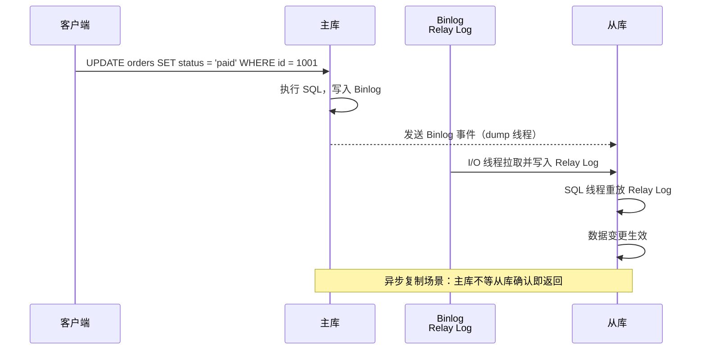
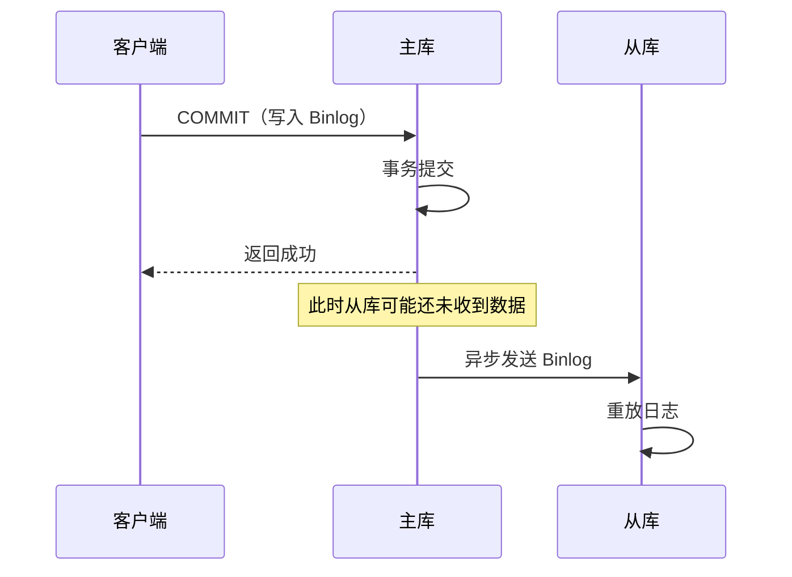
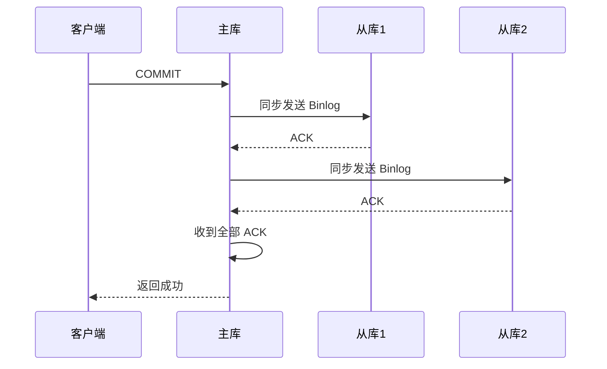
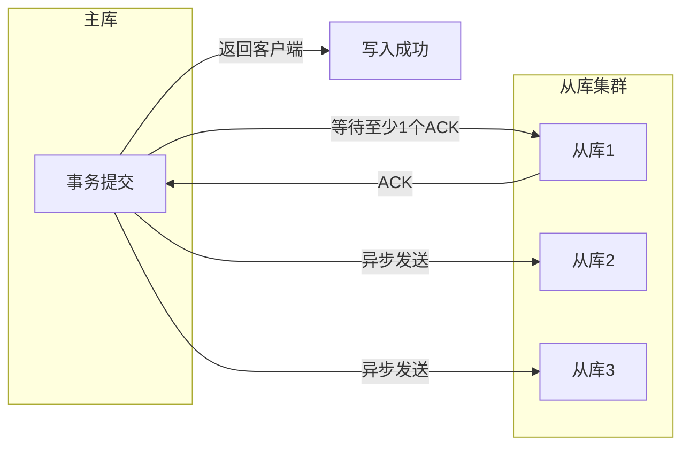
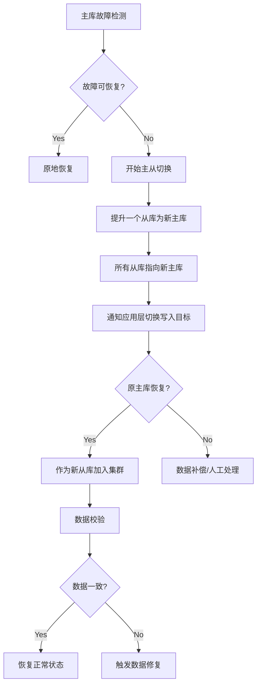
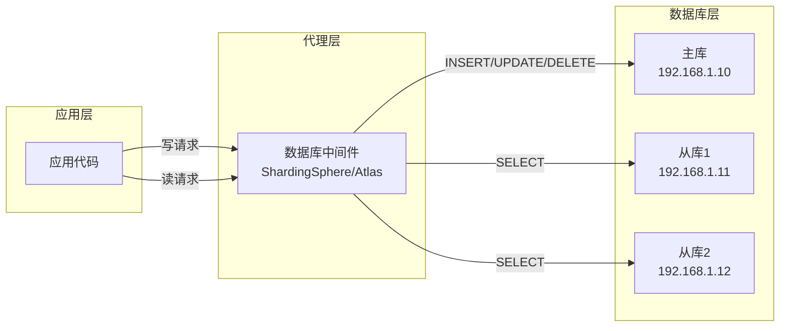

# 主从复制

凌晨两点，监控大屏突然亮起红色告警——主库连接数打满，所有写入请求开始堆积。你紧急检查从库，发现从库的资源使用率只有 30%，完全有能力承接部分负载。问题出在哪？主从复制链路上的某个环节卡住了。

主从复制是分布式数据库最经典的副本模式。它解决的问题很直接：**如何让数据在多个节点间保持一致，同时支持读写分离来提升系统吞吐量？** 理解主从复制的原理与坑点，是每个后端工程师的必修课。

## 复制原理

当客户端发起一条 `UPDATE` 语句修改主库数据时，这条变更如何同步到从库？这取决于复制格式的选择。

### 三种复制格式

| 复制格式 | 原理 | 优点 | 缺点 |
| --- | --- | --- | --- |
| Statement-based（语句复制） | 同步 SQL 语句本身 | 日志体积小、语句可审计 | 函数/时间戳结果不确定、大事务网络开销大 |
| Row-based（行复制） | 同步变更的行数据 | 确定性、精确恢复 | 日志体积大、可读性差 |
| Mixed（混合复制） | 默认语句复制，必要时切换行复制 | 平衡体积与精确性 | 实现复杂 |

MySQL 默认使用混合模式（Mixed），根据语句类型自动选择。`UUID()`、`NOW()`、`RAND()` 等非确定性函数会自动切换为行复制，确保从库执行结果与主库一致。

```sql
-- 查看当前复制格式
SHOW VARIABLES LIKE 'binlog_format';
-- Result: MIXED

-- 动态切换为行复制（需要 SUPER 权限）
SET GLOBAL binlog_format = 'ROW';
```

### 复制链路



从库有两个关键线程：**I/O 线程**负责从主库拉取 Binlog 并写入本地 Relay Log，**SQL 线程**负责读取 Relay Log 并在本地重放。I/O 线程是复制延迟的主要瓶颈——网络带宽、网络延迟、主库负载都会影响它的拉取速度。

## 同步策略：同步 vs 异步

### 异步复制

异步复制下，主库执行完事务后立即返回客户端，不等待从库确认。流程如下：



**优点**：主库延迟低，事务提交快  
**缺点**：主库故障时，未同步的 Binlog 可能丢失（数据不一致风险）

MySQL 默认使用异步复制。多数读多写少的场景可以接受短暂的数据延迟，异步复制的性能优势更明显。

### 同步复制

同步复制要求主库等待所有从库确认写入成功后才返回客户端：



**优点**：主从强一致，任何节点故障不丢数据  
**缺点**：延迟高（= 最慢从库的响应时间）、任一从库故障导致写入阻塞

同步复制适合对数据一致性要求极高的场景，如金融交易。但很少有系统会同步所有从库——通常选择 **半同步复制** 作为折中方案。

### 半同步复制（Semi-sync）

半同步复制是 MySQL 5.7 引入的特性：主库等待**至少一个**从库确认写入成功即可返回，不再要求全部从库确认。

```sql
-- 在主库安装半同步插件
INSTALL PLUGIN rpl_semi_sync_master SONAME 'semisync_master.so';

-- 在从库安装半同步插件
INSTALL PLUGIN rpl_semi_sync_slave SONAME 'semisync_slave.so';

-- 启用半同步复制
SET GLOBAL rpl_semi_sync_master_enabled = ON;
SET GLOBAL rpl_semi_sync_slave_enabled = ON;
```



**效果**：在一致性和性能之间取得平衡。网络抖动导致某个从库响应慢时，只要还有一个从库正常，主库就不会被阻塞。

:::warning
半同步复制有超时机制。默认 `rpl_semi_sync_master_timeout = 10000`（毫秒），超时后主库会退化为异步复制。这意味着在网络分区等极端情况下，数据一致性保证可能降级。生产环境需要监控半同步退化为异步的次数。
:::

## 复制延迟：主从复制的阿喀琉斯之踵

复制延迟是从库落后主库的时间间隔。在高并发写入场景下，从库的处理能力可能跟不上主库。

### 延迟的根因

| 原因 | 表现 | 排查方法 |
| --- | --- | --- |
| 大事务 | 从库重放时间长，单条 SQL 可能执行几分钟 | 避免 `DELETE WHERE id < 10000` 这种大范围删除 |
| 慢查询 | 从库重放期间堆积新 Binlog | `SHOW SLAVE STATUS\G` 查看 `Seconds_Behind_Master` |
| 网络抖动 | I/O 线程拉取 Binlog 变慢 | 检查主从网络延迟 |
| 从库负载高 | SQL 线程与其他查询竞争 CPU/IO | 监控从库 CPU 使用率 |
| 单线程重放 | MySQL 5.6 以前从库 SQL 线程单线程 | MySQL 5.7+ 启用多线程并行重放 |

```sql
-- 查看从库复制状态
SHOW SLAVE STATUS\G

-- 关键指标解读
-- Seconds_Behind_Master: 从库落后主库的秒数（0 表示无延迟）
-- Relay_Log_Space: Relay Log 占用的空间
-- Slave_IO_Running / Slave_SQL_Running: 复制线程状态
```

### 多线程并行重放

MySQL 5.7 引入了 **binlog group commit** 配合 **多线程复制**：

```sql
-- 启用多线程并行重放
SET GLOBAL slave_parallel_type = 'LOGICAL_CLOCK';
SET GLOBAL slave_parallel_workers = 8;

-- 查看并行复制状态
SHOW VARIABLES LIKE 'slave_parallel%';
```

并行重放的核心思想：将 Binlog 中的事务按提交顺序分组成批次，多个 worker 线程并发重放同一批次内不冲突的事务。`LOGICAL_CLOCK` 模式利用了主库的 binlog group commit 特性——同一批次提交的事务在逻辑上没有依赖，可以并行重放。

:::info
从库并行重放受 `slave_parallel_workers` 数量限制。如果业务主要是单表读写（无跨表事务），并行重放效果有限——所有事务实际上都是「冲突」的。如果业务有多表关联写入，适当增加 worker 数量能显著降低延迟。
:::

## 主从切换：当主库故障时

主库故障是每个 DBA 最不愿意面对的场景。切换过程中，最核心的问题是：**新主库是否包含了所有已提交的数据？**

### 切换流程



### 常用切换工具

| 工具 | 特点 | 适用场景 |
| --- | --- | --- |
| MHA（MySQL MHA） | 自动判断主库不可用、选主、切换VIP、补偿 Binlog | MySQL 5.5+ 官方推荐 |
| Orchestrator | Web UI、可视化拓扑、支持手动/自动切换 | 大规模集群运维 |
| MySQL Group Replication | MySQL 原生组复制协议，自动选主 | MySQL 8.0+ |
| Vitess | 内部实现主从切换，对应用透明 | 超大规模部署 |

### 切换的坑

**Binlog 未同步问题**：异步复制下，主库崩溃前最后一批事务可能还在主库的 Binlog 中，尚未发送到从库。如果直接提升从库为主库，这部分数据会丢失。

**"、数据不一致**：新主库和老主库数据不一致时（如双写场景），直接切换会导致数据损坏。切换前必须进行数据校验。

```bash
# pt-table-checksum 数据校验工具
pt-table-checksum --nocheck-replication-filters \
                   --databases=ecommerce \
                   --tables=orders \
                   h=master_host,u=admin,p=password
```

## 读写分离：让从库分担读压力

主从复制的核心价值之一是支持读写分离：将读请求分散到从库，写请求集中在主库，从而提升系统整体吞吐量。

### 路由策略



### ShardingSphere 主从配置

```yaml title="shardingsphere.yaml"
schemaName: sharding_db

dataSources:
  ds_master:
    url: jdbc:mysql://192.168.1.10:3306/ecommerce?useSSL=false
    username: root
    password: password
    connectionPoolClassName: HikariCP
  ds_slave_0:
    url: jdbc:mysql://192.168.1.11:3306/ecommerce?useSSL=false
    username: root
    password: password
  ds_slave_1:
    url: jdbc:mysql://192.168.1.12:3306/ecommerce?useSSL=false
    username: root
    password: password

masterSlaveRule:
  name: ds_ms
  masterDataSourceName: ds_master
  slaveDataSourceNames: ds_slave_0,ds_slave_1

  # 负载均衡策略：随机、轮询、最小连接
  loadBalanceAlgorithmType: ROUND_ROBIN

  # 读写分离策略：强制路由到主库
  props:
    proxy-distSQL-enabled: true
```

```java title="Java 读写分离配置"
@Configuration
public class DataSourceConfig {

    @Bean
    public DataSource dataSource() {
        MasterSlaveRuleConfiguration masterSlaveRuleConfig =
            new MasterSlaveRuleConfiguration(
                "ds_ms",                    // 规则名称
                "ds_master",                // 主库数据源
                Arrays.asList("ds_slave_0", "ds_slave_1")  // 从库列表
            );

        DataSourceConfiguration config = DataSourceConfiguration.getDataSourceConfiguration(
            createDataSourceMap()
        );

        return MasterSlaveDataSourceFactory.createDataSource(
            createDataSourceMap(),
            new MasterSlaveRuleConfiguration[]{masterSlaveRuleConfig},
            new Properties()
        );
    }
}
```

### 读写分离的陷阱

**复制延迟导致读不一致**：用户刚写入数据后立即读取，可能命中从库读到旧值。

```java
// 错误示例：写入后立即读取
public void placeOrder(Order order) {
    orderDAO.insert(order);           // 写主库
    Order result = orderDAO.findById(order.getId());  // 可能读到从库旧值
}
```

**解决方案**：

1. **强制读主库**：对一致性要求高的读取操作，显式指定路由到主库
2. **延迟感知**：应用层感知复制延迟，重要读取走主库
3. **版本号机制**：写入后返回数据版本，读取时校验版本

```java
// 正确示例：强制读主库
public Order placeOrderAndGet(Order order) {
    orderDAO.insert(order);

    // 使用强制路由注释，指定读主库
    return orderDAO.findByIdMaster(order.getId());
}
```

## 术语表

| 术语 | 英文 | 定义 |
| --- | --- | --- |
| Binlog | Binary Log | MySQL 记录所有数据变更的日志文件 |
| Relay Log | Relay Log | 从库接收并存储的 Binlog 副本 |
| GTID | Global Transaction Identifier | 全局唯一事务 ID，便于复制追踪 |
| 复制延迟 | Replication Lag | 从库落后主库的时间 |
| 半同步复制 | Semi-synchronous Replication | 主库等待至少一个从库确认的复制方式 |
| 读写分离 | Read/Write Splitting | 写操作路由主库，读操作分散到从库 |

## 总结

主从复制是分布式数据系统的基石。它的核心价值在于：

1. **高可用**：主库故障时从库可继续提供读服务
2. **读写扩展**：读请求分散到从库，减轻主库压力
3. **数据备份**：从库可作为物理备份，不影响主库性能

但主从复制也有其局限：

- **复制延迟**：异步复制下从库可能落后
- **单点写入**：所有写都打到主库，写入瓶颈依然存在
- **切换复杂度**：主从切换需要仔细处理数据一致性问题

下一章我们将讨论**多主复制**，看看如何突破单点写入的限制，以及随之而来的新挑战——冲突解决。
