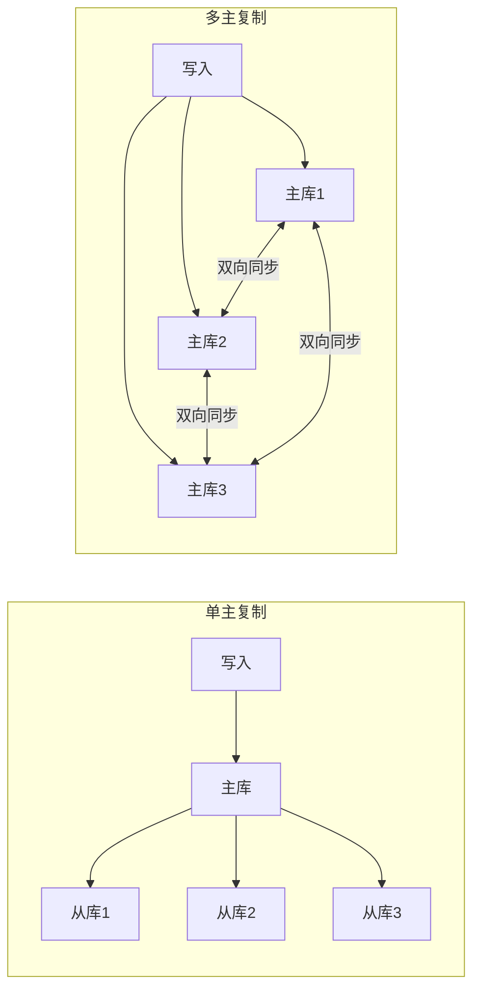
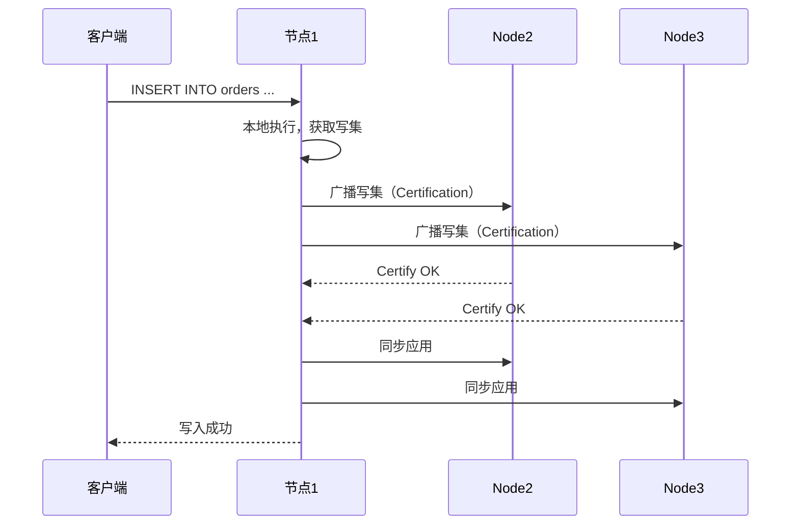
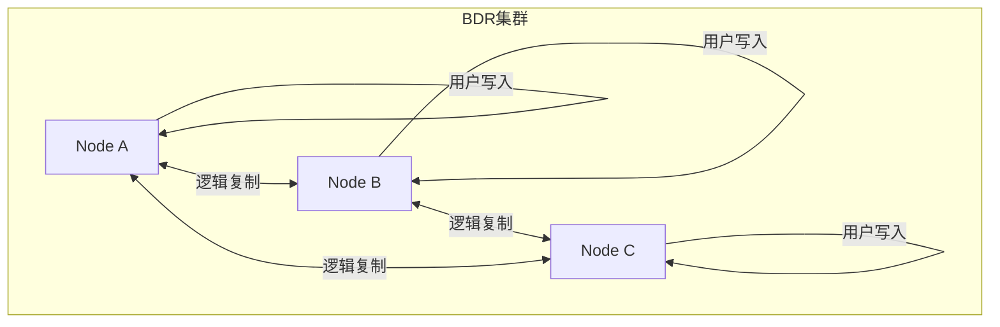

# 多主复制

双十一零点，订单量瞬间暴涨，单个主库已经扛不住写入压力。你想到一个方案：让两个机房各有一个主库，每个机房只写本地的数据库，然后双向同步。听起来很完美——但上线第一天就出现了问题：某用户在 A 机房下的订单，在 B 机房查不到。两边同时修改了同一行数据，谁也不让谁。

多主复制（Multi-Master Replication）解决了单主复制的写入瓶颈问题，但也带来了新的复杂性：**冲突**。当你允许多个节点同时接受写入时，如何保证最终数据一致，是每个多主系统必须回答的问题。

## 为什么需要多主复制

单主复制的瓶颈在于写入：所有写操作都打到同一个主库。在高写入场景下，主库成为系统的阿喀琉斯之踵。

多主复制的核心价值：

1. **写入水平扩展**：多个主库分担写入压力
2. **地理位置优化**：用户就近写入本地数据中心，减少写入延迟
3. **高可用保障**：单个主库故障不影响其他主库服务



## 双向复制的冲突问题

多主复制的核心挑战是**冲突**。当两个主库同时修改同一行数据时，应该听谁的？

### 冲突场景

| 场景 | 主库1 | 主库2 | 结果 |
| --- | --- | --- | --- |
| 同时写入不同字段 | `UPDATE user SET name='张三' WHERE id=1` | `UPDATE user SET phone='138...' WHERE id=1` | 无冲突，可合并 |
| 同时写入相同字段 | `UPDATE user SET name='张三' WHERE id=1` | `UPDATE user SET name='李四' WHERE id=1` | **冲突** |
| 先删后改 | `DELETE FROM user WHERE id=1` | `UPDATE user SET name='王五' WHERE id=1` | **冲突**（记录不存在） |
| 唯一索引冲突 | `INSERT INTO order VALUES(1001, ...)` | `INSERT INTO order VALUES(1001, ...)` | **冲突**（主键冲突） |

### 冲突解决策略

#### 策略一：最后写入胜出（LWW）

最简单粗暴的策略：谁的时间戳最新，谁赢。

```
冲突数据：
  - 主库1: name = '张三'，时间戳 = 1001
  - 主库2: name = '李四'，时间戳 = 1002
  结果：name = '李四'
```

**优点**：实现简单、吞吐高  
**缺点**：时间戳依赖本地时钟，时钟漂移可能导致数据丢失

```sql
-- MySQL 的 LWW 实现（使用 user_update_time 列）
UPDATE users
SET name = '张三',
    update_time = UNIX_TIMESTAMP()
WHERE id = 1;

-- 读取时取 update_time 最大的记录
SELECT * FROM users ORDER BY update_time DESC LIMIT 1;
```

#### 策略二：向量时钟（Version Vector）

每个节点维护自己的逻辑时钟，发生冲突时根据因果关系判断。

```
向量时钟：
  - 主库1: {master1: 5, master2: 3}
  - 主库2: {master1: 4, master2: 4}
  
如果一个时钟所有维度都 >= 另一个，说明它更新
如果两个时钟互不包含（并发修改），需要人工介入或业务规则解决
```

DynamoDB、Cassandra 使用向量时钟检测并发冲突。详细原理见 [向量时钟原理](/distributed-theory/logical-clock/vector)。

#### 策略三：应用层合并

根据业务语义解决冲突，不依赖时间戳或版本。

```java
// 库存系统：乐观锁 + 版本号
public class InventoryService {
    public boolean deductStock(Long productId, Integer quantity) {
        return jdbcTemplate.execute("""
            UPDATE inventory
            SET stock = stock - ?
            WHERE product_id = ?
              AND stock >= ?
              AND version = ?
            """, preparedStatement -> {
                preparedStatement.setInt(1, quantity);
                preparedStatement.setLong(2, productId);
                preparedStatement.setInt(3, quantity);
                preparedStatement.setLong(4, currentVersion);
                return preparedStatement.executeUpdate() > 0;
            });
    }
}
```

## 单主 vs 多主对比

| 维度 | 单主复制 | 多主复制 |
| --- | --- | --- |
| 写入扩展性 | 受限于单主库性能 | 可水平扩展，多主分担写入 |
| 写入延迟 | 所有写入跨数据中心延迟相同 | 用户就近写入，延迟更低 |
| 一致性保证 | 简单，无冲突 | 需要处理写冲突 |
| 复杂度 | 低 | 高 |
| 故障影响 | 主库故障影响所有写入 | 单主故障不影响其他主库 |
| 适用场景 | 写入量可接受、单机房优先 | 高写入量、跨地域部署 |

## MySQL 多主方案：Galera Cluster

MySQL 传统复制是异步的，多主场景下冲突难以避免。**MySQL Galera Cluster** 提供了同步多主复制，通过 **_certification-based replication** 保证了无冲突。

### Galera 原理



Galera 的核心是 **Certification Test**：每个节点在应用事务前，检查这个事务的写集是否与已提交事务冲突。如果没有冲突，事务被认证通过，可以安全应用。

### Galera 配置

```ini title="my.cnf"
[mysqld]
# Galera 必需配置
wsrep_provider = /usr/lib/galera/libgalera_smm.so
wsrep_cluster_name = my_cluster
wsrep_cluster_address = gcomm://192.168.1.10,192.168.1.11,192.168.1.12

# 节点地址（用于 Galera 内部通信）
wsrep_node_address = 192.168.1.10
wsrep_node_name = node1

# 复制模式
# certifications 认证
wsrep_rep_provider = galera

# 单主模式（自动选主）或 多主模式
wsrep_slave_threads = 16
```

```bash
# 启动第一个节点（引导集群）
mysqld --wsrep-new-cluster &

# 其他节点正常启动即可加入
mysqld &
```

:::warning
Galera 的 certification 机制保证了无冲突，但**不保证冲突的业务语义正确**。例如：两个主库同时给同一用户加积分，certification 通过了（写集不冲突），但用户的积分被加了两次。业务层面的幂等和去重需要自行实现。
:::

## PostgreSQL 多主：BDR

PostgreSQL 的双向复制方案是 **BDR（Bi-Directional Replication）**，基于逻辑复制实现。

### BDR 核心概念



BDR 使用 **WAL（Write-Ahead Log）** 作为数据源，通过逻辑解码提取变更。每个节点既是数据源也是目标，变更在节点间双向流动。

### BDR 配置

```sql
-- 在所有节点执行：创建 BDR 扩展
CREATE EXTENSION bdr;

-- 在一个节点创建复制源
SELECT bdr.create_node(
    node_name := 'node1',
    local_database := 'ecommerce',
    local_edge := '00000000-0000-0000-0000-000000000000'
);

-- 在其他节点加入（需要连接到现有节点）
SELECT bdr.connect_bdr_group(
    local_node_name := 'node2',
    local_database := 'ecommerce',
    remote_connection_string := 'host=192.168.1.11 user=postgres dbname=ecommerce'
);
```

## 真实案例：跨机房多主的踩坑经历

> **某电商公司跨机房多主部署的教训**
>
> 场景：订单系统在两个机房部署，使用 Galera Cluster 做双向同步。
>
> 问题1：**网络抖动时的写入阻塞**。当两个机房之间的网络延迟超过阈值（默认 5 秒）时，Galera 会暂停写入以保证一致性。但这导致正常情况下用户写入被阻塞。
>
> 解决：调整 `wsrep_sync_wait` 参数，只在关键操作（如支付）时强制一致读。
>
> 问题2：**大事务导致的死锁**。批量更新订单状态时，事务太大导致 certification 超时。
>
> 解决：拆分为小事务批量执行，每个事务控制在 1000 行以内。
>
> 问题3：**字符集不一致导致的同步失败**。两个机房的 MySQL 配置不同（utf8mb4 vs utf8），导致同步报错。
>
> 解决：所有节点统一使用 utf8mb4 配置，并在应用层做好字符集校验。

## 冲突解决权衡矩阵

| 策略 | 复杂度 | 性能影响 | 一致性保证 | 适用场景 |
| --- | --- | --- | --- | --- |
| LWW | 低 | 低 | 最终一致 | 缓存、计数器 |
| 向量时钟 | 中 | 中 | 因果一致 | Dynamo/Cassandra |
| 应用层合并 | 高 | 低 | 业务自定义 | 库存、账户 |
| 同步认证（Galera） | 高 | 中 | 强一致 | 金融交易 |

## 何时使用多主复制

### 适合使用多主的场景

- **写入量极高**，单主库性能瓶颈明显
- **跨地域部署**，用户需要就近写入
- **高可用要求高**，单主故障导致全站写入不可用不可接受
- **业务冲突可控制**，如不同业务线写入不同表

### 不适合使用多主的场景

- **强一致性要求高**：冲突解决总是有代价，如果业务不能容忍任何数据损失，不要用多主
- **冲突频繁**：如果多个主库经常写入同一行，多主反而成为性能瓶颈
- **团队规模小**：多主的运维复杂度远超单主，小团队慎用

:::danger
不要为了「技术先进」而选择多主。如果单主复制能满足业务需求，保持简单。主从复制 + 读写分离已经能解决 80% 的性能问题。
:::

## 术语表

| 术语 | 英文 | 定义 |
| --- | --- | --- |
| 双主复制 | Dual-Master | 两个主库互相复制对方的变更 |
| 冲突解决 | Conflict Resolution | 多主同时写入同一数据时的处理策略 |
| LWW | Last Write Wins | 最后写入胜出的冲突解决策略 |
| 向量时钟 | Version Vector | 记录多节点逻辑时间的向量，用于检测并发冲突 |
| Certification | Certification Test | Galera 中验证事务是否与其他已提交事务冲突的机制 |
| 逻辑复制 | Logical Replication | 基于 WAL 解码的复制方式，与物理复制相对 |
| BDR | Bi-Directional Replication | PostgreSQL 的双向复制方案 |

## 总结

多主复制是突破单主写入瓶颈的利器，但代价是引入了冲突问题。选择多主复制前，需要回答三个问题：

1. **业务冲突频率有多高？** 如果多个主库经常写入同一行数据，多主会引入大量复杂度
2. **团队能 hold 住多主的运维吗？** Galera/BDR 的运维比传统复制复杂得多
3. **真的需要多主吗？** 分库分表、读写分离、连接池优化可能已经够用

如果三个问题的答案都是「不」，那保持单主复制是更明智的选择。下一章我们将讨论**无主复制**，看看没有主节点的概念下，数据如何分布和一致。