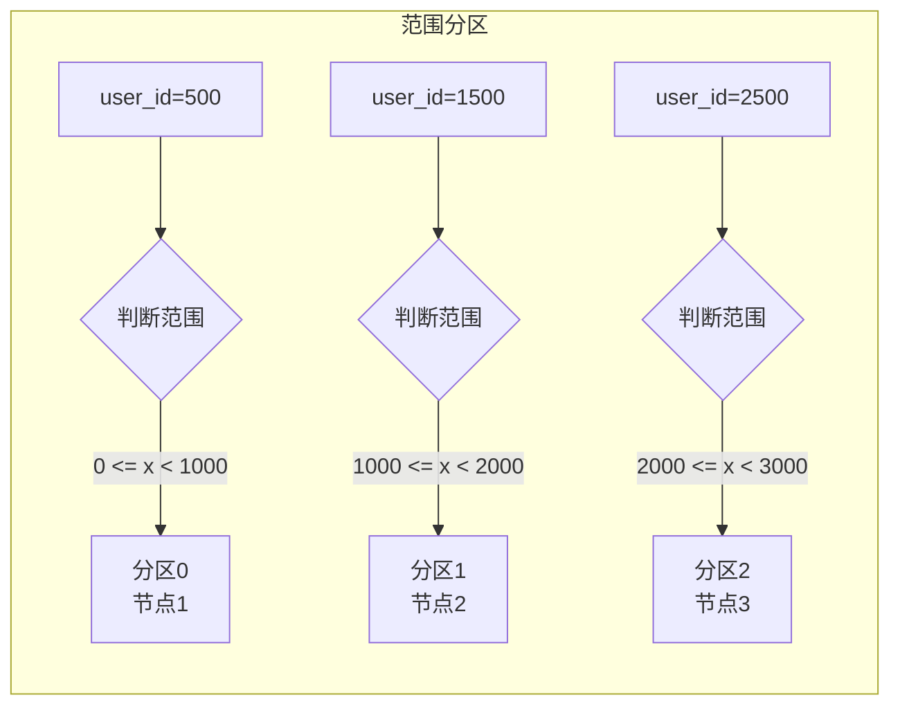
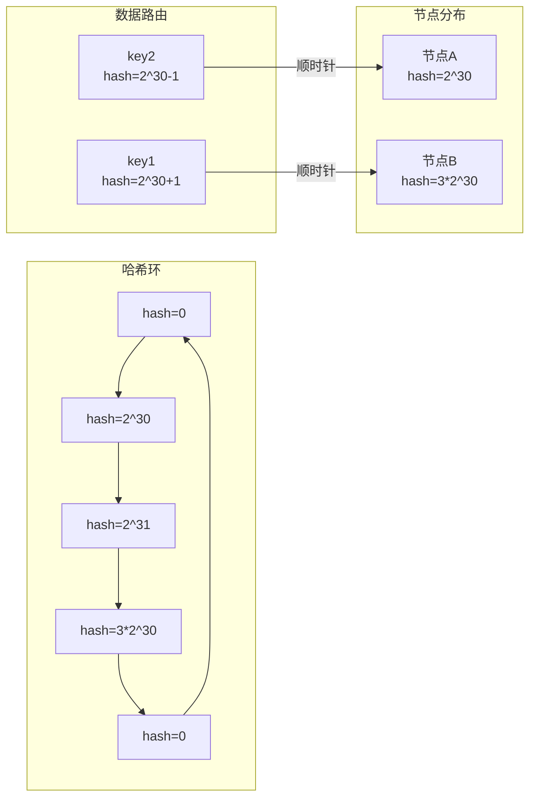
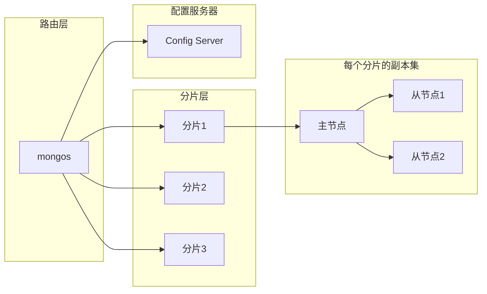
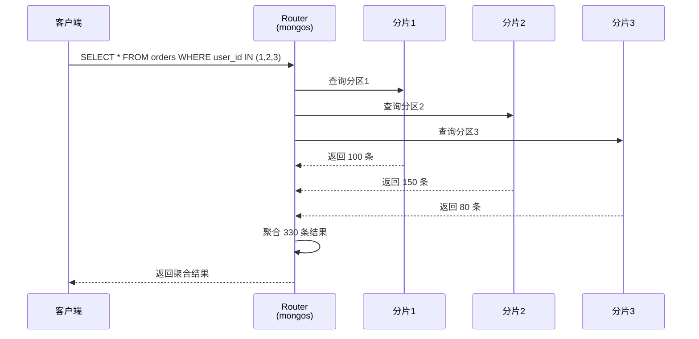

# 数据分区策略

当你的数据库从 GB 级增长到 TB 级，单机存储开始触及天花板。添加内存、加装 SSD——硬件升级能撑一时，但不能撑一世。是时候考虑**数据分区（Sharding）**了。

数据分区的核心问题只有一个：**如何把数据分散到多个节点，同时保证查询效率？** 这个问题看似简单，答案却不唯一。哈希分区、范围分区、一致性哈希——每种策略都有其适用场景和trade-off。

## 为什么需要数据分区

单机数据库的性能上限受限于硬件：

| 资源 | 瓶颈表现 |
| --- | --- |
| 磁盘容量 | 存储空间耗尽，无法写入 |
| IOPS | 高并发读取时响应时间飙升 |
| 内存 | 缓存命中率下降，大量磁盘 IO |
| 连接数 | 连接池耗尽，新请求排队 |

分区通过**水平拆分**突破单机瓶颈：

```
单机：
┌─────────────────────────┐
│        所有数据          │
│   (1000万条订单)         │
└─────────────────────────┘

分区后：
┌───────────┐ ┌───────────┐ ┌───────────┐
│  节点1     │ │  节点2     │ │  节点3     │
│  330万条   │ │  330万条   │ │  340万条   │
└───────────┘ └───────────┘ └───────────┘
```

每个节点只需处理部分数据，性能线性提升。

## 策略一：哈希分区

### 核心原理

哈希分区将分区键的哈希值取模，根据结果决定数据落入哪个分区：

```
分区数 = N

hash(key) % N → 分区编号
```

```java
public class HashPartitioner {
    private final int numPartitions;

    public HashPartitioner(int numPartitions) {
        this.numPartitions = numPartitions;
    }

    public int getPartition(String key) {
        // 字符串哈希取模
        int hash = key.hashCode();
        // 解决负数问题
        return (hash & 0x7FFFFFFF) % numPartitions;
    }

    public int getPartition(long key) {
        // 长整型取模
        return ((int) (key ^ (key >>> 32))) & 0x7FFFFFFF) % numPartitions;
    }
}
```

### 哈希分区示意

```mermaid
flowchart LR
    subgraph 哈希分区
        K1[key=user_001] --> H1[hash()]
        K2[key=user_002] --> H2[hash()]
        K3[key=user_003] --> H3[hash()]

        H1 --> M["% 4"]
        H2 --> M
        H3 --> M

        M --> P1[分区0]
        M --> P2[分区1]
        M --> P3[分区2]
        M --> P4[分区3]
    end
```

### 优点与缺点

| 优点 | 缺点 |
| --- | --- |
| 数据分布均匀 | 无法做范围查询 |
| 实现简单 | 增删节点代价大（所有数据重分布） |
| 写入分散，无热点 | 跨分区聚合查询性能差 |

### 适用场景

- **用户 ID 分区**：查询往往按用户 ID 直接定位，无范围需求
- **订单 ID 分区**：订单查询通常指定订单 ID
- **会话 ID 分区**：缓存场景，按会话 ID 分散

```sql
-- 哈希分区示例（MySQL）
CREATE TABLE orders (
    order_id BIGINT,
    user_id BIGINT,
    amount DECIMAL(10,2),
    created_at TIMESTAMP,
    PRIMARY KEY (order_id, created_at)
) PARTITION BY HASH(order_id) PARTITIONS 8;
```

## 策略二：范围分区

### 核心原理

范围分区按照分区键的值域进行分区，每个分区覆盖一个连续区间：

```
分区1: [0, 1000000)     → 节点1
分区2: [1000000, 2000000) → 节点2
分区3: [2000000, 3000000) → 节点3
```

```java
public class RangePartitioner {
    private final List<Range> ranges;

    public RangePartitioner(List<Range> ranges) {
        this.ranges = ranges;
    }

    public int getPartition(long key) {
        for (int i = 0; i < ranges.size(); i++) {
            if (key >= ranges.get(i).start && key < ranges.get(i).end) {
                return i;
            }
        }
        throw new IllegalArgumentException("Key out of range: " + key);
    }

    // 按时间范围分区示例
    public int getPartitionByTime(LocalDateTime time) {
        int year = time.getYear();
        int month = time.getMonthValue();
        // 按年月分区：2024-01 -> 分区0, 2024-02 -> 分区1
        return (year - 2020) * 12 + month - 1;
    }
}
```

### 范围分区示意



### 优点与缺点

| 优点 | 缺点 |
| --- | --- |
| 支持范围查询 | 可能产生热点（热点分区负载高） |
| 增删分区代价小（只影响相邻分区） | 数据分布不均（依赖业务特征） |
| 跨分区查询相对友好 | 需要预先规划分区边界 |

### 适用场景

- **时间序列数据**：按时间分区，查询近期数据只需扫描少量分区
- **日志系统**：按日期分区，清理历史数据只需删除分区
- **报表系统**：按月份分区，聚合查询性能好

```sql
-- 范围分区示例（MySQL）
CREATE TABLE logs (
    id BIGINT,
    created_at TIMESTAMP,
    level VARCHAR(10),
    message TEXT,
    PRIMARY KEY (id, created_at)
) PARTITION BY RANGE (UNIX_TIMESTAMP(created_at)) (
    PARTITION p_2024_01 VALUES LESS THAN (UNIX_TIMESTAMP('2024-02-01')),
    PARTITION p_2024_02 VALUES LESS THAN (UNIX_TIMESTAMP('2024-03-01')),
    PARTITION p_2024_03 VALUES LESS THAN (UNIX_TIMESTAMP('2024-04-01')),
    PARTITION p_future VALUES LESS THAN MAXVALUE
);
```

### 热点分区问题

范围分区的最大风险是**热点分区**。如果某个分区数据量远超其他分区：

```java
// 热点检测与告警
public class HotPartitionDetector {
    public void detectAndAlert() {
        Map<String, Long> partitionSizes = getPartitionSizes();

        long avgSize = calculateAverage(partitionSizes.values());
        long threshold = avgSize * 3; // 超过平均值3倍视为热点

        partitionSizes.entrySet().stream()
            .filter(e -> e.getValue() > threshold)
            .forEach(e -> alert("Hot partition: " + e.getKey() +
                               ", size: " + formatSize(e.getValue())));
    }
}
```

:::warning
按时间分区时，如果业务量在某个时间段激增（如双十一），该时间段的分区会变成热点。解决方案是**按时间+哈希复合分区**，或定期拆分热点分区。
:::

## 策略三：一致性哈希

### 核心原理

普通哈希分区的问题是：**增删节点导致所有数据重新分布**。即使只增加一个节点，所有数据的哈希取模结果都可能改变。

一致性哈希通过引入**哈希环**解决了这个问题：

```
          0°
           │
           │
    270°───┼──── 90°
           │
           │
          180°
```

数据顺时针找到最近的节点：

```java
public class ConsistentHashRing<T> {
    private final SortedMap<Long, T> ring = new TreeMap<>();
    private final int virtualNodes; // 虚拟节点数

    public ConsistentHashRing(Collection<T> nodes, int virtualNodes) {
        this.virtualNodes = virtualNodes;
        for (T node : nodes) {
            addNode(node);
        }
    }

    public void addNode(T node) {
        // 为每个物理节点创建多个虚拟节点
        for (int i = 0; i < virtualNodes; i++) {
            long hash = hash(node.toString() + "_vn_" + i);
            ring.put(hash, node);
        }
    }

    public T getNode(String key) {
        if (ring.isEmpty()) {
            throw new IllegalStateException("Ring is empty");
        }

        long hash = hash(key);
        // 找到第一个大于等于 hash 的节点
        Map.Entry<Long, T> entry = ring.ceilingEntry(hash);

        // 如果没有，找到环的第一个节点
        if (entry == null) {
            entry = ring.firstEntry();
        }

        return entry.getValue();
    }

    private long hash(String key) {
        // MurmurHash 或其他均匀分布的哈希算法
        return MurmurHash.hash(key);
    }
}
```

### 一致性哈希示意



### 虚拟节点：解决数据倾斜

一致性哈希有个问题：**节点在环上的分布不均匀时，数据分布也不均匀**。

解决方法是引入**虚拟节点（Virtual Nodes）**：

```java
// 虚拟节点 vs 物理节点
public class VirtualNodeDemo {
    // 物理节点只有 3 个
    // 但虚拟节点有 150 个（每个物理节点 50 个）
    // 虚拟节点均匀分布在环上 → 数据均匀分布

    public static void main(String[] args) {
        // 物理节点
        List<String> physicalNodes = Arrays.asList(
            "192.168.1.10",
            "192.168.1.11",
            "192.168.1.12"
        );

        // 每个物理节点 50 个虚拟节点
        ConsistentHashRing<String> ring = new ConsistentHashRing<>(
            physicalNodes, 50
        );

        // 测试数据分布
        Map<String, Integer> distribution = new HashMap<>();
        for (int i = 0; i < 10000; i++) {
            String key = "user_" + i;
            String node = ring.getNode(key);
            distribution.merge(node, 1, Integer::sum);
        }

        // 打印分布（应该接近均匀：3300, 3300, 3400）
        distribution.forEach((node, count) ->
            System.out.println(node + ": " + count + " (" +
                String.format("%.1f", count * 100.0 / 10000) + "%)")
        );
    }
}
```

### 节点增删的影响

```
新增节点前：                    新增节点后：
     ┌───┐                        ┌───┐
     │ A │数据落在A               │ A │数据落在A（大部分）
     └───┘                        └───┘
       ↑                             ↑
    数据落在A                     节点C只"抢走"A的一小部分数据
                                其他节点不受影响！
```

**核心优势**：新增/移除节点时，只有相邻节点的数据需要迁移。

### Cassandra 的一致性哈希实现

```yaml title="cassandra.yaml"
# Cassandra 使用一致性哈希 + 虚拟节点
# 默认每个节点 256 个虚拟节点（vnode）
num_tokens: 256

# 初始化新节点时分配 Token
# 可以手动指定或让 Cassandra 自动分配
# initial_token: ...
```

```sql
-- 查看 Token 分布
SELECT peer, tokens FROM system.peers;

-- 计算新节点的 Token（简单版）
-- Token = hash(node_ip) / 256 * 2^127
```

## 三种策略对比

| 维度 | 哈希分区 | 范围分区 | 一致性哈希 |
| --- | --- | --- | --- |
| 数据均匀性 | 均匀 | 依赖业务特征 | 均匀（虚拟节点） |
| 范围查询 | 不支持 | **优秀** | 部分支持 |
| 增删节点 | 所有数据重分布 | 只影响相邻分区 | 只影响相邻节点 |
| 实现复杂度 | 低 | 中 | 高 |
| 热点问题 | 无 | 可能 | 可能 |
| 典型场景 | 用户分片 | 时序数据 | 分布式缓存 |

## 分区与副本的结合

分区解决的是**数据分散存储**问题，副本解决的是**数据高可用**问题。实际系统往往同时使用两者。

### MongoDB Sharded Cluster



```bash
# 添加分片
sh.addShard("replica_set_name/192.168.1.10:27017")

# 开启分片
sh.enableSharding("ecommerce")

# 设置分片键
sh.shardCollection("ecommerce.orders", 
    { "user_id": "hashed" }  # 哈希分片
)

# 或者范围分片
sh.shardCollection("ecommerce.logs", 
    { "created_at": 1 }  # 1 表示升序
)
```

## 分区键选择：最关键的决策

错误的分区键是分区策略失败的主要原因。

### 好的分区键

| 特征 | 示例 | 原因 |
| --- | --- | --- |
| 高基数 | user_id、order_id | 避免热点 |
| 查询友好 | user_id | 查询直接定位分区 |
| 写入分散 | user_id | 写入分散到各节点 |

### 坏的分区键

| 特征 | 问题 | 解决方案 |
| --- | --- | --- |
| 低基数 | status（只有几个值） | 复合分区键 |
| 时序前缀 | created_at（太集中） | hash(created_at + random) |
| 单一业务键 | 店铺ID（热门店铺是热点） | 复合分区键 + 热点拆分 |

### 复合分区键

```sql
-- 复合分区键示例
-- 主分区：年（范围）
-- 次分区：用户ID（哈希）
ALTER TABLE orders PARTITION BY RANGE (YEAR(created_at))
SUBPARTITION BY HASH(user_id) SUBPARTITIONS 16 (
    PARTITION p_2023 VALUES LESS THAN (2024),
    PARTITION p_2024 VALUES LESS THAN (2025),
    PARTITION p_future VALUES LESS THAN MAXVALUE
);
```

## 跨分区查询的挑战

分区后，跨分区的操作变得困难：

### Scatter-Gather 查询



### 跨分区分页问题

```java
// 跨分区分页的坑
public class CrossPartitionPagination {
    // 错误示例：跨分区分页导致数据重复或遗漏
    public PageResult<User> badPagination(List<Shard> shards, int page, int size) {
        List<User> allUsers = new ArrayList<>();

        // 第一步：从每个分片获取第一页
        for (Shard shard : shards) {
            List<User> users = shard.query(0, size);  // 每页 size 条
            allUsers.addAll(users);
        }

        // 第二步：本地分页
        int fromIndex = (page - 1) * size;
        return new PageResult<>(
            allUsers.subList(fromIndex, Math.min(fromIndex + size, allUsers.size())),
            allUsers.size()
        );
    }

    // 问题：第二页可能包含第一页已经返回过的数据！
    // 因为各分片的"第一页"是独立的
}
```

### 解决方案

1. **禁止跨分区分页**：只允许单分区内的分页
2. **游标分页**：使用上次查询的游标（最后一条数据的 ID）
3. **全局索引**：使用全局索引表记录汇总信息

```java
// 游标分页解决方案
public class CursorPagination {
    public List<Order> paginateByCursor(Long userId, String cursor, int size) {
        if (cursor == null) {
            // 首次查询：定位分区，然后按时间排序
            int shardId = getShardIdByUserId(userId);
            return queryShard(shardId, null, size);
        }

        // 后续查询：使用游标直接定位
        Order lastOrder = decodeCursor(cursor);  // 解析游标
        int shardId = getShardIdByUserId(userId);
        return queryShard(shardId, lastOrder.getCreatedAt(), size);
    }

    private String encodeCursor(Order order) {
        // 游标 = 分片ID + 时间戳 + 订单ID（确保唯一性）
        return String.format("%d_%d_%d",
            order.getShardId(),
            order.getCreatedAt().getTime(),
            order.getId()
        );
    }
}
```

## 代码示例：一致性哈希环

```java
public class ConsistentHashRing<T> {
    private final TreeMap<Long, T> ring = new TreeMap<>();
    private final HashFunction hashFunction;
    private final int virtualNodes;

    public ConsistentHashRing(Collection<T> nodes, int virtualNodes) {
        this(nodes, virtualNodes, MurmurHash::hash);
    }

    public ConsistentHashRing(Collection<T> nodes, int virtualNodes,
                            HashFunction hashFunction) {
        this.virtualNodes = virtualNodes;
        this.hashFunction = hashFunction;

        for (T node : nodes) {
            addNode(node);
        }
    }

    public void addNode(T node) {
        for (int i = 0; i < virtualNodes; i++) {
            long hash = hashFunction.hash(node.toString() + "_vn_" + i);
            ring.put(hash, node);
        }
    }

    public void removeNode(T node) {
        for (int i = 0; i < virtualNodes; i++) {
            long hash = hashFunction.hash(node.toString() + "_vn_" + i);
            ring.remove(hash);
        }
    }

    public T getNode(String key) {
        if (ring.isEmpty()) {
            throw new IllegalStateException("Ring is empty");
        }

        long hash = hashFunction.hash(key);
        Map.Entry<Long, T> entry = ring.ceilingEntry(hash);

        if (entry == null) {
            entry = ring.firstEntry();
        }

        return entry.getValue();
    }

    @FunctionalInterface
    public interface HashFunction {
        long hash(String key);
    }

    // 测试
    public static void main(String[] args) {
        List<String> nodes = Arrays.asList("NodeA", "NodeB", "NodeC");
        ConsistentHashRing<String> ring = new ConsistentHashRing<>(nodes, 100);

        Map<String, Integer> distribution = new HashMap<>();
        for (int i = 0; i < 10000; i++) {
            String key = "user_" + i;
            String node = ring.getNode(key);
            distribution.merge(node, 1, Integer::sum);
        }

        distribution.forEach((node, count) ->
            System.out.printf("%s: %d (%.1f%%)%n", node, count, count * 100.0 / 10000)
        );
    }
}
```

## 权衡矩阵

| 策略 | 数据均匀性 | 范围查询 | 增删节点影响 | 实现复杂度 | 适用场景 |
| --- | --- | --- | --- | --- | --- |
| 哈希分区 | 均匀 | 不支持 | 全量迁移 | 低 | 用户分片、会话分片 |
| 范围分区 | 不均匀 | **优秀** | 局部迁移 | 中 | 时序数据、日志 |
| 一致性哈希 | 均匀 | 部分支持 | 局部迁移 | 高 | 分布式缓存、CDN |

## 术语表

| 术语 | 英文 | 定义 |
| --- | --- | --- |
| 数据分区 | Sharding/Partitioning | 将数据水平拆分到多个节点的技术 |
| 分区键 | Partition Key | 决定数据落入哪个分区的键 |
| 一致性哈希 | Consistent Hashing | 环状哈希空间，最小化节点增删影响 |
| 虚拟节点 | Virtual Node | 一致性哈希中，每个物理节点对应多个虚拟节点 |
| Scatter-Gather | Scatter-Gather | 将请求分散到多个节点，然后聚合结果的查询模式 |
| 热点分区 | Hot Partition | 访问量远超平均水平的分区 |
| 复合分区键 | Composite Partition Key | 多个字段组合的分区键 |

## 总结

数据分区是突破单机存储瓶颈的关键技术。选择正确的分区策略需要考虑：

1. **查询模式**：是点查为主还是范围查询为主？
2. **数据分布**：写入是否集中在某个维度？
3. **扩展性**：未来是否可能增删节点？
4. **跨分区需求**：业务是否需要频繁跨分区查询？

没有完美的策略，只有最适合业务场景的策略。哈希分区适合点查场景，范围分区适合时序数据，一致性哈希适合需要频繁扩缩容的系统。

本模块的七篇文章到此结束。从主从复制到无主复制，从 Quorum 到 Hinted Handoff，从 Anti-Entropy 到数据分区——分布式数据系统的核心挑战和解决方案都已覆盖。希望这些内容能帮助你构建更可靠的分布式系统。