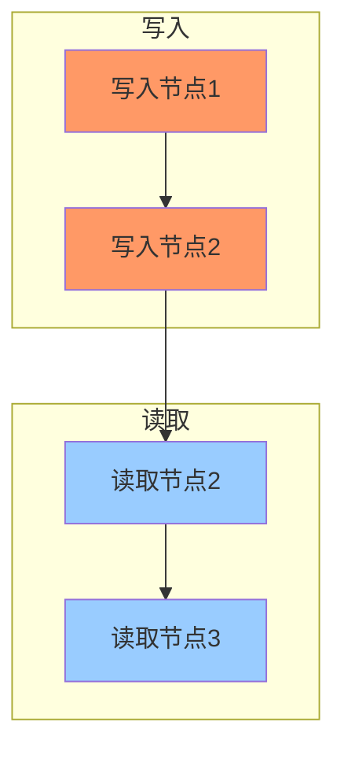
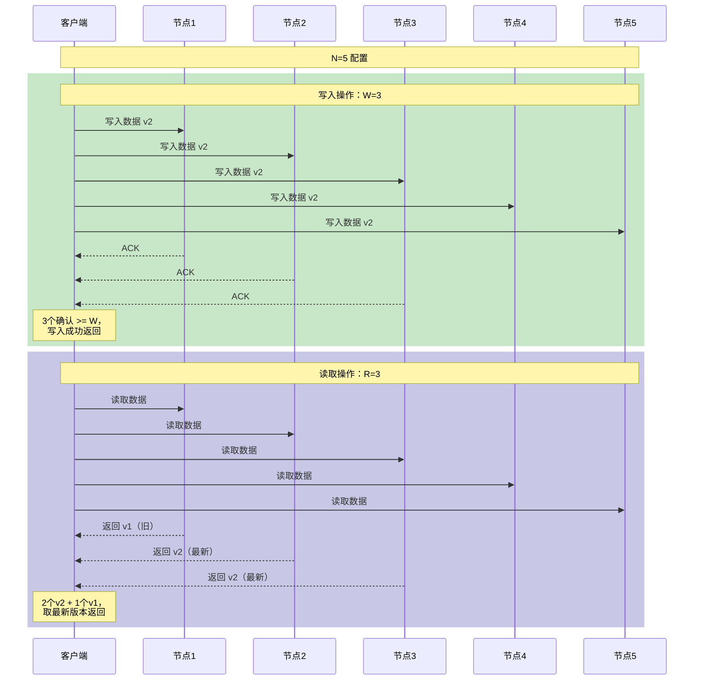
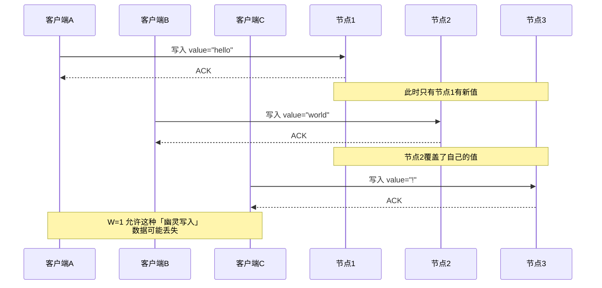
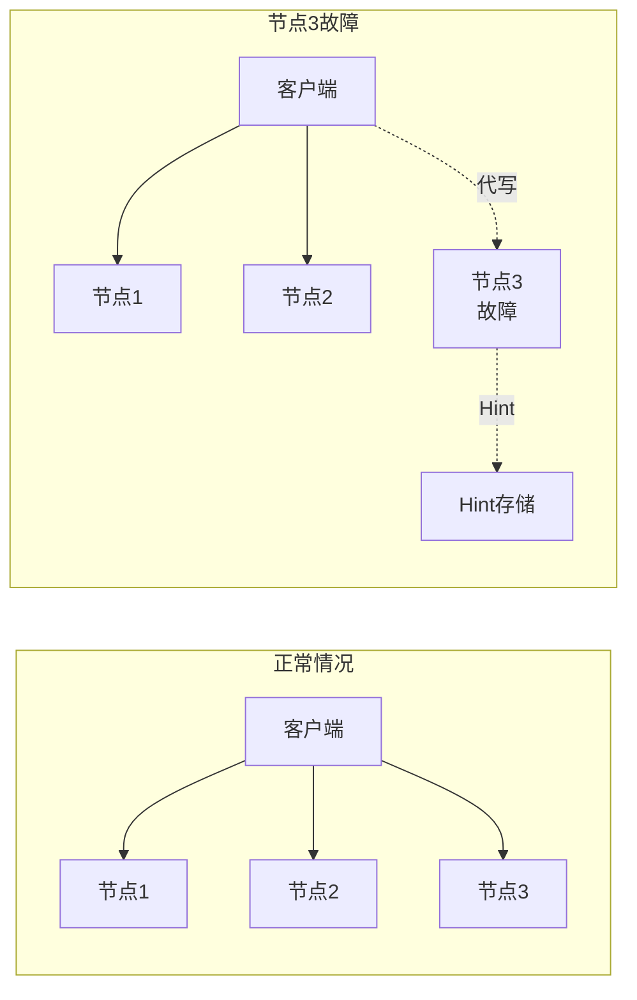

# Quorum 机制详解

分布式系统最核心的问题之一是：**如何在节点故障时依然保证数据一致？** 解决这个问题的一个优雅方案是 **Quorum**——一种基于「多数派」思想的数学机制。

想象一个三个人组成的小组，任何重大决定都需要至少两个人同意。这就是 Quorum 的直观理解。在分布式系统中，Quorum 机制保证：**即使部分节点故障，只要还有足够数量的节点存活，系统就能继续正确工作。**

## Quorum 的定义

Quorum（法定人数）是一种广泛应用于分布式系统的共识技术。它的核心思想是：

- **N 个副本中，需要至少 W 个节点确认写入，才算写入成功**
- **N 个副本中，需要至少 R 个节点返回数据，才算读取成功**

当 W + R `>` N 时，就保证了**强一致性**：任何读取操作都能至少在一个节点上获得最新写入的数据。

### 为什么是 W + R `>` N？

这个公式背后有深刻的数学原理。考虑以下场景：



N=3, W=2, R=2 的配置下：

1. 写入 quorum = 任意 2 个节点（节点1, 节点2）
2. 读取 quorum = 任意 2 个节点（节点2, 节点3）
3. 交集 = `\{节点2\}` ≠ ∅

**任何写入 quorum 和读取 quorum 一定有交集**，这意味着读取一定能读到最新写入的数据。

## N/W/R 三元组配置

### 参数含义

| 参数 | 全称 | 含义 | 取值范围 |
| --- | --- | --- | --- |
| N | Number of replicas | 总副本数 | `1` ~ `集群节点数` |
| W | Write quorum | 写入成功所需确认数 | `1` ~ `N` |
| R | Read quorum | 读取成功所需返回数 | `1` ~ `N` |

### 典型配置组合

| N | W | R | 特点 | 适用场景 |
|---|---|---|---|---|
| 3 | 3 | 1 | 强一致写入，读取快 | 写入后立即读取、审计日志 |
| 3 | 1 | 3 | 强一致读取，写入快 | 读多写少、历史数据查询 |
| 3 | 2 | 2 | 平衡读写 | **默认推荐配置** |
| 5 | 3 | 2 | 容忍 2 节点故障 | 大规模集群 |
| 5 | 2 | 3 | 读取优先 | 报表、分析场景 |
| 7 | 4 | 4 | 容忍 3 节点故障 | 金融级存储 |

### 一致性保证

```
W + R > N  →  强读取（Read Your Writes，一定能读到自己的写入）
W + R <= N →  最终一致（可能读到旧数据）
W > N/2    →  避免脑裂（写入 quorum 是多数派）
```

## N=5 集群的 Quorum 读写示意



### 写入过程详解

1. 客户端并发向所有 N 个节点发送写入请求
2. 等待 W 个节点返回成功确认
3. 返回客户端写入成功（此时已有多数派节点存储了新数据）

### 读取过程详解

1. 客户端并发向所有 N 个节点发送读取请求
2. 等待 R 个节点返回数据
3. 从返回的数据中选择「最新」的版本（通过版本号或向量时钟判断）
4. 如果需要，向旧版本节点发送修复请求（Read Repair）

## 少数派写入问题

当 W `<=` N/2 时，存在一个严重问题：**少数派写入可能导致数据被覆盖**。

### 问题场景

```
N=3, W=1 配置：

时间线：
T1: 客户端A写入节点1（写入成功，因为W=1）
T2: 客户端B写入节点2（写入成功，因为W=1）
T3: 客户端C写入节点3（写入成功，因为W=1）

结果：三个节点存储了三个不同的值！
       读取时可能得到任意一个结果
```



### 解决方案

**始终使用 W `>` N/2 的配置**：

- N=3：W 必须是 2 或 3
- N=5：W 必须是 3、4 或 5
- N=7：W 必须是 4、5、6 或 7

:::warning
Redis Cluster 使用 N=3（每个分片 3 副本），写入默认要求 W=1。但 Redis 提供了 `WAIT` 命令允许等待更多副本确认：`WAIT 2 1000` 表示等待 2 个副本确认，最多等待 1000ms。
:::

## 领导者（Hinted Handoff）

当 Quorum 无法达成时（如部分节点长时间故障），无主复制系统使用 **Hinted Handoff** 机制确保数据不丢失。

### 原理

当某个节点无法响应时，其他节点代为处理写入请求，并记录「提示」（Hint），说明这个数据应该属于哪个节点。



### 时效性

Hints 不会永久保存。如果故障节点在**过期时间**内恢复，Hints 被正常处理；如果超过过期时间，Hints 被丢弃，数据通过其他机制（如 Anti-Entropy）恢复。

## 权衡矩阵：不同 N/W/R 配置对比

| N | W | R | 一致性 | 写入吞吐 | 读取吞吐 | 容忍故障数 | 适用场景 |
|---|---|---|--------|---------|---------|----------|------------|
| 3 | 1 | 3 | 最终一致 | 最高 | 中 | 0 | 低价值数据、日志 |
| 3 | 2 | 1 | 最终一致 | 中 | 最高 | 0 | 读多写少 |
| 3 | 2 | 2 | **强一致** | 中 | 中 | 1 | **通用场景** |
| 3 | 3 | 1 | 强一致写入 | 低 | 高 | 0 | 审计、重要配置 |
| 5 | 3 | 2 | 强一致 | 中 | 中 | 2 | 大规模集群 |
| 5 | 3 | 3 | 强一致 | 中 | 低 | 2 | 高可靠存储 |
| 7 | 4 | 4 | 强一致 | 低 | 低 | 3 | 金融级存储 |

### 性能计算

假设单节点写入延迟为 5ms，网络延迟为 1ms：

| 配置 | 写入延迟 | 读取延迟（命中最新） |
| --- | --- | --- |
| W=1 | 6ms（最快单节点） | 不保证 |
| W=2, R=2 (N=3) | ~12ms | ~12ms |
| W=3, R=1 (N=3) | ~18ms | 6ms |

## Raft 算法中的 Quorum

Quorum 不仅是 Dynamo/Cassandra 的核心机制，也是 Raft、Paxos 等共识算法的基础。

### Raft 的 Quorum

Raft 算法要求 **majority（多数派）** 同意才能完成操作：

- **选举 Quorum**：赢得 N/2 + 1 票才能成为 Leader
- **日志复制**：写入需要复制到 N/2 + 1 节点才提交

```java
// Raft 日志复制简化实现
public class RaftNode {
    private int quorumSize = (totalNodes / 2) + 1;

    public boolean appendEntries(List<LogEntry> entries) {
        int acks = 0;

        // 并发发送日志到所有节点
        List<Future<Boolean>> futures = sendAppendEntries(entries);

        // 等待多数派确认
        for (Future<Boolean> future : futures) {
            try {
                if (future.get(timeout, TimeUnit.MILLISECONDS)) {
                    acks++;
                }
            } catch (Exception e) {
                // 节点故障，继续等待其他节点
            }
        }

        // 只有获得多数派确认才提交
        if (acks >= quorumSize) {
            commitIndex = entries.get(entries.size() - 1).getIndex();
            return true;
        }
        return false;
    }
}
```

### 与 Dynamo Quorum 的区别

| 维度 | Raft Quorum | Dynamo Quorum |
| --- | --- | --- |
| 目标 | 共识（所有节点执行相同命令） | 可调整的一致性（读写分离） |
| 写入 | 必须通过 Leader | 任意节点都可以是写入协调者 |
| 读取 | 通过 Leader（线性一致性） | 可配置（强一致或最终一致） |
| 复制 | 同步（所有节点写入成功才提交） | 可配置（W 可小于 N） |

## 实际应用场景

### 场景一：分布式协调服务（etcd）

etcd 使用 Raft 协议，数据复制遵循 majority 原则：

```bash
# etcd 集群配置（3节点）
ETCD_INITIAL_CLUSTER_STATE=new
ETCD_INITIAL_CLUSTER="infra0=http://10.0.0.1:2380,infra1=http://10.0.0.2:2380,infra2=http://10.0.0.3:2380"
```

- N = 3
- 写入需要 3 个节点中的 2 个确认（majority = 2）
- 容忍 1 节点故障

### 场景二：Cassandra

Cassandra 的 Quorum 计算：

```sql
-- 计算 quorum
-- CONSISTENCY_LEVEL.QUORUM = (replication_factor / 2) + 1

-- 副本数为 3 时
-- QUORUM = (3/2) + 1 = 2

-- 执行强一致性读取
CONSISTENCY LEVEL QUORUM;
SELECT * FROM orders WHERE user_id = 'user_001';

-- 执行全局强一致写入
CONSISTENCY LEVEL QUORUM;
INSERT INTO orders ...;
```

### 场景三：DynamoDB

DynamoDB 的读写配置：

```java
// DynamoDB Java SDK 配置
AmazonDynamoDB client = AmazonDynamoDBClientBuilder.standard()
    .withRegion(Regions.US_EAST_1)
    .build();

Map<String, AttributeValue> item = new HashMap<>();
item.put("order_id", new AttributeValue().withS("order_001"));
item.put("status", new AttributeValue().withS("paid"));

// 使用 QUORUM 一致性级别
PutItemRequest request = new PutItemRequest()
    .withTableName("Orders")
    .withItem(item)
    .withReturnConsumedCapacity(ReturnConsumedCapacity.TOTAL);

client.putItem(request);
```

## 术语表

| 术语 | 英文 | 定义 |
| --- | --- | --- |
| Quorum | Quorum | 分布式系统中多数派的概念，用于保证共识 |
| Write Quorum | W | 写入成功所需的最小节点确认数 |
| Read Quorum | R | 读取成功所需的最小节点返回数 |
| Replica Count | N | 总副本数 |
| Majority | Majority | 超过半数的节点数，即 ⌊N/2⌋ + 1 |
| Strong Consistency | Strong Consistency | W + R `>` N 时的强读取保证 |
| Eventual Consistency | Eventual Consistency | W + R `<=` N 时的一致性级别 |
| Split Brain | Split Brain | 脑裂，集群分裂为多个独立部分 |

## 总结

Quorum 是分布式系统一致性的数学基石。它的核心洞察是：**只要写入和读取都接触到多数派节点，就能保证一定能读到最新写入的数据。**

理解 Quorum 需要掌握三个关键点：

1. **W + R `>` N 是强一致的充要条件**：这是由多数派交集保证的数学事实
2. **W `>` N/2 避免脑裂**：只有多数派写入才能防止数据被覆盖
3. **N/W/R 的选择是权衡**：没有最优配置，只有最适合业务场景的配置

下一章我们将讲解 **Hinted Handoff**，看看当 Quorum 无法达成时，无主复制系统如何保证数据不丢失。