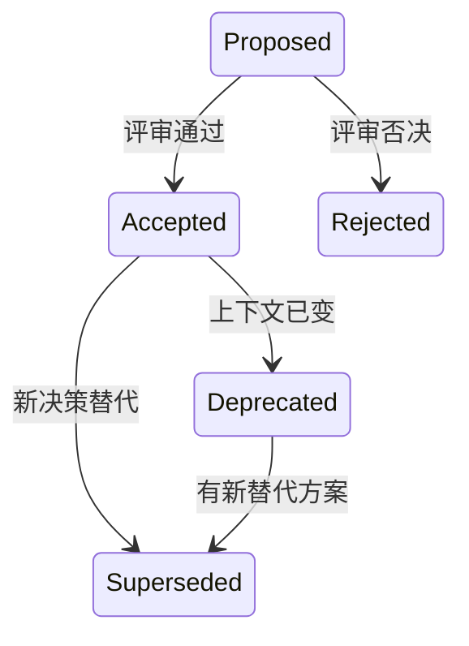

# ADR 编写规范

2019 年，某公司的核心支付系统进行了一次重大架构调整：从单体架构切换到微服务架构。决策很顺利，迁移也很成功。一年后，系统稳定运行，团队对这次决策非常满意。

2022 年，公司招聘了一名资深工程师。他发现支付系统中有一个模块的性能明显低于预期，于是开始排查。当他问到「为什么这个模块要设计成这样」时，没有人能回答。最初做决策的技术负责人早已离职，而当时的讨论都记录在即时通讯工具的聊天记录里，早已无法追溯。

他花了 **3 个月** 才理解这个设计的真实原因：原来当初是为了兼容一个已经废弃的第三方支付通道，而这个通道在三年前就已经停止合作了。代码里那个「奇怪的逻辑」是历史遗留问题，但他花了很长时间才确认这一点。

如果当初有一份 ADR，记录「为什么选择这种设计、当时的背景是什么」，这位工程师不需要花 3 个月，只需要 3 天就能理解全貌。

## 什么是 ADR

ADR（Architecture Decision Record，架构决策记录）是一种结构化的文档格式，用于记录架构决策的背景、方案、选择理由和后果。

ADR 不是架构设计文档，不是技术方案，不是流程文档。它只记录**已经做出的决策**。它的核心价值是提供决策的上下文，让后来者能够理解「为什么当初要这样设计」。

一个好的 ADR 回答三个问题：

1. **背景**：这个问题是什么时候、在什么情况下被提出来的？
2. **决策**：最终选择了哪个方案，为什么？
3. **后果**：这个决策带来了什么收益，又带来了什么代价？

ADR 的核心原则是**简洁和可维护**。ADR 不是论文，不需要长篇大论；ADR 是快照，每个决策一页纸足够了。

## ADR 的生命周期

ADR 不是写完就结束的文件，它有自己的生命周期：



### 提案阶段（Proposed）

当团队发现一个需要架构决策的问题时，先起草 ADR 并标记状态为 `Proposed`。提案阶段需要：

- 清晰描述问题和背景
- 列出至少两个可选方案
- 分析每个方案的优缺点
- 说明推荐方案及理由

提案阶段不需要团队全员同意，但需要有明确的决策者和决策时间。

### 已接受（Accepted）

评审通过后，ADR 状态更新为 `Accepted`，表示该决策已是团队共识，已被纳入架构体系。已接受的 ADR 仍然可以被质疑和重新评审，但推翻已接受决策需要走完整的评审流程。

### 已废弃（Deprecated）

当某个决策的上下文已经发生变化，例如业务场景已不存在、第三方依赖已停止服务、技术栈已迁移，需要将对应 ADR 标记为 `Deprecated`。已废弃的 ADR 不应被作为决策依据，但应保留作为历史参考。

### 已替代（Superseded）

当有新的 ADR 替代现有 ADR 时，原 ADR 标记为 `Superseded`，并在新 ADR 中引用被替代的 ADR 编号。已替代的 ADR 形成完整的决策链，让后来者能够追溯决策的演变过程。

## ADR 的核心要素

ADR 的结构相对简单，但每个要素都有其存在的理由：

| 要素 | 说明 | 必需 |
| --- | --- | --- |
| 编号 | 唯一标识，如 `ADR-0001` | 是 |
| 标题 | 简明描述决策内容 | 是 |
| 状态 | Proposed/Accepted/Deprecated/Superseded | �� |
| 背景 | 决策的问题场景 | 是 |
| 决策 | 最终选择的方案 | 是 |
| 后果 | 正面后果、负面后果、待定后果 | 是 |

背景部分要说明「为什么这个问题需要被解决」，而不是「问题是什么」。例如，不写「数据库性能差」，而写「随着订单量增长，单库查询延迟从 10ms 上升到 200ms，已影响核心交易链路」。

决策部分要说明「选择了什么方案」和「为什么选择这个方案」。要避免写成「经过讨论，决定采用方案 A」，而要说明「选择方案 A 的核心原因是……」。

后果部分是最容易被忽略、但最有价值的部分。正面后果让团队知道决策带来了什么收益；负面后果让团队提前知道需要关注的问题；待定后果让团队知道还有哪些未知数需要观察。

## ADR 编号规范

ADR 编号采用 `ADR-XXXX` 格式，其中 `XXXX` 为四位数字，从 `0001` 开始。

编号一旦分配就不应重复或回收，即使对应的 ADR 已被废弃或替代。已废弃的 ADR 保留原编号，已替代的 ADR 在新 ADR 中通过 `Supersedes: ADR-XXXX` 引用旧 ADR。

例如：

- `ADR-0001` 选择消息队列
- `ADR-0002` 选择 MySQL 作为主数据库
- `ADR-0003` 选择 Redis 作为缓存层
- `ADR-0047` 是最新通过的 ADR

多个相关的 ADR 可以有连续编号，但不强求。

## 好 ADR vs 差 ADR

一个差的 ADR 长这样：

```markdown
# ADR-001: 使用 MySQL 作为数据库

## 背景
我们需要一个数据库。

## 决策
使用 MySQL。

## 后果
使用 MySQL 存储数据。
```

这个 ADR 说了什么有价值的信息吗？没有。它既没有说明为什么选 MySQL 而不是 PostgreSQL 或 MongoDB，也没有说明这个决策的代价和风险。

一个好的 ADR 长这样：

```markdown
# ADR-001: 选择 MySQL 作为主数据库

## 状态
Accepted

## 背景
系统需要持久化存储订单、用户、交易数据。预计 3 年内数据量增长到 5000 万行。需要支持 ACID 事务保证资金安全。

## 决策
选择 MySQL 8.0 作为主数据库，使用 InnoDB 引擎。

## 理由
1. 团队对 MySQL 最为熟悉，学习成本最低
2. 事务支持完善，满足资金类场景的 ACID 要求
3. 生态成熟，社区活跃，问题容易找到解决方案
4. 与现有运维体系兼容，无需新增运维能力

## 替代方案
- PostgreSQL：功能更强大，但团队不熟悉，预计需要 2 周额外学习
- MongoDB：文档模型灵活，但事务支持较弱，不适合金融场景

## 后果

### 正面
- 团队无学习成本，可快速上手
- 事务支持完善，资金安全有保障
- 运维成熟，备份、监控、迁移都有成熟方案

### 负面
- 水平扩展需要分库分表，单机性能有上限
- 复杂查询（多表关联、深度分页）性能较差
- Schema 变更需要锁表，需要在低峰期执行

### 待定
- 如果单表超过 5000 万行，需要评估分库分表方案
```

这个 ADR 提供了足够的上下文，让后来者能够理解决策的全貌。

## ADR 存放位置

ADR 应该与代码存放在一起，而不是存放在独立的文档系统中。

推荐目录结构：

```
project/
├── docs/
│   └── adr/
│       ├── adr-0001.md
│       ├── adr-0002.md
│       └── ...
├── src/
├── package.json
└── README.md
```

放在代码仓库中有几个好处：

- ADR 与代码同步演进，代码变了 ADR 能同步更新
- 新成员克隆代码时自动获得 ADR，无需额外查找
- 通过版本控制记录 ADR 的历史变更

如果项目已有 `docs/` 目录，ADR 应放在 `docs/adr/` 下；如果项目没有文档目录，可以放在根目录的 `doc/` 或 `docs/` 下。

## 真实案例：没有 ADR 的代价

某公司技术团队在 2018 年做了一个技术选型：使用 Elasticsearch 作为搜索服务。当时选 Elasticsearch 的理由很简单——功能强大、性能好、业界流行。

但这个决策没有被记录。两年后，团队扩张，原来的技术负责人离职。新来的工程师发现 Elasticsearch 集群的运维成本很高，每次集群出问题都需要找运维团队协助，而且搜索功能的使用率其实很低——每天只有几千次查询，远没有达到需要 Elasticsearch 的规模。

团队开始讨论：要不要换掉 Elasticsearch？但没有人能说清楚「为什么当初选了 Elasticsearch」，所以这个讨论变成了纯粹的「重新评估」，浪费了大量时间。

最后团队评估后发现，如果当初使用 MySQL 的全文索引，完全可以满足业务需求，而且运维成本会低很多。但这个结论花了两周时间才确认，因为没有人知道当时的决策背景。

如果当初有一份 ADR，记录「当时选择 Elasticsearch 是因为预计搜索量会达到每天百万级别，但目前实际只有几千次」，团队就不需要重新评估，可以直接讨论「这个决策是否还适用」。

这就是 ADR 的价值：**它不是为现在的人写的，而是为未来的人写的**。

## 常见问题

**Q：什么规模的决策需要写 ADR？**

A：ADR 适合记录「重要的、不可逆的、需要跨团队共识的」决策。如果一个决策的影响范围只在一个模块内部，且未来很容易回退，就不需要写 ADR。例如「这个模块用 Redis 还是本地缓存」这类决策，如果选错了影响可控，就不需要 ADR。但如果「选消息队列」这类影响系统架构的决策，就需要 ADR。

**Q：ADR 的篇幅应该多长？**

A：建议控制在一页 A4 纸以内。如果超过两页，说明信息过于冗余，需要精简。但也不必刻意压缩，必要的信息不能省略。

**Q：ADR 写错了怎么办？**

A：ADR 是历史记录，不应该修改。如果发现 ADR 有错误，应该写一个新的 ADR 来修正，并在新 ADR 中引用旧 ADR。例如，新 ADR 可以写「本 ADR 替代 ADR-001，原决策因上下文变化不再适用」。

**Q：ADR 太多后如何管理？**

A：如果 ADR 超过 50 个，可以按主题目录分类，如 `docs/adr/database/`、`docs/adr/messaging/`。但每类的 ADR 仍然保持全局连续编号。

## 总结

ADR 是架构决策的可追溯记录。它的价值不是文档本身，而是决策过程的可追溯性。

写 ADR 不是为了证明「我们做了正确的决策」，而是让后来者能够理解「当时为什么这样决策」，以及「这个决策在什么情况下仍然适用」。

好 ADR 的标准不是「信息量最大」，而是「能够让一个不了解背景的工程师，在 10 分钟内理解决策的全貌」。

下一节我们将介绍[权衡框架与决策树](/evolution-cases/adr/tradeoff-framework)，讲解如何在 ADR 中系统化地权衡方案。