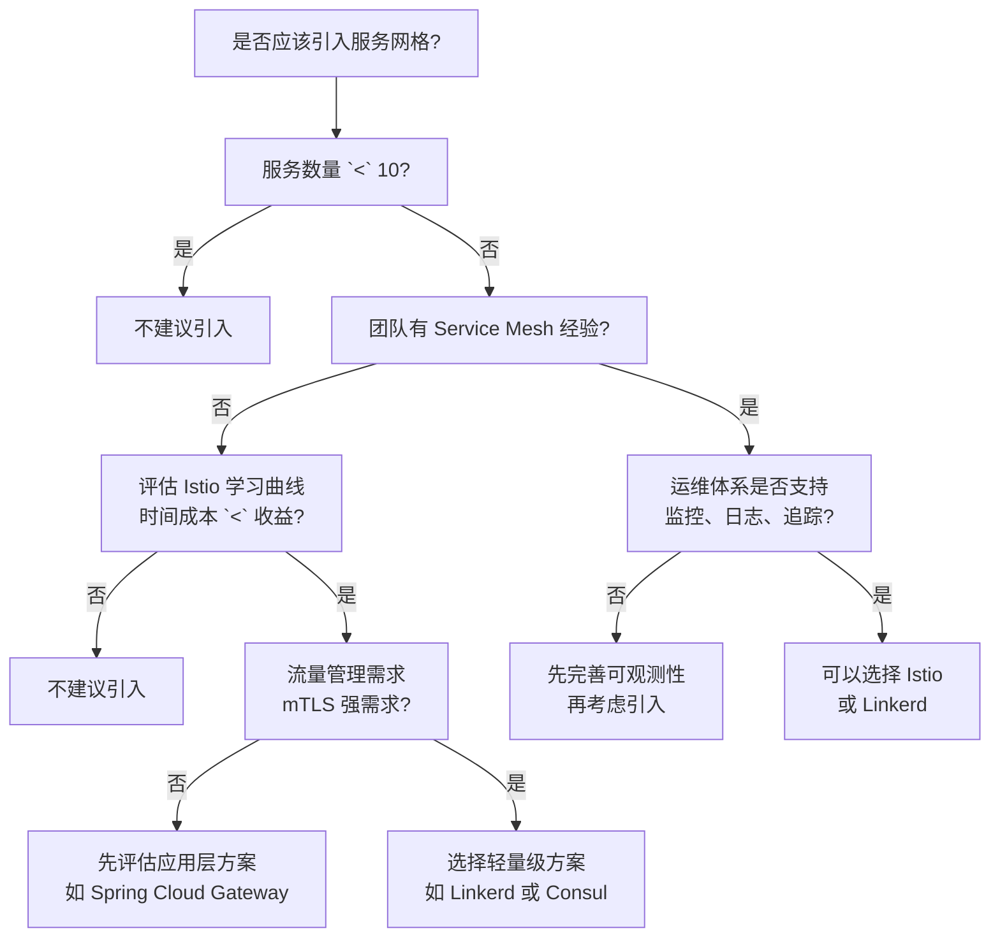

# 权衡框架与决策树

技术选型是架构师最核心的工作之一。但很多团队的技术选型是这样的：团队里资历最深的人说「我们用 Kafka」，然后就开始用了。没有人分析为什么选 Kafka 而不是 RabbitMQ，没有人讨论选 Kafka 的代价，没有人记录选型过程。

这种选型方式的隐患在于：当系统出现问题时，团队不知道问题出在哪里。Kafka 的运维复杂度很高，但如果选型时没有评估这一点，等到真正上线后发现运维成本超出预期，就为时已晚。

技术选型的核心不是「哪个方案最好」，而是「我们愿意牺牲什么来换取什么」。每个方案都有代价，关键是找到最适合当前场景的平衡点。

## 权衡维度

技术选型时需要评估的维度很多，但核心的六个维度是：

| 维度 | 说明 | 评估问题 |
| --- | --- | --- |
| **功能完整性** | 方案能否满足业务需求 | 需求能否实现？边界情况如何处理？ |
| **性能** | 方案的吞吐量和延迟表现 | QPS 能到多少？P99 延迟是多少？ |
| **成本** | 方案的总拥有成本（TCO） | 采购成本、运维成本、人力成本分别是多少？ |
| **复杂度** | 方案引入的系统复杂度 | 团队能掌握吗？学习曲线有多陡？ |
| **可维护性** | 方案的长期维护成本 | 出问题能排查吗？升级兼容吗？ |
| **厂商锁定** | 方案对特定供应商的依赖程度 | 迁移成本高吗？有替代方案吗？ |

这六个维度不是同等重要的。不同场景下，权重的优先级不同。例如，在业务初期，速度最重要，复杂度可以适当容忍；在业务稳定期，可维护性最重要，性能可以适当放宽。

## 决策矩阵

当有多个备选方案时，决策矩阵是量化比较的有效工具。

决策矩阵的基本结构是：

1. 列出所有评估维度
2. 为每个维度设置权重（总权重为 100%）
3. 为每个方案在每个维度打分（1-5 分）
4. 计算加权总分

例如，选择消息队列时的决策矩阵：

| 维度 | 权重 | Kafka | RabbitMQ | RocketMQ |
| --- | --- | --- | --- | --- |
| 功能完整性 | 25% | 5 | 4 | 4 |
| 性能 | 20% | 5 | 3 | 4 |
| 成本 | 20% | 3 | 4 | 4 |
| 复杂度 | 20% | 2 | 4 | 3 |
| 可维护性 | 15% | 3 | 4 | 4 |
| **加权总分** | 100% | **3.7** | **3.85** | **3.85** |

但决策矩阵有个陷阱：**权重和分数都是主观的**。不同的人、不同的场景，权重差异很大。用决策矩阵不是为了得到「客观正确的答案」，而是让团队讨论时有共同的框架，避免遗漏重要维度。

## 权衡框架

每做一个技术选型，都要回答三个问题：

1. **我们愿意牺牲什么？** 每个方案都有代价，我们需要知道这个代价是什么
2. **我们换取到了什么？** 方案带来的收益是什么，是否值得付出那个代价
3. **这个权衡会变化吗？** 随着业务发展，这个权衡会不会逆转

### 功能 vs 复杂度

这是一个常见的权衡陷阱。很多团队追求「功能最强大」的方案，但功能强大的方案往往也最复杂。

例如，选择消息队列时，Kafka 的功能确实最强大——高吞吐量、持久化、exactly-once 语义、Stream processing。但 Kafka 的复杂度也是最高的——需要专业的运维团队、需要理解分区和副本机制、需要处理 Rebalance 问题。

如果你的团队只有 3 个人，每天消息量只有 10 万条，选 Kafka 就是在用牛刀杀鸡。RabbitMQ 足够满足需求，运维复杂度也低得多。

功能完整性和复杂度之间的权衡，本质上是「现在��工作」和「未来的工作」之间的权衡。选简单的方案，现在轻松，但未来可能需要迁移；选复杂的方案，现在辛苦，但未来扩展性更好。

### 性能 vs 成本

性能越好的方案，成本通常也越高。但这里有个反直觉的事实：**很多场景下，我们不需要最高性能**。

例如，Elasticsearch 的搜索性能确实比 MySQL 全文索引好很多。但在日均搜索量只有几千次的场景下，MySQL 全文索引完全够用。你不需要为了「快一点」而引入 Elasticsearch 的运维复杂度。

性能与成本的权衡，本质上是「边际收益」的评估。性能从 100ms 优化到 10ms，可能带来显著的业务价值；但从 10ms 优化到 1ms，在大多数场景下用户根本感知不到差异。

### 可维护性 vs 厂商锁定

选择成熟方案（如 MySQL、Kafka）可以降低可维护性风险，但会增加厂商锁定的风险——如果未来需要迁移，迁移成本很高。选择开源或云原生方案可以降低厂商锁定风险，但可能增加可维护性风险——方案不够成熟，问题文档少。

这个权衡没有标准答案，取决于业务对稳定性的要求和对长期灵活性的要求。

## 反直觉的权衡

技术选型中有几个反直觉的事实：

### 简单方案往往是正确选择

很多工程师追求「正确」的方案，认为简单方案「不够专业」。但实际上，在大多数场景下，简单方案就是正确方案。

Stripe 早期选择 Ruby on Rails 而不是更「高性能」的技术栈，因为 Rails 的开发速度足够支撑业务增长。他们没有在性能上花太多精力，而是把精力放在了产品上。等业务规模增长后，他们再逐步优化。

简单方案的优势在于：

- 学习成本低，团队能快速掌握
- 运维成本低，不需要专业技能
- 问题容易排查，调试效率高
- 迁移成本低，换方案时损失小

### 「完美的方案」往往是不存在的

很多团队在选型时追求「最佳方案」，花大量时间对比各种方案的优劣。但实际上，在大多数场景下，不存在「最佳方案」，只有「当前最合适的方案」。

选型的目的是支撑业务发展，而不是证明技术实力。一个「不完美但够用」的方案，远好过一个「完美但团队驾驭不了」的方案。

### 代价往往比预期大

很多团队评估选型时，只评估了「表面代价」，忽略了「隐性代价」。

例如，选择 Kubernetes 时，表面代价是「学习 Kubernetes」；隐性代价包括：

- 需要重新设计应用的部署方式
- 需要建立 CI/CD 流程
- 需要培训运维团队
- 需要建立监控、日志、告警体系
- 需要处理 Kubernetes 的各种边界情况

技术债务往往在选型时没有被充分评估，等到真正使用时才发现成本超出预期。

## 决策树工具

决策树是可视化技术选型逻辑的有效工具。决策树的每个节点是一个决策点，每个分支是一个可能的选项，每个叶子节点是一个最终结论。

用「是否应该引入服务网格」作为案例，决策树如下：



决策树的核心价值不是给出「正确答案」，而是让团队在选型时有清晰的逻辑路径。当团队争论时，可以用决策树来明确「我们在哪个节点上有分歧」。

## 案例：用决策树分析「是否应该引入服务网格」

某公司有 20 个微服务，计划在半年内扩展到 50 个。团队在讨论是否引入 Istio 作为服务网格方案。

使用决策树分析：

**节点 1：服务数量是否超过 10？**

超过 50 个服务，答案是「是」，继续。

**节点 2：团队是否有 Service Mesh 经验？**

团队对 Istio 几乎没有经验，需要从头学习。答案是「否」，进入「评估学习成本」分支。

**节点 3：学习 Istio 的时间成本是否小于收益？**

Istio 的学习曲线较陡，预计需要 1 个月才能掌握基础操作。同时，团队有 Spring Cloud 背景，已经有基于 Spring Cloud Gateway 的流量管理方案。评估后发现，学习 Istio 的收益是「更好的流量管理和可观测性」，但成本是「1 个月学习时间 + 运维复杂度增加」。当前阶段，这个成本大于收益。

**结论：当前不建议引入 Istio，先使用 Spring Cloud Gateway 满足流量管理需求。**

这个结论不是「Istio 不好」，而是「当前阶段 Istio 的代价大于收益」。等服务数量超过 100 个、流量管理需求更复杂时，可以重新评估。

## 权衡记录

在 ADR 中，权衡应该被清晰记录，而不是隐藏。

错误的写法：

```markdown
## 决策
选择 MySQL 作为数据库。

## 后果
MySQL 可以存储数据。
```

正确的写法：

```markdown
## 决策
选择 MySQL 作为主数据库。

## 权衡
- 选择 MySQL 而不是 PostgreSQL，是因为团队更熟悉 MySQL，代价是放弃了 PostgreSQL 的某些高级特性
- 选择 MySQL 而不是 MongoDB，是因为事务支持更完善，代价是水平扩展需要分库分表

## 后果
### 正面
- 团队无学习成本
- 事务支持完善

### 负面
- 水平扩展需要分库分表
- 复杂查询性能有限

### 待定
- 单表数据量超过 5000 万行时，需要评估分库分表方案
```

权衡记录的要点是：**明确说明我们愿意牺牲什么**，而不是假装「这个方案没有代价」。

## 总结

技术选型的核心不是「哪个方案最好」，而是「我们愿意牺牲什么来换取什么」。

用决策矩阵量化比较，可以让团队讨论时有共同的框架；用决策树可视化逻辑，可以让分歧更容易定位。

但工具只是工具，最重要的是团队的判断力。判断力来自于对业务的理解、对技术的熟悉、对团队能力的清醒认知。

下一节我们将介绍[决策记录模板](/evolution-cases/adr/template)，讲解如何在 ADR 中结构化地记录决策和权衡。