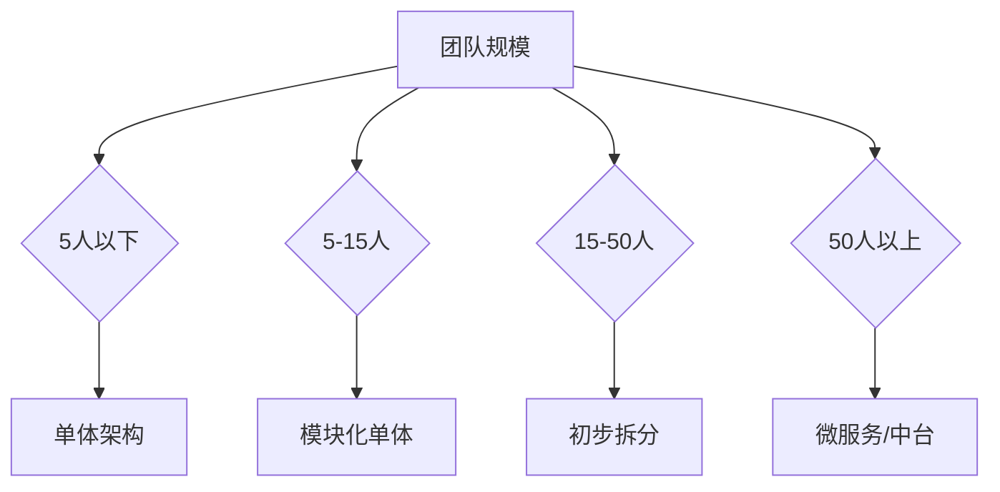

# 架构演进决策树

凌晨两点，某电商公司的 CTO 被一条告警叫醒：订单服务超时，所有新订单都无法创建。他紧急登录监控后台，发现问题根源是「商品搜索」模块的一个慢查询，把整个数据库连接池打满了。

但他面临一个尴尬的现实：他的团队只有 8 个人，系统代码量 30 万行。他不确定该不该在这个时间点做微服务拆分，也不确定有没有能力承担拆分后的运维成本。

这是一个很典型的问题：**什么时候该演进？如何判断演进的时机和方法？**

这篇文章提供一套决策树框架，帮助你在正确的时机做正确的架构选择。

## 决策树的四个核心维度

架构演进不是拍脑袋决定，而是基于客观指标的判断。四个维度帮你量化现状：

### 维度一：团队规模

团队规模决定了协作模式的上限。Fred Brooks 在《人月神话》中指出，沟通成本随团队人数指数增长。



| 团队规模 | 推荐架构 | 核心能力要求 |
| --- | --- | --- |
| `<` 5 人 | 单体架构 | 快速迭代能力 |
| 5~15 人 | 模块化单体 | 代码规范、code review |
| 15~50 人 | 初步拆分（3~5 个服务） | CI/CD、服务治理 |
| `>` 50 人 | 微服务/中台 | 平台工程、SRE 能力 |

### 维度二：代码量与复杂度

代码量是技术债务的显性指标，但不是唯一指标。复杂度往往比代码量更关键。

```
代码量评估标准：

| 规模 | 代码行数 | 业务复杂度 | 推荐行动 |
| --- | --- | --- | --- |
| 小型 | `<` 5 万行 | 单业务域 | 保持单体，优化代码质量 |
| 中型 | 5~20 万行 | 2~3 个业务域 | 模块化拆分，数据层隔离 |
| 大型 | 20~50 万行 | 多业务域 | 按业务边界拆分服务 |
| 超大型 | `>` 50 万行 | 跨多个产品线 | 微服务 + 中台 |

警告：代码量不是拆分依据，领域边界清晰度才是。
```

### 维度三：业务复杂度

业务复杂度包括：业务流程数量、跨团队依赖、数据一致性要求。

| 复杂度等级 | 特征 | 架构建议 |
| --- | --- | --- |
| 低 | 单一业务流程，无跨团队依赖 | 单体架构 |
| 中 | 2~3 个业务流程，团队间有协调需求 | 模块化单体 |
| 高 | 多业务流程，跨团队强依赖 | 按领域拆分服务 |
| 极高 | 产品矩阵，平台化需求 | 微服务 + 中台 |

### 维度四：技术债务

技术债务会放大所有其他问题。在高技术债务的系统中，即使业务规模不大，也可能需要演进。

**技术债务评估清单**：

- [ ] 单次全量发布需要 `>` 30 分钟
- [ ] 无法单独测试某个业务模块
- [ ] 数据库表超过 200 张，且无清晰边界
- [ ] 超过 50% 的代码没有单元测试
- [ ] 新人上手需要 `>` 2 周

如果超过 3 个问题回答「是」，技术债务已经是瓶颈，演进需要提速。

## 不同阶段的关键指标

架构演进不是一次性事件，而是连续的过程。每个阶段有对应的关键指标。

### 阶段一：单体架构

```
关键指标监控：

发布周期：每周发布 1~2 次
故障恢复时间（MTTR）：`<` 1 小时
资源利用率：30%~50%
团队协作：日常 code review

警示信号：
- 发布窗口成为瓶颈
- 一个 bug 导致整个系统回滚
- 数据库成为唯一瓶颈
```

### 阶段二：模块化单体

模块化单体是单体架构到微服务的过渡态。核心是在物理上保持单体，但在逻辑上划分清晰的边界。

```
模块化标准：

✅ 模块间通过接口通信，不直接调用内部实现
✅ 每个模块有独立的数据访问层
✅ 模块可以独立测试
✅ 模块间的共享代码降到最低

❌ 模块间直接引用对方类
❌ 跨模块的事务控制
❌ 共享数据库表（多个模块读写同一张表）
```

### 阶段三：服务化拆分

服务化拆分需要评估基础设施就绪程度：

```
基础设施就绪清单：

[ ] 服务注册与发现（Consul / Nacos / Eureka）
[ ] API 网关（Kong / APISIX / Spring Cloud Gateway）
[ ] 分布式配置中心（Nacos Config / Apollo）
[ ] 链路追踪（SkyWalking / Jaeger / Zipkin）
[ ] 集中日志（ELK / Loki）
[ ] 容器化部署（Docker + Kubernetes）
[ ] CI/CD 流水线

如果基础设施不完善，拆分后的问题会比拆分前更多。
```

### 阶段四：微服务/中台

微服务不是终点，而是另一种复杂度。高可用、多语言、技术演进能力，是微服务的主要收益。

```
微服务成熟度评估：

| 能力 | 初级 | 中级 | 高级 |
| --- | --- | --- | --- |
| 部署 | 手动部署 | 半自动 | 全自动 CD |
| 监控 | 基础监控 | 链路追踪 | 业务监控 + SLO |
| 治理 | 无 | 限流熔断 | 自适应限流 |
| 弹性 | 手动扩容 | HPA | VPA + 预测扩容 |

微服务的代价：
- 服务间网络延迟
- 分布式事务复杂性
- 运维成本（通常是单体的 3~5 倍）
```

## 演进的前提条件

架构演进需要「万事俱备」才能降低风险。

### 基础设施就绪

不要在基础设施不完善时做拆分。拆分后暴露的问题，往往不是业务问题，而是运维问题。

```
最低基础设施要求：

1. 容器化：Docker 镜像标准化
2. 编排：Kubernetes 或等效平台
3. 监控：至少覆盖 CPU、内存、QPS、延迟
4. 日志：集中收集，至少能按 trace ID 检索
5. 告警：关键指标 7x24 告警

没有这些基础设施，拆分等于自找麻烦。
```

### 团队能力匹配

架构复杂度需要对应的团队能力来支撑。

| 架构类型 | 最低能力要求 |
| --- | --- |
| 模块化单体 | 代码规范意识、基础重构能力 |
| 服务化拆分 | CI/CD、基础服务治理 |
| 微服务 | 分布式系统理解、DevOps/SRE 能力 |
| 中台 | 平台工程、产品化思维 |

:::warning 能力错配的风险

一个只有 CRUD 经验的团队，上微服务后会发生什么？

- 不知道怎么排查网络问题
- 不会处理分布式事务
- 监控告警不知道看什么
- 服务挂了不知道怎么回滚

结果是：系统稳定性反而下降。

:::

### 业务边界清晰

拆分失败的案例，80% 源于业务边界不清晰。

**边界不清晰的后果**：

```
场景：拆分「用户模块」和「订单模块」

错误边界：
┌─────────────┐     ┌─────────────┐
│   用户模块    │ ── │   订单模块    │
│  (注册/登录)  │    │ (创建/取消)   │
└──────┬──────┘     └──────┬──────┘
       │                   │
       │   ┌───────────┐   │
       └──►│  用户画像  │◄──┘
           │ (用户模块  │
           │  还是订单  │
           │  模块管?)  │
           └───────────┘

正确做法：
先画清楚「用户画像」属于谁，边界清晰后再拆分。
```

## 演进的风险评估

每次演进都是一次风险操作。风险评估和回退方案是演进的必备项。

### 风险矩阵

```
风险评估模板：

| 风险项 | 发生概率 | 影响程度 | 应对策略 |
| --- | --- | --- | --- |
| 服务间调用失败 | 高 | 高 | 熔断降级 |
| 分布式事务不一致 | 高 | 高 | Saga/TCC |
| 拆分后性能下降 | 中 | 高 | 灰度验证 |
| 团队能力不足 | 中 | 中 | 培训/引入专家 |
| 基础设施不匹配 | 低 | 高 | 先完善基础设施 |

核心原则：每次演进的风险敞口不超过团队可承受范围。
```

### 回退方案

**没有回退方案的演进是裸奔。**

```
回退方案设计：

方案一：蓝绿回退
- 保持旧版本实例不动
- 新版本出问题，立即切换流量到旧版本
- 适合：服务完全替换的场景

方案二：特性开关回退
- 使用 feature flag 控制功能开关
- 新功能有问题，关闭开关即可
- 适合：同一服务的渐进式改造

方案三：数据回退
- 保留旧数据库写入接口
- 新服务写入时同步旧数据
- 回退时切换写入目标
- 适合：数据层迁移场景
```

## 案例：从 5 人团队电商系统看架构选择

某小型电商公司，团队 5 人，代码量 8 万行，主营母婴用品电商。

### 阶段一：单体架构（0~1 年）

```
现状：
- 团队 5 人，协作流畅
- 代码量 8 万行，结构尚可
- 业务稳定，增长缓慢

决策：保持单体架构

行动项：
1. 模块化代码结构（按业务域划分包）
2. 引入单元测试，提高覆盖率到 60%
3. 搭建基础监控（Prometheus + Grafana）

理由：
这个阶段瓶颈是「如何快速开发」，不是「如何大规模协作」。
微服务带来的运维成本，是 5 人团队无法承受的。
```

### 阶段二：模块化单体（1~2 年）

```
现状：
- 团队扩到 8 人，出现协作摩擦
- 业务增长 3 倍，开始有性能压力
- 代码量 15 万行，技术债务累积

决策：模块化拆分，不拆分服务

行动项：
1. 按领域划分模块（用户、商品、订单、支付）
2. 模块间通过接口通信，移除直接引用
3. 每个模块独立数据访问层
4. 引入灰度发布能力

理由：
团队还没有运维微服务的能力。
模块化可以解决 80% 的协作问题。
```

### 阶段三：服务化拆分（2~3 年）

```
现状：
- 团队扩到 20 人，按业务线分工
- 双十一流量是平时的 10 倍
- 某些模块成为独立瓶颈

决策：按业务边界拆分核心服务

行动项：
1. 引入 Kubernetes
2. 拆分「商品服务」和「搜索服务」（热点模块）
3. 引入 API 网关
4. 搭建链路追踪

理由：
基础设施已经就绪，团队能力跟上。
拆分先从热点模块开始，降低风险。
```

## 总结

架构演进决策的核心是「匹配」：

```
演进时机 = 业务需求驱动 AND 基础设施就绪 AND 团队能力匹配

三缺一，风险倍增。
三缺二，不建议演进。
```

**判断框架回顾**：

1. **团队规模**：5 人以下单体，15 人以上考虑拆分
2. **代码量**：20 万行以上需要模块化，50 万行以上需要服务化
3. **业务复杂度**：跨团队依赖强，需要服务边界清晰
4. **技术债务**：债务高企会放大所有问题

**前提条件**：

- 基础设施就绪（监控、日志、容器化、CI/CD）
- 团队能力匹配（分布式理解、DevOps 能力）
- 业务边界清晰（边界不清晰是拆分失败的头号原因）

**风险管理**：

- 每次演进有回退方案
- 灰度验证是安全迁移的关键
- 渐进式演进优于大步快跑

## 思考题

**问题 1**：某创业公司 CTO 觉得微服务是「先进架构」，想在团队只有 3 个人时就上微服务。这样做可能面临什么问题？

<details>
<summary>参考答案</summary>

3 人团队上微服务，主要面临以下问题：

1. **运维成本过高**：3 人团队需要维护服务注册、配置中心、链路追踪、CI/CD 等基础设施，运维负担可能超过开发本身
2. **协作成本增加**：微服务适合大团队并行开发，3 人团队本身体量小，拆分后反而增加协调成本
3. **问题排查复杂**：分布式调用链路长，排查问题需要链路追踪工具，3 人团队可能缺乏相关经验
4. **基础设施投入大**：K8s 集群、CI/CD 流水线等都需要人力维护，ROI 太低

**建议**：3 人团队保持单体，专注业务开发。等团队规模超过 10 人、业务复杂度明显上升时，再考虑模块化或拆分。

</details>

**问题 2**：在演进过程中，如何判断「现在拆分」的时机已经成熟，而不是「可以再等等」？

<details>
<summary>参考答案</summary>

几个客观指标帮助判断拆分时机：

1. **团队瓶颈明显**：发布频率成为业务迭代的瓶颈（如每周只能发布一次）
2. **协作成本可量化**：多人开发导致的代码冲突频率、集成测试时间有明确数据
3. **基础设施就绪**：K8s、监控、CI/CD 等基础设施已经可用
4. **业务边界清晰**：通过 DDD 建模或业务流程分析，边界已经明确
5. **团队能力匹配**：至少有 1~2 人有分布式系统经验

如果 3 个以上指标满足，可以开始考虑拆分。

</details>

**问题 3**：如果演进后发现拆分决策错误（边界划错了），应该怎么办？

<details>
<summary>参考答案</summary>

拆分边界错误是常见的坑，处理方式取决于错误程度：

**轻度错误**（边界模糊，但还能工作）：
- 通过 API 网关做服务聚合，掩盖边界问题
- 逐步重构，不追求一次性解决

**中度错误**（两个服务强耦合，频繁调用）：
- 引入防腐层（ACL），将调用关系限制在接口层
- 考虑合并这两个服务

**重度错误**（循环依赖、数据一致性无法保证）：
- 制定合并计划，逐步将流量切回单体
- 承认试错成本，不要硬撑
- 合并后再重新分析边界

**关键原则**：边界错了就合并，不要为了「面子」继续撑。合并的代价远低于持续维护一个错误架构。

</details>
