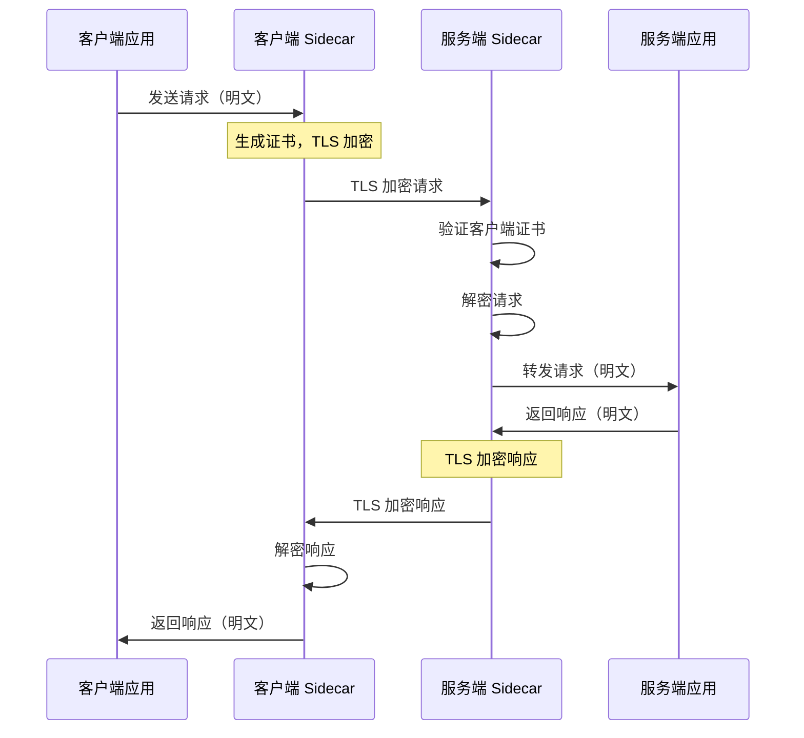

# 服务网格（Service Mesh）

2016 年，Buoyant 公司开源了 Linkerd，这是第一款真正意义上的服务网格产品。2017 年，Lyft 公司开源了 Envoy，随后 Google、IBM、Lyft 联合发布了 Istio。三者让服务网格概念迅速普及。

但繁荣背后，问题也在积累。2022 年，Istio 宣布简化架构，放弃了早期的 Mixer 组件。2023 年，CNCF 宣布接受 ThetaML 作为服务网格标准选项。2024 年，Istio 推出 Ambient Mode，试图解决服务网格的「重量级」问题。

**服务网格是微服务治理的进阶形态，但它不是银弹。它的引入有明确的代价和适用场景。**

## 微服务治理的痛点

在微服务架构中，服务间的通信、可观测性、安全等能力需要每个服务自己实现。这导致几个问题：

### 代码侵入

每个服务都需要重复实现限流、熔断、重试、超时等功能。业务代码和治理逻辑混杂在一起。

```java
// 没有服务网格时，每个服务都要写这些代码
@Service
public class ProductService {

    // 限流
    private RateLimiter rateLimiter = RateLimiter.create(1000);

    // 熔断
    private CircuitBreaker circuitBreaker = CircuitBreaker.ofDefaults("product");

    // 重试
    private Retry retry = Retry.ofDefaults("product");

    // 超时
    private WebClient webClient = WebClient.builder()
        .baseUrl("http://inventory-service")
        .build();

    @HystrixCommand(fallbackMethod = "getProductFallback") // 熔断注解
    public Product getProduct(Long id) {
        // 限流
        rateLimiter.acquire();

        // 超时设置
        return webClient.get()
            .uri("/products/{id}", id)
            .retrieve()
            .bodyToMono(Product.class)
            .timeout(Duration.ofMillis(500))
            .retryWhen(retry)
            .block();
    }
}
```

问题：**每个服务都有这段重复代码**。当需要升级限流算法时，需要修改所有服务。

### 治理逻辑分散

限流策略、熔断阈值、重试次数等治理配置，分散在每个服务的代码或配置文件中。统一修改非常困难。

```
配置分散的问题：

product-service:
  rate-limit: 1000
  circuit-breaker:
    failure-rate: 50
    timeout: 30s

order-service:
  rate-limit: 2000
  circuit-breaker:
    failure-rate: 40
    timeout: 20s

inventory-service:
  rate-limit: 500
  ...

# 问题：每个服务有自己的配置，改一个策略需要改 10+ 个文件
```

### 升级困难

当需要升级治理能力（如从 Hystrix 迁移到 Resilience4j）时，需要逐个服务修改代码，测试工作量巨大。

## 服务网格的核心理念

服务网格的核心思想是：**将流量治理从应用层下沉到基础设施层，让应用代码专注业务逻辑，治理逻辑交给 Sidecar 代理处理**。

```
架构对比：

没有服务网格：
┌────────────────────────────────────────────────────┐
│                   应用进程                          │
│  ┌──────────────────────────────────────────┐     │
│  │            业务代码                        │     │
│  │  ┌────────┐ ┌────────┐ ┌────────┐       │     │
│  │  │限流逻辑│ │熔断逻辑│ │重试逻辑│       │     │
│  │  └────────┘ └────────┘ └────────┘       │     │
│  └──────────────────────────────────────────┘     │
└────────────────────────────────────────────────────┘

有服务网格：
┌────────────────────────────────────────────────────┐
│  ┌────────────────────────────────────────────┐   │
│  │            Sidecar 代理（Envoy）             │   │
│  │  ┌────────┐ ┌────────┐ ┌────────┐         │   │
│  │  │限流治理│ │熔断治理│ │重试治理│         │   │
│  │  └────────┘ └────────┘ └────────┘         │   │
│  └────────────────────────────────────────────┘   │
│  ┌────────────────────────────────────────────┐   │
│  │            应用进程（无治理代码）             │   │
│  │            专注业务逻辑                       │   │
│  └────────────────────────────────────────────┘   │
└────────────────────────────────────────────────────┘
```

## Sidecar 模式的工作原理

Sidecar（边车）模式是服务网格的基础。每个服务实例旁边运行一个 Sidecar 代理，所有出站和入站流量都经过代理处理。

### 流量拦截

Sidecar 代理通过 iptables 规则（或 eBPF）拦截所有进出容器的流量。应用不需要修改任何代码，流量自动被拦截。

```bash
# iptables 规则示例（简化）
iptables -t nat -A PREROUTING -p tcp --dport 8080 -j REDIRECT --to-port 15001
iptables -t nat -A OUTPUT -p tcp --dport 8080 -j REDIRECT --to-port 15001
# 所有发往本机 8080 端口的流量，都被重定向到 Sidecar 的 15001 端口
```

### 请求流程

```
客户端 Pod                                    服务端 Pod
┌─────────────────┐                         ┌─────────────────┐
│                 │                         │                 │
│  ┌───────────┐  │      mTLS 加密         │  ┌───────────┐  │
│  │ 应用容器   │ ──────────────────────────→ │ │ Sidecar   │  │
│  └───────────┘  │                         │  └─────┬─────┘  │
│  ┌───────────┐  │                         │  ┌─────┴─────┐  │
│  │  Sidecar  │  │                         │  │ 应用容器  │  │
│  │  (Envoy)  │  │ ←──────────────────────── │  │           │  │
│  └───────────┘  │                         │  └───────────┘  │
└─────────────────┘                         └─────────────────┘
        ↓                                           ↑
  1. 应用发送请求到 localhost                       4. Sidecar 转发到应用
  2. Sidecar 拦截请求                               5. 应用返回响应
  3. Sidecar 做限流/熔断/路由，加密后发送            6. Sidecar 解密并返回
```

### Envoy 代理的能力

Envoy 是 Istio 和 Linkerd 的默认数据平面组件，提供的能力：

| 能力 | 说明 |
| --- | --- |
| **服务发现** | 从控制平面获取服务实例列表 |
| **负载均衡** | 轮询、加权、最少连接、一致性哈希 |
| **限流** | 基于请求数、连接数的限流 |
| **熔断** | 自动熔断异常实例 |
| **重试** | 自动重试失败的请求 |
| **超时** | 为请求设置超时时间 |
| **重路由** | 金丝雀发布、A/B 测试 |
| **故障注入** | 测试系统容错能力 |
| **mTLS** | 服务间双向认证加密 |

## Istio 与 Linkerd 的定位和差异

### Istio

Istio 是 Google、IBM、Lyft 联合开发的服务网格，功能最全面，但复杂度也最高。

```
Istio 架构（传统模式）：

┌─────────────────────────────────────────────────────────┐
│                    控制平面（Control Plane）              │
│  ┌─────────┐  ┌─────────┐  ┌─────────┐  ┌─────────┐    │
│  │  Istiod │  │  Gateway│  │   CNI   │  │   Zodiac│    │
│  │ (Pilot) │  │         │  │         │  │         │    │
│  └─────────┘  └─────────┘  └─────────┘  └─────────┘    │
└─────────────────────────────────────────────────────────┘

┌─────────────────────────────────────────────────────────┐
│                    数据平面（Data Plane）                  │
│  ┌──────────┐  ┌──────────┐  ┌──────────┐  ┌──────────┐ │
│  │ Envoy    │  │ Envoy    │  │ Envoy    │  │ Envoy    │ │
│  │ (Sidecar)│  │ (Sidecar)│  │ (Sidecar)│  │ (Sidecar)│ │
│  └────┬─────┘  └────┬─────┘  └────┬─────┘  └────┬─────┘ │
│       │             │             │             │        │
└───────┼─────────────┼─────────────┼─────────────┼────────┘
        │             │             │             │
        └─────────────┴─────────────┴─────────────┘
                         mTLS 通信
```

Istiod 统一了早期的 Pilot（服务发现）、Citadel（安全）、Galley（配置）组件，降低了复杂度。

### Linkerd

Linkerd 由 Buoyant 公司开发，设计理念是「简单、安全、轻量」，专注于核心功能。

| 维度 | Istio | Linkerd |
| --- | --- | --- |
| **设计理念** | 功能全面，可定制 | 简单优先，只做必要的功能 |
| **学习曲线** | 陡峭（大量 CRD 和配置） | 平缓（配置简洁） |
| **资源消耗** | 较高（每个 Sidecar 约 50MB 内存） | 较低（约 10MB 内存） |
| **性能** | 中等 | 较高（使用 Rust 语言的数据平面） |
| **扩展性** | 强（大量插件和自定义资源） | 弱（只支持核心功能） |
| **适用场景** | 大规模、复杂需求 | 轻量级、追求简单 |

### Istio Ambient Mode

2022 年，Istio 推出了 Ambient Mode，放弃了 Sidecar 模式，改用 Node 级别的 Ztunnel 代理。

```
Istio Ambient Mode 架构：

┌─────────────────────────────────────────────────────┐
│                  Node 级别                           │
│  ┌───────────────────────────────────────────────┐  │
│  │              Ztunnel（Node 代理）              │  │
│  │  ┌─────────┐ ┌─────────┐ ┌─────────┐        │  │
│  │  │ 服务 A   │ │ 服务 B   │ │ 服务 C   │        │  │
│  │  └─────────┘ └─────────┘ └─────────┘        │  │
│  │  所有流量经过 Ztunnel，但不是每个 Pod 一个     │  │
│  └───────────────────────────────────────────────┘  │
└─────────────────────────────────────────────────────┘

优势：
1. 不需要修改 Pod 的网络命名空间
2. 资源消耗更低
3. 升级不需要重启 Pod
```

## mTLS 双向认证的实现原理

mTLS（Mutual TLS）是服务网格安全通信的基础。相比普通 TLS（只有服务端认证证书），mTLS 要求客户端也持有证书，实现双向认证。

```yaml
# Istio mTLS 配置示例
apiVersion: security.istio.io/v1beta1
kind: PeerAuthentication
metadata:
  name: default
  namespace: istio-system
spec:
  mtls:
    mode: STRICT  # STRICT = 必须 mTLS，PERMISSIVE = 允许明文
```

mTLS 的工作流程：



证书自动轮换：Istio 的 Citadel 组件定期为每个服务签发证书，证书过期前自动续期，应用无需关心证书管理。

## 金丝雀发布的实现原理

金丝雀发布（Canary Release）是将新版本先部署到少量实例，只让一小部分用户使用新版本，验证无误后再全量。

```yaml
# Istio 金丝雀发布配置
apiVersion: networking.istio.io/v1alpha3
kind: VirtualService
metadata:
  name: product-service
spec:
  hosts:
    - product-service
  http:
    - route:
        - destination:
            host: product-service-v1  # 旧版本，90% 流量
            weight: 90
        - destination:
            host: product-service-v2  # 新版本，10% 流量
            weight: 10
```

流量分配的维度可以是：

| 维度 | 配置方式 | 示例 |
| --- | --- | --- |
| **百分比** | `weight` | 10% 流量到新版本 |
| **Header** | `headers` | 带 `X-Canary: true` 的请求到新版本 |
| **Cookie** | `cookie` | `Cookie: user_type=vip` 的请求到新版本 |
| **权重** | `subset` | 按用户 ID 哈希分配版本 |

## 流量镜像的实现原理

流量镜像（Traffic Mirroring）将请求同时发送到生产版本和测试版本，但只返回生产版本的响应。测试版本的响应被丢弃，用于验证。

```yaml
# 流量镜像配置
apiVersion: networking.istio.io/v1alpha3
kind: VirtualService
metadata:
  name: product-service
spec:
  hosts:
    - product-service
  http:
    - route:
        - destination:
            host: product-service-v1
            subset: stable
          weight: 100
    - mirror:
        host: product-service-v2
        subset: canary
      weight: 100  # 100% 镜像流量，但不等待响应
```

**应用场景**：在正式发布前，用真实流量测试新版本，验证功能正确性和性能表现，不影响真实用户。

## 服务网格的代价

### 延迟增加

所有流量都经过 Sidecar，会增加延迟。Envoy 的数据平面通常增加 1~3ms 的 P99 延迟。

```
延迟增加分析：

无服务网格：
请求 → 应用处理（10ms） → 返回
总延迟：10ms

有服务网格：
请求 → Sidecar 拦截（0.1ms） → 应用处理（10ms） → Sidecar 处理（0.1ms） → 返回
总延迟：10.2ms

增加约 2%（可接受）
```

但在高并发场景下，Sidecar 的 CPU 开销会进一步增加延迟。

### 资源消耗

每个 Pod 都需要运行一个 Sidecar 容器，消耗 CPU 和内存。

```
资源消耗估算（Istio）：

每个 Sidecar：
- 内存：50~100MB
- CPU：约 0.5% 单核

1000 个 Pod 的集群：
- 额外内存：50~100GB
- 额外 CPU：5~10 核

成本：额外的云资源费用约 $500/月（1000 Pod 集群）
```

### 运维复杂度

服务网格引入了新的组件和概念，学习曲线陡峭。

```
运维复杂度对比：

没有服务网格：
- 应用日志 + Prometheus 监控
- 基本的 Kubernetes Service

有服务网格：
- 控制平面（Istiod / Linkerd）高可用部署
- 数据平面（Sidecar）版本管理
- mTLS 证书管理
- 流量策略配置（VirtualService / DestinationRule）
- 网络策略配置（AuthorizationPolicy）
- 金丝雀发布、A/B 测试、流量镜像配置
- 故障排查需要理解 Sidecar 日志
```

## Istio 的演进

### 早期版本（1.0~1.5）

早期 Istio 架构复杂，包含多个组件：

- **Pilot**：服务发现和流量管理
- **Mixer**：策略执行和遥测数据收集
- **Citadel**：证书管理和 mTLS
- **Galley**：配置验证和分发

Mixer 是最大的问题：每个请求都要向 Mixer 汇报数据，导致 Mixer 成为瓶颈。

### 中期版本（1.6~1.10）

Istiod 统一了 Pilot、Citadel、Galley 的功能，简化了架构。Mixer 被废弃，遥测数据改由 Sidecar 直接上报。

### 近期版本（1.12~至今）

Istio 推出 Ambient Mode，放弃 Sidecar，改用 Node 级别的 Ztunnel。同时推出「简化安装」选项，降低使用门槛。

## 总结

服务网格是微服务治理能力的进阶形态，它的核心价值：

- **治理逻辑下沉**：应用代码专注业务逻辑，治理能力交给基础设施
- **统一配置管理**：所有服务的治理策略统一配置，版本化管理
- **安全内建**：mTLS 自动加密所有服务间通信
- **可观测性完善**：所有流量经过 Sidecar，可以统一收集指标和日志

但服务网格也有明确的代价：

- **资源消耗**：每个 Pod 都需要 Sidecar
- **延迟增加**：所有流量经过代理
- **运维复杂**：新组件、新概念、新配置
- **学习成本**：团队需要掌握服务网格的原理和使用

**什么时候需要服务网格？** 当微服务数量超过 50 个、服务间调用复杂、需要统一的安全和治理策略时，服务网格的价值才能体现。对于 10~20 个服务的规模，简单的 Kubernetes Service + 基本监控可能就够用了。

下一节，我们来看云原生的极致形态：无服务器架构（Serverless）。

## 思考题

**问题 1**：某公司有 30 个微服务，主要在 Kubernetes 上运行。他们是否需要引入服务网格？

<details>
<summary>参考答案</summary>

30 个微服务的规模处于「可选」而非「必须」的边界。建议的评估方向：

**需要服务网格的信号**：服务间有复杂的调用依赖链；安全合规要求所有服务间通信必须加密；需要频繁做金丝雀发布或 A/B 测试；现有监控无法定位跨服务的故障链路。

**不需要服务网格的信号**：服务数量仍在增长，但调用关系相对简单；团队规模小（< 20 人），没有专职运维；服务网格的学习成本高于收益。

建议：先评估痛点是否真实存在。如果只是「听说服务网格很火」，可以先用 Knative 等更轻量的方案满足 Serverless 需求。

</details>

**问题 2**：服务网格的 Sidecar 代理会增加延迟。对于延迟敏感的服务（如实时报价、在线游戏），应该怎么处理？

<details>
<summary>参考答案</summary>

延迟敏感服务的处理策略：

1. **Ambient Mode**：如果使用 Istio，可以切换到 Ambient Mode，Ztunnel 在 Node 级别而非 Pod 级别，性能更好。

2. **排除延迟敏感路径**：在 AuthorizationPolicy 中排除某些服务的 mTLS 校验，减少加密开销。

3. **优化 Sidecar 配置**：减少 Sidecar 的日志级别、禁用不必要的过滤器，降低 CPU 开销。

4. **本地优先**：延迟极敏感的服务，可以考虑在应用内部处理部分逻辑，减少网络跳数。

</details>

**问题 3**：服务网格的 mTLS 能保证服务间通信安全，但客户端到网关的流量如何处理？

<details>
<summary>参考答案</summary>

服务网格只负责集群内部的通信安全。客户端到网关（入口流量）的安全需要另外处理：

1. **入口网关（Ingress Gateway）**：Istio 的 Ingress Gateway 终止 mTLS，然后转发到内部服务。

2. **API 网关**：在服务网格前部署 API 网关（如 Kong、Ambassador），统一处理认证、限流、SSL 终止。

3. **零信任网络**：配合 NetworkPolicy，限制非授权的网络访问，实现真正的零信任。

</details>
