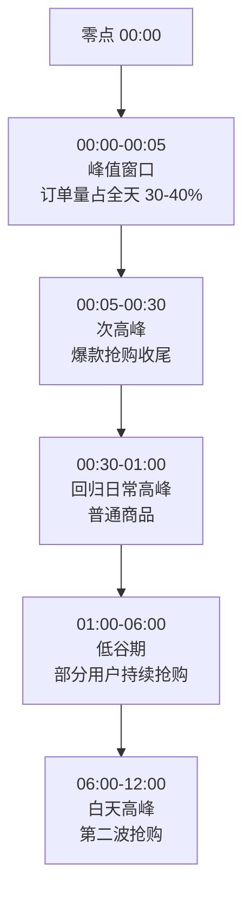
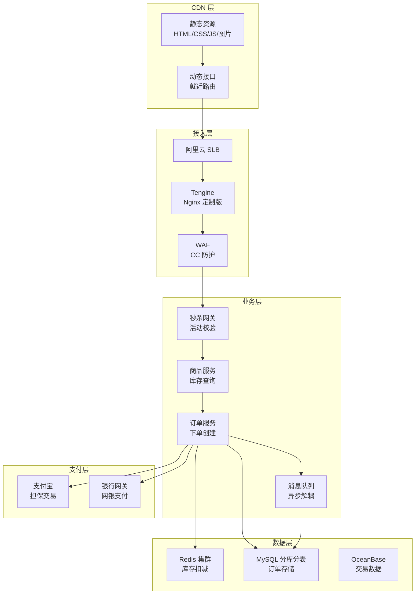

# 双十一秒杀架构

2019 年 11 月 11 日凌晨零点 0 分 36 秒，阿里巴巴的订单峰值达到 54.4 万笔/秒。这个数字意味着：全国数亿用户在同一个时间点刷新页面、点击抢购、完成支付，整个系统的任何一处瓶颈都会在零点零几分内被无限放大。

更残酷的是，双十一的抢购窗口只有短短几十分钟。过了这个时间，流量断崖式下跌，系统的余量资源瞬间变成浪费。这意味着双十一架构的核心目标不是「用最贵的机器扛住最大流量」，而是**用最少的资源、在最短的时间内、精准地扛住这个流量峰值**。

这个目标听起来简单，但背后的技术挑战远超想象。

## 双十一的技术挑战

### 流量特征：脉冲式洪峰

双十一的流量有两个显著特征：

**特征一：时间极度集中。** 零点零分到零点五分，这五分钟内的订单量可能占全天峰值的 30%-40%。之后的流量虽然也高，但主要集中在爆款商品，普通商品趋于平稳。

**特征二：热点商品集中。** 每年双十一真正被全网关注的爆款就那么几款——iPhone、戴森吹风机、茅台1499、AJ 球鞋。这几款商品的库存可能只有几百到几千件，但瞬时流量可能高达数百万。



### 库存一致性：超卖与少卖的双重红线

双十一的库存问题比普通秒杀更复杂：

**超卖问题**：卖出了 12000 件，但库存只有 10000 件。要么平台赔钱发货，要么紧急联系用户退款。无论哪种处理方式，都是灾难——前者损失利润，后者损失口碑。

**少卖问题**：库存还剩 500 件，但系统因为并发问题只扣了 300 件，少卖了 200 件。这 200 件本来可以带来数十万的 GMV，直接损失。

更复杂的是，双十一涉及平台、商家、物流等多个系统。平台库存、商家库存、SKU 库存要保持一致，任何一处不一致都会导致问题。

### 资金安全：支付系统的极限压力

双十一零点不仅是抢购高峰，也是支付高峰。用户抢到商品后必须在极短时间内完成支付，否则库存会被释放。这对支付系统提出了极高要求：

- **支付成功率要接近 100%**：任何支付失败都会导致用户流失和库存浪费
- **支付延迟要极低**：用户等待超过 3 秒就会放弃
- **资金安全不能打折**：反欺诈、风控不能因为性能压力而降低标准

## 整体架构分层

双十一的架构可以划分为五层，每一层都有独特的技术挑战和解决方案。



### 第一层：CDN 层

CDN 层负责静态资源的就近分发，这是整个架构的第一道防线。

**核心作用**：用户访问商品详情页时，页面中的图片、CSS、JS 等静态资源直接从最近的 CDN 节点返回，完全不经过源站。这解决了 70% 以上的流量。

```nginx
# CDN 配置示例：区分静态和动态请求
server {
    # 静态资源：强缓存，减少回源
    location ~* \.(jpg|png|gif|css|js|woff2)$ {
        expires 7d;
        add_header Cache-Control "public, max-age=604800";
        # 热点资源预加载到 CDN 节点
        # 商品图片提前 2 小时上传到 CDN
    }

    # 动态接口：实时获取，不缓存
    location /api/ {
        proxy_pass http://backend;
        add_header Cache-Control "no-store, no-cache";
    }
}
```

**关键设计**：

- 爆款商品的主图、详情页在活动开始前 2 小时就同步到全国所有 CDN 节点
- 使用 CDN 的 QUIC 协议（基于 UDP）减少连接建立时间
- 预热机制：提前模拟请求，把热点资源加载到 CDN 边缘节点

### 第二层：接入层

接入层由阿里云 SLB + Tengine 组成，负责基础的负载均衡和安全防护。

**Tengine 的核心配置**：

```nginx
# Tengine 限流配置：基于令牌桶的请求控制
limit_req_zone $binary_remote_addr zone=ip_limit:10m rate=100r/s;
limit_req_zone $cookie_user_id zone=user_limit:100m rate=10r/s;
limit_req_zone $request_uri zone=api_limit:100m rate=1000r/s;

server {
    location /seckill/api/ {
        # 基于 IP 的限流：每个 IP 每秒最多 100 请求
        limit_req zone=ip_limit burst=200 nodelay;

        # 基于用户 ID 的限流：每个用户每秒最多 10 请求
        limit_req zone=user_limit burst=20 nodelay;

        # 基于接口的限流：整个秒杀接口每秒最多 1000 请求
        limit_req zone=api_limit burst=2000 nodelay;

        proxy_pass http://seckill_backend;
    }
}
```

### 第三层：业务层

业务层是整个秒杀系统的核心，包含秒杀网关、商品服务、订单服务等多个组件。

**秒杀网关的设计**：

```java
// 秒杀网关：五层拦截 + 热点探测
@Service
public class SeckillGateway {

    @Autowired private ActivityService activityService;
    @Autowired private HotspotService hotspotService;
    @Autowired private RateLimiter rateLimiter;

    public SeckillResponse handleSeckill(SeckillRequest request) {
        Long productId = request.getProductId();
        Long userId = request.getUserId();

        // === 第一层：活动有效性检查 ===
        ActivityStatus status = activityService.getStatus(productId);
        if (status == ActivityStatus.NOT_STARTED) {
            return SeckillResponse.notStarted();
        }
        if (status == ActivityStatus.ENDED) {
            return SeckillResponse.ended();
        }

        // === 第二层：热点商品识别 ===
        // 热点商品走独立通道，降低对普通商品的影响
        boolean isHotProduct = hotspotService.isHotProduct(productId);
        if (isHotProduct) {
            // 热点商品：更严格的限流
            if (!rateLimiter.tryAcquire("hot:" + productId, 1000)) {
                return SeckillResponse.rateLimited();
            }
        }

        // === 第三层：用户频率控制 ===
        // 同一用户在当前活动期间最多抢购 N 次
        String userKey = "seckill:user:" + productId + ":" + userId;
        if (redisTemplate.hasKey(userKey)) {
            return SeckillResponse.alreadyPurchased();
        }

        // === 第四层：黑名单过滤 ===
        if (blacklistService.isBlocked(userId, request.getIp())) {
            return SeckillResponse.blocked();
        }

        // === 第五层：库存预扣减 ===
        return stockService.preDeduct(productId, userId);
    }
}
```

### 第四层：数据层

数据层由 Redis 集群和 MySQL 分库分表组成，负责库存扣减和订单存储。

**Redis 原子扣减库存**：

```java
// 库存服务：Lua 脚本保证原子性
@Service
public class StockService {

    private static final String DEDUCT_STOCK_LUA = """
        local stock_key = KEYS[1]
        local user_key = KEYS[2]
        local quantity = tonumber(ARGV[1])

        -- 检查库存
        local stock = tonumber(redis.call('GET', stock_key) or 0)
        if stock < quantity then
            return -1  -- 库存不足
        end

        -- 扣减库存
        redis.call('DECRBY', stock_key, quantity)

        -- 记录用户购买标记（防止重复抢购）
        redis.call('SET', user_key, '1', 'EX', 86400)

        return 1  -- 成功
        """;

    public boolean deductStock(Long productId, Long userId, int quantity) {
        String stockKey = "seckill:stock:" + productId;
        String userKey = "seckill:user:" + productId + ":" + userId;

        RedisScript<Long> script = new RedisScript<>(DEDUCT_STOCK_LUA, Long.class);
        Long result = redisTemplate.execute(script,
            List.of(stockKey, userKey),
            String.valueOf(quantity));

        return Objects.equals(result, 1L);
    }
}
```

**MySQL 分库分表策略**：

```java
// 订单分库分表：根据 userId 分散到 16 个库，每库 16 张表
@Component
public class OrderShardingRouter {

    public String getShardKey(Long userId) {
        // 取模分散到不同分片
        return String.valueOf(userId % 256);
    }

    public String getTableName(Long orderId) {
        // 按时间分表：t_order_20231111
        LocalDate date = LocalDate.now();
        return String.format("t_order_%tY%tm%td", date, date, date);
    }
}
```

## 关键技术要点

### 热点探测与本地缓存

双十一的热点商品是动态变化的。一款本来不热的商品，可能因为某个 KOL 推荐，瞬间变成热点。因此，热点探测必须是实时的。

```java
// 热点探测服务：基于 Redis 滑动窗口统计
@Service
public class HotspotService {

    @Autowired private RedisTemplate<String, String> redisTemplate;

    // 热点阈值：10 秒内访问量超过 10 万次
    private static final int HOT_THRESHOLD = 100_000;
    private static final int WINDOW_SIZE_SECONDS = 10;

    public boolean isHotProduct(Long productId) {
        String key = "hotspot:counter:" + productId;

        // 使用 Redis Sorted Set 实现滑动窗口
        long now = System.currentTimeMillis();
        long windowStart = now - WINDOW_SIZE_SECONDS * 1000;

        // 删除窗口外的旧数据
        redisTemplate.opsForZSet().removeRangeByScore(key, 0, windowStart);

        // 添加当前请求
        redisTemplate.opsForZSet().add(key, String.valueOf(now), now);

        // 统计窗口内的请求数
        Long count = redisTemplate.opsForZSet().zCard(key);

        if (count != null && count > HOT_THRESHOLD) {
            // 标记为热点商品
            redisTemplate.opsForValue().set(
                "hotspot:product:" + productId,
                "true",
                Duration.ofMinutes(5));
            return true;
        }

        return Boolean.parseBoolean(
            redisTemplate.opsForValue().get("hotspot:product:" + productId));
    }
}
```

热点商品识别后，可以将部分数据预加载到本地缓存（如 Caffeine），减少对 Redis 的访问压力。

### 消息队列异步下单

双十一的订单创建量极大，如果每个订单都同步等待数据库写入完成，系统会非常脆弱。更常见的做法是：Redis 扣减成功后，将订单信息发送到消息队列，由消费者异步创建订单。

```java
// 订单服务：MQ 异步创建订单
@Service
public class OrderService {

    @Autowired private RocketMQTemplate rocketMQTemplate;

    public void sendOrderCreateRequest(SeckillOrderRequest request) {
        // 发送到消息队列，异步处理
        // 峰值时每秒可能发送数万条消息
        rocketMQTemplate.asyncSend("order:create:seckill",
            request,
            new SendCallback() {
                @Override
                public void onSuccess(SendResult sendResult) {
                    // 发送成功，更新本地状态
                    log.info("订单消息发送成功: orderId={}", request.getOrderId());
                }

                @Override
                public void onException(Throwable e) {
                    // 发送失败，触发告警
                    alertService.alert("OrderCreateFailed", request);
                }
            });
    }

    @KafkaListener(topics = "order:create:seckill",
        groupId = "order-consumer-group",
        concurrency = "16")
    public void consumeOrderCreate(Message message) {
        SeckillOrderRequest request = deserialize(message);

        // 创建订单（慢操作，约 50-100ms）
        Order order = orderRepository.save(request.toOrder());

        // 更新用户购买状态
        redisTemplate.opsForValue().set(
            "order:status:" + order.getOrderId(),
            "CREATED",
            Duration.ofHours(24));
    }
}
```

**MQ 解耦的价值**：

- 削峰填谷：峰值时消息堆积，consumer 按自己的速度消费
- 系统解耦：下单服务和订单创建服务独立演进
- 失败重试：消息持久化，consumer 失败可重试

### 限流与熔断保护

即使做了多层拦截，仍可能有突发流量冲进来。这时需要限流和熔断来保护后端系统。

```java
// 熔断器配置：Sentinel
@Configuration
public class SentinelConfig {

    @Bean
    public SentinelResourceAspect sentinelAspect() {
        return new SentinelResourceAspect();
    }
}

// 熔断注解：秒杀接口
@RestController
@RequestMapping("/seckill")
public class SeckillController {

    @GetMapping("/buy/{productId}")
    @SentinelResource(value = "seckill:buy",
        blockHandler = "seckillBlockHandler",
        fallback = "seckillFallback")
    public SeckillResult buy(
            @PathVariable Long productId,
            @RequestParam Long userId) {
        return seckillService.buy(productId, userId);
    }

    // 限流/熔断时的处理
    public SeckillResult seckillBlockHandler(Long productId, Long userId,
            BlockException ex) {
        if (ex instanceof FlowException) {
            return SeckillResult.rateLimited("访问过于频繁，请稍后重试");
        }
        if (ex instanceof DegradeException) {
            return SeckillResult.degraded("系统繁忙，请稍后重试");
        }
        return SeckillResult.error("系统异常");
    }
}
```

## 量化数据与历年演进

双十一的技术指标是逐年攀升的，背后是阿里持续的技术投入。

| 年份 | 订单峰值（万笔/秒） | 支付峰值（万笔/秒） | 交易额（亿元） | 技术亮点 |
| --- | --- | --- | --- | --- |
| 2015 | 14 | 8.59 | 912 | 全面上云，异地多活 |
| 2017 | 32.5 | 25.6 | 1682 | AI 千人千面，实时推荐 |
| 2019 | 54.4 | 54.4 | 2684 | 全链路压测，Redis 集群升级 |
| 2021 | 58.3 | 58.3 | 5403 | 云原生架构，全面容器化 |
| 2023 | 更高 | 更高 | 未知 | 持续演进中 |

> **真实案例**：2019 年双十一，阿里巴巴的峰值订单处理能力达到 54.4 万笔/秒，背后是 5000+ 台服务器的支撑。零点流量高峰期，每秒有超过 10TB 的数据在系统中流转。

## 常见踩坑与解决方案

### 踩坑一：超卖事故

**现象**：活动结束后盘点库存，发现实际成交笔数超过库存数量。

**根因**：Redis Lua 脚本编写错误，或者扣减逻辑和库存校验不是原子操作。

**解法**：使用完整的 Lua 脚本，将「库存校验 + 扣减 + 用户标记」放在同一个脚本中，保证原子性。

### 踩坑二：热点 Key 导致 Redis 卡顿

**现象**：Redis CPU 使用率飙升到 100%，所有请求延迟陡增。

**根因**：所有请求都访问同一个商品库存的 Key，单线程处理成为瓶颈。

**解法**：将单个热 Key 拆分为多个逻辑 Key（如 `stock:{productId}:{shardIndex}`），通过用户 ID 取模路由到不同分片。

### 踩坑三：数据库主库压力过大

**现象**：订单写入时延从 5ms 飙升到 500ms，大量订单超时。

**根因**：订单分库分表策略不合理，导致某个分片成为热点。

**解法**：采用更均匀的分片策略（如按 userId 哈希），确保每个分片的负载均衡。

## 普通业务的价值

双十一的技术方案，虽然看起来是「大厂专属」，但其中的核心思路可以应用于普通业务：

**第一：分层拦截是通用思路。** 任何高并发场景，都可以先用 CDN/网关拦截无效流量，再用业务层过滤，最后只让有效请求打到数据库。

**第二：Redis 原子操作是库存扣减的利器。** 只要你的库存扣减需要高并发，都可以用 Lua 脚本实现原子扣减，不需要引入复杂的分布式锁。

**第三：MQ 解耦是削峰填谷的法宝。** 任何可能产生流量突刺的场景，都可以用消息队列将同步操作变成异步操作。

**第四：限流和熔断是系统保护的最后防线。** 即使做了所有优化，系统仍可能超载。限流保证系统不被压垮，熔断保证部分故障不影响整体可用性。

## 思考题

**问题 1**：双十一的零点流量峰值是「脉冲式」的，持续时间可能只有几分钟。如果为了这几分钟准备大量服务器，资源利用率会很低。你会如何设计一个既能应对峰值、又能提高资源利用率的架构？

<details>
<summary>参考答案</summary>

核心思路是「弹性伸缩 + 异步处理」：

- **弹性伸缩**：使用 Kubernetes HPA（Horizontal Pod Autoscaler）或阿里云 ESS，根据实时流量自动扩缩容。零点前自动扩容，峰值过后自动缩容。
- **异步优先**：将尽可能多的操作异步化。库存扣减成功后，订单创建、库存同步等操作都走消息队列，消费者按自己的节奏处理，不影响前端响应。
- **预热机制**：提前将热点数据加载到缓存和本地内存，减少冷启动的性能损失。
- **资源预留**：对于无法弹性伸缩的组件（如数据库），预留一定的峰值余量。

</details>

**问题 2**：在双十一场景中，「超卖」和「少卖」都是不可接受的。但如果让你在两者之间选择一个必须避免，你会选哪个？为什么？

<details>
<summary>参考答案</summary>

大多数电商平台会选择**避免超卖**，因为超卖的后果更严重：

- **超卖**：卖出了没有库存的商品，必须赔钱发货或退款，口碑和利润双重损失
- **少卖**：损失了潜在销售，但不会引发客诉和额外成本

然而，在某些场景下（如政务预约、疫苗预约），**少卖反而是不可接受的**，因为这些场景强调绝对公平，一个名额浪费可能导致严重的社会问题。

因此，选哪个取决于业务属性：普通电商避免超卖，公平性要求高的场景避免少卖。

</details>

**问题 3**：双十一的技术方案是否可以完全复制到其他电商平台的秒杀场景？有什么是你会调整的？

<details>
<summary>参考答案</summary>

不能完全复制，需要根据业务规模进行调整：

- **规模差异**：中小平台的峰值 QPS 可能只有几万，不需要阿里的五层拦截和全链路压测，可能两三层就够了
- **技术栈差异**：中小企业可能没有阿里那样完善的中间件体系，需要选择适合自己技术栈的替代方案
- **成本考量**：阿里可以为了几分钟的峰值投入数十亿建设基础设施，但中小企业应该优先考虑云服务的弹性能力

**建议调整**：
- 优先保证 Redis 原子扣减的可靠性
- 限流策略根据实际峰值设置，不要照搬大厂数字
- 异步化改造可以逐步进行，先做核心链路

</details>
