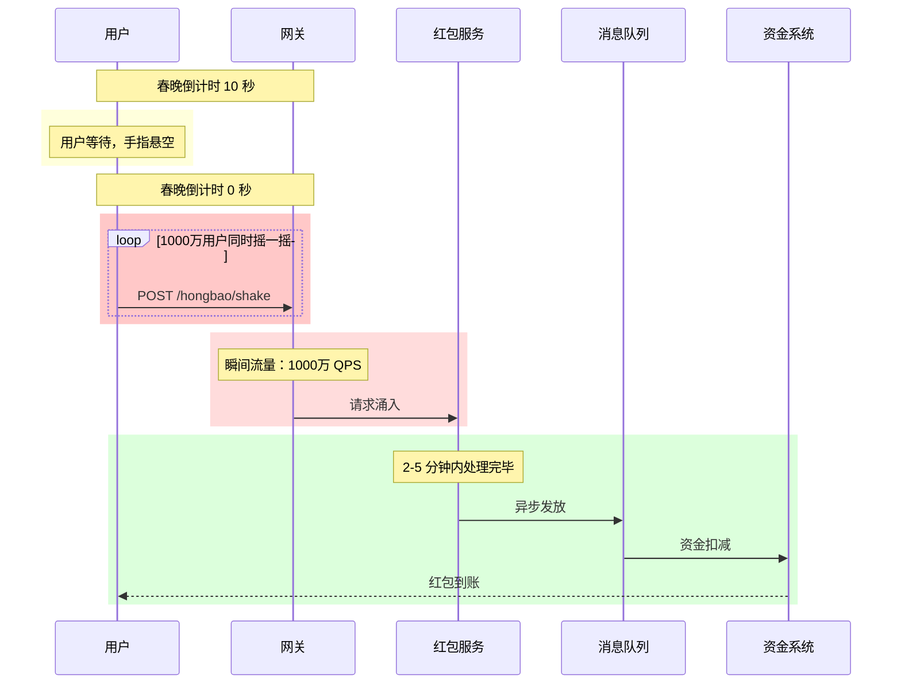
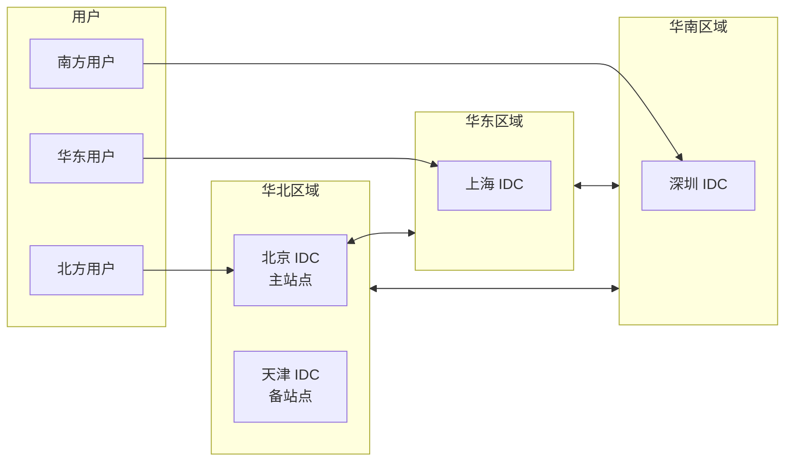
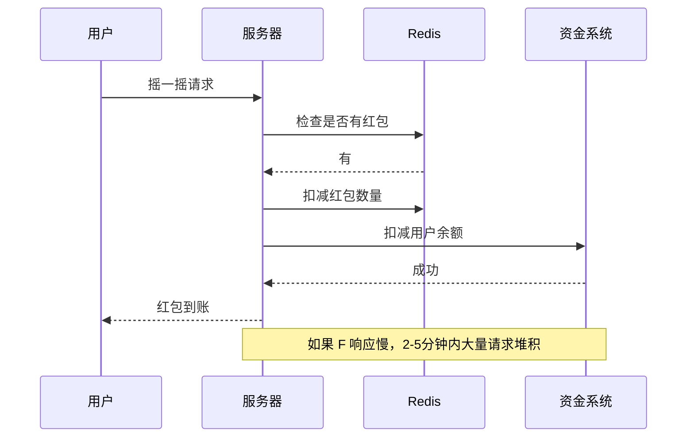

# 春晚红包架构

2015 年除夕夜，微信与央视春晚合作，推出了「摇一摇」红包活动。据统计，晚会期间摇红包的次数超过 110 亿次，峰值时每分钟有 8 亿次摇一摇请求。这个数字远超当时任何一次电商大促。

但比数字更令人震撼的是故障：活动开始后的几分钟内，系统多处告警，部分用户收到红包后无法拆开，服务器开始出现雪崩式超时。微信团队紧急启动应急预案，用了将近 20 分钟才恢复正常。

这是一个比双十一更极端的场景：**全国人民坐在电视机前，准点盯着手机摇红包**。没有提前预热，没有分流窗口，要么系统扛住，要么全面崩溃。没有任何中间地带。

## 春晚红包 vs 双十一：本质差异

很多人会把春晚红包和双十一做类比，但两者有根本性的不同：

| 维度 | 双十一 | 春晚红包 |
| --- | --- | --- |
| **流量曲线** | 峰值持续 30 分钟以上，有预热期 | 准点爆发，持续 2-5 分钟，然后骤降 |
| **用户行为** | 主动浏览、选购、加购 | 被动等待，准点摇一摇 |
| **技术挑战** | 库存一致性、高并发写 | 瞬时洪峰、资金安全 |
| **容错空间** | 部分服务降级可接受 | 任何故障都是春晚的「车祸现场」 |
| **失败成本** | 影响部分 GMV | 全国直播，故障画面传遍全球 |

### 脉冲式流量：最极端的流量特征

春晚红包的流量可以用「脉冲」来形容：



**这个流量曲线的可怕之处**：

- 倒计时 0 秒之前：流量几乎为零
- 倒计时 0 秒瞬间：流量从零直接跳到峰值，没有爬坡期
- 倒计时后 5 分钟：流量基本归零

对于习惯了「逐步扩容」思维的工程师来说，这种流量模式是噩梦。

## 技术架构要点

### 地域化部署：多地协同

春晚红包的用户遍布全国各地，如果所有人都访问同一个数据中心，跨省延迟可能达到 50-100ms。在抢红包这种「快就是一切」的场景下，这是不可接受的。

**地域化部署的策略**：



**DNS 智能解析**：用户在摇红包前，先做一次 DNS 解析，根据用户 IP 返回最近的服务器地址。这要求红包域名的 DNS 解析必须在 10ms 内完成，否则会影响用户体验。

**就近接入**：用户摇红包的请求，优先接入离他最近的数据中心。如果该数据中心负载过高，自动切换到次近的数据中心。

```nginx
# DNS 配置示例：基于地理位置的智能解析
# 实际生产环境使用 HTTPDNS 或阿里云 DNS 解析服务
geo $geo_country {
    default        us-east-1;
    127.0.0.0/8   local;
    10.0.0.0/8    us-east-1;
    172.16.0.0/12 us-west-1;
}

# 用户 IP 段 → 最近数据中心
map $remote_addr $backend {
    ~^223\.16\..*  bj-dc1.wechat.com;   # 北京
    ~^180\.16\..*  sh-dc1.wechat.com;   # 上海
    ~^58\.25\..*   sz-dc1.wechat.com;   # 深圳
    default        bj-dc1.wechat.com;
}
```

### 异地多活架构

异地多活是春晚红包的必然选择。想象一下：如果北京数据中心故障，全国一半的用户无法摇红包，而这时正在春晚直播，这个故障会被放大到政治高度。

**异地多活的核心设计**：

```java
// 多活路由服务：根据用户 ID 路由到不同数据中心
@Service
public class MultiSiteRouter {

    // 数据中心列表（生产环境通常 3-5 个）
    private static final List<DataCenter> DATACENTERS = List.of(
        new DataCenter("dc-bj", "北京", Region.NORTH),
        new DataCenter("dc-sh", "上海", Region.EAST),
        new DataCenter("dc-sz", "深圳", Region.SOUTH)
    );

    // 一致性哈希：确保同一用户的请求尽量路由到同一数据中心
    private final ConsistentHashRing<String> hashRing;

    public MultiSiteRouter() {
        this.hashRing = new ConsistentHashRing<>(
            DATACENTERS.stream()
                .map(DataCenter::getId)
                .collect(Collectors.toList()),
            150  // 虚拟节点数量
        );
    }

    public DataCenter route(Long userId) {
        String dcId = hashRing.get(userId.toString());
        return DATACENTERS.stream()
            .filter(dc -> dc.getId().equals(dcId))
            .findFirst()
            .orElse(DATACENTERS.get(0));
    }

    // 故障切换：当某个 DC 不可用时，自动切换
    public DataCenter routeWithFailover(Long userId, DataCenter... excludeDCs) {
        String excluded = Arrays.stream(excludeDCs)
            .map(DataCenter::getId)
            .collect(Collectors.joining(","));

        for (int i = 0; i < DATACENTERS.size(); i++) {
            DataCenter dc = route(userId);
            if (!excluded.contains(dc.getId())) {
                return dc;
            }
        }
        return DATACENTERS.get(0);  // 保底
    }
}
```

**数据同步策略**：异地多活的最大挑战是数据一致性。如果北京的用户摇到红包，余额扣减了，但这个数据还没同步到上海，上海的用户去查余额可能看到旧数据。

常见做法是：

- **强一致性场景**（资金相关）：使用分布式事务，确保所有数据中心同步更新
- **最终一致性场景**（非资金）：允许短暂延迟，通过消息队列异步同步

### 预抢机制：为什么红包不能像普通秒杀那样处理

普通秒杀场景：用户点击 → 系统检查库存 → 扣库存 → 创建订单。

红包场景如果也这样处理：



问题在于：**资金系统是春晚红包架构中最脆弱的一环**。

资金系统的核心要求是**强一致性**。每一分钱的进出都必须准确记录，不能出现「红包发出去了但余额没扣」的情况，也不能出现「余额扣了但红包没发出」。而资金系统对接的是银行网关，处理速度远慢于普通业务系统。

如果每个红包请求都实时调用资金系统，资金系统会被直接打爆。

**解决方案：预扣 + 异步发放**

```java
// 红包发放服务：预扣 + 异步发放
@Service
public class HongbaoService {

    @Autowired private RedisTemplate<String, String> redisTemplate;
    @Autowired private MessageQueueTemplate mqTemplate;
    @Autowired private UserFundService fundService;

    /**
     * 预扣红包资格（快速路径）
     * 用户摇一摇后，系统快速判断是否有红包，有则预扣
     * 红包金额的真正发放由消息队列异步处理
     */
    public HongbaoPreResult preDeduct(Long userId, String activityId) {
        String activityKey = "hongbao:activity:" + activityId;
        String userKey = "hongbao:user:" + activityId + ":" + userId;

        // 1. 检查用户是否已经摇过（防重）
        if (Boolean.TRUE.equals(redisTemplate.hasKey(userKey))) {
            return HongbaoPreResult.alreadyGrabbed();
        }

        // 2. Lua 脚本：原子预扣红包数量
        String luaScript = """
            local remaining = tonumber(redis.call('GET', KEYS[1]) or 0)
            if remaining > 0 then
                redis.call('DECR', KEYS[1])
                redis.call('SET', KEYS[2], '1', 'EX', 86400)
                return remaining - 1
            end
            return -1
            """;

        Long result = redisTemplate.execute(
            new RedisScript<>(luaScript, Long.class),
            List.of(activityKey, userKey),
            "");

        if (result == null || result < 0) {
            return HongbaoPreResult.soldOut();
        }

        // 3. 发送异步消息，真正发放红包
        // 注意：这里只发送消息，不阻塞等待结果
        sendHongbaoAsync(userId, activityId, result);

        return HongbaoPreResult.success();
    }

    /**
     * 异步发放红包
     * 由独立的 consumer 处理，真正的资金扣减在这里
     */
    @Async("hongbaoExecutor")
    public void sendHongbaoAsync(Long userId, String activityId, Long remainCount) {
        // 异步处理：等待一小段时间后发放
        // 这样可以让请求快速响应，用户先看到「恭喜获得红包」
        // 实际金额可能几秒后才到账
        try {
            Thread.sleep(ThreadLocalRandom.current().nextInt(100, 500));
        } catch (InterruptedException e) {
            Thread.currentThread().interrupt();
        }

        // 调用资金系统，真正扣减余额
        fundService.grantHongbao(userId, calculateAmount(remainCount));
    }
}
```

**为什么这样设计**：

- **Redis 预扣**：毫秒级响应，用户摇一摇后立即知道是否有红包
- **MQ 异步发放**：资金系统的压力被分散到几分钟内，不会瞬间打爆
- **用户感知**：用户摇到红包后立即看到结果，实际到账可能稍有延迟

### 资金系统的特殊设计

红包不仅仅是「发钱」，还涉及微信钱包余额、微信支付绑卡、资金清算等多个系统。任何一处出问题，都可能导致：

- 红包发出去了，但用户余额没增加（用户投诉）
- 红包发出去了，但企业账户没扣钱（企业损失）
- 重复发放红包（严重资金损失）

**幂等发放保证**：

```java
// 资金发放服务：幂等性保证
@Service
public class FundService {

    @Autowired private RedisTemplate<String, String> redisTemplate;

    /**
     * 发放红包：幂等设计，确保不会重复发放
     */
    public FundResult grantHongbao(Long userId, BigDecimal amount,
                                   String transactionId) {
        // 幂等 Key：每个 transactionId 只处理一次
        String idempotentKey = "fund:idempotent:" + transactionId;

        // SETNX 保证幂等
        Boolean success = redisTemplate.opsForValue()
            .setIfAbsent(idempotentKey, "PROCESSING",
                Duration.ofMinutes(30));

        if (Boolean.FALSE.equals(success)) {
            // 已处理过，直接返回成功（防重复）
            return FundResult.success("重复请求");
        }

        try {
            // 真正的资金操作
            return executeFundTransfer(userId, amount, transactionId);

        } catch (Exception e) {
            // 失败：删除幂等标记，允许重试
            redisTemplate.delete(idempotentKey);
            throw e;
        }
    }

    private FundResult executeFundTransfer(Long userId, BigDecimal amount,
                                            String transactionId) {
        // 1. 检查用户余额
        BigDecimal balance = getUserBalance(userId);
        if (balance.add(amount).compareTo(BigDecimal.ZERO) < 0) {
            return FundResult.failed("余额不足");
        }

        // 2. 开启分布式事务（两阶段提交）
        // 实际生产中使用 TCC 或 Saga 模式
        transactionTemplate.execute(status -> {
            // 扣减企业账户
            deductCorpAccount(amount);

            // 增加用户余额
            addUserBalance(userId, amount);

            // 记录流水
            saveTransactionLog(userId, transactionId, amount);

            return null;
        });

        return FundResult.success();
    }
}
```

## 量化数据

| 年份 | 活动 | 峰值并发 | 总发放量 | 技术亮点 |
| --- | --- | --- | --- | --- |
| 2015 | 微信春晚摇一摇 | 8 亿次/分钟 | 10 亿红包 | 首次大规模春晚红包 |
| 2016 | 支付宝集五福 | 数十万 QPS | 2 亿红包 | 卡片收集 + 随机金额 |
| 2018 | 淘宝亲情套餐 | 数百万人同时抢 | 数亿红包 | 语音红包 + AR 红包 |
| 2020 | 京东红包雨 | 数百万人同时点击 | 数亿红包 | 无门槛红包雨 |

> **真实案例**：2015 年微信春晚红包，技术团队在活动前做了 4 个月的准备。峰值时每秒处理 40 万个红包请求，服务器集群超过 1 万台。但活动开始后仍然出现了局部故障，最终靠紧急扩容和降级才稳住局面。这次经历推动了微信红包系统的大规模重构。

## 故障预案设计

春晚红包场景下，任何故障都是不可接受的。必须设计完善的故障预案。

### 降级策略

```java
// 降级策略：五级降级
public class DegradeStrategy {

    // 级别 1：关闭实时查询
    // 红包发放后，不实时更新用户余额，改为异步更新
    public void degradeLevel1() {
        redisTemplate.opsForValue().set(
            "config:degrade:realTimeBalance", "false",
            Duration.ofHours(4));
    }

    // 级别 2：关闭用户反馈
    // 用户摇到红包后，不实时显示金额，改为「红包已到账，请查收」
    public void degradeLevel2() {
        redisTemplate.opsForValue().set(
            "config:degrade:showAmount", "false",
            Duration.ofHours(4));
    }

    // 级别 3：关闭活动详情页
    // 减少非核心请求，释放服务器资源
    public void degradeLevel3() {
        redisTemplate.opsForValue().set(
            "config:degrade:activityPage", "false",
            Duration.ofHours(4));
    }

    // 级别 4：限流降级
    // 超出阈值的请求直接返回「系统繁忙」
    public void degradeLevel4(int threshold) {
        redisTemplate.opsForValue().set(
            "config:rateLimit:threshold",
            String.valueOf(threshold),
            Duration.ofHours(4));
    }

    // 级别 5：停止活动
    // 最后手段，通知春晚导演组
    public void degradeLevel5() {
        alertService.alertCritical("HongbaoActivityDowngrade");
    }
}
```

### 单点故障应急预案

| 故障场景 | 应急预案 | 影响 |
| --- | --- | --- |
| 单个网关故障 | 自动摘除，流量切换到其他网关 | 无感知 |
| 单个数据中心故障 | DNS 切换，流量路由到其他数据中心 | 部分用户短暂延迟 |
| Redis 集群故障 | 降级到本地缓存 + 延迟同步 | 暂时无法查询红包余额 |
| 资金系统故障 | 暂停发放，已预扣用户等待队列 | 用户感知「红包正在路上」 |
| 数据库故障 | 切换到只读副本 | 部分查询降级 |
| 全部数据中心故障 | 启动异地容灾中心 | 活动暂停，通知春晚导演组 |

## 真实踩坑案例

### 踩坑一：2015 年微信红包雪崩

**现象**：活动开始后，大量用户反馈「红包摇不到」「摇了没反应」，后台监控系统显示多处服务超时。

**根因**：秒杀网关在收到请求后，需要调用多个下游服务（用户服务、库存服务、订单服务等）进行校验。这些调用是同步的，任何一个下游超时都会导致网关超时。当部分请求超时后，用户会重试，重试流量进一步加剧了系统压力，形成雪崩。

**教训**：微服务架构中，同步调用是性能杀手。在高并发场景下，必须用异步代替同步，用熔断代替等待。

### 踩坑二：红包金额分布不均

**现象**：活动开始后，部分用户摇到了大额红包（数百元），但大部分用户只能摇到几分钱。用户开始抱怨「不公平」「被耍了」。

**根因**：红包金额的算法是「先摇先得」，导致手速快的用户更容易抢到大红包。但这让后摇的用户感到不公平。

**改进**：引入「摇一摇次数」因子，摇得越多，获得大红包的概率越高。同时设置单次红包金额上限，避免极端不均。

### 踩坑三：预扣成功但发放失败

**现象**：部分用户看到「摇到红包」的动画，但红包迟迟不到账。后台日志显示预扣成功了，但异步发放时失败。

**根因**：MQ 消费端出现故障，消息堆积在队列中。红包金额虽然预扣了（用户看到动画），但没有真正发放到用户账户。

**教训**：预扣和发放是两个独立操作，中间有状态不一致的风险。必须设计补偿机制：定期扫描预扣成功但未发放的消息，补发红包。

## 普通业务的价值

春晚红包的技术方案，虽然是极端场景，但其核心思路可以应用于其他业务：

**第一：异步化是应对脉冲流量的法宝。** 任何可能产生瞬时流量的场景（限时抢购、热点事件），都可以用「预扣 + 异步发放」的思路，将同步压力分散到时间轴上。

**第二：异地多活是保障高可用的终极方案。** 如果业务对可用性要求极高（如金融、支付），异地多活是必须考虑的技术选项。代价是成本和复杂度的提升。

**第三：降级策略是故障时的保命手段。** 再完善的系统也可能故障，关键是有完整的降级预案。设计系统时就要考虑：哪些功能可以降级？降级的用户体验是什么？

**第四：幂等性是资金系统的生命线。** 任何涉及资金的接口，都必须保证幂等。重复调用不能导致重复扣款或重复发放。

## 思考题

**问题 1**：春晚红包的「预扣 + 异步发放」模式，在用户体验和系统可靠性之间做了权衡。如果你是产品经理，你会如何设计用户感知层的体验，既让用户有「获得红包」的即时满足感，又不因延迟发放引发投诉？

<details>
<summary>参考答案</summary>

核心思路是「先给荣誉，再给实利」：

- **第一层（立即反馈）**：用户摇一摇后，动画立即展示「恭喜获得红包」，不需要等金额确认。这个动画就是「荣誉」
- **第二层（进度感知）**：动画展示后，显示「红包正在发放中，预计 1 分钟内到账」。给用户一个预期，减少焦虑
- **第三层（到账通知）**：真正发放成功后，通过微信支付公众号推送通知。这个通知才是「实利」
- **补偿机制**：如果超过 5 分钟仍未到账，显示客服入口，让用户可以主动查询

关键是不能在「荣誉」和「实利」之间让用户等待，否则会引发大量客诉。

</details>

**问题 2**：异地多活架构可以保证高可用，但也会带来数据一致性的挑战。在红包场景中，「用户余额」和「红包库存」是两个关键数据。你认为这两个数据应该用强一致性还是最终一致性？为什么？

<details>
<summary>参考答案</summary>

两个数据应该采用不同的策略：

- **红包库存**：最终一致性即可。红包装进用户钱包后，库存少了一件，这个同步可以有几秒的延迟，不会影响用户体验
- **用户余额**：强一致性。余额必须准确反映用户的真实资金，否则会导致用户投诉或资金损失

**实现方式**：

- 红包库存：用 Redis 保证高并发下的快速预扣，异步同步到 MySQL，允许短暂不一致
- 用户余额：用分布式事务（如 Seata TCC）或 Saga 模式，保证跨数据中心的余额一致性

**核心原则**：资金相关的操作必须强一致性，非资金相关的可以放宽到最终一致性。

</details>

**问题 3**：春晚红包的峰值并发极高，但持续时间很短。如果让你设计一个成本最优的架构，你会如何平衡「峰值时足够用」和「平时不浪费」这两个目标？

<details>
<summary>参考答案</summary>

核心思路是「弹性 + 预处理 + 分级」：

- **弹性伸缩**：使用云厂商的自动扩缩容服务（如阿里云 ESS、AWS Auto Scaling）。平时保持最小实例数，春晚前 1 小时开始扩容，峰值过后自动缩容
- **预处理**：春晚前 1 天完成所有代码部署、缓存预热、数据库连接池预建，避免冷启动的性能损失
- **分级策略**：
  - 核心链路（红包预扣、资金发放）：保留足够的峰值余量
  - 非核心链路（活动页、排行榜）：允许降级，节省资源
- **池化复用**：数据库连接池、HTTP 连接池、线程池都要在平时预热到最优状态，避免峰值时重建
- **成本优化**：对于非核心组件（如监控、日志），可以适当降级，释放资源给核心链路

</details>
