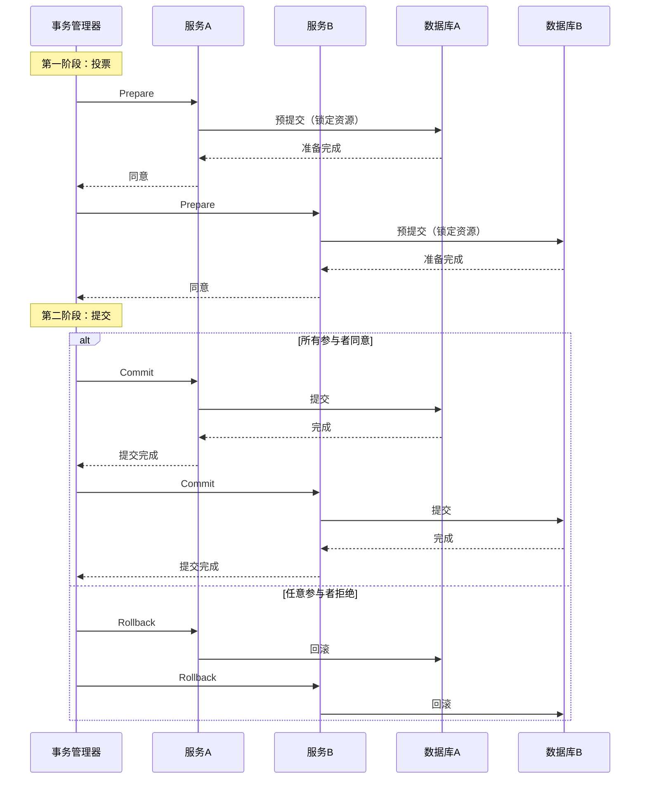

# 分布式事务迁移

2019 年双十一，某电商团队在拆分订单服务和库存服务后，遇到了一个棘手的问题：用户下单时，需要同时扣减库存和创建订单。在单体架构里，这两个操作在同一个数据库事务中，要么同时成功，要么同时失败。但拆分成两个服务后，它们各自有自己的数据库，变成了两个独立的事务。

拆分的第一天，库存扣减成功，但订单创建失败了。库存被扣掉了，用户却没收到订单。

这就是分布式事务的典型场景：**原本在一个事务里的操作，拆分后跨越了多个数据库，甚至多个服务**。

分布式事务是微服务拆分中最难解决的问题之一。这一节从分布式事务的解决方案讲起，分析每种方案的优缺点和适用场景，并给出迁移过程中的平滑过渡策略。

## 为什么微服务架构中不建议使用 2PC

提到分布式事务，很多人第一个想到的是 2PC（两阶段提交）。但**在微服务架构中，2PC 几乎是不推荐的**。

### 2PC 的工作原理



### 2PC 的问题

**第一，阻塞问题。** 在第一阶段，所有参与者完成预提交后，资源被锁定，直到第二阶段完成。如果事务管理器宕机，参与者会一直等待，无法释放资源。

**第二，单点故障。** 事务管理器是整个 2PC 的核心，如果它挂了，整个分布式事务无法完成。

**第三，不适合长时间事务。** 2PC 的阻塞时间与参与者数量成正比。如果参与者的数据库操作需要较长时间（如大批量写入），阻塞时间会很长，严重影响系统吞吐量。

**第四，微服务场景下难以实现。** 2PC 需要所有参与者提供「预提交」能力，而大多数微服务使用的数据库（如 MySQL）虽然支持 XA 协议，但性能和生态支持都不理想。

**在微服务架构中，2PC 只适合「短事务 + 少量参与者」的场景**，如对账、批处理等。对于核心业务流程（如订单创建），2PC 几乎不是选项。

## Saga 模式详解

Saga 是一种长活事务（Long-Running Transaction）的处理模式。它的核心思想是：**把一个大事务拆分成多个本地事务，每个本地事务完成后发布一个事件，触发下一个本地事务。如果某个步骤失败，则执行补偿事务（Compensating Transaction）回滚之前的步骤。**

### 编排式 Saga vs 协作式 Saga

Saga 有两种实现方式：

| 类型 | 说明 | 优点 | 缺点 | 适用场景 |
| --- | --- | --- | --- | --- |
| **编排式 Saga** | 中央协调器（Orchestrator）控制整个事务流程 | 流程清晰，易于追踪 | 协调器是单点，需要额外开发 | 复杂业务流程、多服务协作 |
| **协作式 Saga** | 各服务通过事件协作，没有中央协调器 | 去中心化，扩展性好 | 流程分散，难以追踪 | 简单业务流程、服务数量少 |

### 编排式 Saga 示例

以订单创建为例，编排式 Saga 的流程如下：

```java
// 订单 Saga 协调器
@Service
public class OrderSagaOrchestrator {

    @Autowired private OrderService orderService;
    @Autowired private InventoryService inventoryService;
    @Autowired private PaymentService paymentService;

    public void createOrderSaga(CreateOrderRequest request) {
        String orderId = generateOrderId();
        SagaContext context = new SagaContext(orderId);

        try {
            // 步骤 1：预留库存
            boolean reserved = inventoryService.reserve(
                context.getOrderId(),
                request.getItems()
            );
            if (!reserved) {
                throw new BusinessException("库存不足");
            }
            context.addStep(SagaStep.INVENTORY_RESERVED);

            // 步骤 2：创建订单
            orderService.createOrder(
                context.getOrderId(),
                request.getUserId(),
                request.getItems()
            );
            context.addStep(SagaStep.ORDER_CREATED);

            // 步骤 3：扣款
            paymentService.deduct(
                request.getUserId(),
                request.getAmount()
            );
            context.addStep(SagaStep.PAYMENT_DEDUCTED);

            // 步骤 4：确认库存（扣减变为永久）
            inventoryService.confirm(context.getOrderId());
            context.addStep(SagaStep.INVENTORY_CONFIRMED);

        } catch (Exception e) {
            // 补偿事务：回滚之前的步骤
            compensate(context, e);
            throw e;
        }
    }

    private void compensate(SagaContext context, Exception e) {
        log.error("Saga 执行失败，开始补偿，orderId={}", context.getOrderId(), e);

        // 补偿顺序与执行顺序相反
        for (SagaStep step : context.getCompletedSteps().descending()) {
            try {
                switch (step) {
                    case INVENTORY_CONFIRMED:
                        // 取消库存确认（释放库存）
                        inventoryService.cancelConfirm(context.getOrderId());
                        break;
                    case PAYMENT_DEDUCTED:
                        // 退款
                        paymentService.refund(context.getUserId(), context.getAmount());
                        break;
                    case ORDER_CREATED:
                        // 取消订单
                        orderService.cancelOrder(context.getOrderId());
                        break;
                    case INVENTORY_RESERVED:
                        // 释放预留库存
                        inventoryService.release(context.getOrderId());
                        break;
                }
            } catch (Exception ex) {
                // 补偿失败，记录告警，人工介入
                log.error("补偿失败，step={}, orderId={}", step, context.getOrderId(), ex);
                alertService.alert("Saga 补偿失败，需要人工处理");
            }
        }
    }
}
```

### 补偿事务的设计原则

补偿事务不是简单的「撤销」，而是「反向操作」。设计补偿事务时需要考虑：

1. **幂等性**：补偿操作可能被执行多次，必须是幂等的
2. **可重试性**：补偿失败后应该能重试，而不是直接失败
3. **逆序执行**：补偿按相反顺序执行，先完成的后补偿
4. **业务语义**：补偿不是简单的回滚，而是业务层面的逆向操作

```java
// 库存释放接口（补偿事务示例）
@Service
public class InventoryService {

    // 释放预留库存（幂等实现）
    @Transactional
    public void release(String orderId) {
        // 先查询当前状态
        InventoryReservation reservation = findReservation(orderId);

        if (reservation == null) {
            log.info("库存预留不存在，可能已释放，orderId={}", orderId);
            return;  // 幂等：不存在时直接返回成功
        }

        if ("RELEASED".equals(reservation.getStatus())) {
            log.info("库存已释放，orderId={}", orderId);
            return;  // 幂等：已释放时直接返回成功
        }

        // 释放库存
        inventoryMapper.increaseStock(
            reservation.getSkuId(),
            reservation.getQuantity()
        );

        reservation.setStatus("RELEASED");
        inventoryMapper.updateReservation(reservation);

        log.info("库存释放成功，orderId={}, skuId={}, quantity={}",
            orderId, reservation.getSkuId(), reservation.getQuantity());
    }
}
```

## TCC 模式详解

TCC（Try-Confirm-Cancel）是另一种分布式事务模式，与 Saga 的区别在于：**TCC 是业务层面的补偿，需要业务代码显式实现 Try、Confirm、Cancel 三个阶段**。

### TCC 的三阶段

| 阶段 | 说明 | 目的 |
| --- | --- | --- |
| **Try** | 预留资源 | 检查业务可行性，预占资源 |
| **Confirm** | 确认执行 | 使用预留的资源，完成业务操作 |
| **Cancel** | 取消执行 | 释放预留的资源 |

### TCC 示例

```java
// TCC 库存服务
@Service
public class InventoryTccService {

    @Autowired private InventoryMapper inventoryMapper;

    /**
     * Try：预留库存
     * - 检查库存是否足够
     * - 预占库存（减少可用库存，增加预留库存）
     */
    @Transactional
    public boolean tryReserve(Long skuId, Integer quantity) {
        Inventory inventory = inventoryMapper.findBySkuId(skuId);

        if (inventory.getAvailableStock() < quantity) {
            return false;  // 库存不足
        }

        // 预占库存
        inventoryMapper.decreaseAvailableStock(skuId, quantity);
        inventoryMapper.increaseReservedStock(skuId, quantity);

        // 记录 TCC 事务日志
        tccLogService.logTry("inventory_reserve", skuId, quantity);

        return true;
    }

    /**
     * Confirm：确认预留
     * - 扣减预留库存，完成业务
     */
    @Transactional
    public boolean confirmReserve(Long skuId, Integer quantity) {
        // 检查是否已 Try
        TccLog log = tccLogService.findLog("inventory_reserve", skuId, quantity);

        if (log == null || "CONFIRMED".equals(log.getStatus())) {
            return true;  // 幂等：已确认或无记录
        }

        // 扣减预留库存
        inventoryMapper.decreaseReservedStock(skuId, quantity);

        // 更新 TCC 日志状态
        tccLogService.updateStatus(log.getId(), "CONFIRMED");

        return true;
    }

    /**
     * Cancel：取消预留
     * - 释放预留的库存
     */
    @Transactional
    public boolean cancelReserve(Long skuId, Integer quantity) {
        // 检查是否已 Try
        TccLog log = tccLogService.findLog("inventory_reserve", skuId, quantity);

        if (log == null || "CANCELLED".equals(log.getStatus())) {
            return true;  // 幂等：已取消或无记录
        }

        // 释放预留库存
        inventoryMapper.increaseAvailableStock(skuId, quantity);
        inventoryMapper.decreaseReservedStock(skuId, quantity);

        // 更新 TCC 日志状态
        tccLogService.updateStatus(log.getId(), "CANCELLED");

        return true;
    }
}
```

### TCC vs Saga 的对比

| 维度 | TCC | Saga |
| --- | --- | --- |
| **实现复杂度** | 高，需要显式实现三阶段 | 中，补偿逻辑相对简单 |
| **资源锁定** | Try 阶段锁定，Confirm/Cancel 释放 | 无锁定，通过补偿实现 |
| **性能** | 高，无长时间锁定 | 高，无锁定 |
| **适用场景** | 对一致性要求高、资源需要预留的场景 | 对性能要求高、资源无需预留的场景 |
| **框架支持** | Seata AT、TCC-Proxy | Seata Saga、Axon Framework |

## 迁移过程中的事务处理

从本地事务过渡到分布式事务，不能一蹴而就。以下是平滑迁移的策略。

### 策略一：逐步拆分，先异步后同步

不要一次性把所有的本地事务都改成分布式事务。先把非核心的业务流程异步化，减少需要分布式事务保障的场景。

```
单体架构（本地事务）：
┌─────────────────────────────────┐
│      创建订单（本地事务）          │
│  1. 扣减库存                     │
│  2. 创建订单                     │
│  3. 扣减余额                     │
└─────────────────────────────────┘

拆分后（分布式事务）：
┌─────────────────────────────────┐
│      创建订单（分布式事务）         │
│  1. 扣减库存（TCC）               │
│  2. 创建订单（Saga）              │
│  3. 扣减余额（TCC）               │
└─────────────────────────────────┘

优化后（异步化，减少分布式事务）：
┌─────────────────────────────────┐
│      创建订单（Saga）             │
│  1. 预扣库存（TCC Try）           │
│  2. 创建订单（Saga）              │
│  3. 扣减余额（异步消息）           │
└─────────────────────────────────┘
```

### 策略二：引入分布式事务中间件

使用成熟框架（如 Seata）降低开发成本。Seata 支持 AT、TCC、Saga 三种模式：

```yaml
# Seata 配置
seata:
  enabled: true
  application-id: order-service
  tx-service-group: my_tx_group
  config:
    type: nacos
    nacos:
      namespace: ""
      server-addr: 127.0.0.1:8848
  registry:
    type: nacos
    nacos:
      application: seata-server
      server-addr: 127.0.0.1:8848
```

```java
// 使用 Seata AT 模式
@GlobalTransactional(timeoutMills = 30000)
public void createOrder(CreateOrderRequest request) {
    // 扣减库存（AT 模式自动管理）
    inventoryService.decreaseStock(request.getSkuId(), request.getQuantity());

    // 创建订单（AT 模式自动管理）
    Order order = new Order();
    order.setUserId(request.getUserId());
    order.setSkuId(request.getSkuId());
    order.setQuantity(request.getQuantity());
    orderMapper.insert(order);

    // 扣减余额（AT 模式自动管理）
    paymentService.deductBalance(request.getUserId(), request.getAmount());
}
```

### 策略三：业务层容错

无论使用哪种分布式事务方案，都需要在业务层增加容错机制：**分布式事务只是降低了出问题的概率，不能完全消除**。

```java
@Service
public class OrderService {

    @Autowired private OrderSagaOrchestrator sagaOrchestrator;

    public String createOrder(CreateOrderRequest request) {
        try {
            sagaOrchestrator.createOrderSaga(request);
            return "订单创建成功";
        } catch (InventoryException e) {
            // 库存不足，返回业务异常
            return "库存不足";
        } catch (Exception e) {
            // 分布式事务失败，进入补偿流程
            log.error("订单创建失败，进入补偿", e);
            return "订单创建失败，请稍后重试";
        }
    }
}
```

## 降级方案

分布式事务虽然能保证一致性，但会增加系统复杂度和延迟。如果分布式事务服务不可用，需要有降级方案。

### 降级策略

| 降级策略 | 说明 | 适用场景 |
| --- | --- | --- |
| **最大努力通知** | 不保证一致性，通过定时任务补偿 | 非核心业务 |
| **最终一致性** | 允许短暂不一致，通过异步任务达到一致 | 对一致性要求不高的场景 |
| **人工介入** | 异常时告警，人工处理 | 高价值交易 |

### 降级实现示例

```java
@Service
public class DistributedTransactionManager {

    @Autowired private SeataTransactionManager seataManager;
    @Autowired private ConfigService configService;

    public void executeWithFallback(TransactionOperation operation) {
        // 检查是否启用分布式事务
        boolean dtEnabled = configService.getBoolean("distributed_transaction_enabled", true);

        if (!dtEnabled) {
            // 降级：执行本地事务
            log.warn("分布式事务已降级，执行本地事务");
            operation.executeLocal();
            return;
        }

        try {
            // 执行分布式事务
            operation.executeDistributed();
        } catch (Exception e) {
            log.error("分布式事务执行失败，降级为本地事务", e);

            // 告警
            alertService.alert("分布式事务执行失败，降级处理");

            // 降级执行
            operation.executeLocal();
        }
    }
}
```

## 真实案例

> **真实案例**：某电商订单系统拆分过程中如何处理「创建订单 + 扣减库存」的事务
>
> - **背景**：订单服务和库存服务从单体拆分，订单创建时需要同时扣减库存
> - **方案选型**：最终选用 TCC 模式，因为库存需要预留，直接扣减可能导致负库存
> - **实现细节**：1. Try 阶段预占库存；2. Confirm 阶段扣减库存、创建订单；3. Cancel 阶段释放预占
> - **遇到的问题**：高并发时 TCC 资源锁定导致库存利用率下降
> - **优化方案**：引入库存预售机制，提前锁定部分热门商品库存，降低 Try 阶段的锁定压力
> - **结果**：高峰期订单创建成功率从 95% 提升到 99.5%，负库存问题彻底解决
> - **来源**：内部技术复盘文档

## 总结

分布式事务是微服务拆分中最核心也最复杂的挑战之一。2PC 在微服务架构中几乎不推荐，因为它有阻塞、单点故障、不适合长事务等问题。

Saga 模式适合长活事务，通过补偿事务实现最终一致性，实现相对简单。TCC 模式适合需要资源预留的场景，通过 Try-Confirm-Cancel 三阶段显式控制资源。**选择哪种方案，取决于业务场景的对称性需求**：如果参与者之间的交互是对称的（如订单和库存），TCC 更合适；如果不对称（如订单和物流），Saga 更合适。

迁移过程中，建议采用「逐步拆分、先异步后同步」的策略，先减少需要分布式事务保障的场景，再逐步引入分布式事务框架。同时，业务层必须设计容错和降级方案，以应对分布式事务不可用的情况。

---

**常见陷阱与反模式**：

1. **滥用分布式事务**：不是所有跨服务调用都需要分布式事务。如果两个服务之间的数据一致性要求不高，用最终一致性（消息队列）就够了，引入分布式事务只会增加复杂度。
2. **补偿逻辑不完整**：Saga 的补偿逻辑需要覆盖所有可能的失败场景。补偿逻辑不完整，会导致部分成功部分失败的状态。
3. **忽略幂等性**：分布式事务中，每个参与者都必须保证幂等性，否则重试会导致数据重复或不一致。

### 思考题

**问题 1**：如果 TCC 的 Try 阶段成功了，但 Confirm 阶段超时了，应该如何处理？

<details>
<summary>参考答案</summary>

TCC 事务处理 Confirm 超时的标准策略是：认为 Confirm 已成功（因为 TCC 设计上假设网络分区是小概率事件），不再重试 Confirm。但需要记录这个「悬挂」状态，并通过后台定时任务扫描未完成的 TCC 事务，主动调用 Confirm 确认状态。同时，需要设计幂等的 Confirm 接口，即使重复调用也不会产生副作用。

</details>

**问题 2**：Saga 模式下，如果补偿事务本身也失败了，应该如何处理？

<details>
<summary>参考答案</summary>

补偿失败后，首先应该记录详细的失败日志和上下文信息（订单号、失败步骤、失败原因等），然后通过告警通知运维人员人工介入。同时实现重试机制，对于可重试的补偿（如网络超时），定时任务会自动重试；对于不可重试的补偿（如业务规则冲突），需要人工判断和处理。为避免补偿任务堆积，建议按失败原因分级告警。

</details>

**问题 3**：对于「先付后用」和「先用后付」两种业务模式，分布式事务的设计有什么不同？

<details>
<summary>参考答案</summary>

两种模式的区别在于「资源预留」的时机。「先付后用」（如电商订单）：用户先付款，账户余额已扣减，需要确保后续业务完成（库存扣减、订单创建）。适合 Saga 模式。「先用后付」（如会员积分）：先使用资源，后扣减余额。适合 TCC 模式，在 Try 阶段预留资源（如积分额度），Confirm 阶段真正扣减。需要根据业务特性选择合适的模式。

</details>
