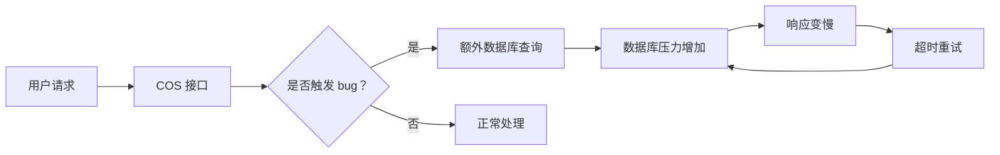
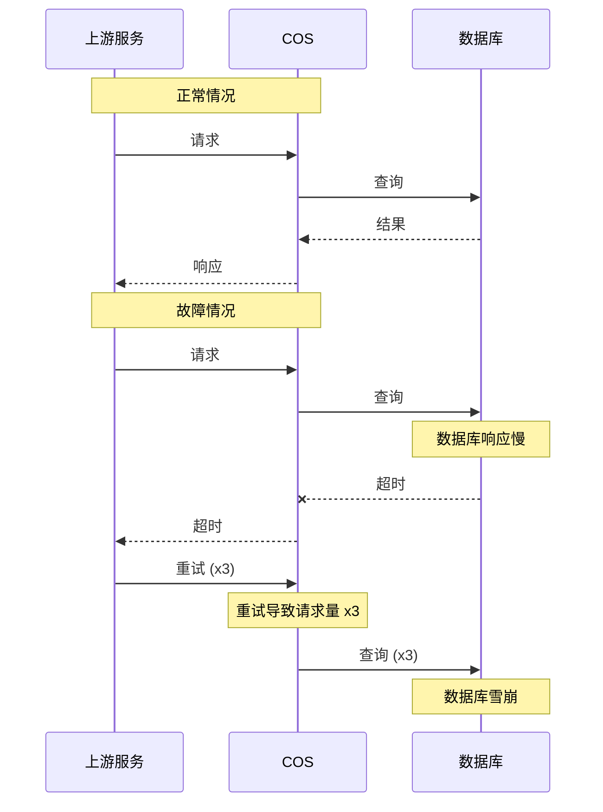
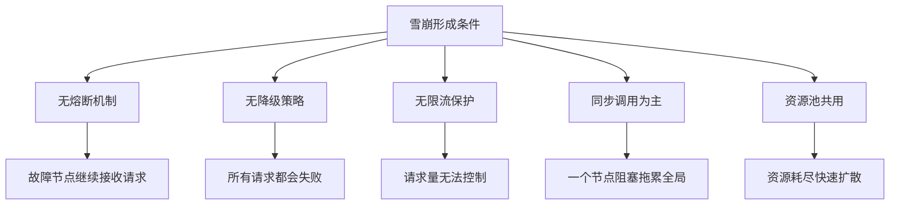
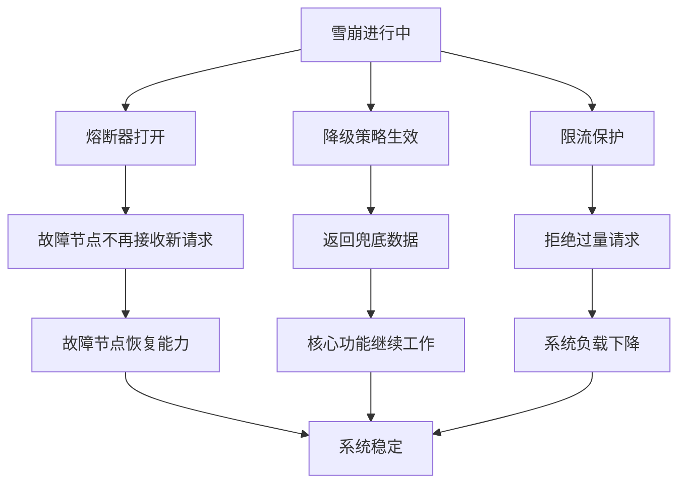

# 阿里云光缆故障

2019 年 6 月 1 日凌晨，腾讯云出现了大范围故障，多款产品同时出现服务异常，广州、上海、重庆等多地用户受到影响。故障持续了约 3 小时，影响范围覆盖了多个业务线。

这本来是一次普通的基础设施故障，但故障的发展过程却让人印象深刻——**一个原本可以快速解决的问题，因为级联效应，演变成了一场影响数万用户的重大事故**。

## 事件背景

这次故障的主角是腾讯云的对象存储（COS）服务。COS 是腾讯云的核心产品之一，提供海量、安全、低成本、高可靠的云存储服务。数以万计的企业和开发者使用 COS 存储图片、视频、日志、备份文件等数据。

2019 年 6 月 1 日是儿童节，一个原本轻松的节日。但对于腾讯云的运维团队来说，这一天却成了噩梦的开始。

## 事件经过

### 故障的起点

故障的起点非常不起眼——凌晨 2:30 左右，一个例行的运维操作需要对 COS 的某个存储节点进行版本升级。升级过程中，由于操作脚本的一个 bug，部分节点的版本回退到了旧版本。

版本回退本身不是大问题。但如果回退的版本存在 bug，情况就不一样了。

### 问题开始发酵

回退后的版本中，有一个接口的行为发生了变化——在特定条件下，该接口会触发一次不必要的数据库查询。这听起来是个小问题，但在高并发场景下，「一次不必要的查询」会被放大成灾难。



约 5 分钟后，值班工程师收到了告警：COS 的某个节点开始出现响应延迟上升。但告警的阈值设置得比较保守，工程师判断是「暂时性的波动」，没有立即介入。

### 雪崩开始

从凌晨 3:00 开始，情况急剧恶化。

由于 COS 是很多服务的基础依赖，当 COS 的响应变慢后，所有依赖它的服务开始出现超时。超时触发重试，重试进一步增加了对 COS 的请求量，形成了**正反馈循环**。



更糟糕的是，COS 的某个内部组件没有配置熔断机制——当数据库压力过大时，它没有「快速失败」，而是继续等待，最终耗尽了所有可用连接。

凌晨 3:15，COS 的主要节点开始拒绝服务。约 3:30，腾讯云的多个产品——包括图片处理、视频服务、日志服务——开始集体告警。

### 影响评估

|| 维度 | 数据 |
|| --- | --- |
| 故障起始时间 | 2019-06-01 02:30 |
| 故障恢复时间 | 2019-06-01 05:45 |
| 总持续时长 | 约 3 小时 15 分钟 |
| 影响地域 | 广州、上海、重庆、北京等多地 |
| 受影响用户 | 估算超过 10 万企业用户 |
| 受影响服务 | COS、CDN、日志服务、直播等 |

## 雪崩效应原理解析

这次故障的发展过程，是一个典型的**雪崩效应（Avalanche Effect）**案例。

### 雪崩的定义

雪崩效应指的是在一个分布式系统中，当某个节点或服务出现故障时，由于缺乏有效的隔离和保护机制，故障会像滚雪球一样逐步扩大，最终导致整个系统崩溃。

雪崩效应通常有以下特征：

1. **起始事件**：单个节点出现故障
2. **传播机制**：故障通过服务调用链扩散
3. **正反馈循环**：超时 → 重试 → 负载增加 → 更多超时
4. **临界点**：系统达到临界状态后，任何小扰动都会导致全面崩溃

### 雪崩的形成条件

雪崩效应不会凭空发生，需要满足以下条件：



**无熔断机制**：当依赖服务不可用时，继续向它发送请求会浪费资源、放大故障。没有熔断器的系统，会让故障持续扩散。

**无降级策略**：当核心依赖不可用时，系统没有「退路」——返回兜底数据、关闭非核心功能。没有降级，系统要么「全部成功」要么「全部失败」。

**无限流保护**：没有限流机制的系统，在流量突增时无法「拒绝对不起的请求」。结果是：处理能力以内的请求也受影响。

**同步调用为主**：异步调用可以让调用方不必等待，但同步调用会阻塞。当一个调用链中的某个节点变慢，所有等待中的请求都会占用资源。

### 如何阻止雪崩

阻止雪崩的核心思路是**打破正反馈循环**：



## 恢复过程

### 第一阶段：止血（3:30 - 4:00）

凌晨 3:30，腾讯云值班团队确认故障范围后，开始紧急止血。主要措施包括：

1. **隔离故障节点**：将出现问题的 COS 节点从服务池中移除，防止继续影响全局
2. **切换流量**：通过 DNS 解析将部分流量切换到其他可用区
3. **紧急扩容**：在健康的节点上紧急扩容，应对请求量的突增

### 第二阶段：根因定位（4:00 - 4:30）

止血措施生效后，团队开始排查根因。约 4:20，确认了问题的源头——运维脚本的 bug 导致部分节点版本回退，回退版本中的 bug 触发了额外的数据库查询。

### 第三阶段：修复与恢复（4:30 - 5:45）

根因确认后，团队开始修复：

1. **回滚到正确版本**：将所有受影响的节点恢复到正确版本
2. **重启故障组件**：清除内存中的异常状态
3. **灰度恢复**：先恢复 10% 流量，观察稳定后再逐步扩大
4. **全量恢复**：确认所有服务正常后，解除流量限制

### 恢复时间线

|| 时间 | 事件 |
|| --- | --- |
| 02:30 | 运维操作导致版本回退 |
| 02:35 | 额外查询开始影响数据库 |
| 03:00 | 告警触发，工程师判断为「暂时波动」 |
| 03:15 | COS 主要节点开始拒绝服务 |
| 03:30 | 多产品告警，故障升级 |
| 03:35 | 团队开始紧急止血 |
| 04:00 | 故障节点隔离完成 |
| 04:20 | 根因定位完成 |
| 04:30 | 开始回滚修复 |
| 05:45 | 服务完全恢复 |

## 后续改进

### 1. 熔断机制

腾讯云在所有核心服务间引入了熔断器。当某个依赖服务的错误率超过阈值时，熔断器自动「打开」，快速失败而不是继续等待。

```yaml
# 熔断配置示例
circuit-breaker:
  enabled: true
  error-threshold: 50%      # 错误率超过 50% 时打开
  success-threshold: 3     # 连续 3 次成功才关闭
  half-open-max-calls: 10  # 半开状态下最多放行 10 个请求
  timeout: 5s               # 超时阈值 5 秒
```

### 2. 降级策略

定义了明确的降级策略，当核心依赖不可用时，系统可以自动降级到「部分可用」状态：

```yaml
# 降级策略
degradation:
  cos:
    degraded: "返回预签名过期链接"
    fallback: "返回默认图片"

  cdn:
    degraded: "回源到 COS 直链"
    fallback: "返回静态错误页"
```

### 3. 限流保护

在入口层增加了限流配置，防止突发流量压垮下游服务：

```yaml
# 限流配置
rate-limit:
  cos-read:
    qps: 10000
    strategy: "token-bucket"

  cos-write:
    qps: 5000
    strategy: "token-bucket"
```

### 4. 运维变更管控

改进了运维脚本的发布流程，增加了灰度和回滚机制：

1. 所有运维脚本必须经过 review 和测试
2. 生产环境变更必须分批次执行，每批次观察 10 分钟
3. 变更操作必须可回滚，不可回滚的操作禁止在生产环境执行

## 量化数据与影响分析

|| 指标 | 数据 |
|| --- | --- |
| 故障总时长 | 约 3 小时 15 分钟 |
| 故障影响地域 | 5 个地域 |
| 受影响用户 | 约 10 万企业用户 |
| 受影响服务数 | 超过 15 个云服务 |
| 流量损失 | 约 30% 的请求失败 |
| 经济损失 | 估算数百万（不含品牌影响） |

从 P0/P1 故障的定义来看，这次故障属于 **P0 级别**——核心服务长时间不可用，影响范围广泛。

## 思考题

**问题 1**：在故障初期，值班工程师判断是「暂时性波动」而没有立即介入。这个判断合理吗？如果你是值班工程师，你会怎么做？

<details>
<summary>参考答案</summary>

这个判断过于乐观。在生产环境中，「暂时性波动」往往不会自动恢复，反而可能是更大问题的前兆。正确的做法是：1）设置更敏感的告警阈值，不要等问题严重了才告警；2）对任何异常都保持警惕，宁可虚惊一场，不要错过真实故障的早期信号；3）如果判断不准，快速升级而不是继续观察。故障的黄金止血期是前 5 分钟，错过这个窗口，问题往往会扩大。

</details>

**问题 2**：熔断和降级是两种不同的容错手段，它们的区别是什么？什么时候应该优先使用熔断，什么时候应该优先使用降级？

<details>
<summary>参考答案</summary>

熔断和降级解决的是不同层面的问题：熔断解决的是「调用方如何保护自己」，降级解决的是「被调用方不可用时调用方该怎么办」。熔断是被动保护——当检测到错误率上升时自动触发；降级是主动预案——预先定义好降级方案，当触发条件满足时执行。在实际系统中，两者应该配合使用：熔断器打开后，调用方应该执行降级逻辑，返回兜底数据或提示用户稍后重试。

</details>

**问题 3**：为什么「同步调用」更容易导致雪崩？异步调用如何帮助缓解雪崩效应？

<details>
<summary>参考答案</summary>

同步调用的特点是调用方必须等待返回结果才能继续。在一个调用链中，如果某个节点响应变慢，所有等待中的请求都会占用线程或连接资源。当请求堆积到一定程度，线程池或连接池耗尽，导致整个系统不可用。异步调用可以让调用方「不等」——发送请求后立即返回，在回调中处理结果。这样即使下游变慢，上游也不会被拖住，资源可以用于处理其他请求。不过异步调用会增加系统复杂度，需要额外的错误处理和状态管理，实际选择需要权衡。

</details>