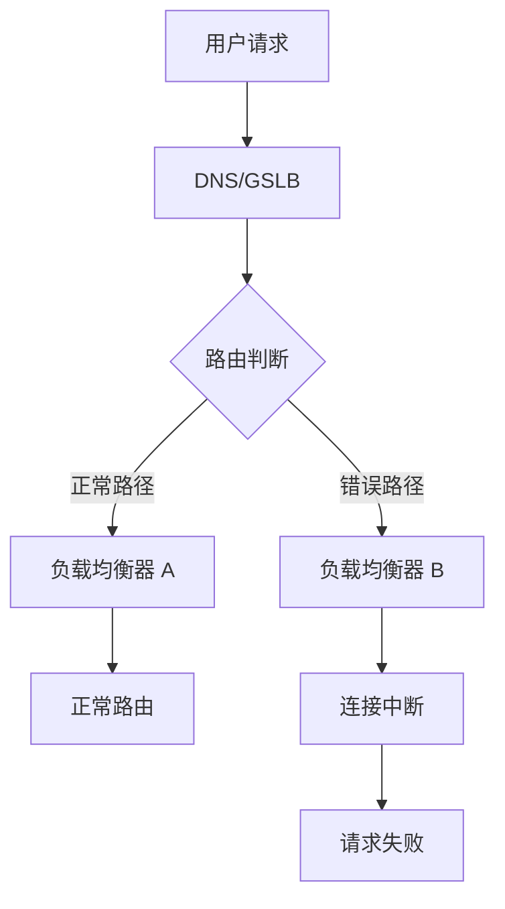

# GitHub 降级事故

2016 年 2 月 1 日下午（北京时间），全球最大的代码托管平台 GitHub 出现了大规模服务故障。这次故障不是由于代码缺陷或硬件故障引起的，而是**一次网络配置变更**导致的。

故障的起因是一次例行的维护操作：工程师在修改负载均衡器的配置时，犯了一个小错误。这个小错误导致 GitHub 在全球多个数据中心之间的网络连接中断，服务降级超过 24 小时。

这次事故后来成为了网络运维领域的经典案例，被广泛讨论和研究。

## 事件背景

### GitHub 的基础设施架构

在讨论故障之前，需要了解 GitHub 当时的基础设施架构。

2016 年的 GitHub 已经是一个拥有超过 1400 万开发者用户、日均 PV 超过 10 亿的大型平台。它的基础设施采用多数据中心部署：

- **东海岸数据中心**：主要服务美洲用户
- **西海岸数据中心**：主要服务亚太用户
- **欧洲数据中心**：主要服务欧洲用户

数据中心之间通过专线互联，流量通过 Anycast DNS 和全局负载均衡器（GSLB）进行调度。

### 故障前的维护窗口

2016 年 1 月 31 日，GitHub 安排了一个例行维护窗口。根据 GitHub 官方博客的事后报告，维护内容包括：

- 升级负载均衡器固件
- 调整 BGP 路由配置
- 测试故障切换能力

这次维护是在凌晨（太平洋时间 00:00-04:00）进行的，GitHub 认为这是流量最低的时间段。

## 事件经过

### 第一阶段：维护操作（1 月 31 日 00:00 - 04:00）

维护窗口开始后，工程师执行了负载均衡器的固件升级和配置调整。维护操作按计划进行，凌晨 04:00 左右，维护窗口结束，服务恢复正常。

表面上，一切正常。

### 第二阶段：故障显现（2 月 1 日 00:00 - 01:00 UTC）

故障真正爆发是在维护窗口结束约 20 小时后。

UTC 时间 2 月 1 日 00:00 左右，GitHub 的监控系统开始检测到异常：部分用户请求出现超时，GitHub API 的响应时间开始波动。

起初的告警被值班工程师判断为「暂时性波动」，没有立即升级。

### 第三阶段：大规模故障（2 月 1 日 01:00 - 02:00 UTC）

UTC 时间 01:00，故障规模急剧扩大。GitHub 官网开始出现大规模访问异常：

- push/pull 操作失败
- 代码审查页面无法加载
- Issue 和 Pull Request 功能不可用
- API 请求大量超时

约 01:30，GitHub 在 Twitter 上发布公告：「我们正在调查影响 git push/pull 和 GitHub.com 的服务降级。」

### 第四阶段：问题定位（02:00 - 05:00 UTC）

工程师开始紧急排查。监控显示，多个数据中心的负载均衡器显示「健康」，但实际流量无法正常路由。

约 03:00，工程师发现了问题的根源：**负载均衡器的配置中，一个指向核心路由器集群的 IP 地址配置错误**。



配置错误导致部分流量被路由到了不存在的目标，或者被路由到了错误的网络路径上。

### 第五阶段：恢复（05:00 - 09:00 UTC）

根因确认后，修复方案很直接：更正负载均衡器的 IP 地址配置。

但问题在于：配置变更需要通过审批流程，而且负载均衡器的固件升级可能导致了某些配置丢失。团队需要确认所有配置是否正确。

约 05:30，团队开始逐个修复负载均衡器的配置。

约 07:00，第一批服务器恢复。

约 09:00，所有服务恢复正常。

## 影响评估

|| 维度 | 数据 |
|| --- | --- |
| 故障起始时间 | 2016-02-01 00:00 UTC |
| 完全恢复时间 | 2016-02-01 09:00 UTC |
| 总中断时长 | 约 9 小时 |
| 影响范围 | GitHub.com、API、Git 操作 |
| 受影响用户 | 全球开发者，约数百万开发者受影响 |
| 影响地域 | 主要是亚太和美洲用户 |

GitHub 官方在事后报告中承认：这次故障影响了大量开发者的正常工作，很多开发者无法 push/pull 代码，也无法使用代码审查功能。

## 根因分析

### 直接原因：网络配置错误

故障的直接原因很清楚：负载均衡器的配置中存在 IP 地址错误。

但为什么这个错误会导致如此大范围的故障？

### 深层原因一：变更管理流程缺陷

GitHub 在事后报告中指出：负载均衡器的配置变更没有经过充分的 review 和测试。

正常情况下，网络设备配置的变更应该：

1. **变更前**：在测试环境验证
2. **变更中**：逐步生效，每步验证
3. **变更后**：确认所有路由正常

GitHub 的问题是：这次变更是在凌晨维护窗口进行的，团队可能因为「时间紧张」而省略了某些验证步骤。

### 深层原因二：配置同步机制问题

负载均衡器的配置是分布式的——多台设备需要保持配置一致。当一台设备的配置出现问题时，其他设备可能需要手动同步。

GitLab 的事后分析发现：配置变更没有自动同步机制，依赖人工逐一检查，容易遗漏。

### 深层原因三：监控覆盖不足

故障从发生到被发现花了约 1 小时。这说明 GitHub 的网络监控存在盲区——它能监控到「服务是否可用」，但无法监控到「路由配置是否正确」。

```bash
# 监控盲区示例
# 负载均衡器状态：健康
# 应用服务器状态：健康
# 数据库状态：健康
# 网络路由：未知
```

## GitHub 官方报告的关键内容

GitHub 在故障发生后约 36 小时发布了详细的事后分析报告（Postmortem）。这份报告后来成为了运维领域的经典文档。

报告的核心内容：

1. **完整的时间线**：从维护开始到完全恢复的每一步
2. **根因分析**：不是简单说「配置错误」，而是分析了「为什么配置会错误」
3. **改进措施**：每项改进都有具体的负责团队和完成标准

GitHub 报告中有一段话值得深思：

> "We have identified several areas where our processes were insufficient, and we have already begun making changes to ensure we catch similar issues earlier."
>
> 我们已经识别出流程不足的多个方面，并已开始进行改进，以确保类似问题能够被更早发现。

## 后续改进

### 1. 变更审批流程强化

GitHub 在故障后改进了变更审批流程：

```
变更分级：
├─ P0 变更（网络核心设备）
│   ├─ 必须提前 48 小时申请
│   ├─ 必须通过同行 review
│   ├─ 必须有回滚方案
│   └─ 必须有值班 SRE 全程陪同
│
├─ P1 变更（负载均衡、数据库）
│   ├─ 必须提前 24 小时申请
│   ├─ 必须有回滚方案
│   └─ 必须有值班工程师在场
│
└─ P2 变更（应用层配置）
    ├─ 必须提前 4 小时通知
    └─ 可在变更窗口内执行
```

### 2. 自动化配置验证

引入了配置自动化验证工具：

```yaml
# 网络配置验证清单
network_config_validation:
  - name: "路由可达性测试"
    tool: "traceroute + ping"
    frequency: "变更后自动执行"
    alert_on_failure: true

  - name: "负载均衡健康检查"
    tool: "自定义健康检查脚本"
    frequency: "每分钟"
    alert_on_inconsistency: true

  - name: "BGP 路由验证"
    tool: "Quagga BGP 状态检查"
    frequency: "持续监控"
    alert_on_change: true
```

### 3. 多区域切换测试

GitHub 在故障后增加了定期的跨区域故障切换测试：

```bash
# 每月一次的跨区域切换测试
test_scenario:
  name: "单数据中心故障切换"
  frequency: "每月一次"
  steps:
    - "隔离东海岸数据中心"
    - "验证流量自动切换到其他区域"
    - "确认服务可用性"
    - "恢复东海岸数据中心"
  success_criteria:
    - "服务中断时间 < 5 分钟"
    - "所有用户请求成功路由"
```

### 4. 值班响应优化

改进了值班响应机制：

```yaml
# 故障响应级别
incident_response:
  level1:
    trigger: "单一服务告警"
    response: "值班工程师 15 分钟内响应"

  level2:
    trigger: "多服务告警"
    response: "值班 leader 5 分钟内介入"

  level3:
    trigger: "服务完全不可用"
    response: "立即升级，所有相关工程师加入"
```

## 维护窗口管理的最佳实践

GitHub 这次故障，很大程度上暴露了「维护窗口」管理的不足。从这次事故中，可以总结以下最佳实践：

### 1. 维护窗口不是免责窗口

很多团队认为「维护窗口内发生的问题是可接受的」。但实际上，维护窗口内的变更往往更危险——因为它改变了系统的已知状态。

正确的态度是：**维护窗口是「可以进行高风险操作的时间段」，不是「可以降低质量标准的时期」**。

### 2. 分批变更与验证

对于复杂的网络变更，应该分批进行：

1. **先在非生产环境验证**
2. **先变更一台设备，观察 10-30 分钟**
3. **确认无误后，变更其余设备**
4. **每步都要有明确的成功标准**

### 3. 准备回滚方案

每次变更前，必须明确回答：**如果变更失败，怎么回滚？**

```bash
# 回滚方案模板
rollback_plan:
  condition: "如果变更后 30 分钟内发现异常"
  action: "立即回滚到变更前的配置"

  backup:
    - "配置变更前备份当前配置"
    - "保存配置到版本控制系统"
    - "记录配置变更前后的差异"

  execution:
    - "执行回滚命令"
    - "验证服务恢复正常"
    - "通知相关方"
```

### 4. 变更后的持续监控

变更完成后，不意味着工作结束。应该：

1. **观察 30 分钟**：确认没有异常
2. **对比关键指标**：错误率、延迟、吞吐量
3. **确认依赖服务正常**：特别是跨系统依赖

## 思考题

**问题 1**：为什么负载均衡器的配置错误会导致如此大范围的故障？是不是应该设计得更健壮？

<details>
<summary>参考答案</summary>

配置错误导致大范围故障的原因：1）负载均衡器是网络架构的核心节点——它的错误会导致流量被路由到错误的目标；2）GitHub 使用的是「集中式」负载均衡架构——所有流量都要经过少数几个关键节点；3）缺少配置验证机制——错误的配置被直接生效了。健壮的设计应该包括：1）配置变更前的自动化验证；2）配置不一致时的自动检测和告警；3）故障时的自动切换到备用路径。GitHub 后来也在这些方面做了改进。

</details>

**问题 2**：在维护窗口内，团队容易出现什么问题？如何避免？

<details>
<summary>参考答案</summary>

维护窗口内常见问题：1）疲劳和判断失误——凌晨操作时团队可能已经疲劳，判断力下降；2）时间压力——维护窗口通常有时间限制，容易让人「跳过步骤」；3）变更过多——把多个变更塞进一个维护窗口，导致复杂性增加；4）验证不足——因为「大家都在」而省略了某些验证步骤。避免方法：1）合理安排维护窗口时间，不要总是在凌晨；2）每个变更窗口只做一个主要变更；3）即使在维护窗口内，也要严格执行变更审批和验证流程；4）做好交接记录，如果需要中途换人，避免信息丢失。

</details>

**问题 3**：GitHub 在故障后发布了详细的事后分析报告，这种做法有什么价值？

<details>
<summary>参考答案</summary>

几个价值：1）**建立用户信任**——坦诚地承认问题并提供解释，比隐瞒或推诿更能获得用户理解；2）**知识沉淀**——详细的事后分析成为运维领域的宝贵资料，其他团队可以从中学习；3）**团队成长**——写报告的过程本身就是对问题的深入思考，帮助团队发现平时忽视的问题；4）**行业示范**——GitLab 等公司后来也采用了类似的做法，形成了故障复盘文化。好的事后分析应该包括：完整时间线、根因分析（不只是直接原因）、改进措施（每项有负责人和时间）、以及透明的用户沟通。

</details>