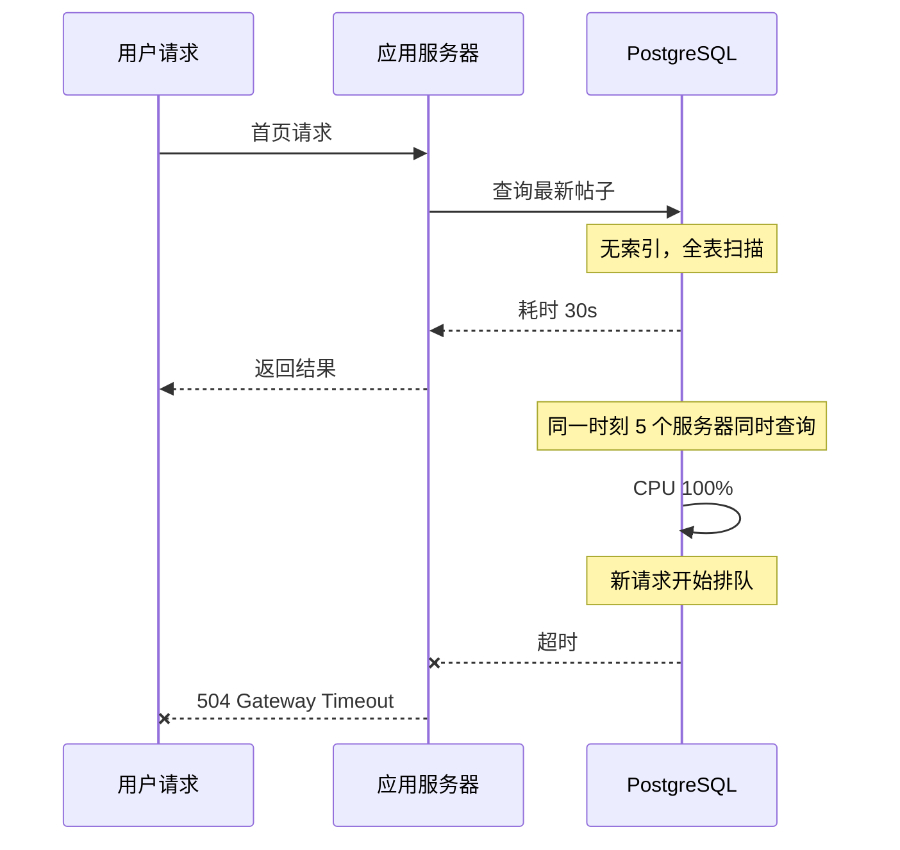

# Hacker News 数据库宕机事件

2019 年 3 月的一个普通工作日，Y Combinator 旗下的 Hacker News（简称 HN）突然宕机了。这次宕机持续了大约 2 小时，期间整个社区无法访问。对于一个日均 PV 超过 3000 万、技术人员聚集的平台来说，这是一次性质严重的故障。

但真正让这次故障值得深入分析的原因，不只是它造成了多大的影响，而是它的根因——**一个看起来很普通的查询，竟然把整个数据库打满了**。

## 事件背景

Hacker News 是 Y Combinator 于 2007 年创立的科技新闻社区，以「高质量的讨论」著称。与 Reddit 等综合性社区不同，HN 的定位更垂直——它的核心用户是工程师和技术从业者，讨论的话题集中在技术、创业、编程、人工智能等领域。

HN 的技术栈非常「复古」：后端使用 Arc 语言（Paul Graham 为 HN 专门开发的编程语言），数据库使用 PostgreSQL。在 2019 年这次故障发生前，HN 的架构没有太多花哨的设计——它走的是「够用就好」的路线。

这种「够用就好」的设计哲学，让 HN 在很长时间内保持了稳定运行。但也正是这种哲学，让它在面对「意外情况」时显得脆弱。

## 事件经过

故障发生在太平洋时间上午 10:36 左右。用户开始报告页面无法加载，最初的监控告警显示数据库 CPU 使用率飙升至 100%，随后 HN 的主站完全不可用。

事后复盘显示，故障的触发点是一个「列表查询」请求。这个查询的本意是获取「过去 24 小时内的最新帖子列表」，用于首页展示。查询逻辑并不复杂：

```sql
SELECT * FROM posts
WHERE created_at > NOW() - INTERVAL '24 hours'
ORDER BY score DESC
LIMIT 50;
```

这条查询本身没有问题。问题出在**没有合理的索引支撑**——当数据库中积累了数百万条帖子记录后，这条查询需要执行全表扫描，导致响应时间从毫秒级飙升到数十秒。

更糟糕的是，这个查询在同一时间被多个应用服务器同时执行。每个请求都在数据库上创建一个长时间运行的连接，而这些连接又进一步加重了数据库的负担。



从 10:36 到 10:52 的 16 分钟内，数据库处于「半瘫痪」状态——它还在响应请求，但每个请求都需要几十秒甚至更长时间，大量连接堆积，CPU 打满。

10:52 左右，值班工程师手动重启了数据库服务。数据库重启后需要加载缓存和重建连接，这个过程又持续了约 20 分钟。直到 11:15 左右，HN 才完全恢复正常访问。

## 根因分析

### 直接原因：慢查询

故障的直接原因是那个看似简单的「获取最新帖子」查询。当帖子数量超过某个阈值后，这条查询的执行计划从「索引扫描」退化成了「全表扫描」。

```sql
-- 查看执行计划
EXPLAIN (ANALYZE, BUFFERS) SELECT * FROM posts
WHERE created_at > NOW() - INTERVAL '24 hours'
ORDER BY score DESC LIMIT 50;

-- 正常情况（有索引）
-- Index Scan using idx_posts_created_at on posts
-- Execution Time: 0.5ms

-- 故障时（无索引或索引失效）
-- Seq Scan on posts  (cost=0.00..1500000.00 rows=5000000)
-- Filter: (created_at > (now() - '24:00:00'::interval))
-- Execution Time: 45000.0ms
```

在生产环境中，帖子表积累了超过 3000 万条记录。一次全表扫描意味着数据库需要读取数 GB 的数据，磁盘 I/O 成为瓶颈，进而拖累 CPU。

### 深层原因：缺乏查询保护机制

但问题不止于「一条慢查询」。更深层的问题是：**HN 的数据库层没有任何查询限制和监控机制**。

首先是**没有查询超时设置**。大多数生产数据库会配置 `statement_timeout`，当单个查询执行时间超过阈值时自动终止。但 HN 的数据库没有配置这个参数，导致慢查询可以无限制地运行下去。

其次是**没有慢查询监控**。慢查询日志虽然记录了执行时间和执行计划，但没有人定期 review 这些日志，更没有基于慢查询的自动告警。

第三是**缺少限流机制**。应用服务器可以无限地向数据库发送查询请求，没有队列管理，没有并发控制。当 5 个应用实例同时发送类似的慢查询时，数据库没有任何保护手段。

```bash
# PostgreSQL 应该配置的参数
# 在 postgresql.conf 中设置

# 查询超时：超过 30 秒的查询自动终止
statement_timeout = '30s';

# 锁等待超时
lock_timeout = '10s';

# 空闲连接超时
idle_in_transaction_session_timeout = '5min';

# 慢查询日志阈值
log_min_duration_statement = '1s';
```

### 系统性原因：架构缺乏冗余设计

HN 在 2019 年时仍然使用单数据库架构——一个主库处理所有读写请求，没有任何读写分离或 replica 机制。

这种架构在正常流量下可以工作，但当主库出现问题时，没有备用节点可以接管。一个合理的做法是**至少配置一主一从**，当主库出现性能问题时，可以将读流量切换到从库。

## 恢复过程

故障发生后，工程师采取的恢复步骤相对直接：

1. **识别问题**：通过监控确认是数据库 CPU 打满导致的
2. **紧急重启**：在确认没有更好的止血手段后，重启数据库服务
3. **验证恢复**：检查数据库状态和业务功能是否正常

但这种「重启数据库」的做法本质上是一种「赌博」——它依赖于数据库重启后能够正常恢复，而不是陷入更糟糕的状态。更好的做法是**先尝试终止慢查询，而不是直接重启**。

```bash
# 识别长时间运行的查询
SELECT pid, now() - query_start AS duration, query
FROM pg_stat_activity
WHERE state = 'active' AND now() - query_start > interval '1 minute'
ORDER BY duration DESC;

# 终止慢查询（谨慎使用）
SELECT pg_cancel_backend(pid);  -- 优雅终止
SELECT pg_terminate_backend(pid);  -- 强制终止
```

重启数据库的过程中，还出现了另一个问题：数据库启动后需要预热（warm up），在此期间查询性能仍然很差。这个预热过程大约持续了 20 分钟，期间服务一直处于降级状态。

## 后续改进

HN 在这次故障后做了几项关键改进：

### 1. 添加查询索引

最直接的改进是为 `posts` 表的 `created_at` 字段添加索引：

```sql
CREATE INDEX idx_posts_created_at ON posts(created_at DESC);
CREATE INDEX idx_posts_created_at_score ON posts(created_at DESC, score DESC);
```

组合索引 `idx_posts_created_at_score` 让查询可以直接利用索引完成排序，无需再进行额外的排序操作。

### 2. 配置查询超时

在 PostgreSQL 配置中增加了超时限制：

```ini
# postgresql.conf
statement_timeout = 30000;  # 30 秒超时
idle_in_transaction_session_timeout = 60000;  # 60 秒超时
```

### 3. 慢查询监控与告警

搭建了慢查询监控体系：

```sql
-- 定期检查慢查询模式
SELECT query, calls, mean_time, total_time
FROM pg_stat_statements
WHERE mean_time > 1000
ORDER BY mean_time DESC
LIMIT 20;
```

同时配置了告警：当单分钟内的慢查询数量超过阈值时，触发 PagerDuty 通知。

### 4. 读写分离架构

将读流量分流到只读 replica，减轻主库压力。这是架构层面的改进，周期较长，但意义更大。

## 教训总结

HN 的这次故障，对小团队运维有几点重要警示：

### 一、不要假设「不会有人写这种查询」

在实际系统中，任何可能出现的查询都会被执行。对于数据库来说，「用户的查询」是不可控的。你能做的是**通过索引、限制、监控来保护数据库**，而不是假设「大家都懂数据库」。

### 二、监控不只是「知道服务挂了」

很多团队以为有服务器 CPU 告警就够了，但真正危险的是**数据库内部的异常**——比如某条查询变慢了、某个连接数在增加、某个表的空间快满了。这些指标需要在数据库层面单独采集和监控。

### 三、单点架构是最脆弱的架构

一主一从是数据库高可用的最低配置。如果当时 HN 有一台只读 replica，部分读流量可以切换过去，主库的压力会降低很多，故障的影响范围也会缩小。

### 四、重启不是万能药

重启数据库可以让服务暂时恢复正常，但如果根本问题没有解决（缺少索引、缺少超时配置），同样的故障还会再次发生。**重启是应急手段，不是解决方案**。

## 思考题

**问题 1**：在 HN 的故障中，如果当时配置了 `statement_timeout = '30s'`，能否避免这次故障？为什么？

<details>
<summary>参考答案</summary>

配置超时限制可以让慢查询在 30 秒后自动终止，避免连接长时间占用。但这只是缓解手段，不能根治问题——查询本身仍然会执行全表扫描，期间仍然会消耗资源。更根本的解决方案是添加索引，让查询的执行计划从全表扫描变为索引扫描，执行时间从 45 秒降到毫秒级。

</details>

**问题 2**：如果你是 HN 的工程师，在故障发生时除了重启数据库，还有哪些更优雅的止血手段？

<details>
<summary>参考答案</summary>

几个可选方案：1）通过 `pg_cancel_backend` 终止正在运行的慢查询；2）临时将首页改为展示缓存内容（如果有预生成缓存的话）；3）通过应用层限流，限制数据库并发请求数；4）如果有只读 replica，切换读流量到 replica。在实际生产中，最佳做法是组合使用——先终止慢查询快速止血，再从架构层面解决问题。

</details>

**问题 3**：为什么小团队更容易出现「单点架构」？从成本和风险两个角度分析。

<details>
<summary>参考答案</summary>

从成本角度：多台数据库服务器意味着更高的基础设施成本（硬件、云服务费用），以及更复杂的运维工作（主从同步、故障切换、数据一致性）。对于流量不大的网站，额外增加一台 replica 的成本可能显得「不值得」。从风险角度：很多小团队没有经历过数据库故障，认为「服务器很稳定，不会挂」。但实际上，数据库故障的频率和影响范围往往比想象中高得多。正确的做法是**在系统设计阶段就把高可用考虑进去**，而不是事后补救。

</details>