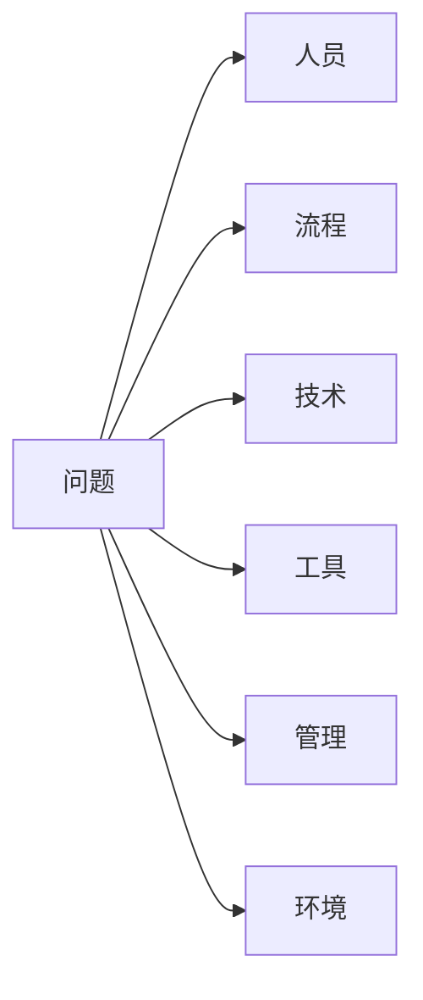

# 故障复盘方法论

故障发生了，服务恢复了，问题解决了——然后呢？

很多团队在「问题解决了」之后就停止了。但真正有价值的改进，发生在故障之后。复盘不是为了追责，而是为了回答一个问题：**下次怎么不让同样的事情发生？**

这一节系统性地讲解故障复盘的方法论——什么时候该复盘、谁来参加、怎么分析、怎么落地。

## 复盘的目的：不是为了追责

首先要明确复盘的目的。

很多团队把复盘开成了「批斗大会」：工程师在复盘会上战战兢兢，生怕被点名；Leader 在复盘会上追问「这是谁的责任」，试图找到一个替罪羊。结果是：工程师学会了隐藏问题，团队学会了推卸责任，真正的根因被掩盖。

这种复盘不仅没有价值，还有负价值——它会让团队变得更保守、更封闭。

**正确的复盘心态是：故障是系统的问题，不是人的问题。** 一个人犯了错，说明系统给了他犯错的可能。我们要找的是「系统的哪个环节让这个错误变得可能」，而不是「谁犯了这个错误」。

复盘应该达到三个目标：

1. **理解故障**：完整还原故障的传播路径，知道问题是怎么一步步变严重的
2. **找到根因**：不只是找到「哪个代码有问题」，而是找到「为什么这个代码会有问题」
3. **制定改进**：识别出可以预防同类故障的系统性改进措施，并确保落地

## 复盘时机：哪些故障需要复盘

不是所有故障都需要正式复盘。根据故障级别，复盘的要求不同：

|| 故障级别 | 定义 | 复盘要求 |
|| --- | --- | --- |
| P0 | 核心业务完全不可用 `>` 30 分钟 | 24 小时内完成复盘，48 小时内出报告 |
| P1 | 核心业务部分不可用 10~30 分钟 | 48 小时内完成复盘 |
| P2 | 非核心业务不可用 5~10 分钟 | 72 小时内完成复盘 |
| P3 | 轻微问题 5 分钟以内 | 值班工程师自行记录，频繁发生的需要汇总复盘 |

有一个判断标准可以帮助决定是否需要复盘：**如果这个故障是第一次发生，它有可能再次发生吗？**

如果是肯定的，那就需要复盘。如果故障本身是低概率事件，且已经采取了应急措施，后续也有监控覆盖，那么可以降低复盘优先级。

## 复盘会议的组织

### 谁应该参加

复盘会议不是越大越好。参与人数过多，会导致讨论效率低下，很多人只是旁观。

**核心参与者**（必须参加）：

- 故障的直接相关工程师（发现者、响应者、修复者）
- 值班 Leader（决策者）
- 相关服务的负责人（如果故障涉及多个服务）
- SRE/运维代表（系统层面的视角）

**扩展参与者**（根据需要）：

- 业务负责人（如果故障影响了业务指标）
- 产品经理（如果需要制定用户补偿方案）
- 其他感兴趣的工程师（旁听，但不强制发言）

**不建议参加的人**：

- 与故障完全无关的工程师（浪费时间）
- 公司高层（会改变讨论氛围，让人不敢说真话）

### 谁来主持

复盘会议最好由 **SRE 或资深工程师** 来主持，而不是故障的直接负责人。

原因有两个：第一，故障负责人往往是「当事人」，在复盘会上可能处于防御状态，难以客观分析；第二，主持复盘需要一定的引导技巧，SRE 通常在这方面更有经验。

主持人的职责是：

1. 控制会议节奏，确保讨论不跑题
2. 引导大家从「找责任人」转向「找系统问题」
3. 记录讨论要点，确保改进措施有人负责

## 五个为什么分析法

### 什么是 5 Why

5 Why（五个为什么）是一种简单但有效的根因分析方法。核心思想是：**通过连续追问，找到真正的原因**。

不是「找到直接原因就停止」，而是「一直追问到可以通过行动改变的程度」。

### 5 Why 的示例

以「数据库被误删」这个故障为例：

**Why 1**：为什么数据库被误删了？
→ 工程师执行了错误的 DELETE 语句

**Why 2**：为什么会执行错误的 DELETE 语句？
→ 工程师在生产库上执行了测试脚本

**Why 3**：为什么在生产库上执行测试脚本？
→ 测试库和的生产库使用同一个跳板机账号，没有隔离

**Why 4**：为什么测试库和的生产库没有隔离？
→ 测试库服务器在年初报废后一直没有补充

**Why 5**：为什么测试库一直没有补充？
→ 申请流程复杂，且认为「测试库只是跑脚本，影响不大」

现在找到了真正的根因：**没有建立测试环境等同于生产环境安全水位的意识**。

### 5 Why 的使用技巧

1. **每次追问都要指向「系统」而不是「人」**。问「为什么人这么粗心」没有意义，问「为什么系统给了人犯错的机会」才有意义。

2. **追问到「可以行动改变」的程度就停止**。不是所有的根因都可以通过行动改变，比如「团队成员能力不足」可以继续追问到「为什么团队没有足够的培训机制」，而不是「为什么这个人不够聪明」。

3. **5 Why 不是绝对的数字**。有时候 3 个 Why 就够了，有时候需要 7 个 Why。关键是追问到真正可改进的层面。

## 鱼骨图分析法

5 Why 擅长纵向追问，但故障的原因往往是多维度的。鱼骨图（Ishikawa Diagram，也叫因果图）可以帮助系统性地分析所有可能的原因维度。

### 鱼骨图的维度

鱼骨图的「鱼骨」通常有以下几个维度：



| 维度 | 说明 | 示例 |
| --- | --- | --- |
| 人员 | 人的因素导致的故障 | 操作失误、沟通不畅、知识不足 |
| 流程 | 流程缺失或流程不合理 | 无 Code Review、无变更审批、无监控 |
| 技术 | 技术层面的问题 | 代码缺陷、架构不合理、容量不足 |
| 工具 | 工具缺失或工具问题 | 监控缺失、发布系统 bug |
| 管理 | 管理层面的问题 | 技术债务、团队协作、知识传承 |
| 环境 | 外部环境因素 | 云服务故障、网络抖动、第三方服务异常 |

### 鱼骨图的使用步骤

1. **画鱼头**：把故障现象写在右侧
2. **画主骨**：按维度画主骨
3. **填小刺**：在每个维度下填写具体的原因
4. **标记关键**：找出「直接原因」���「深层原因」

### 鱼骨图示例：凌晨数据库告警

```
故障：凌晨 3 点数据库 CPU 打满
│
├─ 人员
│   ├─ 值班工程师对慢查询不敏感
│   ├─ 任务开发者缺少性能意识
│   └─ 上线前没有充分测试
│
├─ 流程
│   ├─ 没有定时任务性能评审
│   ├─ 没有定时任务执行窗口规划
│   └─ 没有定时任务监控告警
│
├─ 技术
│   ├─ 归档 SQL 全表扫描
│   ├─ 缺少分批处理机制
│   └─ 缺少索引
│
├─ 工具
│   ├─ 没有定时任务执行监控
│   ├─ 没有慢查询告警
│   └─ 没有连接池使用率监控
```

## 复盘报告的结构

一份好的复盘报告，不只是记录「发生了什么」，更要回答「为什么发生」和「怎么改进」。

```markdown title="故障复盘报告 - INC-20260315-001"
## 基本信息
- 故障编号：INC-20260315-001
- 故障时间：2026-03-15 02:30 - 05:45
- 故障级别：P0
- 影响范围：COS 服务、CDN 服务、日志服务
- 恢复时间：约 3 小时 15 分钟

## 故障现象
描述用户看到的问题和监控系统观察到的问题。

## 影响评估
- 用户影响：估算受影响的用户数
- 业务影响：估算业务损失
- 系统影响：受影响的系统列表

## 时间线
| 时间 | 事件 |
| --- | --- |
| 02:30 | 运维操作触发版本回退 |
| 02:35 | 数据库查询变慢 |
| ... | ... |

## 根因分析

### 直接原因
（发生了什么）

### 深层原因（5 Why）
**Why 1**：...
→ ...
**Why 2**：...
→ ...

### 系统性根因
（从鱼骨图分析得到）
1. ...
2. ...

## 改进措施

| 措施 | 负责人 | 完成时间 | 状态 |
| --- | --- | --- | --- |
| 增加熔断机制 | @工程师A | 2026-04-01 | 进行中 |
| 配置查询超时 | @工程师B | 2026-03-20 | 已完成 |

## 后续跟踪
- [ ] 熔断机制配置完成，已在测试环境验证
- [ ] ...
```

## 改进措施的落地跟踪

复盘报告写得再好，如果改进措施不落地，就是废纸。**改进措施必须满足 SMART 原则**：

- **Specific（具体）**：不是「加强监控」，而是「在数据库监控面板增加慢查询告警，阈值 5 条/分钟」
- **Measurable（可衡量）**：不是「提高代码质量」，而是「Code Review 通过率 100%，平均 Review 时间 `<` 2 小时」
- **Achievable（可实现）**：措施要在团队能力范围内，不要列「重构整个系统」这种不现实的改进
- **Relevant（相关）**：措施要和根因直接相关，不要做「头痛医脚」的事情
- **Time-bound（有时限）**：每项措施要有明确的完成时间

### 跟踪机制

复盘会议结束后，需要有一个**跟踪机制**来确保改进措施落地：

1. **建立跟踪表**：每项改进措施记录负责人和完成时间
2. **定期检查**：每周检查一次改进进展
3. **在下次复盘时回顾**：上次复盘的改进措施是否已落地

```
| 复盘编号 | 改进措施 | 负责人 | 计划完成 | 状态 |
| --- | --- | --- | --- | --- |
| INC-001 | 增加熔断机制 | @A | 2026-04-01 | 进行中 |
| INC-001 | 配置查询超时 | @B | 2026-03-20 | 已完成 |
```

## 复盘的反模式

在实际操作中，复盘很容易走偏。以下是几种常见的反模式：

### 反模式一：复盘变成甩锅大会

**现象**：复盘会上互相推诿，每个人都在证明「不是我的问题」。

**问题**：讨论变成了辩论，而不是分析。

**正确做法**：主持人在会前强调「我们讨论的是系统问题，不是个人问题」。会上如果出现甩锅，立即纠正：「这个问题反映的是系统设计，不是个人能力问题。我们应该讨论的是系统哪里可以改进。」

### 反模式二：停在表面原因

**现象**：找到直接原因后就停止，没有追问深层原因。

**问题**：改进措施只治标不治本。

**正确做法**：强制使用 5 Why 追问，至少追问 3 层。

### 反模式三：措施不落地

**现象**：复盘报告写了很多改进措施，但一项都没执行。

**问题**：复盘变成走过场，没有实际价值。

**正确做法**：每项改进措施必须有人负责、有完成时间、可验证。主持人在下次复盘时先回顾上次改进措施的落地情况。

### 反模式四：一次复盘解决所有问题

**现象**：试图在一篇复盘里把所有改进都列出来。

**问题**：改进措施太多，每项都做不好。

**正确做法**：一次复盘只解决 1~2 个主要问题。其他的可以记录下来，在后续的复盘和迭代中逐步解决。

### 反模式五：没有复盘文化

**现象**：团队认为「故障是偶然的，不会再发生」，不愿意花时间复盘。

**问题**：同样的故障会反复发生。

**正确做法**：把复盘纳入团队文化，每一次 P0/P1 故障都必须有复盘。团队 Leader 以身作则参与复盘，传递「复盘是学习机会」的信号。

## 思考题

**问题 1**：如果你是复盘会议的主持人，发现讨论开始跑偏为「追责」，你会怎么处理？

<details>
<summary>参考答案</summary>

几种处理方式：1）先暂停，明确复盘的目的——「我们今天讨论的是系统问题，不是谁的责任。每个人都可能在类似的情况下犯错，我们的目标是找到系统层面的改进点。」2）用问题引导——「如果系统的这个设计让张三犯错，那李四在同样的情况下也会犯同样的错误。我们怎么改变这个系统设计？」3）如果甩锅持续，可以用「假设测试」——「如果我们把时间拨回到故障前，给团队更多资源或时间，问题还会发生吗？如果不会，问题出在哪里？」

</details>

**问题 2**：在 5 Why 追问中，什么情况下应该停止追问？

<details>
<summary>参考答案</summary>

追问到满足以下条件之一时可以停止：1）追问到「可以通过行动改变」的层面——比如「团队缺少培训机制」可以改进，但「团队成员能力不足」追问到「这个人不聪明」就无法行动改变。2）追问到「有明确责任方」的层面——比如「测试环境一直没有搭建」可以追问到「为什么没有人负责这件事」，然后建立责任人制度。3）追问到「成本过高」的层面——有时候根因可以继续追问，但改进成本过高（比如需要重构整个系统），这时可以记录为「长期改进项」而不是「本次改进项」。

</details>

**问题 3**：如何让团队成员愿意在复盘会上坦诚分享自己的失误？

<details>
<summary>参考答案</summary>

这是组织文化问题，不是技术问题。几个建议：1）Leader 以身作则——如果 Leader 在复盘会上第一个说「我在这件事上有什么责任」，团队成员会更愿意坦诚。2）区分「系统问题」和「个人问题」——在复盘会开始时明确：「我们讨论的是系统哪里设计得不够好，让人在正常操作下也会犯错。不是追究个人责任。」3）建立正向反馈——如果某个工程师在复盘会上坦诚分享了自己的失误，给予正面肯定，而不是负面评价。4）不要把复盘结果用于绩效考核——否则没有人会坦诚。

</details>