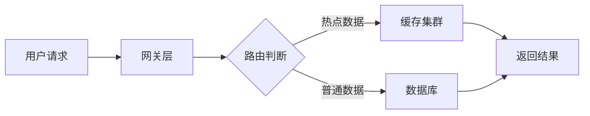

# 技术沟通技巧

凌晨 2 点，你刚处理完一次线上故障。问题根源是一年前设计的数据同步方案——当时为了赶进度，用了一个「能用就行」的临时方案。早上 10 点，你需要向技术团队说明为什么这个方案必须重构；下午 2 点，你要向产品负责人解释重构的必要性；下午 4 点，你要向 CTO 申请 3 个月的排期。

同一个技术问题，你需要用三种不同的方式讲给三类不同的人听。这才是架构师沟通的真实场景。

## 沟通的本质是「翻译」

架构师的沟通，本质上是「技术语言」与「业务语言」之间的翻译工作。你面对的对象不同，他们对技术的理解程度不同，他们的关注点也不同。

| 受众类型 | 核心关注 | 沟通目标 | 典型场景 |
|---|---|---|---|
| 技术人员 | 可行性、实现成本、可维护性 | 达成共识、推进决策 | 技术评审、设计讨论 |
| 产品/业务 | 业务价值、时间成本、风险 | 获得支持、争取资源 | 需求对齐、项目排期 |
| 管理层 | 投资回报率、竞争力、风险敞口 | 推动决策、获取授权 | 战略汇报、预算申请 |

技术人员沟通时，你可以用完整的术语：数据库事务、分布式锁、CAP 定理。但同样的内容讲给管理层听，就需要翻译成：数据一致性保障机制、并发控制方案、系统可用性与一致性的权衡。

## 针对技术人员的沟通策略

技术人员是你的「同路人」，但这并不意味着沟通会更简单。技术人员往往更关注细节、更容易质疑方案的可行性。

### 沟通原则

**第一，数据支撑而非主观判断**。不要说「我认为这个方案更好」，而要说「根据压测数据，新方案在 10 万 QPS 下 P99 延迟从 200ms 降低到 50ms」。技术人员的反驳往往从数据开始，你的数据越扎实，反驳的空间就越越小。

**第二，预设质疑并主动回应**。在正式沟通之前，先在脑子里「彩排」一遍：如果是自己听到这个方案，会在哪里挑刺？提前准备好回应，比现场被问住再补救要好得多。

**第三，给出选择而非唯一答案**。技术人员不喜欢被告知「必须这样做」，但接受「有三种方案，各有优劣，我推荐 A」。后者给了他们参与感，也更容易达成共识。

### 技术方案表达技巧

代码是最好的语言。对于技术人员，与其用一大段话解释设计，不如直接展示代码或架构图。

架构图的作用是让技术团队在细节讨论之前先形成整体认知。比起「我们用缓存来扛热点流量」，一幅清晰的架构图能让他们自己理解设计意图。

## 针对产品/业务的沟通策略

产品经理和业务负责人不需要理解技术的「怎么做」，但他们必须理解「为什么必须这样做」。你的任务是把技术决策转化为业务语言。

### 沟通原则

**第一，从业务结果出发，而非技术问题出发**。不要说「数据库连接池需要优化」，而要说「每次大促活动，平均有 3% 的用户会遇到下单失败，直接影响 GMV」。

**第二，用类比降低理解门槛**。当你解释为什么单体架构需要拆分时，不要直接讲微服务的优势，而要先问：「你有没有见过一个团队的沟通效率，随人数增加反而下降？」等对方点头后，再说：「单体系统就像人多的团队，调用链路越绕越慢。」

**第三，把成本和收益都量化**。业务人员习惯用数字思考。你需要回答的不只是「重构有什么好处」，还有「不重构的代价是什么」。如果能给出具体数字（「预计每年因系统故障损失 200 万营收」），说服力会强得多。

### 类比示例

| 技术概念 | 类比表达 |
|---|---|
| 缓存穿透 | 「就像一个骗子拿着假身份证来办事，门卫没有提前识别，就直接进了大厅」 |
| 服务限流 | 「就像节假日的景区入口，不是来多少人就能进多少人，需要排队控制」 |
| 数据库分库分表 | 「就像一个图书管理员，面对一千万本书不分书架，会累死也找不到书」 |
| 异步消息队列 | 「就像医院的检验科，病人抽完血不用在检验科门口等结果，直接去做其他检查，报告出来后自动通知」 |

## 针对管理层的沟通策略

管理层的时间和注意力是稀缺资源。你通常只有 5-10 分钟的时间窗口，必须在这段时间内完成「问题识别 → 方案共识 → 行动授权」的完整闭环。

### 沟通原则

**第一，先说结论，再说原因**。管理层每天处理大量信息，没有时间听你铺垫背景。第一句话就要告诉对方：「我们需要投入 3 个人月重构订单系统，否则下一季度大促可能出现 30% 的订单失败率。」

**第二，用「不做的代价」而非「做的收益」来说服**。人都倾向于维持现状。单纯讲投入回报比不够有力，必须明确指出：不投入的后果是什么？这个后果的概率有多高？这个后果发生时，损失有多大？

**第三，准备好「电梯演讲」版本**。无论沟通时间是一分钟还是十分钟，你都应该有一个随时可以开始的 30 秒版本：问题是什么，为什么现在必须解决，我们的建议是什么。

### 10 分钟向 CEO 解释系统重构

想象这样一个场景：CEO 问：「为什么要花 6 个月重构系统？现在的系统不是跑得好好的吗？」

第一步（1 分钟）：建立危机感。「CEO，我们现在的系统在正常情况下确实能跑。但根据过去一年的数据，每年大促期间平均发生 3 次故障，每次故障平均损失 2 小时订单。按今年的 GMV 目标计算，每小时损失约 50 万元。」

第二步（2 分钟）：解释根因。「根本原因是 3 年前的技术架构，当时为了快速上线做了很多技术债。这些债务一直在累积，现在已经到了临界点。修复单个 Bug 的成本是 3 年前的 5 倍。」

第三步（2 分钟）：对比方案。「我们评估了三个方案：方案一是继续修修补补，预计每年还要投入 2 个人月，但无法根治；方案二是推倒重来，风险太高；方案三是渐进式重构，我们推荐这个。」

第四步（2 分钟）：说清投入产出。「方案三需要投入 6 个月、3 个核心开发，但重构完成后，系统故障率预计降低 80%，新功能开发速度提升 50%。」

第五步（3 分钟）：给时间节点和里程碑。「第一个月我们交付核心模块重构，验证方案可行性后再继续。这样即使出现问题，也能及时止损。」

## 会议沟通技巧

技术评审会是架构师最常面对的沟通场景，也是最容易陷入无效讨论的地方。

### 如何有效推进决策

**会前准备决定会后效率**。在开会之前，先与关键决策人单独沟通，了解他们的立场和顾虑。把分歧解决在会前，而不是暴露在会上的公开场合。

**明确会议目标和决策边界**。在会议开始时，明确告诉所有人：「今天的会议目标是决定是否采用方案 A，请在 30 分钟内给出结论。」没有目标的会议，往往以「下次再讨论」收场。

**用「决策树」结构化讨论**。不是让每个人各抒己见，而是按照决策逻辑推进：「如果要满足 X 条件，我们有 A/B 两个方案，A 方案的优势是……，劣势是……；B 方案相反。请问各位对哪个方案有异议？」

### 应对质疑的技巧

被质疑时，技术人员的第一反应往往是防御。更好的做法是：先把质疑分类，再针对性回应。

| 质疑类型 | 回应策略 |
|---|---|
| 事实性反驳（有数据支撑） | 承认并纳入方案优化 |
| 方案替代（提出另一个方案） | 对比两个方案的优劣 |
| 执行担忧（担心执行难度） | 给出具体的执行计划 |
| 价值观冲突（根本理念不同） | 上升到更高层面讨论 |

## 沟通反馈机制

说完了，不等于听懂了。确认沟通效果，是沟通的最后一环。

### 现场确认

在沟通结束前，用开放式问题确认理解：「我刚才说的内容，不知道有没有不清楚的地方？」让对方主动提问，比你自问自答要好。

### 书面确认

对于重要的技术决策，用邮件或文档形式确认关键结论：「根据今天的评审，我们达成以下共识……，请各位确认。」这样既避免了口头沟通的理解偏差，也为后续追溯提供了依据。

### 持续跟进

沟通不是一次性事件。一个方案从提出到落地，可能需要多次沟通。定期跟进对方的反馈，及时调整沟通策略。

## 沟通能力的三个层次

架构师的沟通能力可以分为三个层次：

**第一层：能说清楚**。无论对象是谁，都能用自己的语言解释技术方案。

**第二层：能说服人**。不仅说清楚，还能推动决策，获得资源，推进落地。

**第三层：能让对方主动传播**。你的观点不仅被接受，还被对方用自己的语言传播给他人。这是最难达到的层次，也是沟通能力的最高境界。

## 思考题

**问题 1**：假设你要向一个不懂技术的运营总监解释为什么需要做数据脱敏，你会用什么类比？你的沟通目标是什么？

参考答案

可以用的类比：「就像快递单上的地址，寄件人和收件人都希望自己的真实地址不被泄露，数据脱敏就是在数据传输过程中，把敏感信息用「张先生」「某市某区」这样的模糊信息替换，防止万一数据泄露也不会造成用户隐私泄露。」

沟通目标：让运营总监理解这不是「额外的安全成本」，而是「必须承担的法律合规责任和用户信任成本」。不做的代价（被监管处罚、用户流失）远大于做的成本。

**问题 2**：在技术评审会上，一位资深工程师当众质疑你的设计方案，认为「太复杂」，你该如何回应？

参考答案

首先，不要防御。先承认方案的复杂度：「是的，这个方案确实比简单方案复杂。」然后，解释复杂度背后的必要性：「但这个复杂度换来的是……（列出具体收益）。如果不这样做，面临的代价是……（列出不这样做的风险）。」

如果对方提出替代方案，不要直接否定，而是对比：「你的方案也能解决 X 问题，但在 Y 场景下会有……的风险。我们的方案对 Y 场景更友好。」

最终目标不是「证明自己是对的」，而是「让团队做出最好的决策」。如果对方的质疑确实指出了方案的问题，应该真诚感谢并纳入改进。

**问题 3**：你需要向领导申请一个「不紧急但很重要」的技术改进项目，预期需要 3 个月排期，但领导认为「现在系统能跑，没必要投入」。你打算怎么说服？

参考答案

关键在于把「不紧急」变成「紧急」。可以从数据入手：

1. 量化技术债务的成本：统计过去半年因技术债导致的 Bug 数、平均修复时间、影响用户数
2. 估算不改进的代价：如果继续这样，每季度预计损失多少开发时间，按人天成本折算成多少钱
3. 对比改进的收益：改进后预计提升多少开发效率，多出来的时间可以做什么
4. 给出一个分阶段方案：不要一开始就说 3 个月，可以先争取 1 个月做一个核心模块，看看效果

核心逻辑：领导关注的不是技术，而是业务连续性和资源效率。你的工作是把技术问题翻译成业务数字。

