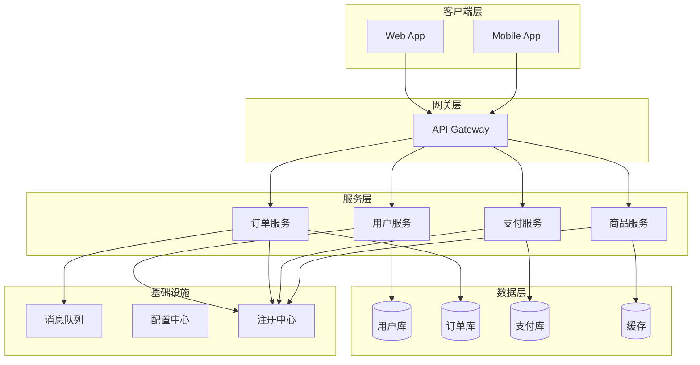

# 架构文档编写

想象一个场景：系统出现了问题，一位 3 年前离职架构师设计的模块出了故障。现任工程师花了 2 天时间，试图理解这个模块的设计意图，最终发现唯一的文档是一份 5 年前的 PPT，大部分图片已经打不开。

这个场景暴露了架构文档最核心的问题：文档不是写给自己看的，而是写给「未来的读者」看的——可能是 3 年后的同事，可能是完全不了解这段代码历史的工程师，可能是 5 年后接手系统的你。

好的架构文档，是团队最重要的知识资产。坏的架构文档，比没有文档更危险——它给人虚假的信心，却无法在真正需要时提供帮助。

## 架构文档的类型与定位

架构文档不是一个模板打天下。根据目的和受众的不同，架构文档分为以下几类：

### 架构设计文档（Architecture Design Document）

这是最重要的一类文档，用于记录系统的高层设计决策。典型内容包括：

- 业务背景与问题陈述
- 设计目标和约束条件
- 技术选型与权衡分析
- 系统架构图
- 核心模块设计
- 数据模型设计
- 部署架构
- 风险评估与应对措施

架构设计文档的生命周期往往比单个项目更长。一个系统可能经历多次重构，但架构设计文档记录了「为什么这样设计」——这个信息比任何代码都珍贵。

### 技术方案文档（Technical Specification）

针对某个具体问题的详细技术方案，通常在架构设计文档的基础上展开。典型内容包括：

- 问题定义
- 方案细节（接口设计、算法、流程）
- 实现计划
- 验收标准
- 测试策略

技术方案文档的生命周期与功能开发周期一致，功能上线后，这类文档的价值会逐渐降低，最终可以被代码和注释取代。

### API 文档

描述系统对外暴露的接口规范。典型内容包括：

- 接口列表与说明
- 请求/响应格式
- 错误码定义
- 认证方式
- 调用示例

API 文档必须与代码保持同步。一旦文档与代码不一致，调用方会陷入困惑。自动生成（如 Swagger/OpenAPI）应该是主要方式，手工维护作为补充。

### 运维文档

记录系统的部署、运维、故障排查相关知识。典型内容包括：

- 环境配置说明
- 部署流程与脚本
- 监控指标与告警阈值
- 故障排查手册
- 应急预案

运维文档的价值在系统稳定运行时不明显，但在故障发生时极为关键。「故障发生时才开始写文档」是运维文档最大的误区。

## 好架构文档的标准

好的架构文档有三个核心标准：**准确**、**可维护**、**可追溯**。

### 准确：文档必须与实际一致

这是最基本的要求，也是最难做到的要求。代码在变，系统在演进，文档如果不及时更新，就会变成「谎言」。

准确不是指「完全不能有任何偏差」，而是指「偏差的部分被明确标注」。如果某个设计已经过时，但暂时没有时间更新文档，应该在文档中明确标注「此部分已过时，预计于 XX 日期更新」。

### 可维护：文档必须能持续演进

文档不是一次性的产物，而是持续演进的资产。可维护的关键在于：

- 文档结构清晰，模块化程度高，修改时不需要重写整个文档
- 文档存放在代码仓库中，与代码一起接受版本管理
- 有明确的负责人，定期审查文档的时效性

### 可追溯：决策过程必须被记录

架构文档不仅要记录「是什么」，更要记录「为什么」。当后人看到系统设计时，他们需要理解：这个决策是基于什么背景做出的？当时有哪些备选方案？为什么最终选择了这个方案？

可追溯的核心工具是 ADR（Architecture Decision Records，架构决策记录），下一节会详细介绍。

## 文档的受众分析

不同受众阅读架构文档的目的不同，因此文档的侧重点也应该不同。

| 受众 | 阅读目的 | 文档重点 |
|---|---|---|
| 开发者 | 理解如何实现和维护 | 详细设计、接口规范、代码结构 |
| 运维 | 理解如何部署和监控 | 部署架构、配置说明、故障排查 |
| 业务方 | 理解系统能力与限制 | 业务能力、数据流、性能特征 |
| 审计人员 | 验证合规性和安全性 | 安全设计、权限控制、日志审计 |

写文档之前，先问自己一个问题：这个文档是写给谁看的？他们的背景是什么？他们最关心什么？

## ADR 与文档同步机制

架构文档最大的敌人是「过时」。代码改了一个月，文档可能还没更新。

ADR（Architecture Decision Records）是解决这个问题的最佳实践。ADR 的核心理念是：**每个重要的架构决策，都应该被记录为一个独立的文档，与代码放在同一个仓库中**。

一个典型的 ADR 包含以下部分：

```markdown title="docs/adr/001-use-redis-for-session-store.md"
# ADR-001: 使用 Redis 存储用户会话

## 状态
已接受

## 背景
我们的用户认证系统原来使用内存会话存储，单实例部署时没有问题，但无法支持水平扩展。每次重启服务都会导致用户会话丢失。

## 决策
我们选择使用 Redis 作为分布式会话存储。

## 权衡分析

| 方案 | 优势 | 劣势 | 适用场景 |
|---|---|---|---|
| Redis 会话 | 支持水平扩展，持久化可靠 | 引入额外依赖，增加复杂度 | 需要多实例部署的场景 |
| Memcached | 性能更高，协议简单 | 不支持持久化，无副本 | 对性能要求极高、可接受会话丢失 |
| 数据库会话 | 无额外依赖 | 性能差，扩展困难 | 单实例场景 |

## 后果

### 正面
- 用户会话在服务重启后不会丢失
- 支持水平扩展

### 负面
- 引入 Redis 运维成本
- 需要处理 Redis 不可用时的降级策略

## 相关决策
- ADR-003：Redis 集群部署方案
```

ADR 的优势在于：

1. **决策与上下文一起保存**。当后人需要理解某个设计时，他们不仅能看到结论，还能看到当时权衡了什么、为什么做出这个选择。
2. **新决策可以引用旧决策**。随着系统演进，新的架构决策可以引用相关的历史 ADR，形成决策链。
3. **代码变更可以关联 ADR**。每次代码变更时，在 commit message 中引用相关的 ADR，形成双向追溯。

### ADR 的维护节奏

ADR 不是写完就完事了。建议的维护节奏：

- **创建时**：每个重要架构决策在实施前创建 ADR
- **审查时**：代码评审时检查是否有新的 ADR 或需要更新的 ADR
- **回顾时**：每季度对历史 ADR 进行回顾，标注已过时的决策

## 文档反模式

架构文档有两个极端，都是错误的方向。

### 反模式一：过度文档化

症状：文档比代码还多，大部分时间在写文档而不是写代码。文档更新周期太长，往往是代码改了三版，文档才更新一版。最终结果：没有人愿意读文档，因为读了也无法反映现状。

过度文档化的根本原因是对「完整性」的执念。架构师总觉得要把所有可能性都考虑到、所有情况都记录下来，结果文档变得越来越臃肿，维护成本越来越高。

正确做法：文档应该服务于「降低理解成本」的目标。对于显而易见的代码，不需要额外文档解释。文档的多少，应该与系统的复杂度成正比，与代码的自解释程度成反比。

### 反模式二：无文档

症状：代码就是文档，「代码即文档」。或者「等我做完再补文档」。最终结果：系统只有开发者自己能理解，换一个人接手需要花几个月才能理解整体设计。

无文档的根本原因是「短期主义」。写文档短期内看不到收益，维护文档更是需要额外投入。但当你需要修改一个不理解的老模块时，你会后悔当初没有写文档。

正确做法：用 ADR 机制降低文档维护成本。每次架构决策时顺便写一个 ADR，每次代码变更时更新相关的文档注释。文档不需要完美，只需要「比没有好」。

## 用一张图讲清楚微服务系统

对于复杂的微服务系统，如何用一张图让读者快速理解整体架构？

关键原则是**分层和抽象**。不要试图在一张图上展示所有细节，而是按层次展示，每层只展示最重要的组件。



这张图的层次清晰：客户端 → 网关 → 服务 → 数据。基础设施（消息队列、配置中心）单独展示，与业务服务区分开。

每个服务下面标注了它们负责的数据存储，帮助读者理解服务边界和数据归属。

## 文档评审机制

架构文档写完之后，需要通过评审来确保质量。评审的目标不是「挑毛病」，而是「确保文档能有效传达信息」。

### 评审清单

文档评审时可以参考以下清单：

| 检查项 | 说明 |
|---|---|
| 受众匹配 | 文档是写给谁看的？他们能看懂吗？ |
| 目标明确 | 文档要回答的核心问题是什么？是否回答清楚了？ |
| 结构清晰 | 文档的逻辑结构是否合理？阅读路径是否清晰？ |
| 信息准确 | 文档内容是否与实际一致？是否有遗漏？ |
| 可操作 | 文档描述的方案，读者能独立执行吗？ |
| 可追溯 | 关键决策是否记录了背景和权衡？ |

### 评审节奏

- **小型文档**（单页技术方案）：作者自审 + 同行 review
- **中型文档**（模块设计文档）：团队评审会议，30 分钟以内
- **大型文档**（系统架构文档）：分阶段评审，先评审整体结构，再评审细节

## 思考题

**问题 1**：假设你需要为一个新上线的微服务系统编写架构文档，总共有 50 个服务。你会如何组织文档结构？如何决定哪些服务需要详细文档，哪些服务只需要简单说明？

<details>
<summary>参考答案</summary>

对于 50 个服务的微服务系统，文档组织策略：

1. **分层组织**：整体架构文档 → 领域/模块文档 → 具体服务文档
2. **优先级决策**：需要详细文档的服务特征包括：
   - 核心业务流程必经之路
   - 涉及跨服务数据同步
   - 有复杂的状态机或事务处理
   - 与外部系统有交互
   - 历史上频繁出问题
3. **简化文档**：边缘服务、非核心流程的服务，用标准模板快速生成文档
4. **文档即代码**：将服务级别的文档用标准格式嵌入代码仓库的 `docs/` 目录，自动���成索引页

核心原则：架构师的时间是有限的，把文档投入集中在对系统理解影响最大的模块上。

</details>

**问题 2**：你的团队刚刚完成了一次大的架构重构，但没有人写过 ADR。现在需要补充记录这些决策，你会怎么做？有哪些决策是值得补录的？

<details>
<summary>参考答案</summary>

首先，识别值得补录的决策：

- 影响范围大的决策（涉及多个服务、多个团队）
- 有明确权衡的决策（选择了 A 而不是 B）
- 可能被质疑的决策（需要解释为什么这样做）
- 不可逆的决策（改变成本很高）

操作步骤：

1. 访谈关键决策者，收集当时的背景和考量
2. 列出所有重要决策，按影响范围排序
3. 从影响最大的决策开始补写 ADR
4. 每个 ADR 完成后，关联到相关的代码或文档

注意：不需要补录所有决策，重点是「对未来理解系统有价值的决策」。日常的代码优化、小规模重构不需要补录 ADR。

</details>

**问题 3**：你的团队有两种声音：一派认为「文档是负担，应该减少」；另一派认为「文档不够，应该增加」。作为架构师，你如何调解这个矛盾？

<details>
<summary>参考答案</summary>

这个矛盾的本质不是「文档多少」的问题，而是「文档价值」的问题。

调解方法：

1. **量化现状**：统计团队当前花在文档上的时间，以及因文档缺失导致的额外工作量
2. **找到共识**：两派都同意的「文档类型」优先确认（如 API 文档必须同步）
3. **区分对待**：不同类型的文档采用不同的维护策略：
   - 高价值文档（架构设计）：定期维护，投入重点
   - 低价值文档（重复性流程说明）：考虑用代码注释或自动化工具替代
   - 中间地带：用 ADR 机制降低维护成本
4. **建立反馈机制**：让文档的价值（是否真的在关键时刻帮助了团队）成为判断标准，而不是「有文档」本身

核心观点：文档的价值不在于「存在」，而在于「需要时能用」。让文档回归本质，而不是为了写而写。

</details>