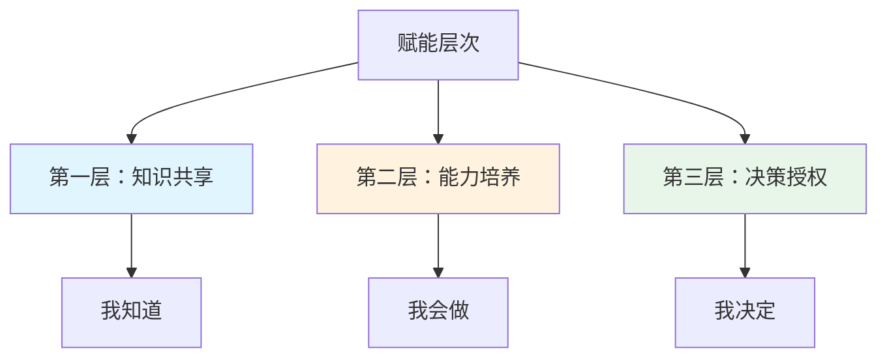
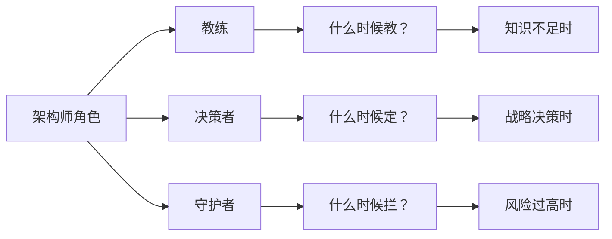

# 团队赋能方法

一位架构师每天收到 20 条技术咨询，80% 是重复问题。你花了 3 个小时解答这些问题，终于有空去做架构设计。但第二天，又有新的 20 条问题进来。

你陷入了一个「能者多劳」的陷阱：因为你太擅长解决问题，所以所有人都来找你解决问题。你越忙碌，问题越多；问题越多，你越没有时间做更高价值的工作。

破解这个陷阱的方法只有一个：**赋能**。不是「我来帮你解决问题」，而是「让你有能力自己解决问题」。

## 赋能的目标是什么

赋能的目标不是「减轻自己的负担」——这是赋能的自然结果，不是目标。如果把赋能当成甩锅，你会找到各种理由「这个让团队自己决定」；如果把赋能当成培养，你会思考「我需要做什么，团队才能更好地做决定」。

赋能的本质是**杠杆效应**。你花 1 小时教会团队一个方法，团队 10 个人每人节省 1 小时，总体节省 9 小时。你的时间是杠杆，团队成长是支点。

## 赋能的三个层次

赋能不是一蹴而就的，而是分层的：

### 第一层：知识共享（我知道）

知识共享是最基础的赋能形式，解决的是「信息不对称」问题。团队不知道某个技术方案，是因为他们没有获取信息的渠道。

典型场景：

- 你知道某个系统的问题在哪里，但团队不知道
- 你了解某个技术的最佳实践，但团队在踩坑
- 你掌握某个工具的使用技巧，但团队效率低下

知识共享的方法包括：技术分享会、文档编写、代码 review、结对编程。

### 第二层：能力培养（我会做）

能力培养解决的是「技能不足」问题。团队知道应该怎么做，但不知道如何做好。

典型场景：

- 团队知道要做单元测试，但不知道如何写有效的测试
- 团队知道要做代码 review，但不知道 review 应该关注什么
- 团队知道要关注性能，但不知道如何定位性能瓶颈

能力培养的方法包括：培训课程、实践项目、技术导师制、方法论传授。

### 第三层：决策授权（我决定）

决策授权解决的是「决策瓶颈」问题。团队有能力做出正确决策，但需要你来拍板。

典型场景：

- 团队面临技术选型，但必须等你回来决定
- 团队发现了系统问题，但需要你确认才能动手修复
- 团队有优化想法，但需要你批准才能实施

决策授权的方法包括：明确授权范围、设定决策原则、建立信任机制。

## 技术分享机制

技术分享是知识共享最常见的形式。但很多团队的技术分享流于形式：讲的人敷衍，听的人无聊，分享完什么也没留下。

### 好的技术分享的特征

**主题聚焦**。一个分享只讲一个问题，而不是「我们系统架构概述」这种大而全的主题。聚焦的分享更容易深入，也更容易让听众记住一个知识点。

**解决真实问题**。分享的主题应该来自真实问题：「我们踩过的坑」「我们优化过的性能」「我们解决过的 bug」。来自真实场景的分享，比概念讲解更有价值。

**有互动环节**。单向讲授的分享效果有限。留出时间让听众提问，或者设计一个小的动手练习，让听众参与进来。

### 技术分享的节奏

| 类型 | 周期 | 时长 | 参与方式 |
|---|---|---|---|
| Lightning Talk | 每周 | 5-10 分钟 | 自愿报名 |
| 技术深挖 | 每两周 | 30-45 分钟 | 指定 + 自愿 |
| 工作坊（Workshop） | 每月 | 2-3 小时 | 轮流主持 |

### 避免的误区

**误区一：强制分享导致应付**。如果强制每个人每月必须分享一次，结果就是大家轮流「水」一次。更好的做法是：把分享质量作为团队认可的标准，而不是分享数量。

**误区二：只有资深工程师分享**。赋能的目标是让更多人成长。新人分享「我学了什么」，往往比资深工程师分享「我会什么」更有价值——因为新人的学习过程更能引起共鸣。

**误区三：分享完就结束**。分享的价值需要延续。分享结束后，鼓励听众实践分享中的方法，或者将分享内容整理成文档，让更多人受益。

## 技术导师制度

技术导师制是能力培养的重要手段。但很多团队把「导师制」变成了「带新人认路」，没有真正发挥导师的价值。

### 有效的导师制要素

**明确的导师职责**。导师不是「有不懂的问导师」，而是「导师主动辅导」。每周至少一次 30 分钟的辅导，涵盖技术成长、职业发展、团队融入等方面。

**量化的成长指标**。导师制的效果需要可衡量。可以设定：3 个月后，被指导者能够独立完成 X 类任务；6 个月后，能够在某个领域指导他人。

**导师的激励机制**。带人是额外付出，需要被认可。可以把「培养了多少人」「培养的人在团队中承担了什么角色」作为晋升参考因素。

### 导师制的问题信号

如果出现以下信号，说明导师制出了问题：

- 被指导者遇到问题第一反应还是找架构师，而不是找导师
- 导师不知道被指导者的成长进度
- 被指导者不敢向导师提问，担心「问得太简单」

## 决策下沉

决策下沉是赋能的最高层次。团队不仅要「知道」「会做」，还要能「自己做主」。

### 哪些决策应该授权

**战术级决策**。这些决策影响范围有限，出错成本可控，应该充分授权给团队：

- 代码风格和工具选择（IDE、lint 规则）
- 单个模块的技术实现方案
- 自动化测试的范围和方式
- 简单的性能优化

**可逆决策**。这些决策如果出错，可以快速回滚，应该允许团队探索：

- 引入一个新的辅助库
- 尝试一种新的错误处理方式
- 使用一个新的工具提升开发效率

### 哪些决策不应该授权

**战略级决策**。这些决策影响系统架构全局，需要架构师或更高层级把关：

- 系统边界划分
- 核心数据模型设计
- 跨系统交互协议
- 安全和合规相关决策

**不可逆或高成本决策**。这些决策一旦做出，改变成本很高，需要谨慎评估：

- 数据库选型
- 主要框架升级
- 引入新的分布式组件

### 建立决策框架

为了让团队能更好地做决策，需要提供决策框架而不是决策答案。

**好的决策框架**：当团队面临技术选型时，引导他们思考：「这个技术的优势是什么？」「我们当前的问题是什么？」「这个技术能解决我们的问题吗？」「引入这个技术的代价是什么？」「有没有更简单的替代方案？」

**坏的决策框架**：直接告诉团队「用 A 不要用 B」。前者培养的是决策能力，后者只是服从指令。

## 赋能的反模式

赋能有两条红线：过度放权和过度控制。

### 反模式一：过度放权导致失控

症状：架构师完全退出了日常决策，团队「自治」了，但问题频出。系统质量下降、架构不一致、重复造轮子。架构师的角色变成了「救火队」而不是「引路人」。

原因：把授权当成甩锅，而不是培养。授权的同时没有提供必要的支持和边界。

正确做法：授权要渐进，边界要清晰。不是说「你们自己决定」，而是说「在 X 范围内你们自己决定，超出 X 范围需要和我讨论」。

### 反模式二：过度控制扼杀创新

症状：所有技术决策都要架构师拍板，团队变成「执行者」而不是「思考者」。团队成员缺乏成长，优秀人才选择离开。架构师变成瓶颈，所有事情都要排队等你决定。

原因：不相信团队能做对。「我来做决定更放心」的背后，可能是对团队能力的怀疑，也可能是对失控的恐惧。

正确做法：区分「必须你决定」和「可以让团队决定」的事情。后者即使做错了，也是团队成长的机会。帮助团队从错误中学习，比「永远不出错」更有价值。

### 平衡的艺术

架构师的角色是动态的：当团队知识不足时，是教练；当涉及战略决策时，是决策者；当风险可能失控时，是守护者。

## 案例：一年内将自主解决率从 30% 提升到 80%

某公司技术团队 15 人，架构师 1 人。以下是一年内赋能实践的复盘。

### 初始状态（第 1 个月）

**问题识别**：

- 架构师每天处理 15-20 个技术咨询
- 80% 是重复问题
- 团队成员遇到问题第一反应是「问架构师」，而不是「查文档」或「自己研究」
- 技术分享流于形式，团队成员不愿意分享

**量化指标**：

- 自主解决率：30%（100 个问题中，30 个由团队自己解决）
- 架构师时间分配：70% 在回答问题，20% 在开会，10% 在做架构设计

### 第一阶段：知识共享（第 2-4 个月）

**措施**：

1. 建立「问题知识库」（类似内部 Stack Overflow），要求每个解答都记录下来
2. 每周一次 Lightning Talk，5 分钟，任何主题都可以分享
3. 技术方案评审改为「方案讲解」，让方案提出者讲而不是架构师评审

**结果**：

- 知识库积累 200+ 条问答
- 7 人进行了分享
- 自主解决率上升到 45%

### 第二阶段：能力培养（第 5-8 个月）

**措施**：

1. 建立「技术导师制」，每个资深工程师带 1-2 个初级工程师
2. 推出「代码学院」系列培训，每月一个主题（如性能优化、安全编码）
3. 设立「技术挑战赛」，团队成员自由组队解决真实技术问题

**结果**：

- 3 对导师-学员配对
- 4 场深度培训
- 自主解决率上升到 65%

### 第三阶段：决策授权（第 9-12 个月）

**措施**：

1. 明确授权范围：「模块内部的技术实现，团队自己决定」
2. 建立决策原则：「可逆决策团队决定，不可逆决策评审后决定」
3. 设立「架构答疑日」，每周固定时间解答战略级问题

**结果**：

- 自主解决率上升到 80%
- 架构师时间分配：70% 在做架构设计，20% 在战略答疑，10% 在会议
- 2 人晋升为技术负责人

### 量化对比

| 指标 | 第一月 | 第十二月 | 变化 |
|---|---|---|---|
| 自主解决率 | 30% | 80% | +167% |
| 架构师回答问题耗时 | 5.6 小时/天 | 1.6 小时/天 | -71% |
| 团队成员分享次数 | 0.5 次/人/年 | 2.5 次/人/年 | +400% |
| 核心系统自主优化提案 | 2 个/季度 | 8 个/季度 | +300% |

## 持续赋能的机制

赋能不是一次性项目，而是持续的工作。

### 日常机制

- **每日站会**：发现「卡住」的信号，及时提供支持而不是直接接手
- **周报同步**：了解各模块进展，提前发现需要赋能的环节
- **代码 review**：识别团队能力的薄弱点，作为培训的输入

### 定期机制

- **季度复盘**：评估赋能效果，调整策略
- **晋升评审**：把「赋能了多少人」「培养了多少能力」作为晋升标准
- **年度规划**：规划来年的赋能重点，是知识共享、能力培养还是决策授权

## 思考题

**问题 1**：你发现团队中有一位初级工程师，成长速度明显慢于其他人。你会如何判断这是「能力问题」还是「意愿问题」？你会采取什么措施？

参考答案

判断方法：

- **意愿问题信号**：能做好但不想做，对技术缺乏热情，遇到困难就放弃
- **能力问题信号**：想做好但做不到，付出很多努力但进步缓慢

针对性措施：

- **意愿问题**：先了解原因——是对工作不感兴趣，还是对团队不满意，还是有其他个人因素。根据原因对症下药：调整工作内容、改善团队关系、帮助解决个人问题。如果意愿问题无法解决，考虑调整人员配置。
- **能力问题**：制定针对性的成长计划，安排合适的导师，降低初期任务的难度，建立成功的体验。如果长期能力不足，需要评估是否适合当前岗位。

无论哪种情况，直接接手他的工作都是错误的选择——这解决的是短期问题，损害的是长期成长。

**问题 2**：你授权给团队的一个技术决策，最终导致了一个线上问题。团队成员开始推卸责任，认为「是架构师授权的，应该架构师负责」。你会如何处理这个情况？

参考答案

处理步骤：

1. **承担领导责任**：公开表态「这个决策我同意了，我来承担领导责任」。这不意味着「是我的错误」，而是「我愿意为团队的学习过程承担风险」。
2. **引导技术复盘**：组织 blameless postmortem，分析问题的根因和教训，而不是追究谁的责任。
3. **明确授权边界**：复盘后，更清晰地定义授权范围——「哪些决策团队可以自己做，哪些需要评审」。
4. **保护团队信心**：避免公开批评团队成员，否则以后没有人敢做决策了。
5. **从中学习**：把这次经历变成团队成长的机会，让所有人都学到东西。

核心原则：授权意味着「允许犯错」。如果团队因为犯错被追责，下次他们会拒绝授权——宁可不做决定，也不要承担责任。

**问题 3**：你的团队中有一位「明星工程师」，技术能力很强，但不愿意带人，每次分配带新人的任务都找借口推脱。你会如何处理？

参考答案

首先了解原因：是他不想带人，还是不会带人，还是有其他顾虑（如带人影响自己的技术产出）？

针对性措施：

1. **如果不会带**：提供培训，教他如何做 code review、如何讲解设计思路、如何辅导新人。很多「不愿意」其实是因为「不知道怎么带」。
2. **如果担心影响产出**：明确「带人」是他工作的一部分，而不是额外负担。把培养新人纳入绩效考核。
3. **如果纯粹不愿意**：了解深层次原因——是对团队不满，还是对这份工作失去热情？如果无法改善，需要评估他对团队长期价值的影响。
4. **重新定义价值**：不是「你不带人就损失了晋升机会」，而是「你的价值不只是写出好代码，还包括帮助团队成长」。

最后：如果各种方式都尝试过仍然无法改变，需要评估这个人和团队目标的匹配度。强技术能力是资产，但如果无法融入团队，可能需要调整配置。

