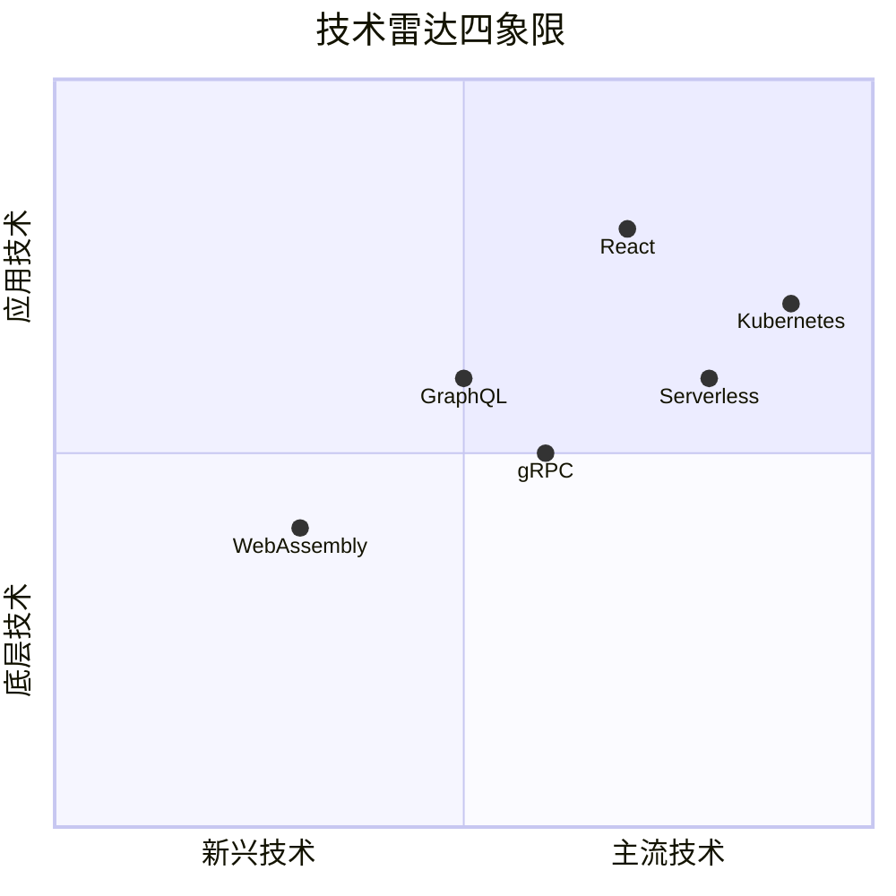
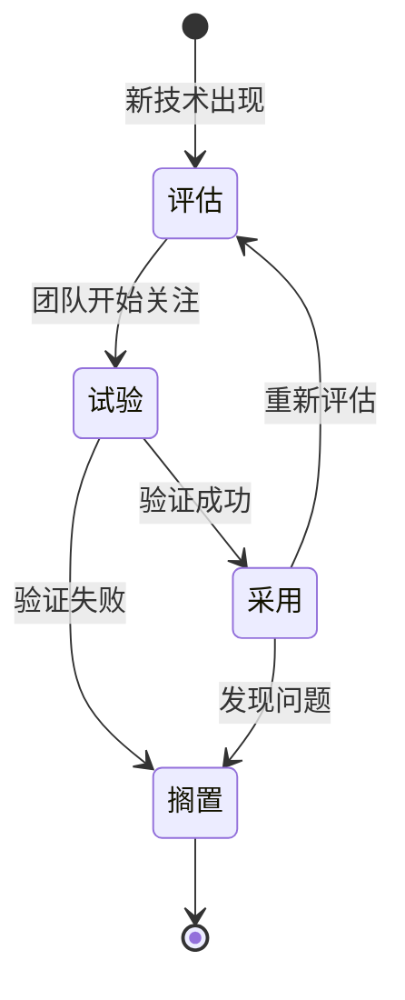

# 技术雷达设计

2011 年，ThoughtWorks 发布了一份内部报告，介绍他们如何追踪和评估技术趋势。这份报告后来演变成了 **Tech Radar（技术雷达）**——一个用四象限和四种状态来组织技术评估结果的工具。

10 年后的今天，技术雷达已经成为全球范围内最流行的技术选型沟通工具之一。Netflix、Spotify、 Zalando 等公司都有自己的技术雷达。技术雷达的价值在于：它把散落在个人头脑中的技术判断，变成了团队共享的技术认知地图。

## 技术雷达是什么

技术雷达是一种**可视化技术评估结果**的工具。它把一个组织对各类技术的态度，用位置信息表达出来：

- **象限**代表技术的类别
- **位置**代表技术的成熟度或推荐程度

当你打开一张技术雷达图时，你可以快速回答几个问题：

- 我们团队目前在用哪些技术？
- 哪些技术我们正在评估？
- 哪些技术我们应该开始尝试？
- 哪些技术我们应该逐步替换？

技术雷达的输入是一系列技术评估，输出是一个所有人都能理解的可视化结果。

## 技术雷达的结构

### 四个象限

技术雷达的四个象限代表技术的分类维度：



| 象限 | 说明 | 示例技术 |
|---|---|---|
| 编程语言与框架 | 应用开发使用的主要语言和框架 | Java、Spring Boot、React、Vue |
| 工具 | 开发、测试、部署等环节使用的工具 | Docker、Terraform、Jenkins |
| 平台与技术 | 基础设施和中间件相关的技术 | Kubernetes、Redis、Kafka |
| 技术与模式 | 架构设计方法论和最佳实践 | 微服务、CI/CD、零信任安全 |

### 三种状态

每个技术在雷达上的位置代表团队对该技术的态度：

| 状态 | 含义 | 使用建议 |
|---|---|---|
| **采用（Adopt）** | 强烈推荐，可以安全使用 | 新项目首选 |
| **试验（Trial）** | 可以尝试，了解适用场景 | 在非关键项目中验证 |
| **评估（Assess）** | 值得关注，了解潜在价值 | 保持关注，理解应用场景 |
| **搁置（Hold）** | 不推荐或逐步淘汰 | 不要在新项目中使用 |

> [!NOTE]
> 不同组织对状态的理解可能略有差异。关键是团队内部达成共识，状态本身的意义不如「一致性」重要。

## 技术雷达的演进过程

技术雷达不是一次性的产物，而是持续演进的知识库。一个技术的状态会随着时间变化：



技术雷达的演进体现了团队技术认知的成长。今天认为是「采用」的技术，可能两年后变成「搁置」——不是因为判断错了，而是因为技术环境发生了变化。

## 如何在团队中推行技术雷达

技术雷达的价值只有在「被使用」时才能体现。如果只是制作了一份漂亮的雷达图，然后束之高阁，就完全失去了意义。

### 推行步骤

**第一步：建立共识**。在推行技术雷达之前，先与团队核心成员沟通，确认以下几点：

- 技术雷达能解决什么问题？
- 团队当前在技术选型上有哪些痛点？
- 技术雷达的维护成本是否可接受？

如果团队认为技术选型没有混乱到需要工具来解决，那么推行技术雷达的时机可能还不成熟。

**第二步：定义流程**。技术雷达需要有人维护，需要有评估流程。至少需要回答以下问题：

- 谁负责更新雷达？
- 一个技术的状态如何确定？需要评审吗？
- 状态变更后，谁需要被通知？

**第三步：从小开始**。不要一开始就构建一个包含 100 个技术的完整雷达。选择团队最关心的 10-20 个技术开始，随着流程成熟再逐步扩展。

**第四步：与日常工作集成**。技术雷达只有在日常工作中被引用时才有价值。在技术评审、方案设计、技术分享等场景中，主动引用雷达中的状态，让团队成员习惯「查雷达」。

## 技术雷达的维护机制

技术雷达最大的敌人是「过时」。一份半年前更新的技术雷达，可能已经无法反映团队的真实技术状态。

### 维护节奏

| 维护类型 | 周期 | 内容 |
|---|---|---|
| 小幅更新 | 每周/每两周 | 新增评估、状态微调 |
| 完整审查 | 每季度 | 全面审查所有技术状态 |
| 大版本更新 | 每半年/每年 | 重新组织象限、清理过时技术 |

### 维护责任人

建议采用「轮值制」：团队成员轮流负责技术雷达的维护，而不是固定一个人。这样做的好处是：

1. 分散维护成本，避免单点依赖
2. 让更多人了解技术评估的过程
3. 引入多元视角，避免「一言堂」

### 避免的误区

**误区一：雷达即标准**。技术雷达是参考工具，不是强制标准。团队成员有权在雷达之外探索新技术，技术雷达的价值是「提供共识」，而不是「限制探索」。

**误区二：雷达不更新**。一份几年不更新的技术雷达，比没有雷达更危险——它给新员工虚假的信心。

**误区三：雷达过于复杂**。如果技术雷达包含了 200 个技术，状态说明有 10 种，这个工具本身就变成了认知负担。保持简洁，只记录真正重要的技术。

## 案例：某互联网公司如何用技术雷达统一团队认知

2019 年，国内某中型互联网公司（员工 200 人，技术团队 50 人）遇到了一个典型问题：每个小组都在用自己熟悉的技术，跨组协作时频繁出现「语言不通」的情况——微服务框架有三种、消息队列有两种、缓存方案有三种。

CTO 决定引入技术雷达来解决这个问题。推行过程如下：

**第一个月：建立基础**。技术委员会（由各组架构师组成）选取了团队最关注的 30 个技术，发布了第一版技术雷达。状态定义如下：

- **采用**：各组新项目必须优先选择
- **试验**：可以在非核心项目中尝试
- **评估**：保持关注，不强制要求
- **搁置**：逐步淘汰，已有项目给出迁移计划

**第三个月：建立流程**。制定了技术评估流程：当团队需要引入新技术时，需要先提交评估报告，说明该技术的优势、劣势、适用场景，由技术委员会评审后决定是否加入雷达。

**第六个月：与招聘同步**。在招聘 JD 中引用技术雷达，候选人可以清楚了解团队的技术栈。降低了「入职后发现技术栈不符合预期」的离职率。

**一年后**：技术雷达从最初的 30 个技术扩展到 60 个，各组的技术选型统一度显著提升。跨组协作时，「用什么技术」的争论明显减少——「查一下雷达」成了团队的口头禅。

**量化效果**：

- 新技术引入的平均评审时间：从 2 周降低到 3 天
- 技术选型争议的解决速度：提升 60%
- 跨组代码复用率：提升 40%

## 技术雷达与 ADR 的配合

技术雷达记录的是「当前的技术状态」，ADR（Architecture Decision Records）记录的是「决策的过程」。两者配合使用，可以实现「知其然」与「知其所以然」的结合。

### 典型配合场景

**场景一：技术升级决策**。当需要升级 Java 版本时，技术雷达会告诉你「当前推荐 Adopt 的版本是 17」，ADR 则记录「为什么选择 17 而不是 21」。

**场景二：技术废弃决策**。当需要废弃某个老旧框架时，技术雷达会告诉你「这个框架已经标记为 Hold」，ADR 则记录「为什么这个框架不再适合我们」。

**场景三：新成员 onboarding**。新成员可以通过技术雷达快速了解团队的技术全景，然后通过 ADR 深入了解关键决策的背景。

### 文档结构建议

```text
docs/
├── radar/
│   ├── index.mdx          # 技术雷达总览
│   ├── adopt.mdx         # 采用列表
│   ├── trial.mdx         # 试验列表
│   ├── assess.mdx        # 评估列表
│   └── hold.mdx          # 搁置列表
└── adr/
    ├── 001-why-java-17.mdx
    ├── 002-why-k8s.mdx
    └── ...
```

## 技术雷达的扩展应用

除了基本用法之外，技术雷达还有几个扩展应用值得关注。

### 按团队分层雷达

大公司可能有多个技术团队，每个团队的技术栈和关注点不同。可以为每个团队维护自己的技术雷达，同时维护一个「公司级技术雷达」作为共识基线。

### 技能差距分析

技术雷达可以与团队技能评估结合使用。将「团队当前使用的技术」与「雷达上推荐的技术」对比，可以识别出团队的技术差距，为培训计划提供依据。

### 项目级技术选型

在为具体项目做技术选型时，可以在项目目录中放一个「本项目技术雷达」，说明该项目选择了哪些技术、为什么选择、与公司级雷达的关系是什么。

## 思考题

**问题 1**：假设你的团队有 5 个人，技术雷达维护会占用一定时间。你会如何设计维护机制，让成本可接受的同时保持雷达的时效性？

<details>
<summary>参考答案</summary>

设计建议：

1. **轮值制**：每人每月轮值负责雷达维护，降低个人负担
2. **触发式更新**：不设固定更新周期，而是在「有新技术引入或有技术状态变更」时更新
3. **模板化**：使用标准模板记录技术评估，减少写作成本
4. **集成到日常流程**：将「是否更新雷达」嵌入技术评审流程，作为评审的产出物之一
5. **简化状态**：只保留「采用」和「搁置」两种状态，减少维护判断成本

关键指标：雷达更新一次的成本应该远低于「每次技术选型时重新讨论」的成本。

</details>

**问题 2**：你的团队中有一位资深工程师，坚持使用一个已经被标记为「搁置」的老技术，理由是「这个技术我熟悉，没问题」。作为架构师，你如何处理这个情况？

<details>
<summary>参考答案</summary>

处理步骤：

1. **了解原因**：先了解这位工程师坚持使用老技术的原因——是认知问题、情感问题，还是确实有合理理由？
2. **数据说话**：如果雷达标记为「搁置」，一定有原因。展示这个原因：如果继续使用，面临的风险是什么（如安全漏洞无人修复、社区支持停止）？
3. **给出过渡方案**：不是「必须换成新技术」，而是「老技术有哪些风险」「我们计划什么时候迁移」「迁移的成本是多少」
4. **寻求共识**：召开技术评审会，让团队一起讨论，而不是单方面宣布决定
5. **授权与支持**：如果团队最终决定继续使用，保留记录（作为 ADR），并定期复审

核心原则：不强制，但要有记录。不阻止探索，但要管理风险。

</details>

**问题 3**：你正在为公司建立技术雷达，CEO 问你「技术雷达能带来什么商业价值？」你会如何回答？

<details>
<summary>参考答案</summary>

从商业角度回答技术雷达的价值：

1. **降低技术风险**：避免团队在技术选型上「踩坑」，减少因技术选型错误导致的返工和项目失败
2. **提高协作效率**：统一的技术语言和共识，减少跨团队沟通成本和代码整合摩擦
3. **加速人才招聘**：明确的技术栈说明，降低候选人筛选成本，提高 offer 接受率
4. **知识沉淀**：技术评估的过程和结论被记录下来，不随人员流动而流失
5. **合规与安全**：通过雷达追踪「搁置」技术，确保老旧系统的安全漏洞及时修复

量化表达：如果一个 50 人的技术团队，每年因技术选型争议浪费 2 周时间，成本约 50 人 × 2 周 = 100 人天 ≈ 30 万。技术雷达的目标是把这类浪费降低 50% 以上。

</details>