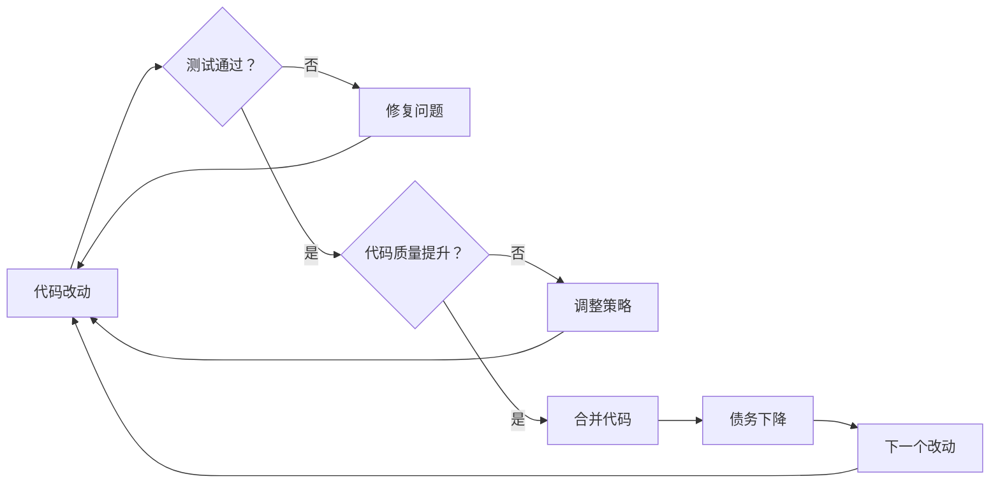

# 增量重构实践

大爆炸重构听起来痛快，但实践中风险极高；集中式债务 Sprint 效果明显，但会中断业务连续性。有没有一种方式，能够在不影响日常开发节奏的情况下，持续偿还技术债务？

这就是**增量重构**的核心价值：**将债务治理融入日常工作，每次代码改动都顺便改善一点点**。日积月累，债务悄然下降。

## 核心原则：小步前进、快速反馈

增量重构的核心思想来自敏捷开发的两条黄金原则：**小步前进**（Small Steps）和**快速反馈**（Fast Feedback）。

**小步前进**意味着不追求一步到位，而是将大目标拆解成可以在几小时内完成的小改动。每次只改一个类、只重构一个方法、只提取一个函数。改动越小，风险越低，越容易验证。

**快速反馈**意味着每次改动后立即验证。写一个测试、跑一遍测试套件、检查一下代码质量指标。反馈越快，错误越早发现，越容易修复。



### 增量重构 vs 批量重构

| 维度 | 增量重构 | 批量重构 |
| --- | --- | --- |
| **改动粒度** | 小（小时级） | 大（天级、周级） |
| **风险** | 低 | 中到高 |
| **融入日常** | 是 | 否（需要专门安排） |
| **总时间投入** | 长期累计 | 短期集中 |
| **团队压力** | 低 | 高 |
| **适用债务类型** | 低息债务、中等债务 | 高息债务 |
| **效果显现** | 慢（需要时间积累） | 快（立竿见影） |

增量重构不是万能药。对于高息债务（频繁出故障、严重影响开发效率），增量重构可能太慢，需要专门的 Sprint 集中处理。但对于持续积累的中小债务，增量重构是最健康的方式。

## Boy Scout Rule：每次改动留下更干净的代码

Boy Scout Rule（童子军规则）是一条简洁的重构原则：**Leave the code better than you found it.**（离开时，代码比你发现时更干净）

这条规则的核心洞察是：**代码的自然趋势是越来越乱**。如果不主动干预，每个新功能的加入、每个 bug 的修复，都会让代码变得更乱一点。十年下来，代码会变成一团无法维护的浆糊。

Boy Scout Rule 的实践方式很简单：当你因为任何原因需要修改一个文件时，顺便改善一下这个文件。不要大改，就改善一点点。

```java title="Boy Scout Rule 示例"
// 修改前：一段需要修改的代码
public class OrderService {
    public void processOrder(Order order) {
        // 大量代码...
        // 其中有一段命名很差的变量
        Integer a = order.getAm(); // a 是什么鬼？
        Integer b = order.getQty();
        Integer c = a * b;
        // 大量代码...
    }
}

// Boy Scout 改动：顺便改善这段代码
public class OrderService {
    public void processOrder(Order order) {
        // 大量代码...
        // 改善：把命名改成有意义的
        BigDecimal amount = order.getAmount();
        Integer quantity = order.getQuantity();
        BigDecimal total = amount.multiply(new BigDecimal(quantity.toString()));
        // 大量代码...
    }
}
```

### Boy Scout Rule 的实践要点

**改动要保守**。Boy Scout Rule 的前提是「顺便改善」，不是「顺便重写」。如果你花太多时间在改善上，会影响正常的开发节奏。

**不要追求完美**。每次只改善一点点。今天改善变量命名，明天改善一个方法拆分，后天改善一行注释。积累下来，变化是惊人的。

**测试优先**。如果要大幅重构一个方法，先补充测试用例，确保有保护网。

:::tip Boy Scout Rule 的度量

一个团队是否在践行 Boy Scout Rule，可以通过代码质量趋势来验证。如果每次代码质量扫描显示代码质量在持续恶化，说明要么没人在做 Boy Scout，要么改动的幅度远小于新增债务的速度。

:::

## 重构的三次法则

与 Boy Scout Rule 相辅相成的是**三次法则**（Rule of Three）：**同一段代码如果出现三次，就值得进行一次重构。**

为什么是三次？因为一次可能是巧合，两次可能是例外的边界情况，三次就说明这是一个模式，值得抽象。

```java title="三次法则示例"
// 第一次出现：复制粘贴
public String formatPriceV1(BigDecimal price) {
    return "$" + price.setScale(2, RoundingMode.HALF_UP).toString();
}

// 第二次出现：还是复制粘贴
public String formatDiscountV1(BigDecimal discount) {
    return "$" + discount.setScale(2, RoundingMode.HALF_UP).toString();
}

// 第三次出现：还是同样的逻辑
public String calculateTotalV1(BigDecimal subtotal, BigDecimal tax) {
    BigDecimal total = subtotal.add(tax);
    return "$" + total.setScale(2, RoundingMode.HALF_UP).toString();
}

// 三次法则触发：重构为通用方法
public String formatCurrency(BigDecimal amount) {
    return "$" + amount.setScale(2, RoundingMode.HALF_UP).toString();
}
```

### 三次法则的价值

**第一，减少未来的维护成本**。如果同样的逻辑散布在 10 个地方，修改时需要改 10 个地方；如果抽象成一个方法，只需要改一个地方。

**第二，提高代码的一致性**。复制粘贴的代码很容易在后续修改中分化——一个地方改成这样，另一个地方没改，结果产生了微妙的 bug。抽象成统一方法后，这种 bug 自然消失。

**第三，让代码更易读**。10 行复制粘贴的代码比 3 行抽象调用 + 1 行方法定义更难读。抽象让代码的「平均行数」降低，可读性提升。

## 真实案例：遗留订单模块的 6 个月重构

> **案例来源**：某电商平台订单模块的增量重构实践

这家公司有一个运行了 6 年的订单模块，代码量超过 15 万行。没有测试用例，圈复杂度平均 18，重复代码率 23%。每次改需求，开发人员都战战兢兢——没人知道改了这一处会不会引爆另一处。

技术团队决定采用增量重构策略，用 6 个月时间逐步改善这个模块。

### 第一个月：建立保护网

第一步不是改代码，而是**补充测试**。没有测试的重构是裸奔。

团队做了三件事：

1. **集成测试覆盖**：针对核心业务流程（创建订单、支付订单、取消订单）编写集成测试，覆盖 70% 的核心路径。
2. **回归测试集**：梳理过去两年所有 bug，编写对应的回归测试用例，确保这些 bug 不会再次出现。
3. **代码覆盖扫描**：用 JaCoCo 扫描测试覆盖率，标记出「改了必死的」热点区域。

第一个月的成果是：订单模块有了一套基础的测试保护网，后续重构可以在安全的环境下进行。

### 第二、三个月：降低圈复杂度

这个阶段聚焦于**降低单个方法的圈复杂度**。

团队制定了简单规则：**任何新编写的代码，圈复杂度不能超过 10**；**任何需要修改的代码，如果圈复杂度超过 15，必须先拆分，再修改**。

```java title="高复杂度方法拆分示例"
// 拆分前：圈复杂度 = 15
public void processPayment(Order order, PaymentMethod method) {
    if (method == PaymentMethod.CREDIT_CARD) {
        // 分支 A
    } else if (method == PaymentMethod.DEBIT_CARD) {
        // 分支 B
    } else if (method == PaymentMethod.WECHAT) {
        // 分支 C
    } else if (method == PaymentMethod.ALIPAY) {
        // 分支 D
    } else if (method == PaymentMethod.PAYPAL) {
        // 分支 E
    }
    // ...
}

// 拆分后：使用策略模式
public interface PaymentProcessor {
    PaymentResult process(Order order);
}

@Service
public class CreditCardProcessor implements PaymentProcessor { ... }
@Service
public class WechatPayProcessor implements PaymentProcessor { ... }
@Service
public class AlipayProcessor implements PaymentProcessor { ... }

// 调用方：圈复杂度 = 1
public void processPayment(Order order, PaymentMethod method) {
    PaymentProcessor processor = paymentProcessorFactory.get(method);
    processor.process(order);
}
```

### 第四个月：消除重复代码

使用 SonarQube 的重复代码检测功能，识别出 Top 20 的重复代码块。

团队采用了两种策略：

1. **提取公共方法**：对于逻辑相似的重复代码，提取为私有方法。
2. **引入领域对象**：对于数据结构相似的重复代码，引入统一的领域对象。

### 第五、六个月：完善文档与架构

最后两个月聚焦于**知识沉淀**：

1. 为核心类编写 JavaDoc
2. 绘制核心流程图
3. 将关键设计决策记录为 ADR

### 6 个月后的成果

| 指标 | 重构前 | 重构后 | 变化 |
| --- | --- | --- | --- |
| 圈复杂度（平均） | 18.3 | 9.2 | -50% |
| 重复代码率 | 23% | 8% | -65% |
| 测试覆盖率 | 0% | 72% | +72% |
| 单次修改前置时间 | 4.2 小时 | 1.5 小时 | -64% |
| 月均故障次数 | 3.2 次 | 0.6 次 | -81% |

:::tip 这个案例的启示

增量重构成功的关键是**耐心和坚持**。6 个月的时间里，团队每周大约花 5-10% 的时间在债务治理上。这个比例不大，但持续积累，效果显著。关键是**坚持做**，而不是「有空就做、没空就不做」。

:::

## 重构与新功能并行：分支隔离策略

增量重构最大的挑战是：**如何在重构的同时，不阻塞新功能开发？**

答案是在**分支上隔离**。


### 分支策略的核心原则

**第一，重构分支的生命周期要短**。分支存活时间越长，合并冲突越多，风险越大。建议重构分支的生命周期控制在 2 周以内。

**第二，频繁合并主干到分支**。不要等重构快完成了才合并主干，而是在重构期间每天合并一次。这样可以避免大量的合并冲突。

**第三，测试必须在分支上跑通**。重构分支上的测试失败不能合并到主干。

**第四，必要时可以「牺牲」重构**。如果在重构期间有紧急需求需要改到重构涉及的代码，优先满足需求，重构可以等一等。

## 重构成功的度量指标

如何判断一次增量重构是成功的？以下是推荐的度量指标：

| 指标 | 重构前 | 重构后 | 判定标准 |
| --- | --- | --- | --- |
| **圈复杂度（平均）** | X | 应下降 30%+ | 有意义的改善 |
| **重复代码率** | X | 应下降 50%+ | 大幅减少维护成本 |
| **测试覆盖率** | X | 应提升至 70%+ | 足够的保护网 |
| **代码可读性评分** | X（团队主观评分） | 应提升 | 团队体感改善 |
| **修改前置时间** | X 小时 | 应下降 30%+ | 开发效率提升 |
| **故障率** | X 次/月 | 应下降 50%+ | 稳定性提升 |

:::tip 度量的陷阱

过度依赖量化指标可能导致「作弊」。比如为了提高测试覆盖率，可能写了大量低质量的测试（只覆盖 happy path，不测边界条件）。建议同时关注**代码可读性评分**——让团队成员匿名评估代码的可读性，这种主观评价往往比客观指标更能反映实际情况。

:::

## 团队协作：债务偿还是全团队的事

增量重构不能只靠技术负责人或架构师推动。成功的债务治理需要全团队参与。

### 建立债务文化

**第一，将债务意识融入 Code Review**。在 Code Review 中，除了检查功能正确性，还要检查代码质量。如果发现 PR 引入新债务，应该要求修复后再合并。

```markdown title="Code Review 债务检查清单"
## 代码质量检查项

- [ ] 圈复杂度是否超过 15？
- [ ] 是否有重复代码（与现有代码 > 80% 相似）？
- [ ] 是否有 TODO/FIXME 未完成？
- [ ] 变量/方法命名是否清晰？
- [ ] 是否有必要的注释解释复杂逻辑？
- [ ] 是否符合团队代码规范？

## 债务引入检查

- [ ] 是否引入了新的技术债务？
- [ ] 如果引入了，是否在 PR 描述中说明？
- [ ] 引入了多少 debt point（约等于修复所需的人天）？
```

**第二，将债务指标纳入团队回顾**。每个 Sprint 回顾会，review 一下债务趋势报告。债务是在增加还是在减少？如果在增加，讨论原因。

**第三，认可债务治理贡献**。在团队会议上表扬那些主动修复债务的开发者。债务治理是默默无闻的工作，需要正向激励。

### 债务积分赛

对于大型团队，可以考虑**债务积分赛**的激励机制：

```markdown title="债务积分赛规则"
## 积分规则

| 债务类型 | 积分 | 说明 |
| --- | --- | --- |
| 消除重复代码（100 行以上） | 10 分 | 大幅减少维护成本 |
| 降低圈复杂度（单个方法从 >15 降到 <10） | 5 分 | 显著提升可读性 |
| 补充测试用例（10 个以上） | 5 分 | 建立保护网 |
| 补充文档（核心类 JavaDoc） | 3 分 | 知识沉淀 |
| 重构工具类（被多处调用） | 8 分 | 杠杆效应高 |

## 季度奖励

积分最高的开发者，获得「代码质量之星」称号，以及额外奖励。
```

:::warning 积分赛的局限性

积分赛可以激励开发者参与债务治理，但也可能导致「刷分」——开发者去做积分高的任务，而不是最需要的任务。建议积分赛只是辅助手段，核心债务治理计划仍然由技术负责人统筹安排。

:::

## 持续改进机制

债务治理不是一次性项目，而是**持续的过程**。要防止债务再次积累，需要建立持续改进机制。

### CI/CD 集成

将代码质量扫描集成到 CI/CD 流水线中：

```yaml title="CI 配置示例"
# .gitlab-ci.yml
code-quality:
  stage: test
  script:
    - sonar-scanner
  artifacts:
    reports:
      sonar: report.json
  rules:
    - if: $CI_PIPELINE_SOURCE == "merge_request_event"
    - if: $CI_COMMIT_BRANCH == $CI_DEFAULT_BRANCH

# 代码质量门禁
quality-gate:
  stage: quality
  script:
    - sonar-scanner
    - sonar-quality-gate-check
  only:
    - merge_requests
  variables:
    SONAR_QUOTE_THRESHOLD: "A"  # 质量评级必须为 A
```

### 技术雷达

建立团队的技术雷达，定期 review 债务分布，决定是否需要调整治理策略。

### 债务上限

对于某些关键模块，可以设置**债务上限**——当债务指标超过某个阈值时，强制锁定对该模块的改动，要求先还债再开发。

```java title="债务上限注解示例"
@DebtLimit(maxComplexity = 15, maxDuplicationRate = 5.0)
public class OrderService {
    // 这个类的圈复杂度上限是 15
    // 如果超过，CI 会失败
}
```

## 思考题

**问题1**：Boy Scout Rule 强调每次改动都顺手改善代码，但在实际工作中，开发人员经常面临 deadline 压力，没有时间做额外改善。这种情况下应该如何平衡？

<details>
<summary>参考答案</summary>

这里有一个关键区分：**改善代码**和**引入新债务**是两件不同的事。Boy Scout Rule 的核心要求是「不要让代码变得更糟」，而不是「每次都让代码变得更好」。在 deadline 压力下，可以「不改善」，但至少要做到「不恶化」——不要在修改时引入新的技术债务。对于确实需要改善但时间不够的情况，建议记录债务（issue 或 TODO），在 sprint 回顾会上统一安排处理。关键是**债务不能无限积累**，无论当下是否有时间处理，都需要有人知道它存在。

</details>

**问题2**：三次法则说「出现三次才重构」，但如果第一次写的时候就设计好抽象，不就可以避免复制粘贴了吗？

<details>
<summary>参考答案</summary>

这涉及一个经典的软件设计哲学问题：**YAGNI（You Aren't Gonna Need It）** vs **预见性设计**。

YAGNI 的观点是：不要为未来的需求做设计，因为大部分「未来会用到」的设计最终不会被用到。过度设计是另一种债务。

三次法则的实践意义是：**在「已经看到三次重复」之前，你还不确定这是否真的是一个值得抽象的模式**。也许前两次看起来相似，第三次就完全不同了。过早抽象可能导致错误的抽象，后期改动成本更高。

正确的做法是：在写代码时，**保持警惕但不急于抽象**；当第三次出现时，**花时间分析这三个场景是否真的可以抽象**，然后再做决定。

</details>

**问题3**：增量重构和批量重构各有优劣，能否将两者结合使用？

<details>
<summary>参考答案</summary>

完全可以，而且这正是最佳实践。对于一个高息债务，可以使用**批量重构**（专门的 Sprint）快速解决问题；对于中等和低息债务，使用**增量重构**持续改善。两种方式的关键区别在于改动的规模和风险控制策略：

- 批量重构：大规模改动，需要完整的测试保护网、详细的回退方案
- 增量重构：小步前进，每次改动小，风险低，但需要长期坚持

一个健康的债务治理体系，应该是**两种方式并存**：有计划地处理高息债务，同时在日常工作中持续改善低息债务。

</details>
