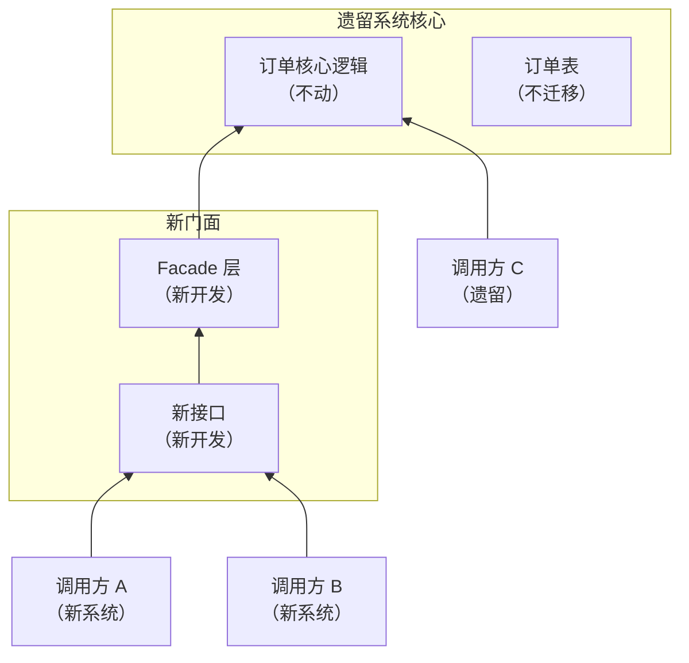
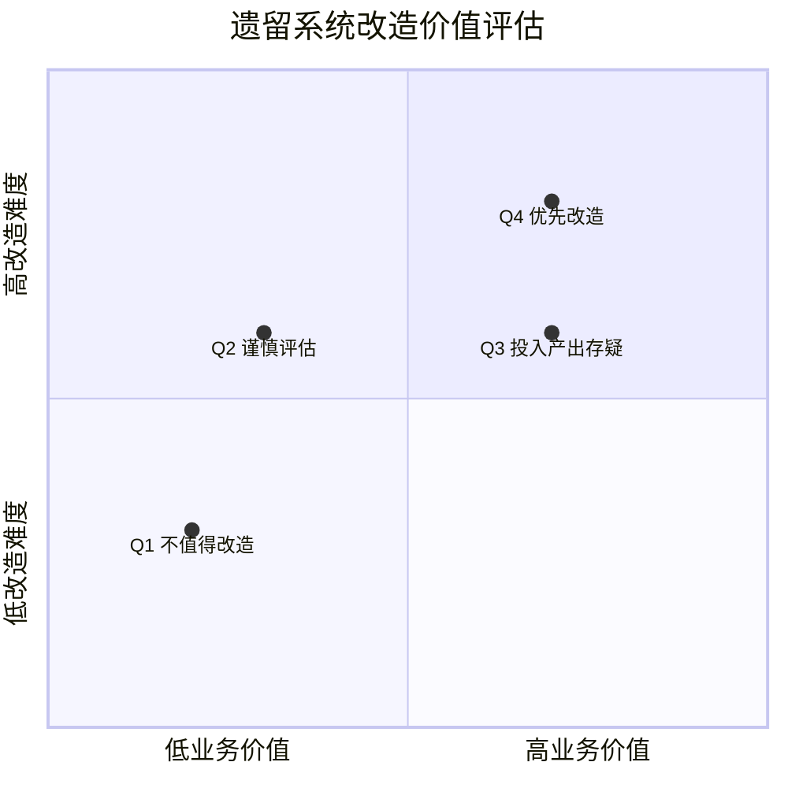
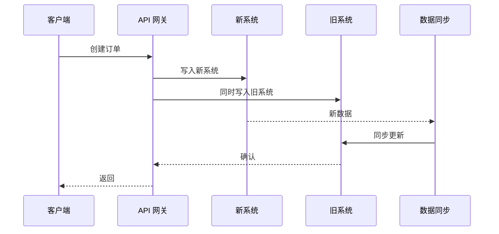
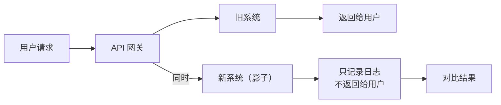

# 遗留系统现代化

有一种系统，代码已经没人能完全理解，测试覆盖率接近零，依赖的框架版本老得连官方都停止维护，每次改需求都像在雷区跳舞。这就是**遗留系统**。

很多团队面对遗留系统的态度是「能不动就不动」。但问题是：遗留系统不会自己变好，只会越来越烂。随着时间推移，依赖的安全漏洞、框架的兼容性风险、性能瓶颈，都会逐步暴露。而且，随着业务发展，对遗留系统的改动需求会越来越多，团队会越来越痛苦。

这一篇讲的是**如何让遗留系统「焕发新生」**——不是推倒重来，而是用系统化的方式，一步步让一个老系统重新变得可维护、可演进。

## 什么是遗留系统

在开始治理之前，首先需要明确：**什么样的系统算「遗留系统」？**

Martin Fowler 对遗留系统的定义是：**「一个内部实现已经没人完全理解的系统，由于业务或技术的原因，不能轻易替换。」**

这个定义揭示了遗留系统的两个核心特征：

1. **知识流失**：最初设计它的人可能早已离职，现有团队对它的理解是片面的
2. **替换成本高**：不是因为不想替换，而是替换的代价太高（业务复杂、数据迁移、用户习惯等）

### 遗留系统的典型症状

| 症状 | 表现 | 危险程度 |
| --- | --- | --- |
| **没有测试** | 任何改动都可能引发未知问题 | 极高 |
| **没有文档** | 新人需要 3 个月才能上手 | 高 |
| **依赖过时** | 使用已停止维护的框架/库 | 高 |
| **代码混乱** | 圈复杂度高、重复代码多、命名不规范 | 中 |
| **数据不一致** | 数据库设计不合理、历史数据混乱 | 中 |
| **部署困难** | 部署依赖人工操作、缺少自动化 | 中 |
| **性能瓶颈** | 无法水平扩展、响应时间长 | 中 |

:::warning 遗留系统 vs 老年系统

一个系统运行了 10 年，不一定是遗留系统——如果它设计良好、有完善的测试和文档、依赖保持更新，那它只是一个「老年」系统而非「遗留」系统。遗留系统的本质特征是**知识流失和替换成本高**，而不是年龄。

:::

## 遗留系统现代化的三条路径

面对遗留系统，你有三条路可以选：**维护（Strangler）**、**增强（Facade）**、**重写（Rewrite）**。

### 路径一：绞杀者模式（Strangler）

绞杀者模式（Strangler Pattern）在前面重构策略那篇已经详细讲过，它的核心思想是**不直接改遗留系统，而是在它外面「长」出新系统，逐步将流量迁移过来，直到旧系统被「绞杀」**。

这条路径适合的场景：

- 遗留系统边界清晰（可以用 API 界定）
- 业务可以接受新旧系统并行
- 团队有足够的资源同时维护两套系统

**优点**：风险可控、业务连续性好、可以逐步验证

**缺点**：周期长、需要同时维护两套系统、新旧数据需要同步

### 路径二：门面模式（Facade）

门面模式的核心思想是**不改变遗留系统的核心代码，而是在外面包一层「新门面」，将新功能放在门面里，遗留系统的调用方逐步切换到门面**。



这条路径适合的场景：

- 遗留系统核心逻辑稳定，不需要改动
- 需要快速提供新接口给新系统使用
- 不想承担迁移核心逻辑的风险

**优点**：风险低、可以快速交付新功能、遗留系统可以作为稳定底座

**缺点**：门面层可能变得复杂、两条路径需要同时维护

### 路径三：重写（Rewrite）

重写是最激进的方式——**放弃旧系统，从零开始构建新系统**。

这条路径适合的场景：

- 遗留系统债务极重，改造代价不亚于重写
- 业务逻辑已经被完全理解（这是前提！）
- 有充足的时间和资源
- 能够接受上线初期的稳定性风险

**优点**：可以彻底解决债务、可以获得全新的技术栈、团队有成就感

**缺点**：风险极高、需要完整的业务知识、周期长、容易失败

:::tip 重写的成功率

业界普遍认为，完全重写的成功率不超过 30%。失败的主要原因不是技术问题，而是**知识不完整**——团队以为理解了旧系统的所有逻辑，但上线后发现遗漏了大量边界条件和隐藏业务。所以，重写的前提是「真的完全理解」，而不是「以为理解」。

:::

## 风险评估：值不值得改造

在选择改造路径之前，你需要回答一个关键问题：**这个遗留系统值不值得改造？**

### 改造价值评估

```
改造价值 = 改造后价值 - 改造投入成本 - 改造风险成本
```

**改造后价值**需要从业务维度评估：

- 改造后能支持多少新业务？
- 改造后能降低多少运维成本？
- 改造后能提升多少开发效率？
- 改造后能降低多少故障风险？

**改造投入成本**包括：

- 直接成本：人力、时间、基础设施
- 间接成本：团队放弃其他机会的代价

**改造风险成本**包括：

- 改造失败的可能性（概率 × 损失）
- 改造期间的稳定性风险
- 改造对业务的影响

### 评估矩阵



| 象限 | 特征 | 建议 |
| --- | --- | --- |
| **Q1** | 低价值、低难度 | 直接放弃或最小化维护 |
| **Q2** | 低价值、高难度 | 不要投入太多资源，保持运行即可 |
| **Q3** | 高价值、高难度 | 深入分析，谨慎决策，考虑分层改造 |
| **Q4** | 高价值、低难度 | **优先投入**，这是最佳 ROI |

### 判断标准：什么时候应该放弃

有些遗留系统，改造的代价可能比重写还高，而且即使改造完成，也无法达到期望的状态。这种情况下，**放弃可能是更好的选择**。

**应该考虑放弃的信号**：

- 核心业务逻辑已经没人能完全理解
- 依赖的外部系统已经停止维护，且无替代方案
- 数据模型已经严重腐化，迁移代价极高
- 改造预算和时间远超预期
- 业务已经决定放弃这个系统

:::warning 放弃不等于「什么都不做」

放弃改造不等于「让它烂下去」。建议为遗留系统设置「生命终结」计划：1）冻结核心功能开发，只做安全补丁；2）逐步将用户迁移到新系统；3）设定明确的废弃时间线（比如 18 个月后停止服务）。有计划的放弃，比无序腐烂对业务的伤害小得多。

:::

## 新旧系统并行策略

如果选择了绞杀者模式或重写，你需要处理新旧系统并行的挑战。

### 双写模式

双写是最常见的并行策略——**新系统和旧系统同时写入，通过数据同步保持一致性**。



**双写的挑战**：

1. **数据一致性**：两个系统的写入可能因为性能差异、事务边界不同导致数据不一致
2. **性能开销**：每个操作需要写入两次，延迟翻倍
3. **冲突处理**：如果两个系统对同一条数据的修改逻辑不同，如何处理冲突？

**解决方案**：

```java title="双写与最终一致性示例"
@Service
public class OrderService {
    private final OrderRepository newOrderRepository;
    private final LegacyOrderRepository legacyOrderRepository;
    private final MessageQueue messageQueue;

    @Transactional
    public Order createOrder(OrderRequest request) {
        // 1. 先写入新系统（主数据源）
        Order order = newOrderRepository.save(request.toOrder());

        // 2. 异步同步到旧系统
        messageQueue.send("order.sync", new OrderSyncMessage(order.getId()));

        return order;
    }
}

// 消息消费者异步同步到旧系统
@MessageListener(topic = "order.sync")
public void syncToLegacy(OrderSyncMessage message) {
    Order order = newOrderRepository.findById(message.getOrderId());
    try {
        legacyOrderRepository.save(order.toLegacyFormat());
    } catch (Exception e) {
        // 重试 + 告警
        retryWithBackoff(message);
    }
}
```

### 影子模式

影子模式（Shadow Mode）的核心思想是**新系统接受生产流量的「影子」，但不返回给用户**。用于在真实流量下验证新系统的正确性。



**影子模式的应用场景**：

- 新系统需要处理大量真实数据来验证性能
- 需要在生产环境测试边界条件和异常情况
- 不想让新系统的风险影响用户

### 灰度发布

灰度发布是流量控制的艺术——**从小范围开始，逐步增加新系统的流量比例**。

```java title="灰度发布控制示例"
@Service
public class OrderServiceRouter {
    private final FeatureToggle featureToggle;

    public OrderService route(OrderRequest request) {
        // 基于用户 ID 的灰度策略
        Long userId = request.getUserId();

        if (featureToggle.isEnabled("order-service-v2", userId, 0.1)) {
            // 10% 的用户走新系统
            return newOrderService.createOrder(request);
        } else {
            return legacyOrderService.createOrder(request);
        }
    }
}
```

灰度发布的推荐节奏：

| 阶段 | 流量比例 | 持续时间 | 观察指标 |
| --- | --- | --- | --- |
| 内部测试 | 0% | 1 周 | 功能正确性 |
| 灰度 5% | 5% | 3 天 | 错误率、延迟 |
| 灰度 20% | 20% | 1 周 | 业务指标、监控 |
| 灰度 50% | 50% | 1 周 | 稳定性 |
| 全量 | 100% | — | 持续监控 |

## 技术选型陷阱

在遗留系统改造中引入新技术是最大的陷阱之一。

### 陷阱一：改造变成了「技术升级」

很多遗留系统改造项目，最后变成了「把 Spring 3 升级到 Spring 6、把 MySQL 5 升级到 MySQL 8」。这本身没有问题，但问题是：**技术升级不是目的，解决业务问题才是**。

如果升级后，故障率没降低、开发效率没提升、用户体验没改善，那这次改造的价值在哪里？

### 陷阱二：引入太多新技术的

改造一个遗留系统已经够难了。如果同时引入新的语言、新的框架、新的数据库、新的消息队列，团队的学习成本会非常高，可能导致项目延期甚至失败。

**建议**：改造期间，**最多引入 1-2 项核心技术变更**。其他的，保持与原有技术栈一致。

### 陷阱三：追求一步到位

遗留系统的问题太多了，团队可能想「这次改造一次解决所有问题」。结果是：

- 范围太大，项目失控
- 风险太高，任何一个问题都会导致整个项目失败
- 时间太长，业务等不及

**建议**：采用**渐进式改造**，每次只解决 1-2 个核心问题。

:::tip 技术选型建议

在遗留系统改造中，技术选型的原则是：**选择团队熟悉的，而不是最新的**。如果团队熟悉 MySQL，即使 PostgreSQL 某些场景下更好，也应该选 MySQL。原因是：1）遗留系统改造本身风险已经够高，不要再引入技术风险；2）学习新技术需要时间，会拉长项目周期；3）新技术的「坑」团队还没踩过，可能导致新的问题。

:::

## 真实案例：某传统企业 15 年遗留系统的 3 年改造

> **案例来源**：某大型传统企业核心业务系统的现代化改造

这家公司有一核心业务系统，运行了 15 年，代码量超过 200 万行，使用 ASP + SQL Server 2000 开发，Windows Server 2003 + IIS 6 部署。没有测试，没有文档，核心开发只剩 1 人。

业务痛点：

- 新需求开发周期 3-6 个月，严重拖慢业务
- 无法支持移动端访问
- 安全性不达标，审计无法通过
- 故障频发，平均每月 2-3 次

### 改造策略

经过评估，团队选择了**渐进式改造 + 绞杀者模式**：

**第一年：打基础**

- 引入 Git 和 CI/CD 流水线
- 搭建自动化测试框架
- 补充核心业务流程的集成测试
- **没有改动任何业务代码**，只是建立基础设施

**第二年：API 化**

- 在遗留系统外层构建 API 层
- 新功能通过 API 实现，不再修改核心代码
- 开始建设新前端（Vue.js）
- 遗留系统和新系统双写

**第三年：迁移**

- 逐步将用户迁移到新前端
- 迁移过程中发现旧系统隐藏的 bug，记录并修复
- 数据迁移：从 SQL Server 逐步迁移到 PostgreSQL
- 旧系统最终下线

### 三年后的成果

| 指标 | 改造前 | 改造后 |
| --- | --- | --- |
| 新需求开发周期 | 3-6 个月 | 2-4 周 |
| 月均故障次数 | 2.5 次 | 0.3 次 |
| 支持移动端 | 不支持 | 支持 |
| 安全审计 | 不通过 | 通过 |
| 团队规模 | 5 人（无人敢离职） | 12 人（有人主动加入） |

:::tip 这个案例的启示

成功的遗留系统改造，关键是**耐心和坚持**。三年时间看起来很长，但这是唯一可行的方式——如果选择大爆炸重写，团队可能在 6 个月后精疲力竭，项目半途而废。渐进式改造虽然慢，但每一步都有成果，业务能看到进展，团队能看到希望。

:::

## 现代化后的持续维护机制

改造完成后，最重要的事情是**防止系统再次变成遗留系统**。

### 建立技术债务管理机制

改造完成后，立即建立技术债务管理机制：

```markdown title="技术债务管理规程"
## 日常规范

1. 所有代码必须有测试用例，覆盖率 >= 80%
2. Code Review 必须检查代码质量
3. 禁止引入停止维护的依赖
4. 每个 Sprint 预留 20% 时间用于债务治理

## 监控指标

1. 代码质量指标：圈复杂度、重复代码率、测试覆盖率（每周报告）
2. 债务趋势：债务指数变化趋势（每月报告）
3. 依赖健康度：依赖版本、安全漏洞（每月报告）

## 定期 review

1. 每季度：技术债务全景 review
2. 每半年：技术雷达更新
3. 每年：架构演进规划
```

### 设置技术上限

为防止债务再次积累，可以设置技术上限：

- **圈复杂度上限**：单方法不超过 15
- **代码行数上限**：单文件不超过 500 行
- **依赖年龄上限**：任何依赖不能超过 2 年未更新
- **测试覆盖率下限**：核心模块不低于 80%

任何代码改动，如果导致这些指标超标，CI 流水线应该失败。

### 知识沉淀

改造完成后，知识沉淀不能停止：

- 核心设计决策必须记录为 ADR
- 关键业务逻辑必须编写设计文档
- 新人 onboarding 必须有完整文档

```markdown title="ADR 示例：选择 PostgreSQL 而非 MySQL"
# ADR-0012：核心业务数据库选型

## 状态
已接受

## 背景
遗留系统使用 SQL Server 2000，已停止维护。需要选择新的数据库。

## 决策
选择 PostgreSQL 14 作为核心业务数据库。

## 理由
1. PostgreSQL 对复杂查询支持更好（递归 CTE、正则表达式）
2. JSON 支持更完善，适合业务扩展
3. 团队有 PostgreSQL 使用经验
4. 社区活跃，文档完善

## 备选方案
- MySQL：团队更熟悉，但复杂查询性能差
- MongoDB：文档型数据库，迁移成本高

## 后果
- 正面：查询性能提升，开发效率提升
- 负面：团队需要学习 PostgreSQL 特性，约 2 周适应期
```

### 定期技术雷达更新

技术雷达（Tech Radar）是 ThoughtWorks 提出的技术评估工具，帮助团队追踪技术的演进。

建议每个季度更新一次技术雷达，将技术分为：

| 象限 | 说明 | 示例 |
| --- | --- | --- |
| **Adopt（采用）** | 成熟稳定，可以放心使用 | Spring Boot、PostgreSQL |
| **Trial（试用）** | 可以小范围尝试 | gRPC、Redis Cluster |
| **Assess（评估）** | 值得深入了解 | WebAssembly、Rust |
| **Hold（暂停）** | 不推荐新项目使用 | Struts 2、PHP 原生 |

## 思考题

**问题1**：一个遗留系统已经完全没人能理解了——没有文档、没有注释、核心开发者早已离职。这种情况下，应该选择绞杀者模式还是重写？

<details>
<summary>参考答案</summary>

答案是**绞杀者模式**，但需要在开始之前做大量的「考古工作」。首先，通过代码考古尽可能理解系统的业务逻辑：分析数据库表结构（通常表名和字段名会透露业务含义）、追踪 API 请求的处理路径、查阅 git 历史了解代码演进、访谈业务人员了解实际业务流程。在此基础上，才能决定如何「绞杀」——新系统应该覆盖哪些功能、如何切分边界。完全重写的前提是「完全理解」，如果真的没人理解，重写就是在赌博。绞杀者模式的风险更低，即使新系统遗漏了某些功能，还可以从旧系统调用。

</details>

**问题2**：在遗留系统改造过程中，旧系统突然出现了重大故障，需要紧急修复。这种情况下，应该停止改造还是继续？

<details>
<summary>参考答案</summary>

大多数情况下，**紧急修复不应阻止改造继续，但可能需要调整改造节奏**。紧急修复是「止血」，改造是「健身」，两者都很重要但紧迫程度不同。处理方式：1）优先修复故障，确保业务连续性；2）故障修复后，分析故障根因，看是否与改造范围相关；3）如果相关，需要调整改造策略（比如隔离风险更高的改造模块）；4）如果无关，继续按计划推进改造。关键是**不要因为紧急修复而完全放弃改造**——很多团队在救火之后就再也提不起精神做改造了，结果债务继续积累。

</details>

**问题3**：如何评估一个遗留系统改造项目是否成功？

<details>
<summary>参考答案</summary>

改造成功的判定标准应该**在改造开始前就明确定义**，而不是事后总结。建议从以下维度评估：1）**业务价值**：改造后，新需求开发周期是否缩短？用户满意度是否提升？2）**技术指标**：代码质量指标是否达到目标？技术债务是否大幅下降？3）**稳定性**：故障率是否下降？MTTR 是否缩短？4）**团队健康**：团队士气是否提升？人员流失是否减少？5）**成本**：改造投入是否在预算范围内？ROI 是否为正？建议在改造规划阶段就设定这些指标的「目标值」和「验收标准」，改造完成后对照验收。

</details>
