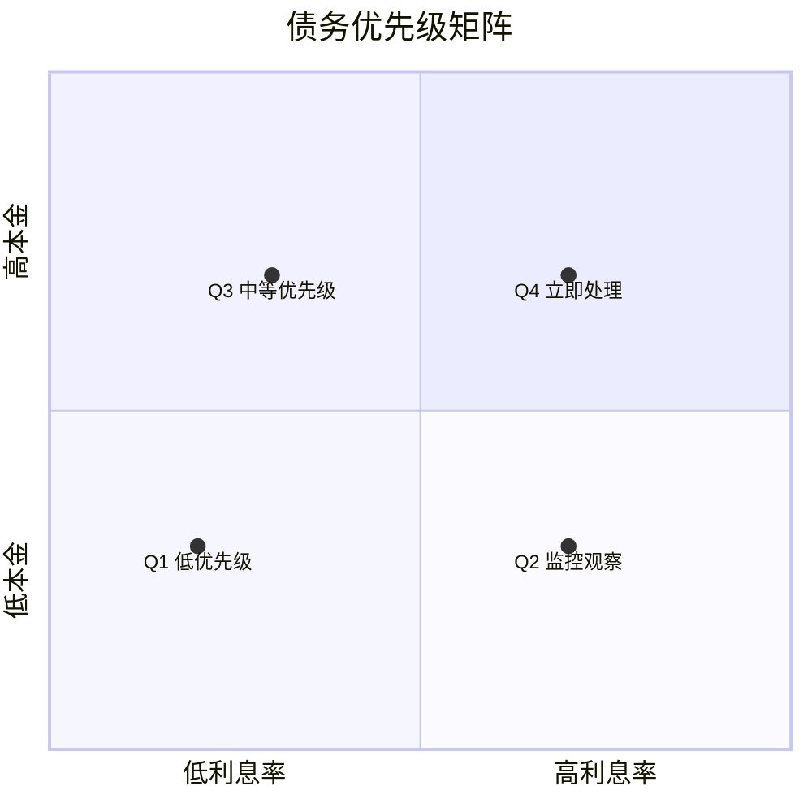
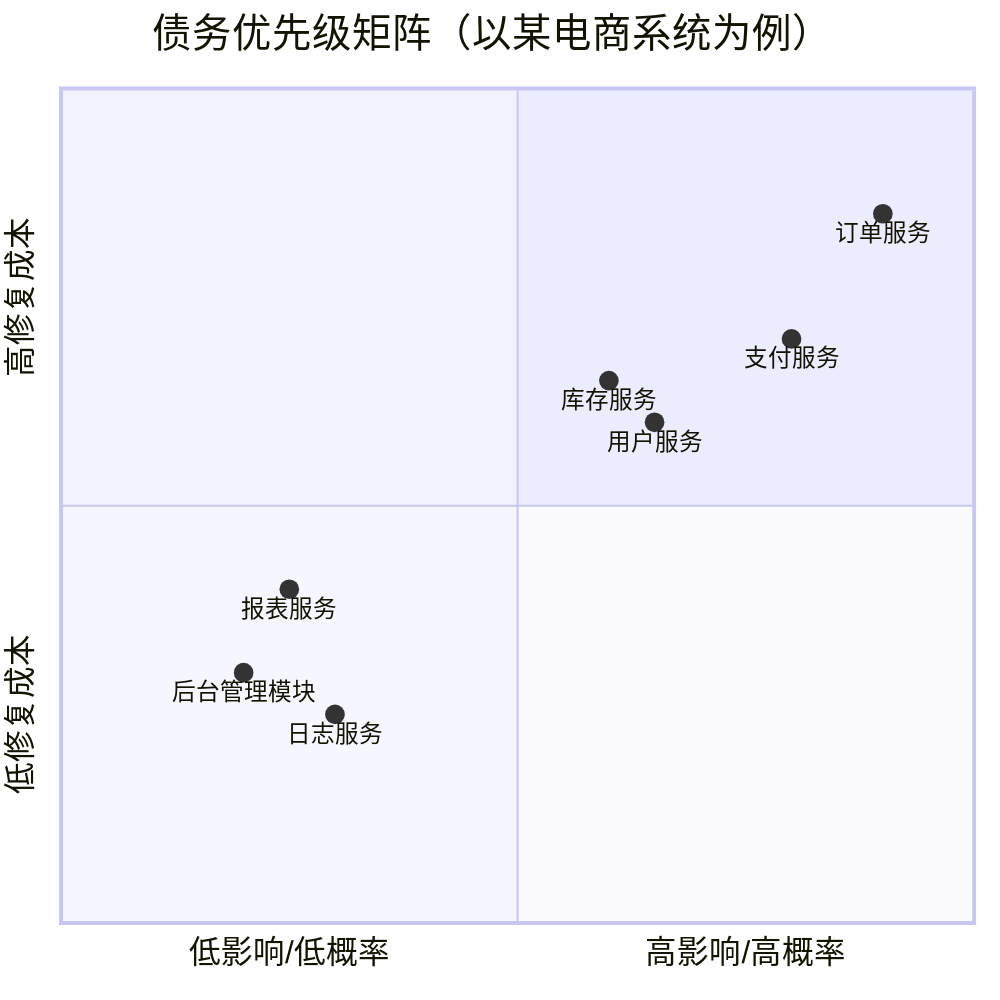

# 债务优先级评估

你花了两周时间完成技术债务量化，现在手头有了一份详细的债务积分卡。订单服务的综合债务指数是 8.2，库存服务是 7.5，用户服务是 6.8。后台管理模块只有 4.2，报表服务是 3.5。

问题是：**你有多少时间还债？一个 Sprint 能处理多少债务？应该优先还哪些债？**

量化的目的是为了决策。但仅仅有数字还不够，你需要一个优先级框架来指导决策。

## 利息率 × 本金模型

金融学中评估债务有两个核心概念：**本金**（欠了多少）和**利息率**（欠债的成本有多高）。这两个概念可以映射到技术债务的优先级评估中。

**债务本金**指的是债务的绝对量级——代码有多烂、依赖有多老、文档有多缺。它回答的是「这个债务有多重」。

**债务利息率**指的是债务持续产生额外成本的速度。它回答的是「这个债务每天在消耗多少资源」。

一个高本金、低利息的债务，可能是「一段写得不好但几乎不用的历史代码」；一个低本金、高利息的债务，可能是「一个高频修改的核心模块的轻微设计缺陷」。



### 四象限决策框架

**Q4 高本金 + 高利息 = 立即处理**

这是债务治理的首要目标。这类债务的本金很重，而且每天都在产生高昂的利息。典型场景是核心业务模块的高复杂度代码——修改成本高、修改频率高、故障影响大。

**Q3 低本金 + 高利息 = 尽快处理**

本金不重，但利息很高。这意味着一个小的缺陷正在产生大的持续成本。典型场景是高频调用的工具类、通用组件。虽然代码量不大，但被调用的次数多，每次调用都在付出代价。

**Q2 低本金 + 低利息 = 监控观察**

债务不重，利息也不高。这类债务可以暂时放着，但在做其他改动时「顺手清理」。典型场景是远离核心链路的辅助模块、非关键接口。

**Q1 高本金 + 低利息 = 低优先级**

本金很重，但利息很低。这类债务往往是「遗留代码」——古老、混乱、没人敢动，但因为业务已经稳定，实际上很少需要修改。对于这类债务，如果没有特定的需求驱动，不建议主动重构（详见反模式章节）。

:::warning 警惕「看起来低利息」的陷阱

低利息可能只是假象。有些债务模块看起来利息很低，因为当前没有人敢改它——大家都绕着走。但这种「不产生利息」是建立在巨大机会成本之上的：团队每周花 3 小时绕路，而这些绕路时间完全可以用于新功能开发。这类债务应该重新评估其「利息」。

:::

## 评估维度详解

在具体评估时，你需要从以下四个维度打分。

### 维度一：故障影响范围

这个债务模块如果出问题，会影响多少用户？

| 影响范围 | 评分 | 说明 |
| --- | --- | --- |
| 核心链路 | 10 | 影响所有用户，如登录、下单、支付 |
| 高频功能 | 7 | 影响大部分用户，如商品搜索、购物车 |
| 中频功能 | 5 | 影响部分用户，如个人中心、订单列表 |
| 低频功能 | 3 | 影响少量用户，如后台管理 |
| 内部功能 | 1 | 不影响用户，如定时任务、批处理 |

**注意**：影响范围不仅要考虑「有多少用户」，还要考虑「影响的业务有多关键」。一个后台报表模块影响 1000 个运营人员，可能不如一个下单模块影响 100 个付费用户重要。

### 维度二：修复成本（人天）

还掉这笔债需要多少开发资源？

| 修复成本 | 评分 | 说明 |
| --- | --- | --- |
| 1 人天以内 | 2 | 改动明确，风险可控 |
| 1-3 人天 | 5 | 需要一定时间，但可以完成 |
| 3-5 人天 | 7 | 需要专门的项目跟进 |
| 5 人天以上 | 10 | 需要多周甚至多月的专项 |

**注意**：修复成本的评估要诚实。很多人会低估修复成本——你以为只需要改一个类，实际上可能需要改 20 个类，因为这个类的设计已经渗透到整个系统。建议在评估成本时预留 50% 的 buffer。

### 维度三：业务风险（故障概率）

这个债务模块出问题的概率有多高？

| 故障概率 | 评分 | 说明 |
| --- | --- | --- |
| 极高（每月多次） | 10 | 已经是故障大户 |
| 高（每月 1-2 次） | 7 | 频繁出问题 |
| 中（每季 1-2 次） | 5 | 偶发问题 |
| 低（半年 1 次） | 3 | 很少出问题 |
| 极低（基本不出） | 1 | 稳定运行 |

**注意**：故障概率的评估要基于数据，而不是主观感受。很多人对「出问题多的模块」印象深刻，对「没出问题但一直在危险边缘」的模块反而不够重视。建议结合债务量化中的历史故障数据。

### 维度四：团队士气影响

这个债务对团队士气和开发效率的影响有多大？

| 士气影响 | 评分 | 说明 |
| --- | --- | --- |
| 严重影响 | 10 | 团队怨声载道，每次改动都心惊胆战 |
| 明显影响 | 7 | 开发者普遍认为这是痛点 |
| 中等影响 | 5 | 有抱怨但不强烈 |
| 轻微影响 | 3 | 少数人有怨言 |
| 无影响 | 1 | 没人觉得是问题 |

**注意**：团队士气是一个容易被忽视的维度，但它对长期生产力有显著影响。一段让所有开发者都头疼的代码，即使故障率不高，也值得优先处理，因为它正在持续消耗团队的精神能量。更重要的是，这类债务往往会驱动优秀开发者离职。

## 优先级计算公式

综合以上四个维度，可以用加权公式计算债务优先级：

```
债务优先级 = 故障影响 × 30% + 修复成本 × 20% + 故障概率 × 30% + 士气影响 × 20%
```

```markdown title="债务优先级评分表示例"
## 订单服务债务评估

| 评估维度 | 评分 (0-10) | 权重 | 加权分 |
| --- | --- | --- | --- |
| 故障影响范围 | 9 | 30% | 2.7 |
| 修复成本 | 7 | 20% | 1.4 |
| 故障概率 | 8 | 30% | 2.4 |
| 士气影响 | 8 | 20% | 1.6 |
| **综合优先级** | | | **8.1 / 10** |

## 用户服务债务评估

| 评估维度 | 评分 (0-10) | 权重 | 加权分 |
| --- | --- | --- | --- |
| 故障影响范围 | 7 | 30% | 2.1 |
| 修复成本 | 6 | 20% | 1.2 |
| 故障概率 | 5 | 30% | 1.5 |
| 士气影响 | 6 | 20% | 1.2 |
| **综合优先级** | | | **6.0 / 10** |
```

:::tip 权重调整的灵活性

公式中的权重不是固定的。如果团队当前处于稳定性优先的阶段，可以提高「故障概率」的权重；如果团队正在快速扩张需要提升开发效率，可以提高「士气影响」的权重。权重的选择反映的是团队当前的战略重点。

:::

## 债务优先级矩阵

除了公式，还有一个更直观的工具：**债务优先级矩阵**。



**立即处理区域**（右上角）：高影响、高概率、高成本。这个区域的债务必须立即安排资源处理，否则将持续影响业务。

**计划处理区域**（左上角和右下角）：中等影响或中等概率。这个区域的债务应该纳入季度规划，按计划逐步处理。

**观察区域**（左下角）：低影响、低概率。这个区域的债务可以暂时忽略，或者在处理其他问题时「顺手清理」。

## 利益相关方对齐

债务优先级的评估不能只是技术团队自己说了算。你需要与多个利益相关方对齐，才能确保债务治理计划真正落地。

### 与产品经理对齐

产品经理关心的是业务价值和资源效率。向产品经理展示债务治理的 ROI（投资回报率）是关键。

一个有效的对齐框架：

```
「如果不处理这笔债务，未来 6 个月的预期损失：
- 故障成本：X 次故障 × Y 小时 × Z 元/小时 = A 元
- 开发效率损失：B 人天 × C 元/人天 = D 元
- 总损失：A + D 元

处理这笔债务的成本：E 人天 = F 元

ROI = (A + D - F) / F = X%
```

:::tip 对齐话术示例

不要对产品经理说「这段代码很烂需要重构」，而要说「订单模块的债务导致每个 Sprint 有 15% 的时间浪费在修 bug 和绕路开发上。如果投入 2 周重构，预计可以将这部分时间降低到 5%，相当于每个 Sprint 多出 1 人周的开发资源」。

:::

### 与开发团队对齐

开发团队是债务的直接受害者和处理者。他们的意见对优先级评估至关重要。

建议在 Sprint Planning 之外，专门组织一次「债务治理头脑风暴」：

1. 让每个开发者提名他们认为债务最高的模块，并说明理由
2. 集体讨论每个模块的「利息」——这个债务每天浪费多少时间
3. 对提名模块进行投票
4. 基于投票结果和量化数据，确定优先级

这种自下而上的方式有两个好处：第一，开发者的本地知识（local knowledge）可以补充量化数据的不足；第二，开发者参与了决策，执行意愿会更高。

### 与管理层对齐

如果债务治理需要大量资源投入（比如需要占用整个 Sprint），你可能需要管理层的支持。

向管理层展示的内容应该聚焦于：

- 债务对业务目标的影响（比如对大促稳定性的影响）
- 不处理债务的代价（量化展示）
- 债务治理的里程碑和成功指标

## Sprint Planning 中的债务处理

如何在 Sprint Planning 中合理安排债务偿还？这里有一个实践多年的经验框架。

**固定比例法**：每个 Sprint 预留固定比例的资源用于债务治理。推荐比例是 15-20%。

```markdown title="Sprint Planning 债务安排示例"
## Sprint 23 计划

### 新功能开发
- 用户画像 2.0 需求 (Story Points: 21)
- 订单导出功能优化 (Story Points: 8)

### 债务治理
- 订单服务：重构高复杂度方法，3 个（预计 13 points）
- 订单服务：补充核心路径单元测试（预计 8 points）

### 预留 buffer
- 随机事件处理 (Story Points: 5)

---
**总计：55 points，其中债务治理占比 38%**
```

**债务专项 Sprint**：对于特别严重的债务，可以在某个 Sprint 专门做债务治理，而不是和新功能混合开发。这种方式的优点是可以集中精力处理复杂问题；缺点是短期内没有新功能产出，需要提前与利益相关方沟通。

:::warning 不要在债务 Sprint 中引入新功能

债务专项 Sprint 最常见的失败模式是「做着做着就变成了功能 Sprint」。团队觉得既然在做这个模块，不如把那个需求也做了。结果债务没还完，功能也做了一半，两头都不靠。债务专项 Sprint 必须有严格的范围控制。

:::

## 真实案例：Sprint Planning 中的债务对齐

> **案例来源**：某金融科技公司的债务治理实践

这家公司有一个历史遗留的账务系统，运行了 12 年，代码量超过 120 万行。技术团队知道这个系统债务很重，但每次申请资源还债都被产品团队拒绝——「业务压力这么大，哪有时间重构？」

技术负责人换了一个思路：他花了两周时间，收集了过去一年账务系统的所有故障报告、工单、以及开发人员的工时记录。分析结果令人震惊：

- 过去一年，账务系统共发生 23 次故障，平均每次故障影响 500+ 用户，故障处理时间合计 156 小时
- 开发人员在账务模块的「修改前置理解时间」平均为 4.2 小时，是其他模块的 3.5 倍
- 因账务系统债务导致的开发效率损失，折算成人力成本约 180 万元/年

技术负责人带着这份数据去和产品 VP 对齐。他的提案是：「拿出一个 Sprint 专门处理账务系统的 5 个最高息债务，预计投入 5 人 × 2 周 = 50 人天。」

产品 VP 的回应是：「好，但我要看到效果。你说的 156 小时故障处理时间和 180 万效率损失，我来跟踪验证。」

结果：两个 Sprint 的债务治理后，账务系统的月均故障次数从 2 次降低到 0.5 次，故障恢复时间从平均 45 分钟降低到 15 分钟。开发效率也显著提升——修改前置理解时间从 4.2 小时降低到 1.5 小时。

产品 VP 后来主动提出：「以后每个大版本发布后，拿出一个 Sprint 专门做债务治理。」

:::tip 这个案例的启示

债务治理最难的不是技术，而是说服利益相关方。关键是：**用业务语言说话，用数据支撑结论，用结果验证承诺**。技术债务治理一旦形成了正向循环（投入资源 → 看到效果 → 愿意继续投入），就会进入良性轨道。

:::

## 优先级的动态调整

债务优先级不是一成不变的。随着业务发展、系统演进、团队变化，优先级需要动态调整。

**应该重新评估优先级的时机**：

- 业务架构发生重大变化（比如新增了核心功能）
- 某模块的故障模式发生显著变化（比如突然变得频繁）
- 技术栈发生重大升级（比如从 Java 8 升级到 Java 17）
- 团队组成发生重大变化（比如核心开发离职）

建议每季度做一次债务优先级的全面复盘，并根据复盘结果调整下一季度的治理计划。

## 思考题

**问题1**：有三个债务模块：
- A 模块：故障影响大、修复成本高、故障概率低
- B 模块：故障影响中等、修复成本中等、故障概率中等
- C 模块：故障影响小、修复成本低、故障概率高

按照利息率 × 本金模型，这三个模块应该分别处于哪个象限？

<details>
<summary>参考答案</summary>

A 模块属于「高本金 + 低利息」象限（Q1 左下角）：修复成本高意味着本金重，但故障概率低意味着利息不高。这类债务适合在有特定需求驱动时处理，不建议主动重构。

B 模块属于「中等本金 + 中等利息」象限：各项指标都处于中等，是典型的「中等优先级」。应该在季度规划中安排处理，但不必紧急。

C 模块属于「低本金 + 高利息」象限（Q2 左上角）：虽然每次问题不大，但频繁发生，累计利息很高。这类债务应该优先处理，因为「本金」不大意味着改起来相对容易，但「利息」高意味着投入产出比很好。

</details>

**问题2**：开发团队和产品经理对债务优先级的判断不一致——开发认为 A 模块最紧急，产品认为 B 模块更关键。怎么处理？

<details>
<summary>参考答案</summary>

分歧的根源可能是信息不对称或优先级维度不同。处理方法：1）组织联合评审会，让双方分别陈述自己的判断依据；2）用统一的评估框架（比如本文的四个维度）对两个模块重新打分；3）如果分歧仍然存在，引入第三方（如技术负责人或业务负责人）做最终裁决；4）如果资源允许，可以同时处理两个模块；如果不允许，就按统一框架的结果执行。关键是**用同一个框架评估，而不是各说各话**。

</details>

**问题3**：某个债务模块综合优先级很高，但团队所有人都说「这段代码我不敢动，一动就出问题」。这种情况下应该怎么处理？

<details>
<summary>参考答案</summary>

「不敢动」通常意味着两种情况：一是代码风险高，确实容易出问题；二是团队对这段代码缺乏理解，不知道怎么改。针对第一种情况，应该先做充分的风险控制：补充测试用例、增加监控告警、准备回滚方案。针对第二种情况，应该先做「代码考古」：让有经验的工程师花时间理解这段代码，然后做知识分享。必要时不惜「重构准备」——比如添加注释、拆分方法、建立测试——而不直接做大规模改动。总之，对于高风险债务，要「谋定而后动」，但不能「不动」。

</details>
