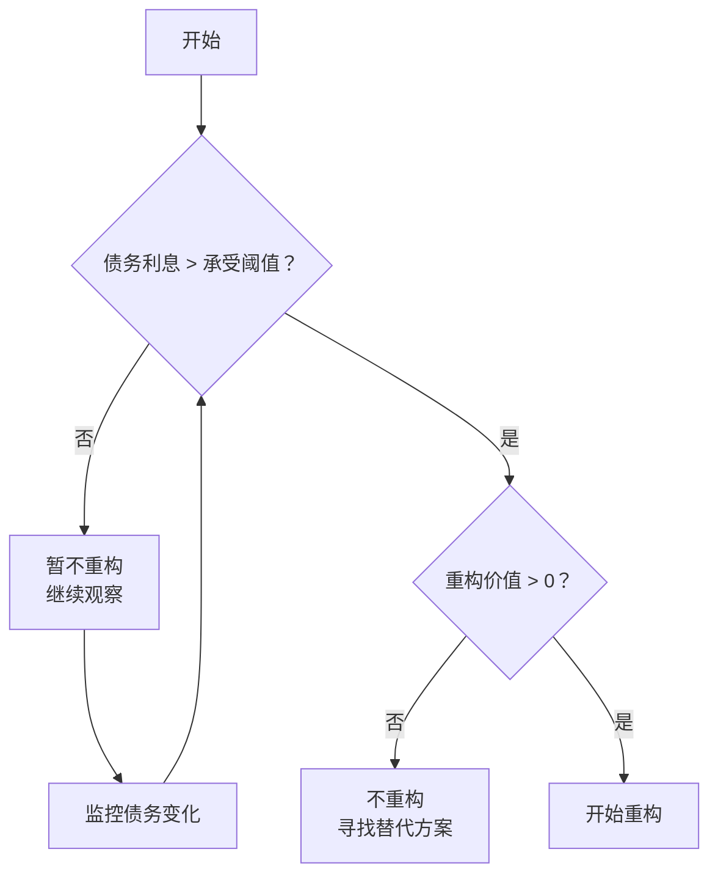
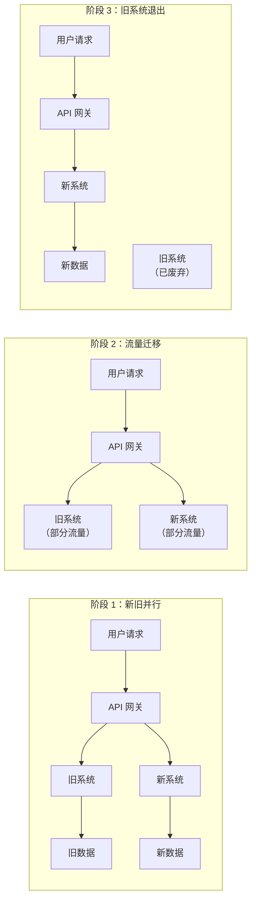
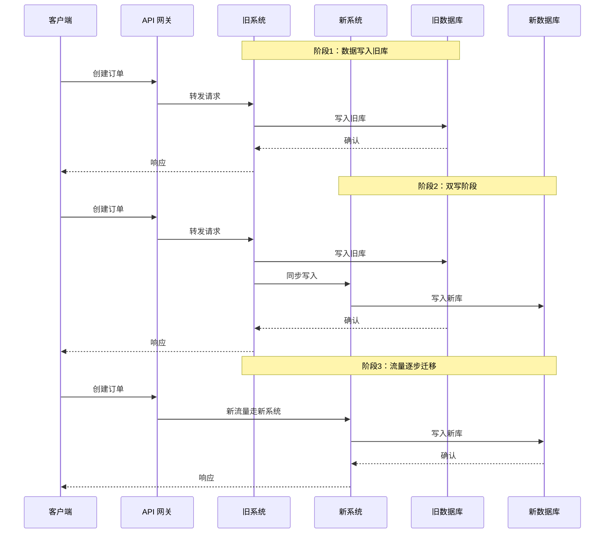
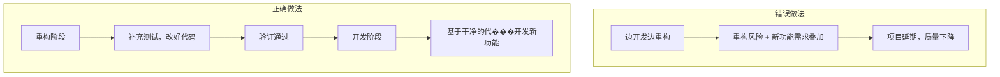

# 重构策略选择

你确认了优先级，现在要开始还债了。但**怎么还**和**什么时候还**，和「还多少」同样重要。

很多团队在债务治理的第一步就犯了错：看到一段烂代码，直接上手重写。结果写到一半发现逻辑太复杂、项目进度被拖、项目延期、新功能被锁死。一年后回头看，系统比原来更乱——因为新旧代码混在一起，没人分得清哪些是新写的、哪些是遗留的。

这一篇讲的重构策略选择，就是帮你回答：**什么时候该重构、用什么方式重构、如何控制重构的风险。**

## 重构的时机：债务利息超过承受阈值

重构不是想重构就重构的。重构有成本：时间、风险、机会成本。在债务利息没有超过承受阈值之前，不值得重构。

**债务利息的承受阈值**因团队而异。一个 startup 可能可以承受 30% 的开发效率损失，一个金融系统可能 5% 就受不了。

判断是否值得重构的简单公式：

```
重构价值 = 重构减少的年利息成本 - 重构投入成本 - 重构风险成本
```

如果重构价值 > 0，重构是值得的。如果重构价值 < 0，重构是亏本的。



:::tip 替代重构的方案

不是所有债务都需要通过重构来还。有些债务可以通过其他方式「止损」：加缓存绕过性能问题、加熔断器降低故障影响、加监控提前发现问题、增加人力投入来对抗效率损失。选择哪种方式，取决于成本对比。

:::

## 重构策略对比：大爆炸 vs 渐进式

重构策略分为两大类：**大爆炸重构**（Big Bang Refactoring）和**渐进式重构**（Incremental Refactoring）。

### 大爆炸重构

大爆炸重构指的是在短时间内一次性替换整个系统或整个模块。这种方式的特点是：

- **优点**：速度快、可以彻底解决债务、新旧代码不共存
- **缺点**：风险极高、需要长时间 lock codebase、团队压力大、难以回退

大爆炸重构的本质是「破旧立新」——先摧毁旧系统，再建立新系统。这听起来很痛快，但实践中问题重重。

**大爆炸重构失败的根本原因**：新系统在设计时无法完全预见旧系统的所有边界条件和隐藏逻辑。旧系统之所以能运行这么多年，是因为它已经「长」出了大量针对特定场景的处理逻辑——这些逻辑没有文档，可能连写代码的人都不记得了。重写时，这些「隐性知识」往往会丢失。

> **真实案例**：某社交平台的重写悲剧

> 2010 年左右，某知名社交平台决定用新架构重写整个平台。他们花了 18 个月，投入 30 人的团队，终于完成了「更现代化」的版本。上线第一周，服务器崩溃了。上线第一个月，陆续发现了 47 个「旧版本有但新版本没有」的功能。半年后，这个重写项目被放弃，团队回归旧版本，又花了 6 个月修复重写期间引入的问题。
>
> 这个案例后来成为「不要大爆炸重写」的标准反面教材。

### 渐进式重构

渐进式重构指的是将重构工作分散到多个阶段，每次只改一小部分。这种方式的特点是：

- **优点**：风险可控、可以持续验证、随时可以回退、不影响业务连续性
- **缺点**：速度较慢、新旧代码需要共存较长时间、可能有技术债叠加

渐进式重构的本质是「边还债边做生意」——不追求一步到位，而是将大目标拆解成小步骤，逐步推进。

**两种策略的权衡矩阵**：

| 维度 | 大爆炸重构 | 渐进式重构 |
| --- | --- | --- |
| **风险** | 极高，一次失败可能全盘皆输 | 低，每次只承担一小部分风险 |
| **速度** | 快，一次完成 | 慢，需要多个迭代 |
| **业务影响** | 期间可能需要锁死业务 | 持续可交付，不影响业务 |
| **回退成本** | 极高，回退等于白做 | 低，可以随时回退到上一版本 |
| **新旧共存** | 无 | 有，需要维护两套代码 |
| **适用场景** |债务极轻、系统极简单 | 大部分场景 |

:::warning 大爆炸重构的适用条件

大爆炸重构只在极少数情况下才合理：系统是全新项目（没有旧系统需要兼容）、债务极轻（不需要继承旧逻辑）、团队有完整的系统知识（知道所有边界条件）、有充足的时间和资源、愿意接受失败风险。如果有任何一条不满足，不要选择大爆炸。

:::

## 绞杀者模式：渐进式重构的核心武器

**绞杀者模式**（Strangler Pattern）是渐进式重构的核心策略。其核心理念是：**不要直接改旧系统，而是在旧系统外面包裹新系统，逐步将流量从旧系统迁移到新系统，直到旧系统被「绞杀」取代。**



### 绞杀者模式的三种实现方式

**方式一：代理模式**

通过 API 网关或反向代理，将请求路由到新系统或旧系统。适合 API 层面的重构。

```nginx title="Nginx 路由配置示例"
location /api/v2/ {
    # 新系统
    proxy_pass http://new-service:8080;
}

location /api/v1/ {
    # 旧系统，逐步迁移
    # 新增功能走新系统，旧功能暂时走旧系统
    proxy_pass http://legacy-service:8080;
}
```

**方式二：功能开关模式**

通过配置开关，决定每个请求走新代码还是旧代码。适合代码层面的重构。

```java title="功能开关控制重构切换"
@Service
public class OrderService {
    private final OrderServiceLegacy legacyService;
    private final OrderServiceNew newService;
    private final FeatureToggleService featureToggle;

    public Order createOrder(OrderRequest request) {
        // 通过功能开关决定走哪套实现
        if (featureToggle.isEnabled("order-service-v2")) {
            return newService.createOrder(request);
        } else {
            return legacyService.createOrder(request);
        }
    }
}
```

**方式三：数据库切分模式**

通过数据库层面的切分（新旧系统使用不同的数据库表），逐步将数据迁移到新数据库。适合数据层面的重构。



## 测试驱动重构（TDD）

重构最大的风险是「改坏了不知道」。测试驱动重构是控制这个风险的核心方法。

测试驱动重构的核心流程：

1. **写测试**：在改动之前，为要重构的代码编写测试用例。这些测试用例是「保护网」——确保重构后的行为与重构前一致。
2. **运行测试**：确保测试用例通过，证明你理解了代码的行为。
3. **重构代码**：在测试通过的前提下，重构代码。
4. **再次运行测试**：确保重构后的代码仍然通过所有测试。

```java title="测试驱动重构示例"
// 第一步：识别要重构的方法
public class OrderService {
    public Order processOrder(Long orderId) {
        Order order = orderRepository.findById(orderId);
        if (order == null) {
            throw new OrderNotFoundException();
        }
        if (order.getStatus() != OrderStatus.PENDING) {
            throw new OrderStatusException("Order is not pending");
        }
        if (order.getAmount() <= 0) {
            throw new IllegalArgumentException("Invalid amount");
        }
        // 业务逻辑...
        return order;
    }
}

// 第二步：编写测试用例
@Test
public void testProcessOrder_success() {
    Order order = new Order();
    order.setId(1L);
    order.setStatus(OrderStatus.PENDING);
    order.setAmount(new BigDecimal("100.00"));
    when(orderRepository.findById(1L)).thenReturn(order);

    Order result = orderService.processOrder(1L);

    assertNotNull(result);
    assertEquals(OrderStatus.PROCESSING, result.getStatus());
}

@Test(expected = OrderNotFoundException.class)
public void testProcessOrder_notFound() {
    when(orderRepository.findById(1L)).thenReturn(null);
    orderService.processOrder(1L);
}

@Test(expected = OrderStatusException.class)
public void testProcessOrder_invalidStatus() {
    Order order = new Order();
    order.setId(1L);
    order.setStatus(OrderStatus.COMPLETED);
    when(orderRepository.findById(1L)).thenReturn(order);

    orderService.processOrder(1L);
}
```

:::tip 测试覆盖率的要求

如果你准备重构一个方法，这个方法的测试覆盖率至少要达到 80%，最好能覆盖所有边界条件。如果一个方法连测试都没有，那在重构之前，应该先补充测试。补充测试的过程本身就是理解代码的过程。

:::

## 功能开关：小范围验证的艺术

功能开关（Feature Toggle）是在重构过程中控制风险的核心工具。它的核心理念是：**任何改动都可以随时回退**。

功能开关的使用场景：

**场景一：控制新代码是否生效**

```java title="功能开关控制逻辑"
@Service
public class ProductService {
    private final FeatureToggle featureToggle;

    public List<Product> searchProducts(String keyword) {
        if (featureToggle.isEnabled("product-search-v2")) {
            return searchProductsV2(keyword);
        } else {
            return searchProductsV1(keyword);
        }
    }

    private List<Product> searchProductsV2(String keyword) {
        // 新实现：使用 Elasticsearch
        return elasticsearchService.search(keyword);
    }

    private List<Product> searchProductsV1(String keyword) {
        // 旧实现：使用 SQL LIKE
        return jdbcTemplate.query(
            "SELECT * FROM products WHERE name LIKE ?",
            keyword
        );
    }
}
```

**场景二：A/B 测试验证**

通过功能开关，可以将用户分成两组，一组走新代码，一组走旧代码，从而对比效果。

```java title="灰度流量控制"
@Service
public class UserService {
    private final FeatureToggle featureToggle;

    public UserVO getUserInfo(Long userId) {
        // 灰度 10% 的用户
        if (featureToggle.isEnabled("user-service-v2", userId, 0.1)) {
            return getUserInfoV2(userId);
        } else {
            return getUserInfoV1(userId);
        }
    }
}
```

**场景三：紧急回退**

当新代码出现问题时，不需要回滚代码，只需要关闭开关，将流量切回旧代码。

```bash title="紧急回退操作示例"
# 一行命令关闭功能开关，流量立即切回旧代码
$ feature-toggle disable product-search-v2

# 观察监控，确认无异常
# 然后再安排时间修复问题
```

:::warning 功能开关的技术债务

功能开关本身会产生技术债务——如果你在每个服务里都塞满 `if (toggle.isEnabled(...))` 的逻辑，代码会变得难以维护。建议在功能稳定后，尽快「删除开关，保留新代码」，不要让开关成为永久的架构负担。一个功能开关的理想生命周期是：开启 → 稳定 → 移除（删除旧代码分支）。

:::

## 风险控制：重构的边界条件与回退方案

重构是高风险活动，必须有充分的风险控制措施。

### 重构前必须明确的边界条件

在开始重构之前，必须明确回答以下问题：

1. **这个模块的所有输入是什么？** 包括正常输入、异常输入、边界值
2. **这个模块的所有输出是什么？** 包括返回值、副作用、对外部系统的调用
3. **这个模块与其他模块的交互是什么？** 哪些模块依赖它？它依赖哪些模块？
4. **这个模块有哪些已知的 bug 或 workaround？** 这些 bug 在重构后是否应该被修复？
5. **这个模块的性能要求是什么？** 重构后是否需要保持性能不变？

### 回退方案

每次重构都必须有回退方案。回退方案应该包括：

**回退触发条件**：什么情况下应该回退？

- 新代码故障率高于旧代码
- 性能指标下降超过阈值（如 P99 延迟上升 20%）
- 用户投诉数量上升

**回退执行步骤**：如何快速切回旧代码？

```bash title="回退操作清单"
1. 关闭功能开关 → 流量切回旧代码（约 5 分钟）
2. 如果是代码级别的改动 → 回滚代码版本（约 15 分钟）
3. 如果是数据库改动 → 执行回滚 SQL（约 10 分钟）
4. 确认监控指标恢复正常（约 10 分钟）
5. 发出故障通告，通知相关方（约 5 分钟）

总计理论回退时间：约 45 分钟
```

**回退后的处理**：回退不是终点，是���续改进的起点。

## 反模式：为什么不应该「边开发边重构」

最后一个话题，聊聊**最常见的重构反模式**：「边开发边重构」。

「边开发边重构」的典型场景是：团队在开发新功能的过程中，看到烂代码就顺手重构一下，结果导致项目延期。

这个反模式的本质是**混淆了两件本质不同的事情**：

- **重构**：保持外部行为不变，改变内部实现
- **开发**：增加新功能，改变外部行为

当你同时做这两件事时，你既无法专注于重构（因为要理解新功能需求），也无法专注于开发（因为要处理重构的风险）。结果是：重构没做好（因为被新功能打断），新功能也没做好（因为被重构拖累）。

**正确做法**：将重构和新功能开发严格分开。



具体来说：

1. 如果重构是开发新功能的前提，那就**先重构，再开发**
2. 如果新功能需要改到某个烂模块，那就**先把那个模块重构干净，再开发新功能**
3. 如果重构和新功能是独立的，那就**放在不同的 Sprint 中处理**

:::warning 「顺手重构」的陷阱

「顺手重构」听起来很美好——既完成了工作，又改善了代码。但实践中，「顺手重构」往往变成「顺手改坏」——因为重构是在时间压力下进行的，风险控制往往被省略（反正已经 deadline 了，哪有时间写测试）。建议将「顺手重构」改为「记录债务，计划重构」。

:::

## 思考题

**问题1**：一个遗留模块债务很重，但团队对它的了解几乎为零——没有文档、没有测试、没人敢动。这种情况下，应该选择大爆炸重构还是渐进式重构？为什么？

<details>
<summary>参考答案</summary>

应该选择渐进式重构，甚至在开始重构之前需要先做「考古工作」。大爆炸重构的前提是团队对系统有完整的理解（包括所有边界条件和隐藏逻辑），而「没有文档、没有测试、没人敢动」说明这个前提不成立。正确的做法是：1）先花时间理解代码（通过代码考古、运行调试、查阅 git 历史）；2）补充测试用例，建立保护网；3）从小范围开始，逐步重构。如果连理解都不理解就直接重写，很可能会丢失重要的业务逻辑。

</details>

**问题2**：在绞杀者模式中，新旧系统需要「双写」数据。这种设计会带来什么问题？如何解决？

<details>
<summary>参考答案</summary>

双写的问题有两个：1）数据一致性问题——新旧系统的数据写入可能因为性能差异、事务边界不同等原因导致不一致；2）性能开销——双写意味着每个操作都要执行两次。解决方案：1）异步双写而非同步双写——新系统写入后，通过消息队列异步同步到旧系统；2）数据校验——定期比对新旧系统的数据，发现不一致时告警；3）最终逐步切流——先让小部分流量走新系统，确认稳定后再逐步增加比例，直到旧系统可以下线。

</details>

**问题3**：功能开关在重构完成后应该如何处理？

<details>
<summary>参考答案</summary>

功能开关在重构稳定后必须「关闭」——即删除旧代码分支，只保留新代码。处理步骤：1）确认新代码稳定运行至少 1-2 个 Sprint；2）通过灰度逐步将流量 100% 切换到新代码；3）监控��键指标（错误率、延迟、错误日志），确认一切正常；4）「删除开关」——在代码中移除 `if (toggle.isEnabled(...))` 的逻辑，只保留新代码分支；5）删除开关配置和相关的监控告警。功能开关应该被视为临时工具，而不是永久架构。一个系统里如果积累了太多「已经稳定但还开着开关」的功能，说明代码质量在持续下降。

</details>
