# 燃烧率报警（Burn Rate）

想象一个 SLO 目标：每月可用性 99.9%（即每月允许 43.8 分钟的不可用）。如果今天早上 8 点到 10 点发生了 2 小时的故障，剩余 28 天的预算会在多少天内耗尽？

答案是：不到 3 天。这就是**燃烧率报警**的核心场景。传统阈值告警只看「当前是否超标」，而燃烧率报警看「按当前速度，剩余的预算什么时候会耗尽」。

## 什么是燃烧率

### 定义

```
燃烧率 = 实际错误消耗率 / 允许的错误率

例子：
- SLO 目标：99.9% 可用性（即 0.1% 允许错误）
- 当前错误率：1%（是允许错误率的 10 倍）
- 燃烧率：10x

含义：每单位时间内，错误消耗的速度是允许速度的 10 倍
```

### 物理含义

把 SLO 预算想象成一杯水：

- **水流进来**（系统正常）：没有错误，水位不变
- **水流出去**（发生故障）：有错误，水位下降
- **水位到零**（预算耗尽）：发布冻结，必须修问题

燃烧率就是「水流出的速度相对正常速度的倍数」。

## 为什么要用燃烧率

### 传统阈值告警的问题

```yaml
# 传统告警：固定阈值
- alert: HighErrorRate
  expr: error_rate > 0.01  # 1%
  for: 5m
```

问题：静态阈值无法适应流量波动。100 QPS 的 1% 错误率和 10000 QPS 的 1% 错误率，代表的问题严重程度完全不同。

### 燃烧率的优势

```
燃烧率报警的特点：
1. 动态的：考虑剩余时间和剩余预算的比例
2. 可预测的：能提前告诉你「按这个速度，X 天后会耗尽预算」
3. 与业务对齐：直接反映对 SLO 的影响
```

## 燃烧率计算

### 基础公式

```
Burn Rate = (当前错误数 / 当前时间窗口) / (允许错误数 / 总时间窗口)

举例：
- 30 天 SLO 窗口
- 允许错误预算 = 43.8 分钟 = 0.1% × 30天
- 当前：1 小时内发生了 6 分钟错误

燃烧率 = (6分钟错误 / 1小时) / (43.8分钟 / 30×24小时)
       = 6 / 1 / (43.8 / 720)
       = 6 / 0.0608
       = 98.7x

含义：1 小时消耗了约 1.6 天的预算（6分钟 / 43.8分钟 × 24小时）
```

### 多窗口设计

为了同时检测突发故障和慢性退化，燃烧率报警通常使用多窗口：

| 窗口 | 燃烧率阈值 | 检测目标 |
|---|---|---|
| **1 小时** | 14.4x | 突发故障（熔断打开、服务崩溃） |
| **6 小时** | 6x | 急性故障 |
| **1 天** | 3x | 持续故障 |
| **3 天** | 2x | 慢性退化 |

## Prometheus 燃烧率告警规则

### 标准规则（SLO 99.9%）

```yaml title="prometheus-alerts.yml"
groups:
  - name: slo-burn-rate
    interval: 30s
    rules:
      # 1 小时窗口：检测突发故障
      # 阈值 = 1小时 / 30天 × 6 = 0.002 / 30 × 6 = 0.008
      - alert: SLOBurnRateHigh-1h
        expr: |
          (
            sum(rate(http_requests_total{status=~"5.."}[1h]))
            /
            sum(rate(http_requests_total[1h]))
          )
          / (1 - 0.999)
          > 14.4
        labels:
          severity: critical
          slo: availability
        annotations:
          summary: "SLO 可用性燃烧率过高（1 小时窗口）"
          description: "过去 1 小时内，燃烧率为 {{ $value | printf \"%.1f\" }}x，超过了 14.4x 阈值。如果保持此速度，将在未来 3 小时内耗尽 1 天的错误预算。"

      # 6 小时窗口：检测急性故障
      - alert: SLOBurnRateHigh-6h
        expr: |
          (
            sum(rate(http_requests_total{status=~"5.."}[6h]))
            /
            sum(rate(http_requests_total[6h]))
          )
          / (1 - 0.999)
          > 6
        labels:
          severity: critical
          slo: availability
        annotations:
          summary: "SLO 可用性燃烧率过高（6 小时窗口）"
          description: "过去 6 小时内，燃烧率为 {{ $value | printf \"%.1f\" }}x，超过了 6x 阈值。如果保持此速度，将在未来 1 天内耗尽 3 天的错误预算。"

      # 1 天窗口：检测持续故障
      - alert: SLOBurnRateHigh-1d
        expr: |
          (
            sum(rate(http_requests_total{status=~"5.."}[1d]))
            /
            sum(rate(http_requests_total[1d]))
          )
          / (1 - 0.999)
          > 3
        labels:
          severity: warning
          slo: availability
        annotations:
          summary: "SLO 可用性燃烧率过高（1 天窗口）"
          description: "过去 1 天内，燃烧率为 {{ $value | printf \"%.1f\" }}x，超过了 3x 阈值。如果保持此速度，将在未来 3 天内耗尽 1 周的错误预算。"

      # 3 天窗口：检测慢性退化
      - alert: SLOBurnRateHigh-3d
        expr: |
          (
            sum(rate(http_requests_total{status=~"5.."}[3d]))
            /
            sum(rate(http_requests_total[3d]))
          )
          / (1 - 0.999)
          > 2
        labels:
          severity: warning
          slo: availability
        annotations:
          summary: "SLO 可用性燃烧率过高（3 天窗口）"
          description: "过去 3 天内，燃烧率为 {{ $value | printf \"%.1f\" }}x，超过了 2x 阈值。如果保持此速度，将在未来 6 天内耗尽 2 周的错误预算。"
```

### 通用模板

为了避免重复配置，可以创建一个通用的模板：

```yaml title="slo-alerts-template.yml"
# 通用 SLO 燃烧率告警模板
# 使用 Kubernetes ConfigMap 管理

groups:
  - name: slo-burn-rate-template
    interval: 30s
    rules:
      # 多窗口燃烧率（通用公式）
      - alert: SLOBurnRateHigh-MultiWindow
        expr: |
          (
            sum(rate(http_requests_total{status=~"5.."}[&#123;&#123;.window&#125;&#125;]))
            /
            sum(rate(http_requests_total[&#123;&#123;.window&#125;&#125;]))
          )
          / (1 - &#123;&#123;.slo&#125;&#125;)
          > &#123;&#123;.threshold&#125;&#125;
        labels:
          severity: &#123;&#123;.severity&#125;&#125;
          slo: availability
        annotations:
          summary: "SLO &#123;&#123;.slo_name&#125;&#125; 燃烧率过高 (&#123;&#123;.window&#125;&#125; 窗口)"
          description: |
            过去 &#123;&#123;.window_label&#125;&#125; 内，燃烧率为 &#123;&#123; $value | printf "%.1f" &#125;&#125;x，
            超过了 &#123;&#123;.threshold&#125;&#125;x 阈值。
            &#123;&#123;if eq .severity "critical"&#125;&#125;
            建议立即处理。
            &#123;&#123;else&#125;&#125;
            请在 48 小时内处理，否则可能耗尽错误预算。
            &#123;&#123;end&#125;&#125;
```

## 燃烧率与错误预算的关系

### 预算消耗可视化

```mermaid
gantt
    title 错误预算消耗对比
    dateFormat  X
    axisFormat  %d days

    section 正常消耗
    每日1%消耗: 0, 100

    section 6x燃烧率
    3小时消耗1天预算: 0, 12.5
    6小时消耗2天预算: 0, 25
    1天消耗4天预算: 0, 50

    section 14.4x燃烧率
    1小时消耗6小时预算: 0, 4.2
    3小时耗尽1天预算: 0, 12.5
```



### 告警阈值推导

| 窗口 | 消耗 1 天预算的时间 | 燃烧率阈值 |
|---|---|---|
| 1 小时 | 3 小时 | 14.4x |
| 6 小时 | 1 天 | 6x |
| 1 天 | 3 天 | 3x |
| 3 天 | 6 天 | 2x |
| 14 天 | 30 天 | 1.07x |

## 多 SLO 场景

### 按服务/接口配置不同的 SLO

```yaml
groups:
  - name: slo-burn-rate-by-service
    rules:
      # 核心服务：99.9% SLO
      - alert: CoreServiceBurnRateHigh
        expr: |
          (
            sum(rate(http_requests_total{service=~"order|payment|auth"}[1h]))
            /
            sum(rate(http_requests_total{service=~"order|payment|auth"}[1h]))
          )
          / 0.001  # 99.9% SLO
          > 14.4
        labels:
          severity: critical
          tier: core

      # 非核心服务：99% SLO
      - alert: NonCoreServiceBurnRateHigh
        expr: |
          (
            sum(rate(http_requests_total{service!~"order|payment|auth"}[1h]))
            /
            sum(rate(http_requests_total{service!~"order|payment|auth"}[1h]))
          )
          / 0.01  # 99% SLO
          > 14.4
        labels:
          severity: warning
          tier: non-core
```

## 质量判断标准

读完本节后，你应该能够回答：

1. 燃烧率的物理含义是什么？为什么说它是「水流出的速度」？
2. 燃烧率报警为什么要使用多窗口（1小时/6小时/1天/3天）？每个窗口分别检测什么类型的故障？
3. 如何推导燃烧率告警的阈值？14.4x 这个数字是怎么计算出来的？
4. 对于 99.9% 的 SLO，如果过去 1 小时内燃烧率达到了 20x，这意味着什么？剩余的预算还能撑多久？
5. 燃烧率报警和传统的「错误率 > 1%」阈值报警在本质上有何不同？为什么说燃烧率更适合 SLO 时代？
