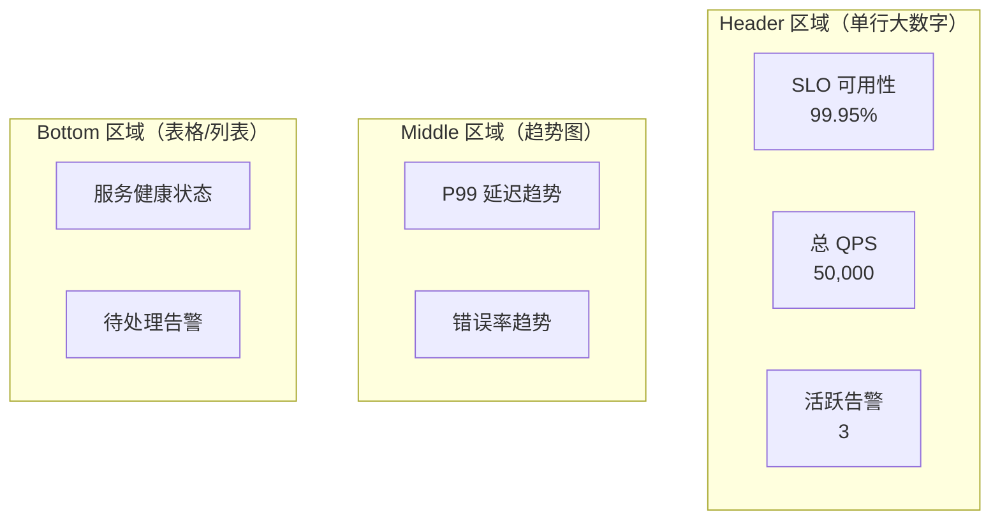

# Grafana 仪表盘设计

一个仪表盘如果需要 5 分钟才能看懂，它的价值就大打折扣。好的仪表盘应该让任何人在 30 秒内理解系统的状态，并知道下一步该做什么。

Grafana 是可观测性领域的标准可视化平台，支持 Prometheus、Loki、Tempo、Elasticsearch 等多种数据源。但工具本身不能决定仪表盘的价值——决定价值的是设计者的思路。

## 仪表盘设计原则

### 原则一：分层设计

仪表盘应该按受众分层：

| 受众 | 关注内容 | 仪表盘类型 |
|---|---|---|
| **管理层** | 业务 SLA / 系统整体健康 | 高层概览 |
| **SRE / 运维** | 服务可用性 / 告警状态 | 全链路视图 |
| **开发** | 具体服务性能 / 错误分析 | 服务详情 |
| **故障排查** | 实时指标 / 链路 / 日志 | 根因定位 |

### 原则二：信息密度适中

- 单一面板不超过 5 条线（多了看不清楚）
- 颜色不超过 5 种（多了难以区分）
- 关键数据突出（红色告警、绿色正常）

### 原则三：行动导向

每个仪表盘都应该回答一个核心问题：

- 「系统现在健康吗？」
- 「有哪些告警需要处理？」
- 「性能趋势是上升还是下降？」

## 层级一：全局概览仪表盘

这是最高层的仪表盘，供管理层和 oncall 工程师快速了解整体状态：

```json title="Overview Dashboard JSON"
{
  "title": "System Overview",
  "panels": [
    {
      "title": "SLO Status",
      "type": "stat",
      "targets": [
        {
          "expr": "100 * (1 - (sum(rate(http_requests_total{status=~\"5..\"}[1h])) / sum(rate(http_requests_total[1h]))))",
          "refId": "A"
        }
      ],
      "fieldConfig": {
        "defaults": {
          "unit": "percent",
          "thresholds": {
            "mode": "absolute",
            "steps": [
              { "color": "red", "value": null },
              { "color": "orange", "value": 99.9 },
              { "color": "green", "value": 99.99 }
            ]
          }
        }
      }
    },
    {
      "title": "Error Budget Remaining",
      "type": "gauge",
      "targets": [
        {
          "expr": "100 - (100 * error_budget_consumed)",
          "refId": "A"
        }
      ]
    },
    {
      "title": "Active Alerts",
      "type": "stat",
      "targets": [
        {
          "expr": "count(ALERTS{state=\"firing\"})",
          "refId": "A"
        }
      ],
      "options": {
        "colorMode": "value",
        "graphMode": "none"
      }
    }
  ]
}
```

### 全局概览面板设计



## 层级二：服务详情仪表盘

针对单个服务的详细仪表盘：

```yaml title="Service Dashboard Panels"
# 1. 黄金指标行
- title: "QPS"
  type: timeseries
  expr: sum(rate(http_requests_total{service="$service"}[5m]))

- title: "错误率"
  type: timeseries
  expr: 100 * sum(rate(http_requests_total{service="$service",status=~"5.."}[5m])) / sum(rate(http_requests_total{service="$service"}[5m]))

- title: "P99 延迟"
  type: timeseries
  expr: histogram_quantile(0.99, sum(rate(http_request_duration_seconds_bucket{service="$service"}[5m])) by (le))

# 2. 基础设施行
- title: "CPU 使用率"
  type: timeseries
  expr: 100 * (1 - avg(rate(node_cpu_seconds_total{service="$service",mode="idle"}[5m])))

- title: "内存使用率"
  type: timeseries
  expr: 100 * (1 - node_memory_MemAvailable_bytes{service="$service"} / node_memory_MemTotal_bytes{service="$service"})

# 3. 应用健康行
- title: "JVM GC 频率"
  type: timeseries
  expr: rate(jvm_gc_pause_seconds_count{service="$service"}[5m])

- title: "连接池使用率"
  type: timeseries
  expr: 100 *hikaricp_connections_active{service="$service"} / hikaricp_connections_max{service="$service"}
```

## 层级三：根因定位仪表盘

故障排查时的专用仪表盘：

```yaml
# 根因定位仪表盘面板

# 1. 时间选择器：自动关联告警时间
- type: row
  title: "故障时间窗口"
  collapsed: false

# 2. 依赖服务状态
- title: "下游服务健康"
  type: stat
  targets:
    - expr: sum(rate(http_requests_total{service=~"downstream.*"}[5m])) by (service)

# 3. 链路追踪：慢请求
- title: "Top 10 慢请求"
  type: table
  targets:
    - expr: |
        topk(10,
          histogram_quantile(0.99,
            sum(rate(http_request_duration_seconds_bucket[5m])) by (le, traceId, service)
          )
        )

# 4. 错误日志
- title: "最近错误日志"
  type: logs
  targets:
    - expr: '{service="$service", level="error"}'
      refId: loki
```

## 面板类型选择

| 面板类型 | 用途 | 适用数据 |
|---|---|---|
| **Stat** | 单值展示 | 当前 QPS、错误数、SLO 百分比 |
| **Gauge** | 进度/占比 | 错误预算消耗、CPU 使用率 |
| **Time Series** | 趋势变化 | 延迟/流量随时间变化 |
| **Table** | 多维度数据 | Top N 慢请求、错误排名 |
| **Bar Gauge** | 对比分析 | 各服务 QPS 对比 |
| **Heatmap** | 分布分析 | 延迟分布、请求大小分布 |
| **Logs** | 原始日志 | 错误日志、调试日志 |

## 模板变量

使用模板变量让仪表盘可复用：

```yaml
# 常用模板变量
- name: service
  type: query
  query: label_values(http_requests_total, service)
  multi: true

- name: environment
  type: query
  query: label_values(http_requests_total, environment)
  multi: true

- name: interval
  type: interval
  options:
    - 1m
    - 5m
    - 15m
    - 1h

# 使用变量
expr: sum(rate(http_requests_total{service=~"$service", environment=~"$environment"}[$interval]))
```

## 告警规则集成

仪表盘应该与告警系统集成：

```yaml
# Grafana Alerting 规则
apiVersion: 1
groups:
  - name: service-alerts
    folder: Services
    interval: 30s
    rules:
      - uid: high-latency
        title: High P99 Latency
        condition: C
        data:
          - refId: A
            relativeTimeRange:
              from: 300
              to: 0
            datasourceUid: prometheus
            model:
              expr: histogram_quantile(0.99, sum(rate(http_request_duration_seconds_bucket[$__rate_interval])) by (le))
              refId: A
          - refId: C
            model:
              type: threshold
              expression: A
              reducer: last
              params: []
              refId: C
        noDataState: OK
        execErrState: Alerting
```

## 质量判断标准

读完本节后，你应该能够回答：

1. 仪表盘设计的「分层原则」是什么？为什么不能把所有数据放在一个仪表盘里？
2. 好的仪表盘应该回答什么问题？如果一个仪表盘需要 5 分钟才能看懂，说明什么问题？
3. Grafana 的 Stat、Gauge、Time Series、Table 四种面板类型分别适合什么场景？
4. 如何设计一个可以复用的服务详情仪表盘（使用模板变量）？
5. 根因定位仪表盘和日常运维仪表盘在设计上有什么区别？根因定位仪表盘最关键的面板是什么？
